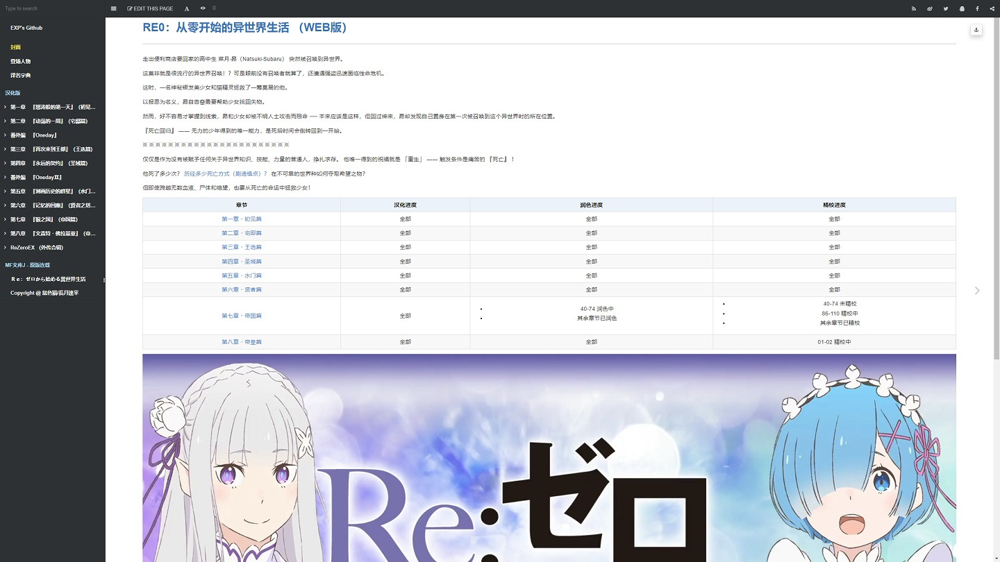
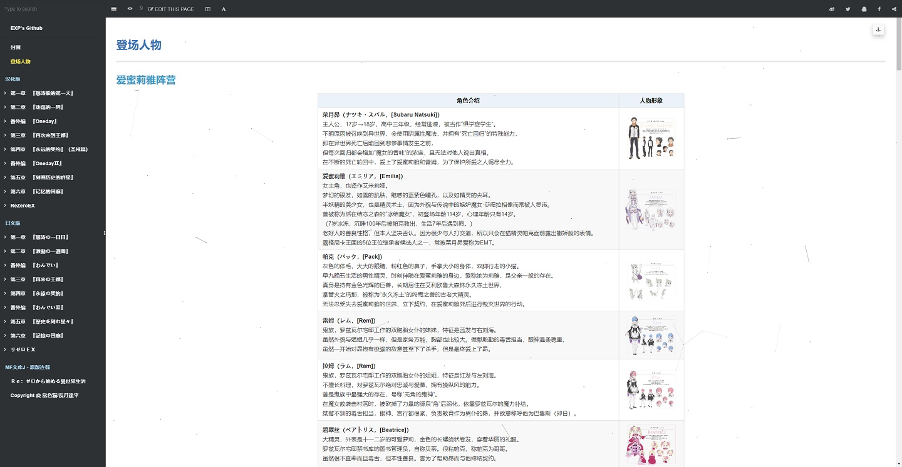
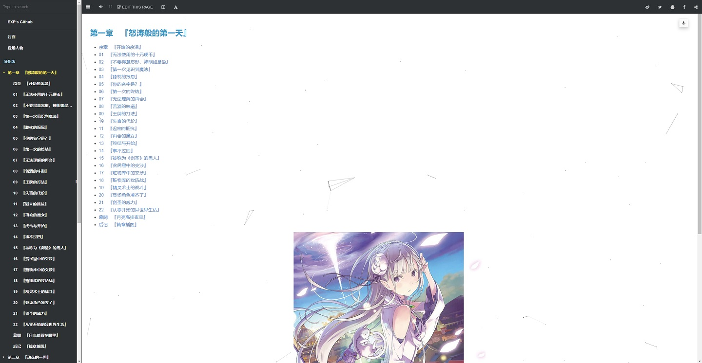
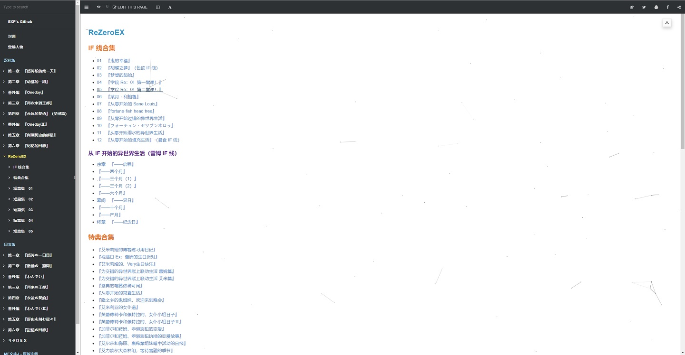
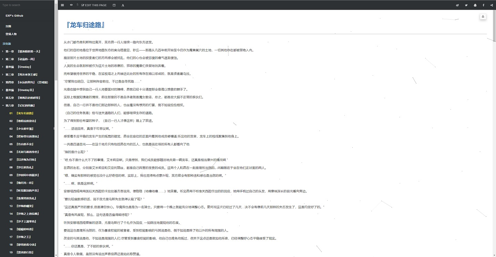
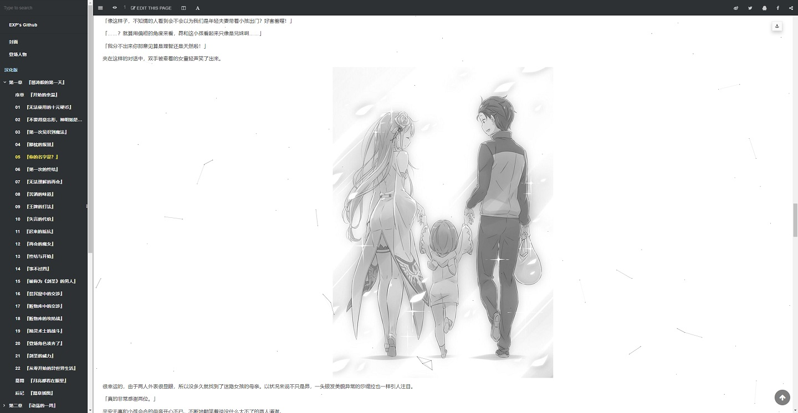

# Re0：从零开始的异世界生活 （WEB 版）

> 在线阅读：【[WEB 版](https://re-zero-khis.github.io/re0-web)】【[文库版](https://re0zero.top/gitbook/book/markdown/epub.html)】

------

## 0x00 如何阅读

- 【PC/手机】用户均可从这个链接直接阅读：[https://re0zero.top/](https://re0zero.top/)
- 【手机】用户若加载时间过长，也可以阅读纯文字版：
 　（1）[注册](https://github.com/join?source=header-home) 一个 Github 账号
 　（2）点击此项目仓库([re0-web](https://github.com/re-zero-khis/re0-web))右上角的  和  按钮
 　（3）从 Google/App Store 搜索并安装 APP 【Github】 ，登录之
 　（4）在【仓库】中找到 [re0-web](https://github.com/re-zero-khis/re0-web)，点击打开
 　（5）点击【浏览代码】可打开仓库文件，在路径 `gitbook/markdown/ch` 下即为各个章节的内容

## 0x10 内容预览

更多 ...

 

## 0x20 项目简介

这是《Re:从零开始的异世界生活》 WEB 版的汉化项目，目前每个章节的完整汉化流程包括：

1. 翻译（日 -> 中）
2. 润色（使得上下文表达语句意思更贴近中文环境）
3. 校对（人名、地名、技能名等专有名词修正、所有章节一致化）
4. 编排（文档格式）

鉴于整个流程超级耗时间（平均一章需要花 3~4 小时），而目前是我独力运营（为爱发电），但我又需要优先兼顾固定工作，所以只能在闲暇时间隔三更四。

为了让我更有动力去做这件事，也为了部分回收我投入的人力物力成本，所以我设立了赞助机制（亦可点页面上方的 **Sponsor** 按钮）。

当然这个不是强迫性质的，赞助多少全凭自愿，即使不赞助也可以阅读所有章节（只是可能会囤着在闲暇时一起更新）。

> 也欢迎有志趣的同学加入这个项目，根据贡献度可以从赞助中享有一定的分成。

| ❤️赞助我们 | 国内通道 | 海外通道 |
|:---:|:---:|:---:|
| 主链 | [支付宝/微信/QQ](https://lyy289065406.github.io/sponsor/) | [Open Collective](https://opencollective.com/re0-web) |
| 备链 | [支付宝/微信/QQ](https://lyy289065406.github.io/sponsor/) | [KO-FI](https://ko-fi.com/exppoc) |

## 0x30 相关资源

- [文库版图源](https://rezero.fandom.com/wiki/Re:Zero_kara_Hajimeru_Isekai_Seikatsu)
- [日文原版（需翻墙）](http://ncode.syosetu.com/n2267be/)
- 资源整合网盘：[爱丽丝的记事本](https://noire.cc:8888/s/djDhA?path=%2F)
- 汉化整合（百度贴吧）： [【1.0】](https://tieba.baidu.com/p/4974060711) [【2.0】](https://tieba.baidu.com/p/7063765027)
- [汉化整合（石墨文档）](https://shimo.im/docs/QDDPYPg8Y63xDXHX/read)
- 汉化整合（巴哈姆特）： [【第三四章】](https://home.gamer.com.tw/creationDetail.php?sn=3279407) [【第五章】](https://home.gamer.com.tw/creationDetail.php?sn=3686795)
- 汉化搬运（有道云）： [【上】](https://note.youdao.com/ynoteshare1/index.html?id=8a308a38db5ff96ec6e69d5807a917ba) [【下】](https://note.youdao.com/ynoteshare1/index.html?id=c79c8f8e467ac554d292d62a43dc8bf6&type=note#/&sfc=qqfriend)
- 汉化搬运（真白萌）：[【第六章】](https://masiro.moe/forum.php?mod=forumdisplay&fid=251)
- 汉化搬运（中文 Wiki 论坛）：[【第七章】](https://rezero.fandom.com/zh/f?catId=4400000000000005617) `1 ~ 28`
- [EPUB 资源（mobi）](https://www.mobinovels.com/rezero-starting-life-in-another-world/)
- [EPUB 资源（wenku8）](https://www.wenku8.net/modules/article/articleinfo.php?id=1861)

## 0xF0 致开发者

此项目是利用 [GitBook](https://docs.gitbook.com/) 搭建的，同时兼容在 [Github Pages](https://re-zero-khis.github.io/re0-web) 和 [本地（线下）](http://127.0.0.1:4000/) 运行。

> 关于 **本地** 环境的搭建可见 [gitbook-server-docker](https://github.com/re-zero-khis/gitbook-server-docker) 的说明
  另由于 [`SUMMARY.md`](./gitbook/SUMMARY.md) 索引量较大，[`build.sh|ps1`](./bin/build.sh) 编译一次约需 1 小时，因此要谨慎发布变更

