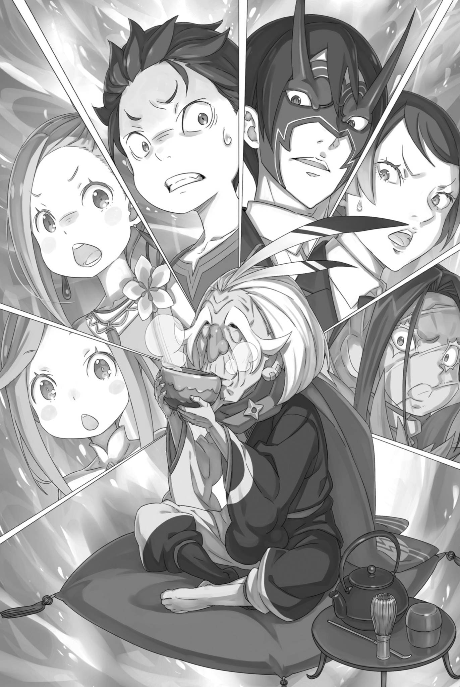

# 『茶歇谈话』

------

「——作战会议！」

鸦雀无声的房间里，昴举起短短的手臂，提出了这个建议。

没有人反对他的话。每个人都感到有必要进行讨论。

讨论的议题当然是『赴红琉璃城应召』。

「写信的埃布尔，还有昨天去过城堡的我们，都必须到场……」

昴反复琢磨着使者坦萨留下的要求，低头看看自己束紧袖口和下摆的衣服，皱紧眉头，苦起了脸。

让埃布尔亲自前往城堡的风险，这次姑且接受，最大的问题是『昨天的使者同行』的条件。

可带着缩小后的昴、阿尔和米迪娅姆三人前往，当真能入尤尔娜的眼吗？最坏的情况，他们可能会被视为恶作剧。

或者，向尤尔娜全盘交代他们的处境，以真诚的态度恳求她，这也是一种选择——，

「在不知道对方动向的情况下，展示我们的手牌，这可不是明智的行为」

「是的……我也是，看昨天的交流，我不能说尤尔娜肯定会听我们的话……」

埃布尔反对完全公开手牌，昴在这一点上也同意他的观点。

虽然昨天他避免明确地表达，但如果让昴用语言表达他对尤尔娜的印象，选择『恶女』这个词最准确。那游女般的言谈举止，在昴眼中，正是擅长将男人玩弄于股掌之间的艳丽女子所具备的手腕。

而且，她不仅有魔都的统治者的地位，还有『九神将』称号的力量，尤尔娜的危险程度不言而喻。

虽说将她视为协力者候选，打算最先拉拢这位『九神将』，但正如埃布尔所警戒的那样，她绝非可以轻易交底的对象。

「就算全盘托出，万一她揪着兄弟的事不放，也没辙吧。要是来一句『竟敢男扮女装，欺瞒奴家？』，那怎么办？」

「我是不愿相信她会这么找茬啦。不过，要不保险起见，扮成幼女版的夏美・施瓦茨……？」

「等，等一下。那真的太过了，我也会感到混乱……」

为了掩盖谎言而重复撒谎，这种困境是常有的事，但为了掩盖女装的谎言，在『幼儿化』之后，竟还得继续女装，这种任务却很少有前例。

与阿尔的头盔不同，假发的尺寸还能调整，所以女装是可能的，但是否需要如此彻底取决于今后的谈话走向。

「那么，我们怎么办？火之钟声，大概还有三个小时吧？」

「……应该去红瑠璃城，这是毋庸置疑的……」

米迪娅姆抱着路伊，歪头问道。

两人如今身量相仿，路伊也跟着米迪娅姆歪起脑袋。昴只好在心里继续权衡。

「首先，不接受尤尔娜的邀请不是选项，对吧？」

「嗯，费尽心思让她读了信。否则，我们昨天的努力，和我们如此缩小的意义也就消失了」

「否则，只会留下损失……」

在阿尔和塔莉塔的话语中点头的同时，昴考虑着撤退也不是不可能。

只有在收回投注的钱才能回家，这是赌博失败的人的惯例。在某些情况下，也应该重视止损的态度。

然而，这次的『止损』会让昴他们失去身高。

「这个问题应该看成是严重还是不严重？……」

「要是变老也就罢了，可咱们是变年轻了啊。这不有点像长生不老的秘术吗？」

「啊，确实——」

从某种意义上说，『返老还童』与『死亡回归』一样，意味着更多的机会。

如果以成年人的知识和经验回到孩子时代，就能够积累适应肉体成长的训练，也能够重新挑战曾经放弃的目标。

如果情况允许，看似也有可能将其转化为优势——，

「——你会这么想，对吧？但是，这个问题并不那么简单。这并不是那么好用的东西，对吧？」

瞬间，闯入讨论的第三方的声音让昴的呼吸停了下来。

——不，不仅是昴。房间里的所有人都瞬间僵住，无法动弹，对那个声音的主人感到惊讶。

然而，当事人却仿佛无视房间内升高的紧张气氛，

「咱自作主张泡了茶喝，还有谁想来一杯啊？」

这样说着，他举起冒着热气的茶杯，轻松地询问。

「——！」

紧接着，塔莉塔像弹簧装置的玩偶一样，迅速地动了起来。

她在瞬间取出了弓箭，瞄准了现身的人物 —— 奥尔巴特・邓克尔肯。

瞄准的距离非常近，既无法偏离也无法躲避。

然而，奥尔巴特却「哎呦呦」地一脸平静地耸了耸肩，

「别这样，别这样。我可不喜欢别人用尖锐的东西瞄准我。你们这样吓我，我这么大年纪了，上厕所的次数就多，你们想让我吓得尿裤子吗？真是吓得我战战兢兢的啊，对吧？」

「你竟然敢如此嘲笑我……！你究竟是……」

「——奥尔巴特・邓克尔肯」

「———」

面对敌意，但却一点也不慌乱的矮小老人，塔莉塔的脸变得通红。然而，回应她疑问的人，是那个叫出奥尔巴特名字的鬼面男人。

埃布尔是唯一一个坐在沙发上一动不动的人，他和奥尔巴特对视，奥尔巴特眯起了被浓眉遮住的眼睛。

「咱是个名人，这事昨天也确认过了，所以倒不惊讶。不过，你这张脸也挺让人过目不忘的嘛。那是哪儿买的纪念品？」

「别说些无聊的话，老家伙。你来这里是想做什么？」

「现在的年轻人都不愿意听老人的闲话，真是寂寞啊。村里那帮家伙也一天比一天会拿咱的话当耳旁风了……喀喀喀喀喀！」

奥尔巴特一边讲述老年人的寂寞生活，一边大咧地笑了出来。

在埃布尔和奥尔巴特的对话中，旁观的昴们的困惑也渐渐消解。然而，完全放松警惕是不可能的。

「不过，老爷爷你是怎么进来的？我们竟然毫无察觉……」

「哦，虽说小了点，你是昨天那个像舞娘的小姑娘吧。爷爷告诉你啊，你们不是让那个鹿人姑娘进来了嘛？咱就一道进来了呗。」

「一道进来的？和坦萨酱？」

「喀喀喀喀喀！具体怎么进来的，可是秘密啊。忍的技艺，就像咱吃饭的家伙嘛。」

面对米迪娅姆的朴素提问，奥尔巴特以笑声将其淹没。

不论他有多认真，他自己都说出了『忍』这个称呼，似乎并没有打算隐瞒自己的真实身份。

那么，他只身来到他们这边的真正意图，与其笨拙地探索，不如直接询问。

「那么……」

「嗯？」

「那么，你真的是为了什么来这里的？」

一瞥，奥尔巴特的视线转向了问他来访目的的昴。然后，老人皱起眉头，像是在思考一样，

「啊，你是那个，昨天那个穿红衣服的姑娘吧。像舞娘的小姑娘和独臂小子倒是一眼就能认出来，唯独你，可让咱琢磨了好一阵」

他如此坦诚地说出了识别昴真实身份的困扰。

听到这个，昴瞪大了眼睛，而正在悄悄改变位置的阿尔则忍不住笑了出来。他带着一点闷闷的声音，穿过面具，发出了低沉的笑声，

「……不愧是兄弟。连忍的首领都没看穿你的身份。」

「哦，了不起了不起！你那种变装本领，我也想让我村里的人学学。怎么样，当他们的导师吧。我们会热烈欢迎你的。」

「不好意思，夏美・施瓦茨的日程已经排得满满的了。……不过，或许也不是挤不出时间。」

「哦哦，怎么个或许法？」

面对对女装的出乎意料的关注，昴湿润了嘴唇，眯起了眼睛。

姑且不论这番戏言有几分可信，这个直接与奥尔巴特交谈的机会，他必须充分利用。首要的是，昴们遭遇的异常事件。

若埃布尔的推测属实，那么这个现象的始作俑者就是眼前的老人。

「我们变成这样的原因，如果你知道的话，就请老实说……」

「啊，那个啊。那个就是我做的。有意思吧，忍的技艺。」

「———」

不需要任何谈判，奥尔巴特就轻易地承认了这是他的所作所为。

他的话语抹去了昴接下来的话，昴微微地屏住了呼吸。然后，看着僵硬的昴，老人露出狡黠而邪恶的笑容，

「如果一不小心杀了人，就什么都听不到，麻烦事就留到后面了。所以，我有很多不用杀人就能让人屈服的技巧。——挺有趣的，不是吗？」

说完这些，他抿了一口温热的茶。

※ ※ ※ ※ ※ ※ ※ ※ ※ ※ ※ ※ ※ ※ ※ ※ ※ ※ ※ ※ ※ ※ ※

――昴，阿尔，以及米迪娅姆三人遭受了『幼儿化』的攻击。

根据熟知『九神将』的埃布尔的证词，几乎可以确定作案者就是奥尔巴特。

但是，直接从其本人口中得到确认，带来了另一种惊讶。尤其是他丝毫不感到羞愧，反而大大方方地承认，更是如此。

「――――」

「喂喂，大家都用那种吓人的眼神看我。没学过要体恤老人，不能欺负老人吗？」

再次紧张起来的房间里，包括始终没放下弓的塔莉塔在内，阿尔和米迪娅姆两人也悄悄地改变了站立的位置。

特别是阿尔，他挡在入口的门前，做好了阻止奥尔巴特逃跑的准备。

然而，由于他的身体缩小，连惯用的刀都无法自如挥动，究竟能拦住这神出鬼没的忍之首领多久，实在不能抱太大期望。

「呜……」

「那边的小姑娘，你本来就是小孩子，可不是咱变的吧？如果是的话，被你那样看着，我会受伤的。你不喜欢老头子特有的甜腻气味吗？」

「别胡言乱语，奥尔巴特。我再问你一遍。你为什么来这里？」

试图安抚发出咆哮的路伊的奥尔巴特，埃布尔向他投来了疑问。对着稍微转过头的奥尔巴特，埃布尔透过鬼面传递出锐利的霸气，

「这个魔都的统治者，尤尔娜・米希格蕾的想法应该已经传到你的耳朵里了。她已承认这些人是使者，并明言不会让任何人对他们出手」

「没、没错！不准出手，昨天不就是为这个才一决胜负的吗！人家也是拼了命的呀！现在这样，可跟说好的不一样！」

「喂喂，你这一激动，连说话的腔调都混起来了啊。」

在埃布尔的攻击之下，昴也再次主张了昨天尤尔娜的声明。就像奥尔巴特所说的那样，他的情绪也回到了昨天，但这并不能改变事实。

尤尔娜承认了昴他们是使者，坦萨也明确表示，不会让任何人对他们出手。

如果违背这一点，那就等于是宣布与尤尔娜为敌。

「当然，若你们已打算毁灭魔都，那自然也不会把这话放在眼里。」

「……被你这么一说」

对于埃布尔的补充，昴感到血液冷却下来。

实际上，有奥尔巴特随行的假皇帝一行，已经把与尤尔娜等人的谈判权让给了昴他们。他们可能会认为这是一个错误，立即推翻这个局面。

那么，就免不了与尤尔娜正面冲突——她即便在『九神将』中，也是因种种缘由而令人另眼相看的存在。

「真抱着将其毁灭的打算进攻，魔都便难逃覆灭。当然，你们也会付出相应的代价。」

「……嗯，那个狐娘的处理确实很麻烦。但是，被那个戴面具的年轻人看穿也不是很有趣」

「戴面具的，年轻人……」

奥尔巴特挠着下巴，摆出一副左右为难的样子。昴留意到他的话，偷偷用眼角瞟了埃布尔一眼。

埃布尔的态度并未发生任何变化，但是昴对他们的对话感到非常紧张。毕竟，奥尔巴特是『九神将』的一员。

显然，埃布尔，也就是文森特・佛拉基亚，应该多次与他面过面。

即使他用面具遮住了脸，但是他的说话方式和声音都没有改变，如果他和埃布尔交谈，应该很容易就能发现他的真实身份。

「――――」

然而，埃布尔以堂堂正正的态度回应，看不出有任何不安。

奥尔巴特也没有发现埃布尔的真实身份的迹象。于是，昴也无法指出这一点，只能隐藏内心的恐惧，强装镇定。

无论如何――，

「我们还没有听到你的答案，奥尔巴特先生」

「——比起被叫老头子，这称呼倒让咱觉得受了点尊重。看在这个份上，就不计较你假扮姑娘的事了。」

「奥尔巴特先生！」

昴看向回避回答的老人，目光锐利，仿佛要逼出答案。看到这一幕，奥尔巴特双手举起，做出投降的姿态，

「好吧好吧，你们说的都对。不仅狐娘，就连阁下也告诫我不要对你们动手。」

「那么……」

「但你要注意，我开始对你们小动作的时候，是在昨天的决斗定胜负之前，对吧？那么这样说吧，如果因战斗中留下的刀伤死了，也不能再来抱怨，那在战斗中施加的缩小术，也不应该有人抱怨吧？」

「这、这是诡辩……！」

「嘛，确实是诡辩。——但是，你能推翻吗？」

奥尔巴特单眉微扬，狡黠地笑着，昴无言以对。

奥尔巴特的话虽然是诡辩，他自己也承认了。但另一方面，他的话也有些道理。

如果因为在战斗中受到的伤而失去生命，只要这个伤是在停战协议达成之前的伤，那么在停战后质责这个悲剧的责任就有些牵强了。

当然，伤口和『幼儿化』在人们感觉上有着巨大的不同。

「所以，我认为让你们恢复正常与狐娘的命令是两回事。明白了吗？」

「———」

「喀喀喀喀喀！别拉着这么长的脸。可爱的脸都变形了……你这可爱的脸也是用化妆做出来的假象吗！真是被你骗了一把」

奥尔巴特巧妙地弄着他的茶杯，展示着他杂技般的技巧，不让里面的茶水溅出来。他的话，充满了高深莫测的狡黠。

可是，无论杀气渐浓的塔莉塔，还是试图封住退路的阿尔他们，再怎么奋战，昴也想象不出他们能靠武力压服奥尔巴特的情景。

若真有人能对付这老狐狸，那就只有——

「奥尔巴特，你也别过分了」

正是这位凭着凛然的威势，试图一举斩断老狐狸种种诡计的鬼面男子。

埃布尔，他的姿态没有改变，他的眼神却变得更加锐利和冷酷，他看着奥尔巴特，让他停止了他的茶杯游戏。

「我问你，你来找我有什么事？你要我问多少次你才准备回答？」

「一见到这种看不着脸色的年轻人，咱就忍不住想看看他眉头能皱成什么样。这是咱的坏毛病，多担待啦。」

奥尔巴特一只眼睛微闭，以一种调皮的态度回应埃布尔的威胁。然而，面对埃布尔仍然冷酷的目光，老人只好摸着头说，

「不论狐娘如何，阁下也告诫我不要动手，所以我来这里并不是为了处理你们。但是，如果你们终究会成为敌人，稍微削弱一下你们也没关系吧？」

「……这能解释为什么把咱们变小，可解释不了你为什么特意来喝茶吧。」

「你的头盔变得不合适了，看来你很痛苦。总的来说，你的判断也是对的。嗯，我来这里的理由，坦白说，最直接的就是来听你们的故事」

「……故事？」

奥尔巴特用没拿茶杯的那只手掏着耳朵，朝满脸疑惑的昴点头。

然后，他用摆弄耳朵的手指向窗外，

「昨天在城堡里撂的那番狠话，连咱都听得热血沸腾啊。但是，想要挑战阁下的人有很多，而且到现在为止都失败了。尽管如此，我仍然想知道，为什么你们还敢铤而走险，我想听听你们内心的想法」

「……听了之后，你打算怎么做？」

「啊？那种事情，听了之后再决定不是很正常吗。所以，为了让你们不能撒谎，咱就先动了点手脚，喀喀喀喀喀！」

奥尔巴特张大嘴巴，笑得唾沫横飞。看着他，昴皱起了眉头。

他的态度，就像他所说的那样，可以简单地被划为恶趣味。但显然，他并不是可以简单就此结束对话的对象。

不仅要让他解除施在他们身上的『幼儿化』之术，他还是应当争取来协助埃布尔夺回帝位的『九神将』之一。

反而——

「……这是个机会，对吗？」

为了拉拢他，首先需要接触，这对于『九神将』的立场来说本已困难。

但是现在，不知什么因果，除了统治者尤尔娜之外，卡欧斯弗莱姆也有奥尔巴特和看起来是假皇帝的奇夏。

当然，即使首先敌对的奇夏的笼络是不可能的，但是——

「如果埃布尔昨天的推断是正确的，奥尔巴特先生并非确定为敌人」

埃布尔的推测是，已经被视为对手棋子的『九神将』中，奥尔巴特仍然留有希望。考虑到现状，他们已经接近与尤尔娜的谈判，无法否认埃布尔的判断是正确的。

关于奥尔巴特的立场，如果相信他的推测，那么应该有谈判的余地。

然而，为了使奥尔巴特成为盟友——

昴默默地看着埃布尔的侧脸。一直保持着强硬态度的鬼面男埃布尔，揭露他的真实身份，这是在争取奥尔巴特时必须公开的决定性信息。

诚实地说，他们没有更能打动奥尔巴特的情报了。

在昴的注视下，鬼面的埃布尔毫不动摇。他的侧脸被面具遮住，无法知道他的任何情绪。然而，昴所想到的，聪明的埃布尔应该也有所感知。

在这里，面对奥尔巴特，他们该如何开诚布公？

这是昴的思考焦点，但如果埃布尔不采取行动，那么这种想法是否过于急躁？或者，埃布尔也在观察着局势？

无论如何，如果能让奥尔巴特成为盟友，昴他们的『幼儿化』问题、战力不足、以及『九神将』的争夺战也将有所曙光。

所以，这里也应该是决胜的场面吧——

「——有趣的是啊，人这张脸，意外地很能说话呢。」

「咦……？」

「眼神、脸绷得多紧，哪怕一丁点肌肉的紧张……即便嘴巴不动，也会把各种事说出来啊。」

奥尔巴特竖起两根手指，轻轻敲了敲自己的眼角。他的目光落在昴身上，朝屏住呼吸的昴点了点头。

「比方说，像舞娘的那姑娘依赖使弓的姑娘。蒙着布的小子和那个小丫头依赖你。而你和使弓的姑娘……依赖的是那个戴面具的小子。」

「在他们的视线中，大部分的事情都能看到。特别是在他们虚弱的时候，这一点更为明显，对吧？」

奥尔巴特这么说，并露出一抹笑容，他的话语刺穿了昴的心。

昴这才迟迟明白，自己大大看错了奥尔巴特的为人——这个老人，甚至能装得像位和蔼可亲的长者。

奥尔巴特坦言，『幼儿化』是他所为，并明确表示他这样做是为了听昴他们的话。

他从未说过，他是为了和昴他们『谈判』。

「你是为了……谈话而来的吗……」

「来『交谈』，和来『听你们说』，看着像，可还是有点不同吧？咱也不讨厌这么闲聊啦。不过——」

「咱好歹也是忍的首领，平时还得端着村里头面人物的架子。所以啊……没拷问过的人说的话，实在太危险，咱可不敢信。」

奥尔巴特依旧摆着通情达理的长者姿态，道出了自己遵从忍之不成文准则的想法。

他的冷酷，确实类似于昴所知道的『忍者』的世界。

可将其当成虚构故事欣赏，和有人当着自己的面将这套做派摆出来，完全是两回事。

然后——

「所以，态度那么大，又不依赖任何人，戴面具的小子就是头儿吧？说来听听，你打算做什么，才来拉拢那只狐狸的？」

「——若我不肯说，你又待如何？」

「那就另想别的办法呗。不过，受着不许出手的约束，能用的手段也没剩多少啦。」

奥尔巴特耸了耸肩，他的视线和注意力都转向了埃布尔。当然，身为忍之首领的奥尔巴特，他不可能忽视其他的事情。

即使他没有直接面对他们，他也不会放松对阿尔和塔莉塔的注意。

可虽说已用弓瞄准、将他围住，昴他们若真向奥尔巴特表露攻击的意图，也绝非明智之举。

在尤尔娜的命令下，他们作为使者被迎接进入了卡欧斯弗莱姆。

若在卡欧斯弗莱姆里闹出事，这份保护是否还算数？尤尔娜又会怎样对待不守规矩的客人？这些全是未知数。

换句话说，这个场景对昴他们和奥尔巴特都是僵局。

在声明准备进行攻击的同时，他们只能相互瞪视。

在这种摇摆不定的极限状态——

「……但是，这种情况，反而在哪里可以准备？」

昴回顾了他的处境，再次向内心中新出现的空白发问。

然后再次，他的思绪生出了「这不是一个机会吗？」的想法。

被假皇帝和尤尔娜束缚，不能进行额外的敌对行动的奥尔巴特。

确定他的心情倾向何方，即使是敌对的，也不能在这个时机行动。这样的情况除了这里还能在哪里准备呢？

「――――」

时间，一分一秒地流逝。

不仅是紧张的气氛，尤尔娜给出的火之钟声敲响的时间也在逼近。

时间是宝贵的。――浪费它，就等于消耗生命。

在寂静中，握住弓的塔莉塔的手指在颤抖，阿尔和米迪娅姆也在屏息。路伊也破天荒地只是低声嘶吼，莫非也凭本能察觉到了奥尔巴特的危险。

她们恐怕谁都无法决意打破僵局。若还有人能作出这个选择，那便是——

「――埃布尔」

「――――」

静静地，昴叫出埃布尔的名字。

他知道听到这个名字的埃布尔，即使被鬼面遮住，也转过来看他。虽然他的视线被鬼面挡住，无法窥视，但他的注意力已经转向昴。

他的情绪是看不见的。――但他感觉到他的意图已经被揣测出来。

「那是文森特・佛拉基亚皇帝」

「……哈？」

奥尔巴特听到昴的话，眉毛上扬。

老人睁大了被浓密眉毛遮住的眼睛，对昴的话感到困惑。这是很自然的反应，但距离他期望的反应还很远。

所以，为了引出他想要的反应，他要深入探究。

「你想知道那个脸庞难以看清的年轻人的真身，以及我们的目标，对吧。为什么我们要去见尤尔娜，答案是……」

「哎呀，这事儿有点让人笑不出来吧？」

「我也没打算开玩笑。――埃布尔」

一瞬间，奥尔巴特的话语打结，他的声音中混入了微妙的惊讶。

昴明确地捕捉到这一点，向屋子深处的埃布尔喊话。至此，埃布尔也不再反驳昴的言行。

只是静静地，他那修长的手指伸向自己的脸。然后――、

「――这可真是个大新闻」

奥尔巴特愕然出声，面前那张被隐藏的脸终于露了出来。

回望着神情绷紧的奥尔巴特的，正是那位黑发俊美的男子——文森特・佛拉基亚皇帝。

「阁下？可这也太不对劲了吧。那和咱一道来的——」

「运用你老狐狸的智慧吧，奥尔巴特・邓克尔肯。你应该已经拥有答案了。现在只需要揭示出来」

「用皇帝的面孔，说出皇帝的话。……但，是么」

一度被惊愕所吞没，然而，这位老年的忍者很快恢复了镇定。

埃布尔露出真容，以皇帝的身份发号施令。正如他所说，凭奥尔巴特掌握的情报，似乎已经足以解释眼前的状况。

奥尔巴特边抚摸着自己的下巴，边说，

「这么说，那边那个就是奇夏了？可真把咱骗过去了……不过，这样一来，阁下岂不是一直在挨打？这可不像您啊。」

「你的眼睛能看穿我的内心深处么？」

「哦，这真是吓人」

奥尔巴特挥了挥手，对埃布尔的回答响起了喉咙的干哑声。

事实上，正如奥尔巴特所说，埃布尔的处境确实是挨了一轮又一轮重击，几乎已无力还手；可他这份压倒性的虚张声势，愣是没让人看出半点。

然而，看到奥尔巴特放松的样子，昴的肩膀也松了下来。

奥尔巴特理解了真相。

埃布尔失去了皇帝的地位，而与他同行的文森特其实是假皇帝。

「各种各样的，我内心混乱的事情都明白了。不过，我一直在想，为什么突然直接去见那个狐娘的地方」

「那是……全部，都是为了控制我们这边的动作」

「哈哈，老人家跟不上聪明人的思维，实际上。年轻又聪明又帅气，真是贪心不足。你不也这么认为吗？你不觉得吗。你也还年轻。啊，变这么小还是咱干的！喀喀喀喀喀！」

奥尔巴特大笑着，试图用他不可笑的话引人发笑。

看到他这样，昴的脸颊抽动，长长地吐出一口气，然后瞥了一眼塔莉塔。

仍然对奥尔巴特保持警戒并瞄准他的弓箭的修德拉克战士。他试图让她解除战斗状态，重新整理现状。

「塔莉塔小姐，你现在可以放下弓箭了。奥尔巴特先生是……」

「啊？不，不用放下也没关系。毕竟，在没有确认不是敌人的人面前解除警戒，对那个小姑娘来说应该是不可能的」

「啊？」

试图让她解除警戒，开始交谈的昴被瞄准的奥尔巴特本人阻止了。

老人看待塔莉塔的警戒态度就像是理所当然的事情，也没有否定那个对昴来说难以理解的「理所当然」——也就是说，他自己的危险性并未减少。

然而，这样一来——，

「我们的话……」

「咱听了啊？不是说了，听完再判断嘛。现在，判断完了。」

「……」

昴的喉咙紧紧地哽住，而奥尔巴特的态度并没有改变。

只是，听到了一声低低的咂舌，

「本以为不知会走向哪方的一张牌，你会选择这样行动吗」

「不像你，阁下。不，真正致命的是手里没有牌可以出。……而且，这里要出的是我，真是倒霉。我一直想试一试」

「哦，试什么呢？」

奥尔巴特的决定已经确定，他对被逐出皇位的皇帝的话语微笑着。

他嘲笑着，犹如他的『恶毒翁』的称号一样，

「咱这把老骨头，也没多少日子可活了。临死前，倒想弑杀一回皇帝，好好风光一场啊。」

「——！」

当那恶意的愿望被说出的瞬间，紧张的气氛中出现了动静。

在这一瞬间，无论是塔莉塔、阿尔，还是米迪娅姆，他们都违反了『禁止战斗』的规则，全都行动起来，试图粉碎奥尔巴特的企图。

然而——，

「昨天，咱没看穿你那把戏，独臂小子。不过，身子变小后，好多地方都不听使唤，不好受吧。」

「啊……」

「老了以后学会的技巧，年轻的时候是无法熟练使用的」

说着，奥尔巴特扭了扭头，挥了挥双手。

从他的指尖飞溅出血液，昴睁大眼睛看到了眼前的惨剧。

试图冲上前去抓住奥尔巴特的阿尔和米迪娅姆，他们的喉咙被割开，血液喷涌而出。他们的身体虽然小，但血液如同喷泉般在室内四溅。

「咝，啊……」

「看来，你那救命的本事是使不出来了啊。可还没弄清把戏，就先动了手，真是失策，失策。」

阿尔跪在地上，捂着喷涌的血伤口。米迪娅姆瞪着白眼，倒在地上一动不动。

他们受的伤显然是无法挽回的致命伤。

而唯一有准备直面奥尔巴特的塔莉塔——

「——啊」

昴并非有意识地在想，为何她迟迟没有放箭。

但是，理应发动的攻击没有出现，这使得昴的目光不由自主地朝那边看去。

塔莉塔被钉在了墙上。

作为女性，她的个子很高，她的瘦弱身体靠在墙上，被固定住。固定她的原因，是那根插在她胸部中心的投掷武器——手里剑。

那个星形的投掷武器穿透了塔莉塔的胸部，从她的背部穿出，把她钉在了墙上。她的心脏被击碎，显然是瞬间死亡。

「——连不准出手的规矩，也束缚不了你吗？」

男人的声音在充满死亡的房间中回荡。

发出这个声音的，是站在满是尸体的房间中的埃布尔。他站起身，透过清澈的眼神鄙视着造成这一切的奥尔巴特。

面对那个目光，奥尔巴特用手指擦去脸颊上溅出的血，

「是的。我在死前想燃放一场大烟火。杀掉那位被誉为历代最出色的皇帝，再因此被处决，咱就心满意足了」

「我无法预测你的，那种毁灭性的嗜好。是我的疏忽吗？」

「喀喀喀喀喀！不不，如果咱这老年人的梦想被看穿了，我会觉得羞愧到无法生存的」

阿尔已经不再动弹，米迪娅姆和塔莉塔的生命也已经停止。

在这种情况下，皇帝和臣下之间的对话，对昴来说像是来自另一个世界。但这并不是另一个世界。这是现实。这是现实中的压倒性事实。

这是昴因为错误的选择，而最终陷入的现实。

「杀了阁下，咱就直接回奇夏那儿去。奇夏那家伙，总能给咱安排个妥当的死法吧。」

「等——！」

「嗯？哦，你在这儿呢」

对昴太晚的呼喊，正准备做最后决定的奥尔巴特转过头。

老人听着昴紧张的阻止，颈骨发出咯吱声，然后指着倒在地上的阿尔等人，

「看，他们是因为向我发起攻击才被反击的，你并不需要死，我没有逃避责任的意思，也没有必要封你的口」

「怎、怎……」

「啊，原来你是脑子一热就喊出来了啊。小子，想好要说什么再开口嘛。不过，咱这老头子时日无多，也没法等太久就是了。」

奥尔巴特淡然地，按照他自己的节奏继续说话，昴的思维开始空白。——否，他的思维已经被愤怒染红。是愤怒，还是阿尔他们流出的血，昴自己也不清楚。

但是，无论如何，无论如何，绝对不能在这里——

「——蠢货。」

是的，埃布尔蔑视地这样说。

他的视线现在应该是锁定在昴的后脑勺上。感受到那股锐利的目光压力，昴深深地感到了那句话的正确性。

现在这样站在埃布尔前面保护他是毫无意义的。

如果在阿尔他们倒下之前能这样做，也许能改变些什么——

「唔……！」

「喂喂，连不是咱变小的那个丫头也这样啊。阁下这套做派，本来不是最招女人小孩讨厌的吗？」

奥尔巴特抚摸着额头，路伊站在他面前。——不，路伊站在的是昴的前面。

昴保护着埃布尔，然后路伊保护着昴，三人竖着站成一行。

这简直是一种荒谬至极的肉体屏障。

「我原本以为，皇上会一个人去死的」

「——没有谁，会按照你的预想来行动」

「喀喀喀喀喀！」

埃布尔直到这个时候都还没有停止说话，对他的回应，奥尔巴特高声嘲笑。

在这个年纪的忍者眼中，并没有看到昴和路伊的存在。然而，他并不是那么善良，以至于会忽视那些站在他面前展示敌意的人。

所以——

「——我，不会原谅你的」

盯着这个邪恶地嘲笑，只想满足自己野心的忍者的脸，菜月・昴年轻的身体喷出了血，沉入了冷冷的血泊中。

然后——

※ ※ ※ ※ ※ ※ ※ ※ ※ ※ ※ ※ ※ ※ ※ ※ ※ ※ ※ ※ ※ ※ ※

血液在流淌，炙热的感觉从伤口中迸发出来。

无尽地涌出的热流，却在瞬间剥夺了自己体内的温度。

流出的鲜血转眼便将自己吞没，令人沉溺，夺去视野。就这样，就这样，一直沉向最深处，在那尽头，在那前方——

「———」

一瞬间，原本流失的血液重新在体内奔流，震得耳边喧嚣不止。

听觉被磨砺至极致，可以感知到在安静的空间中自己体内流动的血液的声音。全身被这种感觉侵袭，昴粗重地呼吸。

粗重地呼吸，视野随着逐渐远去的痛楚与失落感明灭，紧咬着后牙。

自己，究竟回到了哪里，为了确认这一点——

「咱自作主张泡了茶喝，还有谁想来一杯啊？」

瞬间，那难以忘记的恶劣声音，宣告了菜月・昴新的战斗的开始。

