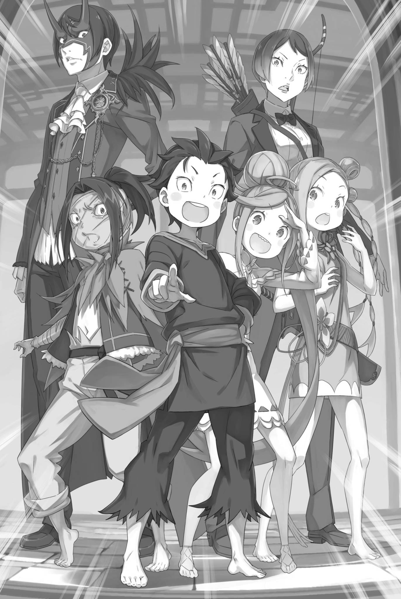

# 『眼皮子底下』

------

――沙哑的声音提出的建议让昴他们陷入了极度困惑。

「――――」

袭击昴等人的『幼儿化』，其始作俑者奥尔巴特・邓克尔肯。

为了让奥尔巴特解除『幼儿化』，昴等人向他提出交涉。而他开出的条件怪诞离奇，叫人摸不着头脑，倒也符合这位将他们身心玩弄于股掌的老人——不，怪老头的作风。

话说——，

「追、追逐游戏……？」

原本还提心吊胆，怕他提出什么无理要求的昴，结结巴巴地重复着听到的话。见他这般反应，两手空空的奥尔巴特疑惑地皱起眉。

「怎么还带个问号啊？你该不会连追逐游戏都不知道吧？」

「当然，我知道这个词。但是，这在现在的情况下不是应该出现的词汇吧？」

无论怎么说，『追逐游戏』都只是小孩子的游戏。

很难想象这还能有什么别的含义。不过，若是忍之里玩的追逐游戏，倒也很可能掺入了独有的规则。

比如说——，

「比如，追逐的时候可以互相杀人之类的。」

「咔咔咔咔！怎么可能。真要流行那么吓人的游戏，忍还不得转眼就灭绝了？而且还是被咱这个头领亲手灭的。那还得了？」

奥尔巴特虽否认了昴的担忧，可结合他此前的凶行与言谈，昴认定，只要有必要，这个人连同伴的血也会毫不犹豫地沾上双手。

说实话，就算忍之里早已毁灭，昴也不会觉得多么意外。

「——那所谓的追逐游戏，具体如何进行？」

昴正被疑虑折磨得坐立难安，埃布尔便代他催促对方说下去。

对于埃布尔的询问，奥尔巴特扭曲了脸颊，笑了出来，

「哟，戴面具的小子，没想到你还挺有兴致啊。」

「胡说。当我们明确表明我们掌握你想要的情报时，我们已经没有选择是否参与的余地了」

「哈哈哈哈！确实，你说得对」

奥尔巴特大笑出声，像是要把下巴笑掉似的。

事实上，埃布尔说得没错，奥尔巴特的算盘也着实恶毒。无论这场追逐游戏胜负如何，他都要把想要的情报弄到手。

是通过交涉，还是用尽酷刑——这场『追逐游戏』的目的，不过是让他们选择以哪种方式吐露情报。

「至于追逐游戏的规矩，没什么特别的。一边逃，一边抓……啊，逃的那边就让咱来吧。你看，让咱追着一大群人跑，这把老骨头哪吃得消。」

「那么，如果我们抓住了你，我们就赢了？这很容易理解呢」

「明白是明白，可是……」

对于奥尔巴特的规则解释，米迪娅姆表现得乐观，塔莉塔则持悲观态度。

昴的观点，也偏向于塔莉塔。的确，规则很简单，没有不确定的因素。——换句话说，实力将完全体现出来。

而在实力上，昴他们的总和远不及奥尔巴特。

「嗯，一群小不点是有些难办。这样吧，咱也不是不能稍微放宽点条件。」

「明明就是你把我们变成这样的，还毫无愧色……！」

「都说别生气了。你那手指要是松开弓弦，咱就有自卫的名分了，事情倒能解决得更快。」

「————」

奥尔巴特目光扫过屋里众人的脸，耸了耸肩。塔莉塔见状，咬紧了后槽牙。

正如这位老人所指出的，塔莉塔的弓依然对准着奥尔巴特。然而，奥尔巴特却面不改色地无视这一点，反而将其用作谈判筹码。

昴可以完全理解塔莉塔的痛苦。然而，现在最重要的是——，

「放宽条件，是什么意思？」

「就是改改追逐游戏的玩法。不用抓住咱，只要找到咱就算赢，如何？不过这样的话，就得比三回了。」

「三局比赛……」

「咱藏三回，你们找着咱三回。做不到就算输。这样与其叫追逐，不如叫找人游戏……这名字有点怪啊。」

奥尔巴特摇摇头，显然不太满意这个表述。

昴听到这个老人的建议，他的心底升起一个词——，

「——捉迷藏？」

「哦，这名字不错，就叫这个。」

奥尔巴特打了个响指，当即看中了『捉迷藏』这个名字。

接着，他两手各竖起一根手指，向左右展示，让在场所有人都看清。

「追逐游戏，抓到咱一回就行。捉迷藏，就得找着咱三回。——哪种更有胜算，还用咱说吗？」

昴屏住呼吸，看着眨了一只眼睛的奥尔巴特。

奥尔巴特说得对，这个问题不需要思考。——昴已经知道奥尔巴特作为超越者的能力，没有理由选择追逐游戏。

尽管如此——，

「你真是太慈悲了。特意提出了我们更有可能赢的方法，让我不禁怀疑你有什么别的目的」

面对准备主动让步的奥尔巴特，阿尔反驳道。

阿尔摘下头盔后，改用布裹住了脸。隔着布传来的声音有些发闷，但变小后的嗓音更为尖细，倒不至于听不清。

奥尔巴特也听清了阿尔的话，耸了耸肩。

「喂喂，小子，你是不是把咱当成非赢不可的老头了？对咱来说，你们赢了才好呢。咱这么做，就是想看看你们的话值不值得听啊。」

「————」

「咱对你们的话可是很有兴趣的。可要是被一通胡话骗了，到头来反倒让阁下怀疑咱的忠心，养老的积蓄不就悬了吗？所以咱才动动这颗不大灵光的老脑袋，想出这么个主意啊。」

奥尔巴特飘然地回答阿尔，同时挥动着他竖起的手指。

阿尔听了他的回答，虽然他的疑虑并未消除，但是回答是有道理的，似乎让他不再追问。

昴并不是那么轻易就相信这就是奥尔巴特真实的内心。

但眼下，无论时间还是线索，都远不足以摸透这位老练的忍心里在打什么算盘。

就在此时，尤尔娜设定的时间限制正一秒一秒地逼近。

奥尔巴特提出的两个不自由的选择——无论选择哪一个，都很难说是最好的。从这种情况挽回的可能性几乎为零。

更甚至，尽管他们已经尽了全力，但最后到达的还是这个状况。

「——如果我们接受你的提议，我们需要明确规则」

「嗯，你的意思是？」

「这可是你亲口所言。既然我方获胜对你更有利，就不该留下太多事后抵赖的余地。——双方所求，都须说清楚。」

「——哈哈哈哈」

埃布尔似乎已经得出了相同的结论，他盯着奥尔巴特，推进着谈话。

规则的明确化——这个要求背后的意义十分清晰。他已经决定接受比赛，也已经决定了比赛的内容。

埃布尔迎着奥尔巴特低笑时灼灼发亮的双眼，点了点头。

然后——，

「——我们玩捉迷藏」

※ ※ ※ ※ ※ ※ ※ ※ ※ ※ ※ ※ ※ ※ ※ ※ ※ ※ ※ ※ ※ ※ ※

――然后，两者间交换的规则大致有三条。

首先是『互不伤害』的承诺。

奥尔巴特只要起意，本来就能轻易杀光他们。阻止他行凶的，无非是假皇帝的命令，以及对尤尔娜的忌惮。

然而，根据情况，他可能会破坏这个禁止，所以这个承诺是必需的。

其次是『隐藏地点必须在城市内』。

若要相信他确实打算给他们留下胜算，为了公平，划定范围便不可或缺。当然，即便限定在城内，范围也依旧相当大。

不过，这一点应该能靠昴说服对方接受的条件来弥补。

最后一点是，『明确胜利条件』。

既然看到了胜利的可能性，选择了『捉迷藏』。那么，追求胜利的目标是任何人都无法否认的。

因此――，

「我明白通过追逐和捉迷藏可以改变我们的胜算。但为什么要三次？不吝啬一点，不是一次就好了吗？」

「咔咔咔咔！小子，你可太贪心了。话虽不好听，只找着一回，总有撞大运的可能。可要是找着三回，那就是本事了。」

「运气也可以考虑到实力里」

「不好意思，咱不信什么听天由命。说来帝国人大多都这么想吧？你这说法还真少见。」

这是帝国的实力至上主义，一个没有逃脱之路的想法。

幸运和不幸并不存在，显示的结果都是自己的实力所引来的。这种态度，对于那些不能没有逃脱之路的人来说，似乎很令人窒息。

比如，像昴这样的不上学的时期，在这个帝国没有出路。

「还有啊，你们不是有三个人变小了吗，所以就三回，如何？虽说是咱刚想出来的牵强理由，听着倒也说得通吧。」

「那么，每找到你一次，你就替一人解术，如何？」

「哟，还真会顺杆往上爬。那咱刚才这理由就作废吧。」

奥尔巴特挥舞着双手，拒绝了埃布尔的确认。

总之，将这些细节逐一敲定后，便再没有什么需要细究的地方了。

也就是说――，

「那么，我们来比赛吧」

「奥尔巴特先生，细节上再确认一次……不能躲到我们根本到不了的地方。要是藏到那种偏僻之处，我们也没办法。」

「真是个细心的家伙。——嗯，你不提的话，咱还真打算这么干。」

「……」

「先说好，咱说自己不是非赢不可，这可是真心话。不过也别忘了，这场游戏是考验你们的试金石。」

也就是说，我们的才能、机智、思维速度都在被考验。

奥尔巴特看起来慷慨大方，有余裕，但他的决断非常严厉。如果判断为无价值，他会毫不留情地攻击我们的弱点。

甚至现在，如果昴不插嘴，他可能真的会这么做。

尽管如此――，

「——不过，咱也不觉得那边戴面具的小子会漏掉这一点。」

奥尔巴特指着埃布尔，露出了他不掩饰的狡猾笑容。

尽管感到困扰，但昴向埃布尔和阿尔示意，看到他们点头，他做好了挑战的准备。

「如果我们赢了，你就把我们恢复原状」

「咱要是赢了，你们就等十年再长回来吧。嗯，要是阁下和那狐狸女人改变主意，咱也会用咱的法子问出你们的秘密。」

怪老头暗示的，是忍之里代代相传的审讯之术——也就是拷问。寒意涌上昴的心头，他以漆黑的眼睛紧盯着奥尔巴特。

接着，在怪老头动身前往第一个藏身处之前，昴追问道。

「那么，第一个提示是什么？」

这种问题，如果是一场认真的比赛，会被认为是荒谬的。

但是，奥尔巴特并没有嘲笑这个问题。因为这正是昴在与奥尔巴特的『捉迷藏』中，为了获得胜利而设定的条件。

既然昴他们已经『幼儿化』，奥尔巴特想看到的评价标准并不是战斗力或体能，而是前述的思维敏捷和创新思维。

说白了，无非就是『不和蠢货做交易』这一理所当然的想法。

「先小试一下身手……咱就藏在这旅店附近，『眼皮子底下』吧。」

「――眼皮子，底下」

「好了，小子们，可得加把劲啊。让咱这个没几年好活的老头，也享受点乐趣吧。」

挥手告别，奥尔巴特转过身去。――一瞬间，昴感到房间里的紧张感在他悠然离去的背影中拉紧。

「――――」

此时此刻，如果能突然冲向奥尔巴特，将『捉迷藏』和『幼儿化』以及所有问题一次性解决掉，没有人会不这么想。

但是，没有人真的去执行这个荒谬的想法。这就是正确的做法。

「哈哈哈哈」

就在门即将关闭的时候，奥尔巴特的嘲笑声响起，可能是他已经察觉到了昴他们的犹豫。

包括他那沙哑的笑声在内，他的行为一直都与他的『恶毒翁』之名相称。

奥尔巴特离开后，屋内重新只剩下了自己人——

「塔莉塔，放下弓箭。现在已经没有目标了」

「……是的」

在敌人离开的房间里，埃布尔让塔莉塔放下了她的弓。

遵守命令的塔莉塔的脸上，显露出了羞愧的情绪。这是理所当然的。她指向奥尔巴特的弓箭，被他冷静地无视了。

作为修德拉克的一员――不，已经被任命为下一代族长的塔莉塔来说，奥尔巴特的那种态度无异于是对修德拉克的力量的嘲弄。奥尔巴特侮辱了『修德拉克之民』。

这也是因为她自身的力量不足。

原本，塔莉塔陪同到魔都的原因是为了寻求继承族长位置的决心的支持。

然而，这样下去，她不但不能获得自信，反而产生了逆效果。

「你真的打算陪那个老头玩游戏吗，兄弟？」

无法找到对塔莉塔说的话的昴，阿尔向他提出了这个问题。

阿尔的口气中透露出对与奥尔巴特交涉的不满和怨气。通常他对事情的接受和处理给人的印象都很随和，这样的反应让人感到意外。

不过，毕竟始终被奥尔巴特耍得团团转，阿尔会烦躁也不难理解。

「我也不喜欢被他那样对待。但是，可能性还是存在的，对吧？」

「可能性……」

「我们能恢复正常的可能性，对吧，昴君」

米迪娅姆盘腿坐在地上，按住挣扎的路伊。如今她与路伊的体型已相差无几，靠的是技巧，而非蛮力，才将对方制住。

这可能是她在孤儿院生活中培养出来的技巧。

昴看着她抚慰路伊的蓝眼睛，点了点头。

「如果我们在那里得罪了他，我们的身体会一直缩小……无论从未来的规划，还是从当前的方向来看，我们都不能接受。恢复正常是必须的。」

「……我们其实也可以围攻那个老头。」

「别说傻话。我们没死，是因为奥尔巴特先生还打算遵守那个皇帝的命令。他真要动手，我们根本毫无还手之力。」

「――你说得好像你亲眼看到一样。」

阿尔移开视线，语气仿佛在说『这不可能』。

阿尔那句『好像亲眼看过』倒也说得没错。昴的洞察力来自跨越世界的作弊——他确实亲眼见识过。

阿尔觉得不可能的事，无论愿不愿意承认，终究都可能发生。

然而――，

「――――」

阿尔依旧移开着视线，没有再提出反驳。

阿尔也在昨天的天守阁中了解到了奥尔巴特的一部分实力。他自然明白，如果那个在场上没有全力以赴的怪老头真正展现出实力，自己的胜算是非常渺茫的。

也许因为这个原因，他才选择看着奥尔巴特离去的背影。

「不管怎样，时间不多了。要去见尤尔娜，我还得化妆。七七八八加起来，得留出半小时……也就是说，还能用两个多小时。」

「果然，你还需要装扮成女人么……」

「人家指定了昨天那三个也要去。还有……」

说着，昴看向了沉默的埃布尔。

既然他没有插话，基本上也就意味着他与昴的方针一致。总不至于是在感慨刚刚死里逃生吧。

或者说——

「你对奥尔巴特想要刺杀皇帝感到震惊吗？」

「无稽之谈。我知道那家伙有着不合他身份的野心。尽管我没想到他的目标是皇帝的生命。我原以为他做这种事情得不到任何好处，原来他追求的是最后的满足感和死后的恶名」

埃布尔耸了耸瘦小的肩膀，表达出他无法理解的情绪。

被驱逐出皇位，被推到了极度劣势的埃布尔，他从未放弃过。对他来说，能活着回到王座，夺回帝位才是最好的。

他无法理解那种甘愿放弃生命，追求死后名声的态度。

在这一点上，昴的情绪也很复杂，但他同意埃布尔的观点。他并不想死后还被人赞美。

昴希望，当他死后，那些他深爱的人能够忘记他。

他宁愿被忘记，也不希望他们因为他的死而感到悲伤或痛苦。他宁愿他们在他死的那一刻就把他淡忘在记忆中。

然而，他并没有打算和埃布尔分享这些感受。

「……不过，奥尔巴特真的是有些糊涂啊。尽管他有那样的野心，但他却完全没有察觉到你的真实身份」

因此，昴改变了话题的焦点。

然而，听到这个话题，埃布尔的眼神透过鬼面显现出一种明显的困惑。

「——你在说什么？」

「啊？」

「我戴着这副面具，奥尔巴特有那种反应，自然不足为奇。」

埃布尔淡淡地说道，他的手触碰到了鬼面的脸颊。

昴皱了皱眉，他的表情显示出他并不明白埃布尔的意思。突然，埃布尔的困惑变成了明显的失望。

埃布尔深深地叹了口气，

「这个面具有扭曲他人认知的效果，能隐藏佩戴者的真实身份」

「什……什么！这难道是『认知阻碍』吗！？但是，这个面具原本是存在于修德拉克村子里的东西啊……」

「哈，是的，就是这样。很久以前，皇帝和修德拉克结下了友谊。为了能在森林中不被人认出来，皇帝曾使用过这个面具。这是传说中的故事」

「这个面具原来有这样的来历吗……？」

昴被这个惊人的事实震惊到，张大了嘴巴。面对震惊的昴，埃布尔继续表达他的失望，

「你真以为我一直戴着这面具，只是为了装模作样，或是一时兴起？」

「————」

「你的愚蠢真是到了极点。遮盖面容总是有其特定的理由的。难道你是以观光的心态来到这个魔都的吗？」

「你没必要说得这么狠……如果你一开始就解释清楚，不就好了吗……！」

昴把面具当作埃布尔怪癖的一部分，因而没有询问，固然有错；可埃布尔以为什么也不说别人就能明白，也不是全无责任。

害得昴白白丢了脸，又担了不必要的心。

无论如何，昴终于明白了为什么奥尔巴特没有察觉到埃布尔的真实身份。仅仅通过遮住面部，埃布尔的高傲的谈话方式和傲慢的态度并没有任何掩饰，昴一直担心他的真实身份何时会被揭露，现在看来，这都是多余的。

「嘿，阿尔啊阿尔。埃布尔这样说，你也有隐藏你的脸的原因吗？」

「我只是对脸部的伤疤有些自卑……等等，别管我了。我们的捉迷藏游戏已经开始了。我们得赶紧行动了」

说着，阿尔指向窗外的魔都的街道。

在帝国的大都市中，卡欧斯弗莱姆的规模比城郭都市古拉尔要大五倍以上。

在这么大的地方找出隐藏的忍者首领绝非易事。

仅仅两个小时，只有六个人，还要找三次。

「开始时说的只是试探一下，但就算只是寻找住宿周围，候选也太多了。兄弟和埃布尔有什么策略吗？」

「倒也算不上什么计策。」

至少，昴有些想要尝试的事情。

这个『捉迷藏』的试探——不经意间，和奥尔巴特有着相同的设想。为了衡量对手——那位恶毒翁的思维方式，有一个值得一试的想法。

同样有所打算的埃布尔抱起双臂，点头道：「当然。」

「有几个办法。当然，可能和那个小丑的想法不同。」

「从军师降级到小丑，你对刚才的面具事情念念不忘啊。……不过，我并没有特别坚持我是你的军师。」

因为昴把鬼面装扮当作奇行的事情，埃布尔的冷峻声音让昴只能咬着嘴唇。

无论如何，在这里讨论的时候，时间就在慢慢流逝。

「得趁还没忘记手脚长时的感觉，赶紧行动了。」

「嗯，我和兄弟从未有过长腿的时候……」

「这只是和现状的比较。」

阿尔调侃他们的腿都短，一群人开始整理最基本的装备。

阿尔将青龙刀连鞘背起，米迪娅姆则从双剑中只取了一把，佩在腰后。昴姑且也带上了鞭子，但说实话，根本没把握使得动。

此外，还有状态完好的埃布尔与塔莉塔，以及——

「啊，嗯！」

「哦，路伊，你充满斗志啊！好的，让我们一起努力找那个老头子吧！」

「嗯！」

路伊也不可能被独自留下。听见她的叫声，米迪娅姆举起小小的拳头。

实际上，路伊可能会成为麻烦。奥尔巴特被禁止改变藏身之处，所以即使他察觉到吵闹的路伊接近，他可能也不会因此保持距离，至少我希望如此。

「他会不会不停地改变藏身之处，然后坚称他一直藏在一个地方？」

「他自己也纠正过，奥尔巴特的目的并非取胜。之所以如此大费周章，是想通过这场游戏衡量我们的器量。」

「衡量才干，是么。那就是说……」

「看我们是否有足够的能力来争夺皇帝的宝座。」

埃布尔毫不含糊地回答对奥尔巴特真意的质疑的阿尔。

这一点，昴也认为没有虚假。虽然难以直接相信奥尔巴特的说辞，可既然他的目标是皇帝的性命，那么昴等人的意图与情报真实可信，对他才更有利。

奥尔巴特希望他们拿出本事，好让自己信服。

为了这个目标——

「我没有问过，但关于『阳剑』的火焰……」

「遗憾的是，我没有时间给你详细解释佛拉基亚皇帝的历史。不管你的小聪明如何，我的策略不能在旅店的房间里实施。」

「哼，我知道了。」

昴对埃布尔明显不打算透露的搪塞感到恼火。

不过，若他与奥尔巴特的对话属实，埃布尔——也就是佛拉基亚皇帝——似乎受着某种庇护，只要庇护尚在，便无法受到伤害。

「回想起来……」

至今为止，昴从未亲眼看到埃布尔死亡的场面。

自从来到这个佛拉基亚帝国以来，昴以极高的频率面临生命危险，实际上已经死过并且『死亡回归』过，但他从未看到埃布尔死亡的情况。——在某些情况下，他可能已经死了。

比如上次奥尔巴特露出真面目，或者托德把包括修德拉克村在内的巴德海姆密林烧成灰烬的时候，被囚禁的埃布尔应该已经死了。

然而，那只是状况上的事，昴并未直接确认过他的死亡。——所以，有一点他想确认。

「那个，『阳剑』的火焰，现在还在保护你吗？」

「啰嗦。还是说，若不告诉你，你也要与我为敌？」

「……我看不出那有什么好处。」

对于这种嘲讽的说话方式，昴扭曲了脸颊，这次他真的放弃了追问。

然后，昴环顾了一圈正准备离开客栈的伙伴们，说道：

「没想到会被迫比上这么一场。不过，既然只要找到对方就行，就算我们当中一半的人变小了，也应该还有得比。倒不如说，要玩捉迷藏，现在身心都返老还童，没准反而更有利。」

「怎、怎么能这么说呢……？」

「别在意，听了也没什么意义的胡言乱语」

实际上，这不过是开个玩笑，这是正确的，但昴仍然皱着眉头表示遗憾。

之后，昴大声说道「总之！」，

「大家，尽可能注意周围。――那么，出发！」

「哦！」

「呜~！」

「……兄弟真是气势十足啊」

昴穿着随手找的衣服，以非常不雅观的样子鼓起勇气。米迪娅姆和路伊跟着挥舞着拳头，看着他们的样子，阿尔叹了口气。

另一方面，作为最大的战力的塔莉塔在她的眼中充满了紧张和不安，埃布尔的脸在鬼面的掩饰下无法窥视，他的手里仍然什么都没有，如同以往一样的傲慢。

这样的队伍一起离开了客栈的房间。

首先，他们要确定奥尔巴特第一次隐藏的地方。满怀这种决心，昴砰地关上了门，大步向前走去――，

「――然后，马上回来」

「诶？」

昴刚迈出去的脚猛地蹬地，身子转了半圈，重新面向刚刚走出的房门。阿尔见他突然折返，不禁发出一声傻愣愣的惊呼。

不理会他，昴大力推开了房间的门。

然后，他指向了他们刚刚离开的房间里――，

「――奥尔巴特先生，找到你了」

「咔咔咔咔！喂喂，这么快就看穿，也太坏心眼了吧？一上来就被识破，咱都要脸红了，真丢人啊！」

结果，就在昴他们离开的同时，潜进房间的奥尔巴特，看到昴指着他的第一次宣言，他真的是笑得很开心。

※ ※ ※ ※ ※ ※ ※ ※ ※ ※ ※ ※ ※ ※ ※ ※ ※ ※ ※ ※ ※ ※ ※

「真的吗，兄弟……！」

房间里，阿尔惊愕地看着正准备重新泡冷掉的茶的奥尔巴特。

在阿尔的惊讶声中，米迪娅姆和路伊也跟着叫道「啊，老爷子在这儿！」「啊！」。刚刚也看进房间的塔莉塔也瞪大了眼睛。

紧随他们的反应，最后把奥尔巴特的身影纳入视线的埃布尔眯起了眼睛，

「原来如此，『眼皮子底下』吗」

他低头看着昴年幼的侧脸，喃喃自语。

「你一开始就知道是这里吗？」

「用『眼皮子底下』这个说法，我第一个想到的就是这个地方。这种游戏的类型，肯定会想尝试一下这个」

回答的昴脑海里回想起了遥远的往事——他和碧翠丝在旧罗兹瓦尔庄园第一次相遇的回忆。

碧翠丝利用魔法制造了一个循环走廊，让昴不停地走过同样的空间。然而，不幸的是，昴一眼就看穿了她的计谋，早早地发现了起点就是终点。

现在想来，他应该陪可爱的碧翠丝玩玩的，但对方可不是碧翠丝，而是一个恶老头，所以不能手下留情。

因此，昴大大地扭曲了年幼的脸，毫不留情地炫耀着胜利。

「说实话，早就看穿你了，『恶毒翁』。」

「喂喂，别再穷追猛打了。这副丑态，咱可没脸让里头的年轻人看见。你要不要改叫『恶毒小子』啊？」

「那还是免了。我可没干什么当得起恶毒二字的事。」

「这才叫谦虚过头了吧。——你刚才特意大声喊出发，不就是喊给咱听的吗？真会耍心眼啊。」

奥尔巴特挑起一边眉毛，定定地盯着昴。昴不由得挠了挠脸。

果然，那么夸张地做了那么多事，他的意图应该是可以被察觉的。然而，即使能看穿昴的真意，奥尔巴特也没有办法改变藏身的地方。

因为这场比赛的规则就是先确定藏身地点，然后传递提示。

「第一回结束得是快了点，不过会好好算一次吧？总不会因为我拒绝继承『恶毒』的名号，就闹脾气吧？」

如果因为结果令人出乎意料，就逃避责任，那就太困扰了。

对昴的这种担忧，奥尔巴特回应说，「那当然」，然后眯起了一只眼，

「这么快就出了结果，是咱失算了。让你们替咱收拾烂摊子，说不过去。按约定，还剩两回。」

「哦～！做得好，昴！这次只用了大约十秒！」

「嗯，这是个好消息」

在欢呼雀跃的米迪娅姆旁边，昴松了一口气。

总算解开了奥尔巴特的第一个谜题——没错，这是一场借『捉迷藏』之名进行的考验，说是在答考题也不为过。

他们正在被试炼、是否能够得到奥尔巴特的认可。

「这一切都是，都是碧翠子的……」

昴想要说『功劳』，然后在心中想象出一个可爱的小女孩。

然而，这个思考突然停顿了。

「……」

一种微妙的不适，和一种微小的疑惑，引发了心中的不安。

在他寻求明确的答案之前——

「那么，咱也得挽回名誉了，赶紧去第二个藏身处吧。」

「啊，是的，那么，下一个提示是？」

「嗯……下一个藏身地点，就像这样」

奥尔巴特双手交叉在腰后，倾斜了下头和身体，陷入了深思。然而，这样的思考并没有持续很久，怪老儿脸上露出了狡黠的笑容，说道：

「——就叫它『视野绝佳的深渊』吧。」

「视野绝佳的……」

「深渊？」

塔莉塔与阿尔一人接上一句，重复着这个古怪的藏身地点提示。

然而，奥尔巴特并没有打算给出更多的提示。

「首次的结果超过了预期，但是，真正的比赛才刚刚开始」

老人露出一口白牙，笑着轻巧地向后一跃，随即推开窗户，随意地将脚搭上窗框。然后，当着目瞪口呆的众人，纵身跃了出去。

「下回咱可得藏得难找些了！」

「等等，老头子！……该死，他已经不见了！」

阿尔急忙跑到窗户边，环视了一下外面，然后戴着面具的他捂住头，大声叫道。

实际上，要抓住一心只想逃跑的奥尔巴特是非常困难的。他那超常的逃跑速度，让人不得不承认，从追逐比赛变为捉迷藏是正确的。

无论如何——

「昴，那个男人的下一个藏身地点是……」

「嗯嗯，昴会知道吗？你知道吗？」

「唔……那个，其实……」

塔莉塔和米迪娅姆转过头来，满怀期待地看着昴，昴却语塞了。

对于第二个藏身地点的提示——『视野绝佳的深渊』，昴实话说，根本找不到任何线索。

「对不起，我一时半会儿想不出来。我不是读心术，只是看懂了情况而已」

「是吗～，抱歉！不能一味地依赖你！我们一起想想看！」

「是的，我虽然不擅长动脑筋，但我会尝试思考的」

面对低头道歉的昴，米迪娅姆和塔莉塔都这样回答。

第一个藏身处恰好是起点，不过是某种常见套路。即使猜错，也几乎不会浪费时间，所以大可放心一试。但从这里起——

「简单来说，这就变成了与时间的较量」

「——兄弟，你也猜不出下一个藏身地点吗。嗯，这也是理所当然的」

「就这样……虽然我知道期望不高，但被直接这么说还是有点沮丧啊」

真正的『捉迷藏』比赛开始了，就在这个时候，却遭到了来自同伴的打击。

当然，昴接受了这个评价，但他心里其实希望他们能婉转一些。即使是朋友，也应该有一些礼貌。

然而，阿尔摆了摆手，说：「啊，不是那个意思。」

「兄弟猜不出来，也难怪啊。毕竟我还跟你在一起呢。」

「嗯？我没太听懂。你的意思是，只要阿尔在，我的智商就会下降？这是什么机制？」

「不是这个意思，但是解释起来有些困难……对吧？」

「即使你这么问我，我也不知道」

阿尔自己也似乎对他的话没有太多的确定性，这让人感到奇怪。

把阿尔放在一边，这个话题似乎无法有建设性的发展。解开奥尔巴特留下的『视野绝佳的深渊』的秘密是最重要的。

「第一个藏身地点是『眼皮子底下』，『视野绝佳的深渊』也可能是类似的隐喻……」

「视野绝佳，那么可能是高处吧？」

「但是，深渊不是指的是洞穴吗？如果是洞穴，那不是应该在地面上吗？」

也可能卡欧斯弗莱姆里，确实有个地方会被这样形容。

无论如何，在这个客房里，他们获得的信息量不足以找到答案。很显然，他们需要走出去，走向城市。

「……我脑袋转不过来。说起来，埃布尔的计划是？」

「我曾经说过，这并非可以在此处执行的计划。最好能找到一个人多的地方……而且，外来人员的出入频繁会更方便」

「你是说接待外来者的地方吗？这城里哪里会有这种地方呢……」

阿尔疑惑地对埃布尔的计划提出了疑问。埃布尔寻找外来人频繁出入的地方的真正意图尚不明确，但即便询问，他在实施阶段之前可能也不会告诉我们。这虽然不能算是助敌，但的确难以应对。

当然，尽管他清楚埃布尔是那种为了胜利而毫不留情地出牌的男人。

「如果是人员出入频繁的地方，那就是……那个，喝酒的地方」

「你是说酒馆吗？」

「对，就是那儿。我觉得可以先去那里看看。」

是专心寻找奥尔巴特，还是先帮埃布尔实施计划，哪边更有利尚有商榷余地；但眼下，优先配合埃布尔应该更稳妥。

有着这样的想法，昴他们重新振作精神，走出了旅馆。

「带着一群孩子，引人注目到了极点」

「六个人里四个都是小孩，就别抱怨了。再说，论起引人注目，你戴着鬼面具就已经够显眼了吧。还是说，认知……呃，面具的效果会让别人看见另一张脸？」

「只是隐藏了真身，外表还是鬼面具，没有变化」

「那样的话，肯定会很引人注目的……」

昴无视了埃布尔奇怪的抱怨，小小地耸了耸肩，轻叹了一口气。

他们在旅馆的入口向店员打了声招呼，询问了酒馆的位置后，就走向了街道。接下来，他们就要为了实现埃布尔的目标，全体一起走向那家店。

然而，在他们路上，昴突然说，

「我们全员去店里，还是分工会更好呢？我们可以分成『寻找奥尔巴特的小组』，和『与埃布尔一起去酒馆的小组』——」

正当他要提出分开行动的建议时，

「——啊？」

突然，红色的光芒在视线的边缘闪过，使得昴的眼睛一时昏花。

然后——

※ ※ ※ ※ ※ ※ ※ ※ ※ ※ ※ ※ ※ ※ ※ ※ ※ ※ ※ ※ ※ ※ ※

「哦，这名字不错，就叫这个。」

「诶？」

被红光灼烧的眼睛，昴眨了眨，这时一个意外的声音打在了他的鼓膜上。

由于声音的回响和突然出现，他不由得发出了愚蠢的声音，前方立即响起了笑声。那是低沉而沙哑的笑声，昴因为那声音而瞪大了眼睛。

「咔咔咔咔！怎么发出这么傻的声音？咱是在夸你这名字起得好啊。」

「……奥尔巴特，先生？」

一个怪异的老人，喉头发出咕哝声，瘦小的肩膀震动着笑个不停，他就站在昴眼前。

这太过突然，昴无法理解，只是连连眨眼。然后他吞了口唾沫，说出了他应该声明的事情。

「奥、奥尔巴特先生，我找到你了。」

「——？什么？你是觉得比赛已经开始了？」

「诶……？」

昴本想抓住这意外找到对方第二次的机会，却在此时察觉到了异样。

奥尔巴特歪着头的姿态和他的话语，以及最大的违和感来自周围的景象——他本应在魔都的街道上，但现在的昴却在一个房间里。

——不，不是在某个房间。

「……这不可能」

昴所在的，是旅店的一间客房。——正是他们刚刚离开的那间。

而且，他正在那里与奥尔巴特面对面地谈话，这意味着……

「————」

在不应该死亡的规则下，他不得不承认他又『死亡回归』了。

