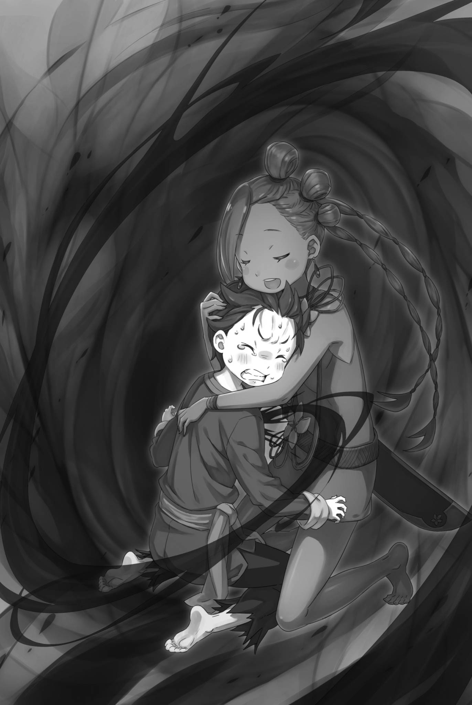

# 『收缩的视野』

------

——无法理解的状况，正蹂躏着菜月・昴那颗变小的脑袋。

眼前的冲击，强烈到足以如此形容。

毫无『死亡』的实感，昴却回到了与奥尔巴特商定规则的途中——即使不愿承认，也只能承认。

昴失去了生命，并在这一刹那进行了『死亡回归』。

而且——

「……在应该不会死的，捉迷藏的过程中……」

他用小小的手掌捂住自己的嘴，昴拼命回想发生了什么。

与奥尔巴特的『捉迷藏』开始了，他一度克服了这个怪老的恶劣，成功地找到了隐藏在第一个房间——『眼皮子底下』的忍者。

凭借这股势头，昴他们踏出了客栈，试图确定下一个怪老的藏身之处。然后突然，世界变黑了。

当他意识到的时候，他又回到了这个地方。

「————」

「——若要接受你的提议，就有必要将规则定得明明白白。」

「哦，是什么情况？」

「这可是你亲口所言。既然我方获胜对你更有利，就不该留下太多事后抵赖的余地。——双方所求，都须说清楚。」

「——哈哈哈」

昴在思考的同时，与奥尔巴特的谈判正在向前推进。

埃布尔与奥尔巴特的对话进展，等待他们的是决定规则的前提——比赛的方式。也就是——

「——就是捉迷藏」

埃布尔就要如此断言了。

※ ※ ※ ※ ※ ※ ※ ※ ※ ※ ※ ※ ※ ※ ※ ※ ※ ※ ※ ※ ※ ※ ※

――然后，与奥尔巴特交换的『捉迷藏』的条件。

就像昴所知道的那样，内容始终如一。没有新增的条件，也没有必要剔除的内容。必然的，内容保持一致。

然而――、

「虽说已经确认过，还是再问一遍。奥尔巴特先生，你只是躲起来，不会偷偷向我们发动攻击之类的吧……」

「喂喂，小子，你也太爱操心了。咱要考验的，是你们脑子转得快不快、做事周不周全。真要只比拳头，昨天在天守阁不就完事了吗？」

「――――」

奥尔巴特的话似乎是为了让他们安心，但昴无法接受。

事实上，昴『死亡回归』是无可争辩的事实。并且，对于现在的他们来说，最大的威胁无疑就是面前的奥尔巴特。

他是否打破了不得攻击的规则，瞄准了他们？

「唉，咱可真是被疑心得够呛啊。」

「你凭什么叫人相信啊，老头。也太自以为是了吧。」

「咔咔咔咔！这话倒也没错。八年前还跟咱处得不错的你，如今也这么冷淡啊。」

见昴沉默不语，奥尔巴特察觉到他强烈的戒心，耸了耸肩。听了阿尔接着说的话，他便露齿一笑，厚着脸皮如此说道。

当然，阿尔也对奥尔巴特的话语显得有些不满。

无论如何――、

「奥尔巴特，你应该明白，你的藏身之处不能是我们无法到达的地方。不要耍小聪明」

「知道知道，你们还真够细心的。要是不提，咱本来还真打算这么干。」

埃布尔指出的内容与上次昴提出的一样。奥尔巴特同意了这一点，然后宣布了比赛的开始。

也就是说，提供了第一个藏身地点的提示。

「那么，你首先打算藏在哪里，老爷子？」

「先小试一下身手……咱就藏在这旅店附近，『眼皮子底下』吧。」

瞬间，昴内心的紧张达到了顶峰，但这只是杞人忧天。

他担心会被指定一个与上次不同的藏身地，但事实并非如此。后来，奥尔巴特大大方方地转过身去，塔莉塔和阿尔都有冲过去的冲动，但他们只能眼睁睁地看着。总的来说，整个过程都遵循了既定的流程。

然后――，

「怎么了，兄弟？你看起来脸色不好」

塔莉塔遵照埃布尔的指示放下弓。昴正担忧地望着她的侧脸，阿尔便向他搭话。这句话与上一次有了些许不同。

本来，他应该是在抱怨不愿参与与奥尔巴特的比赛，但现在他在谈论昴的脸色――不，他似乎在担心昴说话变少了。

这也是理所当然的。昴自己，他的困惑和混乱还没有消散。

对于突然的『死亡回归』，以及自己还无法从那次心理打击中恢复过来。

「不，不好意思。在谈话的过程中，我突然感到很累……」

「喂喂，振作一点，我求你了。与我和米迪娅姆缩小导致能力下降不同，你的优点应该还在吧？」

「我的优点……」

「当然！昴的优点就是他的聪明才智！虽然哥哥也很棒，但昴也很棒，对吧？即使胸部变小了，也没关系！」

阿尔的鼓励之后，米迪娅姆也充满活力地加入了进来。

她一边抱着路伊，一边拍打着自己已经不再鼓胀的胸部。昴看着他们两个的样子，长长地吐了一口气。

他们两个说得对。

原本，无论身体有没有变小，能靠体力派上用场的局面都与昴无缘。既然如此，他才是受到变小影响最轻的那个。

他不能一直拖着精神上的消耗。

「……所以，不要用那样的眼神看我。如果要充分发挥鬼面的效果，只需要『认知阻碍』的功能就足够了。」

「你看来有些恢复过来了。但是，我真的很惊讶。我本以为你是个没发现这个面具效果的傻瓜。」

「……就算你戴面具只是出于怪癖，我也不会吃惊就是了。」

得到阿尔和米迪娅姆的鼓励，抬起头的昴直接回应了埃布尔。

原本看不起无用之人的埃布尔，看到昴恢复了精神，似乎也没有再说什么刻薄的话。

就在他觉得这是埃布尔的让步时，他意识到埃布尔的沟通能力存在问题，但现在没有时间去讨论这个问题。

「话说回来，老头说第一回只是小试一下，可就算只找旅店周围，能藏的地方也多得很。兄弟和埃布尔有什么计策吗？」

为了改变局势，阿尔将矛头指向了昴和埃布尔。

昴能给出的回应，就是奥尔巴特最初的藏身之处——也就是他们现在正在谈话的这个房间——恶毒翁将会回到这里。

只要奥尔巴特留下的线索仍然一样，那里应该不会有什么变化。

问题在于，在找到奥尔巴特之后，他们需要走出旅店。

「虽然不能算是策略，但我能猜到『眼皮子底下』是指什么地方」

「等等，真的吗？太厉害了，兄弟」

「……不过，很可能还有个与『眼皮子底下』无关的问题。」

必须把袭击了昴——不，袭击了他们的某种威胁，告诉尚且一无所知的埃布尔、阿尔等人。

然而，由于昴本人获得的信息过于有限，他能够确信并告诉他人的见解并不多。如果非要说的话——

「奥尔巴特先生的承诺……他说他不会对我们出手，但他有可能会违背这个承诺吗？」

「啊？你是说，他会把游戏的大前提都推翻？」

「啊，我觉得这是可能的……」

「――不，不可能」

他们在离开旅店的瞬间就遭到袭击的事实，让昴试图让伙伴们注意奥尔巴特。然而，埃布尔却坚决否认了这一点。

对于埃布尔的反应，昴目瞪口呆，埃布尔则双臂交叉，

「这样的行为，奥尔巴特没有得到任何好处。所以，这是不可能的」

「可、可是，奥尔巴特先生甚至考虑过杀皇帝！你也是，你完全没有想到这一点……那么！」

「死后的名誉，这是我没有的想法。但是，我可以理解这样的东西存在。也可以理解有人想要这样的东西。然而，这和那是两回事」

被鬼面后的锐利视线穿透，昴感到内脏像是被挤压。

埃布尔并没有比以前更加锐利，至少应该是这样。

尽管如此，那种被目光震慑得动弹不得的感觉却挥之不去，昴的呼吸也乱了。

然而，埃布尔一边看着正在痛苦的昴，一边说，「你听好了。」

「你自己也看穿了，那蒙面小丑也被他反驳过。奥尔巴特・邓克尔肯没有理由主动加害我们。若他想取皇帝的首级，我手中的情报便是他求之不得的。若伤害我们，岂不连先前的前提都无从谈起？」

「嗯，我也同意埃布尔的观点，兄弟。那个老头被皇帝命令，不要对我们动手。如果他有破坏的意图，旅店里外都无所谓。对吧？」

「那么，就是这样了吗……？」

「兄弟？」

「啊！不，就是这样！是的，我也这么认为。确实是这样」

埃布尔和阿尔的连续对话，让昴理解有些滞后。

但是，他们详细地阐述了原因，昴也不得不点头同意。

埃布尔他们并不知道，奥尔巴特曾经杀过昴他们。

可那次行为符合奥尔巴特自己的逻辑，连昴也能理解其中的缘由。当时坏就坏在时机不对，仅此而已。

按照这个逻辑，这一次——昴他们一出旅店就被杀了，从奥尔巴特的规则来看，确实是个奇怪的事情。

正如阿尔所说，若他无论如何都打算杀人，趁众人尚未离开旅店时动手，才更不引人注目。或许他有意当众杀死他们，可昴也想不出这样做的理由。

也许他就是想等昴等人相信自己不会被杀、放下心来之后再动手，好让他们更惊恐、更痛苦。

「如果是那样的话，他应该更直接地显示出自己的面孔」

如果奥尔巴特因为个性的问题，想看昴他们情绪的起伏，那么他肯定会想亲眼看到他们的失望和绝望吧。

如果没有那个，昴就无法想出奥尔巴特在旅店外面杀他们的理由。

也就是说——，

「那么，这到底是怎么回事呢……？」

「喂喂，昴，你在担心什么？你在担心外面的事吗？」

「啊？」

在整理情况的过程中，昴陷入沉默，米迪娅姆凑过来看他的脸。

在眼前有一双蓝色的圆眼睛，昴不由得「哇」地往后退了一步。看到昴的反应，米迪娅姆立刻抓住了昴的手。

然后——，

「好了好了，昴，冷静下来，冷静下来」

「——啊」

米迪娅姆拉住昴的手，将他的头揽进了怀里。

她轻轻抚摸着昴的背，昴的额头与脸颊感受到了她胸中的心跳。那平稳的节律，一点一点地化开了他僵住的思绪。

「我也是，当我的头脑一片混乱的时候，我会让大哥哥这样做。大哥哥也说，他以前也是有人这样做给他的。」

「……这样确实让人感到安心」

「嗯嗯，太好了！那么，就这样告诉我吧？昴你在担心外面发生了什么？」

从头顶传来的米迪娅姆的声音，并没有催促昴回答。

昴很想就这样依赖她——即使变小了，米迪娅姆的宽厚与温柔也丝毫未变。可他也明白，时间并不允许。于是折中一下，他仍将头靠在她怀里，磕磕绊绊地梳理起思绪。

「那个，我觉得……旅店外面，可能变得非常危险……」

「外面变得很危险？」

「嗯，是的。我觉得，可能有人在瞄准我们……」

嗯嗯地点头，米迪娅姆倾听着昴过于模糊的观点。坦率地说，他自己也意识到，这是一种缺乏说服力和依据的发言。

如果他不能讲出更有说服力的话，那么，无论米迪娅姆如何，他都无法取得埃布尔和阿尔的认同。例如——

「实际上，我们一走出旅店，就在那里死——」

——就在那一刻，世界停止了。

「——」

清晰可闻的米迪娅姆的心跳声消失在遥远的彼岸，眼前的她的脸，她的呼吸，都变得遥不可及。

一切都变得遥远。

色彩消失了，声音消失了，时间的流逝消失了，动弹的自由也消失了。

动不了。不动。无法动弹。无法使唤身体。

发不出声，无法呼吸，连眼珠也不听使唤。就在这样的昴的意识边缘，某种令人毛骨悚然的恐怖之物缓缓逼近。

为何触碰了禁忌——漆黑的影子仿佛如此哀叹着，一寸寸地靠近。

为何忘记了这一切——暗色的纤细手指悄然滑入胸腔。

为何还要一再重蹈覆辙——将一切涂黑的『魔女』之声随之而至。

『——我爱你。』

听到了这句话，好久好久没有听到过的话，将昴拉入地狱。

心脏被攥住，剧痛将昴动弹不得的肉体撕得粉碎。折磨、践踏、凌辱。——把『绝不许再忘记』刻进他的身体。

然后——

「——」

「昴？」

突然，声音，色彩，时间的流动回来了，他全身感受到猛烈的血液流动。

他的头贴在米迪娅姆的胸部，但是他感觉到的并不是她柔和的心跳，而是他自己的血液的重新流动，和他自己因惊吓而跳动的不正常的心跳。

『魔女』对他触碰禁忌的怒火，强烈到夺走声音、粉碎理智、侵蚀整个灵魂。昴不禁诅咒起自己。

为什么他会自己踏入那么多的痛苦和困苦？

他决不能向他人透露『死亡回归』。

即使是让他人推测到这个事实，他也不能说出口。

只要他试图向任何人传达这个意图，那个黑暗的魔手——『嫉妒魔女』，无论有多么困难，都会到达昴的心脏。

更不用说——

「真是，太危险了……」

昴这么嘟囔着，确认了正在拥抱他的米迪娅姆，以及周围的埃布尔和阿尔，塔莉塔和路伊，他们各自的存在。

眼角涌上来的热泪是因为他们没有受到伤害的安慰。——这个『死亡回归』的告白，带来了昴最害怕的风险。

也就是说，那个魔手可能会针对除了昴以外的任何人，它可能不像对付昴那样仅仅是威胁，而是有可能不放松力度，直到他们的生命被完全剥夺。

如果这种可能性没有发生，昴是唯一一个受到痛苦的人，那么这也算是次优的结果。

当然，昴也希望自己不会遭受痛苦，这是无可否认的最佳结果。

「米迪娅姆，谢谢你，现在我已经没事了」

「真的吗？看起来，你比刚才还要痛苦呢……」

「如果只是我一个人痛苦，那么在当前情况下，这就是最好的结果了」

昴这么说着，抬起头，从米迪娅姆的拥抱中解脱出来。米迪娅姆看起来有些不乐意，但在昴的坚决拒绝下，她也无法说出更多的话。

她的关心是令人感激的，但现在的情况不允许这样。而且，毫不夸张地说，事实上，昴也因为米迪娅姆的帮助得以幸存。

「对不起，我让你感到不安。但是，我真的觉得外面很危险……所以」

「你是说，不要出去吗？但是，那样的话，我们就无法与奥尔巴特进行对决了。当然，我们也不是没有选择不与他对决的选项」

「――――」

「如果那样，我们跟尤尔娜・米希格蕾的交涉也只能宣告失败。这次的旅程就成了我们走了一大圈，结果只有你、小丑，和米迪娅姆变小了」

「嘛，可能有人愿意用一生的时间去追求变年轻，但是……」

面对埃布尔冰冷的话语，阿尔无力地打趣，试图缓和气氛。但他这番说法，早被奥尔巴特先前的话否定了。

虽然具体细节尚不明了，但是攻击昴他们的『幼儿化』似乎带来了某种不利影响。这不同于简单的变年轻，这点可以肯定。

总的来说，这个『幼儿化』也是一种炸弹。

「不管怎样，我们不能一直保持变小的状态。既然我们没有选择围攻那个老头，我们就只能赢得『捉迷藏』的游戏」

「我知道。我不会放弃比赛。只是，外面非常危险。所以……」

「所以？」

「我想说，如果要出去，就要小心。另外，即使我说了一些非常奇怪的事情，我也希望你们能相信我」

「……」

昴直视着埃布尔，坚决地表达了他的想法。

他直接了当的话语让埃布尔眯起了眼睛。阿尔也显得有些困惑。

确实，他的话语缺乏说服力，也缺乏试图说服人的努力。

「然而，昴所说的话也有一定的道理。我们陷入了敌人的陷阱，我们现在所在的地方可以说是敌人的地盘。因此，提高警惕性并没有什么损失」

「就是就是，我也和塔莉塔一样的想法！要小心啊！如果我们再变小的话，我可是无法控制路伊的」

「哇——」

然而，塔莉塔和米迪娅姆同意了昴的观点。最后，路伊发出了声音，尽管她的意图不明，但她似乎并无敌意。

同意昴观点的塔莉塔他们，并没有讨论什么复杂的问题。他们只是提醒自己不要大意，保持警惕。

除了对昴的不满，埃布尔阻止他们的理由让人无法理解。

「如果你对我有意见的话，我可以给你看看证据」

「证据？」

「证明你不能忽视我的想法的证据。那个，奥尔巴特先生的位置。我可以告诉你他隐藏的『眼皮子底下』在哪里」

「你认为这能成为交换条件吗？无论如何，你也必须揭示这一点。对你来说，隐藏它会带来同样的不利」

「唔……」

然而，埃布尔坚定地反驳了昴的观点。昴无法反驳，只能低声呻吟。这时，阿尔插了一句「别那么激动」，

「埃布尔，他只是想给我们一些判断的证据。实际上，他的话确实有点突然，让我也感到困惑。但是，他说出这些离谱的话并不是第一次，对吧？」

「……」

「如果我们不听他的意见，那么带他一起行动就没有意义。如果你打算忽视他，那我也会感到不悦」

「哦？」

阿尔挪动脚步，像是要把昴护在身后，面对埃布尔压低了声音。

虽然他的声音只有小男孩的水平，但足以改变现场的气氛。埃布尔的视线变得更冷，让昴不禁屏息。

虽然他之前并没有太在意，但埃布尔和阿尔之间的关系，比昴想象的更为淡薄。

阿尔原本只是打算陪伴昴一起去魔都。而且，和昴一样，作为露格尼卡王国的人，他对埃布尔复位的关注并不多。

硬要说有什么联系，也只有他的主人普莉希拉希望埃布尔复位这一点吧。

因此，阿尔个人对埃布尔的目标、以及埃布尔本人并无特别的偏好。

现在，这种情况正在明显地体现为他们之间的裂痕。

虽然阿尔的身体已经缩小到了大约十岁孩子的程度，但埃布尔真的能赢过他吗？在阿尔现在的实力尚未明了的情况下，这种对峙的状态如果继续下去并无益处。

所以——

「别再争了！我知道了，我输了！我投降！」

昴绕到护着自己的阿尔身前，大声喊道。

在此刻，如果他们作为盟友之间产生纷争，那将无法带来任何好处。相较于继续这种无益的争吵，昴成为坏人反而更好。

再者，无论如何，他已经引起了大家的注意。

塔莉塔和米迪娅姆，甚至阿尔，他们都应该听到了昴的呼声。当他们离开旅馆时，他们应该会更加小心。

问题在于，如果『死亡』以无法单靠警惕就可以避免的形式逼近，那该怎么办？

到那时，就只能由昴豁出身子，设法挡下了。

「我们不能再磨蹭了！大家，准备起来！」

「——那么，你所想的『眼皮子底下』在哪儿？」

「那个……」

总的来说，昴坚称应该避免在此处浪费时间。对于昴的话，埃布尔终于表示了肯定。

仅仅这一点就令人安心，这就说明了这位皇帝陛下在人际交往能力上的缺陷。

无论如何，昴决定如实回答。

奥尔巴特的第一个藏身之处，那就是——

※ ※ ※ ※ ※ ※ ※ ※ ※ ※ ※ ※ ※ ※ ※ ※ ※ ※ ※ ※ ※ ※ ※

「下回咱可得藏得难找些了！」

「等等，老头！……糟糕，他已经不在了！」

奥尔巴特推开房间的窗户，跃出旅店。

阿尔慌忙地追赶着那个身手敏捷的怪老头，但当他抵达窗户时，那个熟练的忍者已经消失在了街头的熙攘人群中。

逃跑的速度无人能敌，他只能无奈并赞赏地感叹。

「昴，那个男人的下一个藏身之处……」

「嗯嗯，昴你知道吗？你知道吗？」

情形再次重复，昴轻而易举地猜透了奥尔巴特的第一个藏身之处，塔莉塔和米迪娅姆两人都期待地看着他。

然而，很遗憾，第二个藏身地——『视野绝佳的深渊』的答案尚不明确。

不能给出满意的回答，米迪娅姆等人都有些沮丧，但他们仍然鼓起勇气，继续像之前那样讨论。

「那么，埃布尔觉得怎样？我兄弟已经成功猜出了老头的藏身之处。」

「这个成果值得赞扬。」

「……就这些？」

「我一直说，我们没有时间闲逛。还需要找出奥尔巴特的居所两次。还有其他问题吗？」

「……我明白了。」

可能是之前的谈话的影响，阿尔对埃布尔的回答感到有些失望。

虽然阿尔的感情让人欣喜，但埃布尔作出这种反应是预料之中的事。他记得上次埃布尔并没有对结果做出特别的评论。

或者说，他很难想象埃布尔会赞扬他人，不仅仅是昴。

这次也不例外，他的表现并未让人改变这种印象。

「视野绝佳，这指的是高处吗？」

「但是，深渊不是指的洞穴吗？如果是洞穴，那不是应该在地面上吗？」

「我觉得你们两个都有道理。为了找出答案……埃布尔，你不是说想去人多的地方吗？」

「————」

塔莉塔和米迪娅姆正在推测奥尔巴特下一个藏身的地方。

为了推动讨论，昴希望能实施埃布尔上次未能实现的计划。毕竟，他们原本打算去人多的酒馆。

上一次，众人正是按这个打算走出旅店，才在街上遭遇了突如其来的『死亡』。

也就是说，问题的关键时刻正在迅速接近。

「喂，埃布尔？」

「……你的想法没错。我们需要去人来人往的地方……最好是外来者频繁出入的地方。」

「外来者频繁出入的地方……」

「就是喝酒的地方……酒馆，对吧？」

随着昴的建议，埃布尔静静地点了点头。

于是，他们决定一起离开旅店，去往酒馆——

「我们应该避开正门，从旅店的后门出去。」

说出这句话的，竟然是埃布尔。

对于他突然的变化，昴发出了一个愣住的声音，阿尔和塔莉塔也都吓了一跳。

「那个……埃布尔，你是在信任昴说的话吗？」

「保持警惕没有坏处。既然我们已经确定了奥尔巴特的藏身之处，也该考虑一下这个问题。就这么简单，有问题吗？」

「……你这家伙，性格真是不好。」

昴带着怨恨的口吻说道，埃布尔只是轻轻地哼了一声。

尽管他的态度高傲，但埃布尔的判断对昴来说是一种帮助。同样，昴也想尽可能地引导大家从后门出去。

「看来他还是愿意承认兄弟你的功劳啊。」

「……好像是。其实，他之前也一直是这样。」

不知为何，昴竟连埃布尔一贯坚持的『信赏必罚』都怀疑起来。

如果能理解这一点，昴和埃布尔的相处之道大概也能搞清楚。本来就应该开始以这样的角度去理解的。

就好像，昴正在重新学习如何和埃布尔相处。

「话说回来，你准确地找到老头的位置，真是令人吃惊。你是怎么做到的？——看起来就像你读过攻略书一样。」

「攻略书，这词儿真是让人怀旧。当然，如果真有这种东西肯定很方便，但完全不是那么回事。那只是我过去的经验起了作用。」

「经验？捉迷藏的经验？」

「差不多吧。之前……之前……」

在被问及如何发现奥尔巴特的问题上，昴的思绪突然停了下来。

他能看穿奥尔巴特躲在第一个房间的原因，一方面是因为这样的行为正是那类型人的习惯。

但是，这个习惯，除了奥尔巴特之外，应该还有人做过。

因此，昴应该清楚地记得这一点。

「你是忘记了吗？健忘症是老人才会有的病啊。明明你看起来更年轻了，却健忘，这真是个怪事，兄弟。」

「健忘……」

「会不会是那个？既然有人做过，没准就是你身边的人。银发的小姑娘应该不像，会不会是你总带着的那个小萝莉……」

「——碧翠丝！」

「哇！」

昴突然抬起头，大声叫出这个名字，阿尔吓得肩膀一震。

然而，昴并没有余裕去理会阿尔的惊讶。这也是理所当然的。

「别开玩笑了……」

无论怎么想，都觉得不对劲。

是碧翠丝，碧翠丝。昴的伙伴，他深爱的大精灵。她对昴搞的第一次恶作剧，竟然成了发现奥尔巴特的线索。

如果那是一种功绩，那么是昴和碧翠丝共同赢得的。

然而，昴居然会完全忘记这一点，这是不可能的。

这是绝对不能发生的事情。

「——昴！阿尔！过来！」

正当昴震惊之际，突然，塔莉塔的尖锐的声音叫喊起来。

昴下意识地抬头望去，只见绕到旅店后门的塔莉塔轻轻推开门，正向外张望，侧脸上满是警惕。

她警惕的原因，可能是因为昴他们受到的『死亡』的袭击——，

「——我们已经被包围了。恐怕，有近百人的敌人。」

