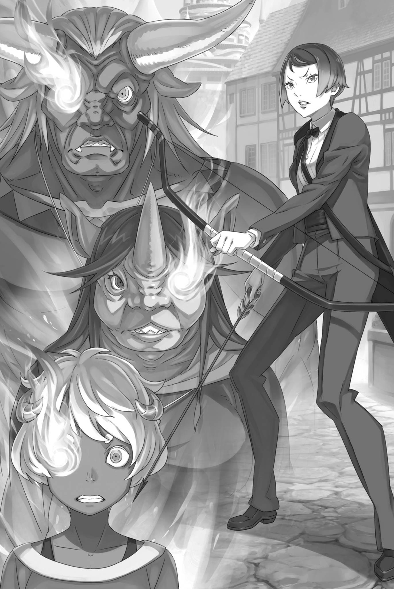

# 『魂婚』

------

——前门有虎，后门有狼。

严格来说，情况并不完全一样，但这样的成语却在昴的脑海中闪过。

更何况，即使是这样的成语，也花费了一些时间才浮现出来，这就如实反映了昴所处的困境的棘手之处。

「有近百名敌人！？」

从旅馆的后门窥视外面，塔莉塔给出了令人惊异的报告，阿尔的声音都变了调。

对于这种反应，塔莉塔静静地点了点头，然后说：

「我们被包围了。他们给人的感觉更像是警戒，而不是敌意……」

「一两人也就罢了，近百人便不能置之不理。」

塔莉塔关上后门，压低声音。埃布尔如此说道，见她点头，便将目光转向昴。鬼面后的黑眸微微眯起，那锐利的目光令昴心头一紧。

然后——

「——你自己，也有除了被围的问题之外的问题，对吧？」

「——啊」

「违反自然规律地缩小了手脚。无论发生什么都不奇怪」

埃布尔淡淡地叹了口气，注意到了昴的异常。

听到他的话，昴感觉自己的脸颊因羞愧而发热。埃布尔一眼就看出了他的不适，他也意识到自己是在拖后腿。

他甚至有点想要硬撑，假装什么都没有发生。

但是——

「昴，你还好吗？」

就在这时，曾在先前安慰过他的米迪娅姆的声音让他打消了这个念头。

在这里坚持己见并不能解决任何问题。更何况，不仅是昴，包括米迪娅姆在内的伙伴们也会受到这种坚持己见的结果的影响。

所以——

「其实，那个……我感觉我的记忆有点奇怪。我记得的东西我不能很好地回忆起来，可能有些问题」

「……刚才的，奇怪的反应就是因为这个吗」

昴咽下逞强的话，将实情说了出来。阿尔听后，一时语塞。

阿尔也注意到了昴之前的反应有些不对。现在，当问题具体化，他也开始感到不安。

对阿尔来说，发生在昴身上的事情并不是别人的事。

「——具体来说是什么？」

「……重要的、家人的名字想不起来了。不！那个，应该说，是花了点时间才想起来。」

「兄弟，现在可不是逞强的时候……」

「我没在逞强……」

他下意识地想要否认，却又迟疑起来：这会不会也是在逞强呢？

他不想被直接告知忘记了重要的名字。昴记得碧翠丝，记得艾米莉娅，记得雷姆。

他记得他留在庄园的伙伴们，他应该记得的。

「所以，我没有逞强……」

「说出确切的情况」

「什么？」

「你是忘记了，还是需要时间来回忆？到底是哪一个？」

被这样问，昴瞬间变得结巴。

埃布尔逼近了一步，他的问题犀利，丝毫不允许谎言。

昴感到头脑一阵麻木，无法从眼前的这个男人身上移开视线。在沉默的昴面前，埃布尔再次追问：「到底是哪一个」。

「你既然看不清周围，难道连自己的脑子里都看不清了吗」

「——不，不是的！我并没有忘记，只是有点难以回忆！只是需要一些时间来回忆，我并没有忘记！」

「……需要时间来回忆，是吗」

面对严厉的追问，昴下意识地辩解，埃布尔静静地接受了他的答案。

这是昴自己都不明白的辩解，所以他很惊讶埃布尔并没有轻蔑地驳斥他。

阿尔见埃布尔如此反应，烦躁地喊了声「喂」，

「有什么区别吗？在这种情况下还在乎这个？」

「非常不同。忘记和难以回忆之间有天壤之别」

「啊？」

阿尔不悦地咕哝，然而埃布尔并没有继续回答。

他没理会困惑的昴和阿尔，转身问正在留心外面动静的塔莉塔，

「外面的情况如何？他们还没动手吗？」

「目前只是在潜伏，应该已经完成了包围」

「那就说明，我们尚未满足他们动手的条件。」

「条件……？」

埃布尔没有回答疑惑的塔莉塔，他用手指摸了摸下巴，思考了一下，然后再次转向昴。

昴还没跟上他的思考速度，被他转过来的目光吓了一跳。埃布尔缩短了他们之间的距离，将脸凑近昴，追问，

「——怎样做，外面的人才会攻过来？」

「呃……」

「回答我。他们会在什么情况下向我们发起攻击？」

「我，我怎么知道……」

面对埃布尔的追问，昴紧张得全身僵硬。

即使他回忆起『死亡回归』之前的事情，那也是突如其来的死亡，他完全无法理解。

如果有更多的信息，他甚至可以提出适当的应对方法——。

「回答我」

然而，埃布尔无情地打断了昴的犹豫和混乱，向他提出问题。昴无法回答，埃布尔抓住他的肩膀，严厉地命令，

「回答我！菜月・昴！」

「我，我不知道！只有，一走出去，他们就会攻击！只有这个！」

被逼着答出这句话，昴猛地睁大眼睛，按住了胸口。

他又一次冲动地透露了通过『死亡回归』获得的信息。他害怕再次犯下禁忌，受到惩罚。然而，什么都没有发生。

周围的时间没有停止，也没有任何惩罚的手伸向他。

只是，作为替代——

「呜——！」

路伊低吼着挤进两人之间，将昴护在身后，正面瞪着态度强硬的埃布尔。

埃布尔被摆脱了抓住肩膀的手，不悦地看着路伊。然而，路伊立刻得到了一个强有力的支持者，米迪娅姆站在了她的身边。

「埃布尔！不许欺负昴！我要告诉哥哥！」

「……就算告诉他，又能奈我何。我不过是让他说出必要的情报。——也就是说，走出旅店便是触发条件。」

埃布尔毫不讳言地耸了耸肩，对米迪娅姆的责备视而不见。

看着陷入思考的埃布尔，米迪娅姆气鼓鼓地双手撑在腰上，转过头看向昴。

「昴，没事吧？埃布尔真是太可怕了」

「我，我不是被吓到。只是有点吓了一跳……嗯」

「是吗？那就好，昴，你真是个勇敢的孩子」

说着，米迪娅姆的手轻轻地抚过昴的黑发。

他感到羞耻，因为他被称为『勇敢的孩子』，并被以柔和的方式抚摸。然而，他不得不承认，他紧张的心慢慢平静下来。

真是让人无法理解。

受到米迪娅姆安慰时那份安心感固然不对劲，更大的问题，是面对埃布尔时那种难以言喻的抗拒与近乎恐惧的情绪。

他无法抵抗埃布尔的强大气场，总是被压迫。

这就像——

「就像是大人和孩子。而且，不仅仅是外表」

「嗯……」

昴依然按住自己的胸口，低头陷入沉思，此时阿尔的声音响起。

在埃布尔的对话中，阿尔的语气变得更加严肃。昴感觉自己仿佛被指责，脸颊不由自主地抽搐了一下。

被称为『大人和孩子』的比喻，在昴心中消除了所有的疑问。

没错，正如阿尔所说，这样的表达最为恰当。实际上，现在昴和埃布尔的互动，就像是大人和孩子之间的权力关系。

这不仅仅是外表上的，甚至连他们的内心，都好像被这种关系牵引着。

「——听着。我已对包围我们的敌人有了眉目。」

「哦，真的吗……！？」

在昴体验着一种莫名的恐惧时，埃布尔低沉的声音响起。

埃布尔的话让塔莉塔惊讶得瞪大了眼睛。不仅她，除了埃布尔外的所有人都感到惊讶。更准确地说，除了对话内容完全不明白的路伊以外的所有人。

总之，埃布尔聚集了所有人的注意力，然后点了点头。

「奥尔巴特所提出的条件，以及塔莉塔感知到的上百名敌人……如果排除不可能的可能性，那么剩下的可能性自然就被限制在一定范围了」

「那么，聪明的埃布尔，你的结论是？谁在瞄准我们？」

「——是卡欧斯弗莱姆」

「卡欧斯弗莱姆……是指这个城市吗？」

对于阿尔和米迪娅姆的提问，埃布尔沉重地点了点头。

然后，他看着昴他们这些还没有连上答案的面孔，继续说道。

「卡欧斯弗莱姆……也就是，魔都的居民。围住旅店的，伺机对我们发动攻击的，应该就是这座城市的居民」

※ ※ ※ ※ ※ ※ ※ ※ ※ ※ ※ ※ ※ ※ ※ ※ ※ ※ ※ ※ ※ ※ ※

——敌人是卡欧斯弗莱姆的居民，埃布尔如此断言。

「———」

面对埃布尔的断言，昴张口结舌地张了张嘴。——不，不只是昴。阿尔他们也各自露出了惊讶的反应。

这是理所当然的。毕竟，突然被告知城市的居民已经成为了敌人。

「就算这么说，也不可能立刻接受吧。你怎么会想到这个？」

「这是非常自然的思考。首先，能够动用百人规模的力量围攻旅店的势力是有限的。到那个时候就只有两个选择……皇帝一行和魔都的力量。但是，奇夏的样子正在模仿我。我不会做的事情，他也不会轻易做。」

「为了不让人发现他和埃布尔不是同一个人啊。那你不会做的事，是什么？」

「就是率领一支队伍大摇大摆地来到魔都这种鲁莽的行为。」

虽然想要点头同意这个断定，但昴不能判断这是否是确切的信息。皇帝随行的士兵有一百人，这是多还是少呢？

就算是这样的数量，也并不感到有什么奇怪的。

「我不太清楚，埃布尔君的城堡里有多少士兵？」

「你是在问帝都的兵力吗？如果是的话……」

埃布尔向挥手的米迪娅姆看了一眼，他的目光落在了昴身上。昴没能理解他目光的意图，然后他摸了摸鬼面的额头，稍微思考了一下，

「不会少于三万。但这并不是我们现在讨论的。现在的焦点是皇帝是否会让他们随行。然后——」

「也就是说，若是真正的皇帝，便不会如此行事。」

「就是这样」

埃布尔点头同意，否定了假皇帝的鲁莽判断。

即使听到这个讨论，昴还是觉得对方可能是疏忽了，但即使他说出来，也不会被接受，所以他保持沉默。

总的来说——

「皇帝已经明言不准对我们出手，奥尔巴特也表现出了遵守这一决定的态度。既然如此，对我们动手就违反了原则」

「……也许有种理论是我并没有亲自出手吧？」

「那我问你，你觉得我会接受这种理由吗？」

「我觉得不会」

塔莉塔如此回答，旁边的阿尔也摇了摇蒙着布的头。既然假皇帝在冒充埃布尔，判断的标准就该与身为皇帝的埃布尔一致。也就是说，埃布尔不允许的事，假皇帝也不能允许。

这么一来，假皇帝也得一直装出那副心胸狭窄的样子了。

「即便是以小聪明来应对，卡夫马・伊鲁克斯也不会接受。他思维僵化。正因为如此，他才是宝贵的人才，我相信卡夫马二将不会忽视这个问题」

「卡夫马・伊鲁克斯……是昨天那个看起来很严肃的人吗？」

「他对皇帝非常忠诚，但是如果有违道理的事情，即使是对一将，他也会毫不犹豫地提出自己的观点。奥尔巴特的狡猾，我想是无法动摇卡夫马的信念的」

「那家伙真的有那么大的能力吗？」

「曾经有人建议他晋升为『九神将』。虽然因为种种原因最后没有成行，但这是事实」

听到埃布尔的回答，阿尔发出了一声不悦的叹息。

如果这个消息是真的，那么昨天在红琉璃城的『九神将』级别的人才就有两人——不，如果把假皇帝算进去的话，就有三人。

这确实比带着一支糟糕的军队来可能更有保障。

「但是，如果假皇帝并不是敌人的话……」

自然地，埃布尔所说的推测开始具有现实感。

也就是说，正在外面等待我们的是魔都卡欧斯弗莱姆的居民，而能够驱使他们的头目是——，

「难道是尤尔娜想要攻击我们吗？」

「……除此之外，还有其他可能吗？首先，只有知道我们的情况，并有足够理由攻击我们的人，才可能是敌人」

「——埃布尔，你怎么看？」

魔都卡欧斯弗莱姆，能够驱使其居民的人。当然，首先会想到的是这个魔都的支配者尤尔娜・米希格蕾。

但是，就像奥尔巴特一样——不，比奥尔巴特更加难以看透的她，真的可能是策划了这一切，是背后的黑手吗？

面对充满疑虑的昴的询问，埃布尔敲了敲鬼面的额头，

「说不通。」

他简短地回答道。

「说不通，呃，就是想不明白的意思吧？为什么？」

「以为凡事一问便能得到答案，未免傲慢。——是亲笔信。」

「亲笔信？」

埃布尔给昴的回答是这样。

亲笔信，指的是昨天交给尤尔娜的那封信。递交那封信是昨日的目的，也应该是今日被召见的缘由。

埃布尔并没有告诉我们那封信具体写了什么。

「在信中，我写道我将给她所渴望的东西作为奖赏」

「她想要的东西……也就是说，皇后的地位？」

「嫁给你？」

埃布尔提到信件的内容，阿尔和米迪娅姆紧接着这样说道。

按昨天的说法，尤尔娜想要的是『皇帝』，并非非埃布尔不可，而是看中『皇帝这一身份』。

所以，如果信里写着将给予她所想要的东西，那就应该是这个意思。

「这种事，你觉得用信件来传达合适吗？」

「别用你的尺度，把事情想得如此浅薄。总之，她能得到自己所求之物，故而才召我们入城。既然如此，再派人来袭，便说不通了。」

「啊，也有可能她非常不想成为埃布尔的妻子，到了想杀你的地步……」

或者，信中写的东西让她生气到想要杀人的地步。

面对面交谈尚且是这副态度，昴觉得，即便面对有意迎娶的人，埃布尔恐怕也照样会摆出高高在上的架子。

但是，对于昴他们的想法，埃布尔只是嗤之以鼻，

「只要有必要，她便会做。感情居于其次，她又不是普莉希拉。」

「我觉得那个姐姐和公主在麻烦程度上有点相似呢！」

昴同意这个看法。无论是普莉希拉还是尤尔娜，都让他感到害怕。

但是，埃布尔肯定的语气让昴不得不承认他的观点有道理。——再者，他也回想起了昨天尤尔娜的行为。

『奴家好歹也是这魔都之主，侍从们都在跟前，岂会说谎。』

这是尤尔娜嫣然一笑时说的话，准确的说，她是在对昴他们说，她不会在没有阅读的情况下就丢弃他们送来的信，这是她的承诺。

但是，在那之后，尤尔娜的侍从坦萨告诉落入马厩的昴他们，尤尔娜已经承认了他们。

至少，昴觉得尤尔娜并不是那种会随意改变自己之前的话的人。

他不觉得尤尔娜是那样的人，所以他想相信埃布尔的话。

「不管怎么样，外面的人们也等得不耐烦了。我们要怎么办？」

塔莉塔在警戒外面的同时，表明他们不能再等下去了。

埃布尔说的袭击条件——即对方为何要攻击我们的理由，目前来看，就是我们出去。但是，既然对方已经准备好攻击我们，我们无法确定他们什么时候会强行闯入。

加上，昴他们现在正在玩『捉迷藏』。

「即使知道外面的人会涌过来，我们也不能不出去，对吧？」

「嗯，如果那个老头又偷偷藏在旅馆里，那就另当别论了……以防万一，我们再去检查一下房间吗？」

「如果没有『视野绝佳的深渊』的线索的话，我们也可以考虑这个办法」

埃布尔这样拒绝了之后，阿尔失望地摇了摇头。

实际上，昴也考虑过奥尔巴特可能再次藏在他们最初的房间里。只是，无论他怎么想，都无法将这个想法和『视野绝佳的深渊』联系起来，所以他没有说出来。

在此期间，昴他们的决策逐渐明确。

显然，除了冲出去，别无选择。问题只在于，要用什么策略才能成功突围。

「塔莉塔，吸引他们的注意力」

「埃布尔！？」

一瞬间，埃布尔发出的指令让人觉得无比残忍。

被指令的塔莉塔僵硬了脸颊，昴用颤抖的声音谴责埃布尔。然而，埃布尔无视了昴的声音，一直看着塔莉塔，重复了他的话。

「大闹一场，吸引外面的人们的注意。在此期间，我们会逃出去」

「埃布尔，我知道你说的有道理，但是我们还有更好的办法……」

「没有。这是现有手牌所能打出的最优解。若你们没有变小，倒还可以另寻他法。」

「说的太过分了！」

「啊呜——！」

面对关心塔莉塔的阿尔，埃布尔如此回应并且拒绝了他。

昴对他的冷酷感到愤怒，和他一样，路伊也愤怒地提高了声音。但是，对于昴他们的反应——

「没关系，我明白了。我会吸引外面的人的注意力」

「塔莉塔！无论如何都……」

塔莉塔摇了摇头，准备接受埃布尔的严酷的命令。

他们必须找到一个更好的方法，确保她的安全。但是，现在昴的脑海中只有对外面危险敌人的警惕和不安。

「塔莉塔，把东西给我。我们接下来需要它」

「好的。我吸引足够的注意力之后，你们抓住机会逃出去。我可能没有时间给你们发信号……」

「那就让米迪娅姆来决定」

「诶，我吗？」

埃布尔接过了塔莉塔背负的行李，瘦小的身形背起了包裹。然后，埃布尔继续布置计划，被点名的米迪娅姆瞪大了眼睛。

埃布尔转过头看向米迪娅姆，点点头说道：

「即使身体变小，判断时机的眼力也还在。这些人中，以你最为合适。」

「嗯～，我明白了。我会小心注意的！所以，塔莉塔，你也要小心哦」

「好的」

昴感觉自己被抛在了一边，事情进展得太快了。

埃布尔就算了，塔莉塔和米迪娅姆的反应太沉着了。尤其是塔莉塔，即使她被赋予了最危险的任务。

「那么，我要出发了」

说着，紧握弓箭的塔莉塔小心翼翼地向后门走去。看着她的背影，昴忍不住大喊了一声「塔莉塔！」

「那个，你，你不能死……！」

「……」

昴自己都讨厌自己说出这种显而易见却不能鼓舞人心的话。如果他不能提供有用的建议或者必胜的策略，他至少应该说些能鼓舞塔莉塔士气的话。

但他能说出的，只是颤抖的请求。——然而，塔莉塔微微松开了眼角，

「好的，我们待会再见」

她微微笑着，像是被弹射出去一样跳出了门。

就在这之前，埃布尔对即将进入敌方领地的塔莉塔抛出了最后的话语。

那就是——

「塔莉塔，不需要手下留情。全力以赴。——这个城市的人们，不论是谁，都不是那么容易杀掉的」

这是一种既不鼓舞人心、也不是必胜策略的，而是令人不安的警告。

※ ※ ※ ※ ※ ※ ※ ※ ※ ※ ※ ※ ※ ※ ※ ※ ※ ※ ※ ※ ※ ※ ※

―― 一踏出户外，敌意如潮水般激涨。

她以其深褐色的皮肤感受着这股气势，紧细的眼睛一扫左右全景。

在密林中，生活作为猎人的『修德拉克之民』对于地形和状况的瞬时把握是最基本的必备技能，塔莉塔也不例外。

——不，她是从姐姐米泽尔妲手中，接下了族长重任的人。

因此，塔莉塔在修德拉克族中，必须在这些技能上超越他人。而实际上，她就是如此。

「――啊」

微微地喘息，塔莉塔感知到针对自己的敌意。

周围的敌意，大约有一百人，但真正注意到从后门冲出的塔莉塔的，不过二十人。再加上，真正能迅速反应的人数会更少。

先从转向自己的那些人下手，射他们的腿——

「――不」

冲出去前，埃布尔那句『全力以赴』的忠告掠过脑海。

埃布尔傲慢而俊美，正是米泽尔妲喜欢的类型，塔莉塔却不擅长应付这种人。她性子软，容易被牵着走，面对姐姐或埃布尔这样的性格，自己的意见往往一句也说不出来。

因此，塔莉塔更喜欢愿意听她说话的人。尤其是自己需要时间整理观点，被催促时往往让她头昏脑胀。

从这个角度看，像是留在古拉尔的弗洛普等人更合……

「――呃，我在想什么啊」

一瞬间的羞愧让她的脸红了起来，塔莉塔像是泄愤一般拉紧了弓弦。

然后，在瞬间，弓箭射出――一次三箭。塔莉塔的箭术展现了它的威力，三支箭分别瞄准了不同的目标。

一箭直射，两箭弧线飞出，划破旅馆外巷道的风，深深刺入目标。

三名男子刚转向冲出门的塔莉塔，正要迈步，便分别被射穿了脖颈与胸膛，瞬间失去了战斗力。

「狩猎，真是好啊。」

因为不用与任何人说话，狩猎很适合塔莉塔。猎物不指望她开口，她也不希望与猎物心意相通。唯一称得上对话的，只有射出的箭与敌人的交锋。生与死，也无需靠交谈来分出结果。

「哦！」

伴着咆哮，几道身影取代被射倒的男子，冲进小巷。最先映入塔莉塔眼帘的，是一名身形高大得必须仰视的牛人兽人。头顶生着短粗犄角的男人，凭借庞大的体格猛冲过来。

如果正面承受他的攻击，塔莉塔纤细的身体肯定会被粉碎。

然而，后方和侧面都无处可逃。即便向上飞跃，也有被抓住脚的高风险。

考虑到这些，塔莉塔低身向前冲去。

「什么!?」

似乎没料到她会迎上来，牛人瞪大眼睛，喉咙一紧。塔莉塔抬脚踢碎他的鼻梁，顺势将他的脸当作了踏脚石。

她屈膝卸去冲击，踏着牛人喷血的脸，轻巧地跃入空中，身子转了半圈，变成头下脚上的姿势。

「————」

借着旋转，她将先前看不见的背后也收入眼底，获得了整整一周的视野。建筑阴影、屋顶、遍布城市的脚手架——连同那些打算从各处发起攻击的人，一并被她锁定。

「箭矢，不够了呢。」

说着，她一把抽出箭筒中的数支箭夹在指间，以眼花缭乱的速度搭弓，反复三箭齐发，猛烈地削减敌人。

敌人数目远多于剩余箭矢，塔莉塔只得凭多年经验，优先瞄准实力更强的敌人。那些人影带来的违和感，此刻暂且抛开——

「唔哦哦哦——！？」

箭雨如风暴般肆虐，被贯穿的敌人纷纷受冲击掀飞。

遵照埃布尔的忠告，她毫不留情地瞄准要害，胸口、脖颈，能瞄准时更射向眼睛与嘴巴，力求一击致命。大约三十名敌人遭到了攻击。

然而，第一轮交锋便已耗尽箭矢。接下来，只能尽量回收射出的箭，继续担任诱饵——

「……这稍微有点，出乎我的预料」

塔莉塔正要从被射倒的人身上回收箭矢，脚步却顿住了。

作为修德拉克的战士，塔莉塔已经射杀过数不胜数的猎物。尽管形态各异，但射中生物要害的感觉在箭矢发射的瞬间就能知道。

正是凭借这些经验，她确信那些中箭者已被自己夺去了性命。

「咕咕……」

然而，那些呻吟着站起来的生物，没有一个失去了生命。

即使他们没有死，也应该处于濒死状态。但是，那些站起来的人不仅没有濒死，他们的眼中甚至没有失去战斗的意志，而是怒视着塔莉塔。

他们盯着塔莉塔的眼睛，出现了变化。

「那是，到底怎么回事？」

塔莉塔皱眉，向重新站起的牛人发问。男人没有回答，但他身上的变化实在异样，令人无法移开视线。

他的右眼，被一团红色的火焰覆盖着。

不仅仅是这个牛人男子，所有被塔莉塔射中、倒下的人们都有一个眼睛里燃烧着红色的火焰，他们都在凝视着塔莉塔。

而且，不仅仅是被塔莉塔射中的人，那些后来包围塔莉塔的人也在他们的眼中燃烧着红色的火焰。这是一种摇曳的火焰，散发出火星。

令人惊讶的是，这火焰正燃烧在牛人们的伤口上，治愈着他们的伤口。

牛人被踢碎的鼻子，以及中箭者身上的箭伤，都被那火焰尽数治愈。

「……埃布尔，你的解释是不是有点太不足了？」

眼前的景象与埃布尔方才的忠告重叠，塔莉塔叹着气抱怨。虽不敢断言，但埃布尔多少预料到了这种情况。既然如此，真希望他能多说几句，解释得清楚些。

明明才刚觉得自己不擅长应付那种只顾着推进话题的人，此刻却又希望对方多说一些，倒也随性得很。

不过——

「我的任务是引诱敌人，而不是消灭他们」

所以，若只看是否尽到了职责，眼下反而可以说十分顺利。

然后，

「……果然会折断箭呢。」

被她射中的人们开始折断从他们身体上拔出的箭矢。她原本应该回收的箭矢没有了，塔莉塔只能封印自己擅长的弓术。

但要说她就此束手无策，也不尽然。

「在狩猎中，我们也使用短剑和投石」

说着，塔莉塔压低身子，将藏在礼服里的短剑与已无箭可射的弓一同架起。

她依然在完成自己的任务，战斗才刚刚开始。

※ ※ ※ ※ ※ ※ ※ ※ ※ ※ ※ ※ ※ ※ ※ ※ ※ ※ ※ ※ ※ ※ ※

「——塔莉塔，你真了不起……！」

在奔跑中，看着那些被伤口和眼瞳燃烧的人们，昴颤抖地发出声音。

冲出去的塔莉塔奋勇作战，那身本领远远超出了昴的想象。

坦白地说，内向且温顺的塔莉塔在修德拉克人中有多强，昴一直都低估了她。

他也见过她面对奥尔巴特时的无力感。

毕竟，既然米泽尔妲会指名她作为下一任族长，他本以为她的实力和库娜或荷莉差不多。

但看到她精准的射击和快速射箭，以及在与压倒性数量的敌人战斗中的英勇表现，他甚至开始怀疑她是否与米泽尔妲相匹敌，或者比她更强。

「尽管如此……」

即使是技艺高超的塔莉塔，那些刺客的异质性也无法抹去。

首先，他们的外貌也很奇特。他们全身上下没有穿盔甲，也没有携带任何像样的武器。他们就像是没带任何武装。

他们的外表，与昨天在卡欧斯弗莱姆遇到的大部分人一样——他们就像是在这个魔都生活的普通市民。

这些市民们，围攻了昴他们，即使被塔莉塔的超级技巧和箭矢攻击，即使受到致命伤害，他们还是平静地站了起来。

就他们看来，刺客中包括了女性和孩子，他们并不是被召集的强大战士，这可能让塔莉塔也感到不安。

她成功地吸引了所有人的注意，昴他们在米迪娅姆的指示下跳入了城市。但是，他们真的可以逃跑吗？他们不应该援助塔莉塔吗？

他不知道什么是正确的，昴的心中充满了疑惑。

在昴旁边，重新拿起包袱的埃布尔——，

「果然，整个城市都被『魂婚术』覆盖着」

「魂婚……？喂，埃布尔，那是什么啊？」

「那些人面对塔莉塔仍不退却，靠的就是它。」

阿尔在奔跑中提出问题，埃布尔给出了含糊的回答。

他并没有完全理解这个答案，但有一点是明确的——埃布尔对于那些燃烧的眼睛和刺客之间的关系有所了解。

「埃布尔！别隐瞒了！全部告诉我！」

「——古籍记载的一种本该失传的秘术，名为『魂婚术』。将自身灵魂的一部分分予他者，从而提升受赠者的价值。」

「我不懂！这是什么意思？！」

「简单来说，『魂婚术』使得灵魂之间共享一部分力量。在这个城市中，使用『魂婚术』的人只有一人——」

在昴和阿尔的催促下，埃布尔尽可能地解释了这个问题。

尽管内容仍然难以理解，但昴总算是捕捉到了一些要点。

也就是说——，

「——构成这个魔都的所有事物，都在共享尤尔娜・米希格蕾的力量。因此，这个城市不会轻易被任何军队所攻陷。」

