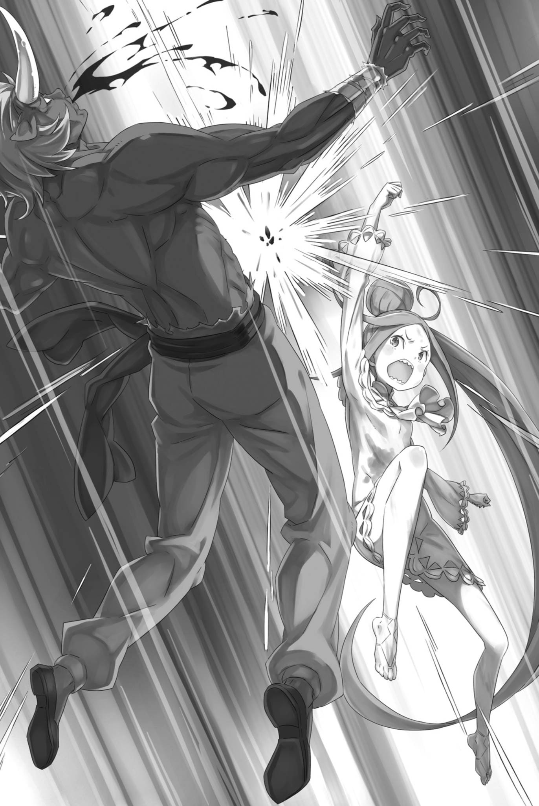

# 『不会消失的■■』

------

「——！」

微弱的尖叫声响起，小小的身体在空中打转，一路飞出。

少女落向地面，弹了一下，去势却丝毫不减，接连翻弹到街边，撞上已被扯去篷布的帐篷骨架。支架倾倒，发出刺耳的响声，将她压在底下。

昴呆然地看着这一切，连声音都无法发出。

这一切发生得太突然，他不能找借口说他不明白发生了什么。

尽管这确实是一瞬之间，他甚至没有时间伸出手，但他的黑眼睛清楚地捕捉到了这一瞬间发生的事情。

脑子乱成一团，什么也没想，便冲上了危险的街道。

然后果然，他被敌人发现并陷入危险，为了救昴，阿尔和米迪娅姆两人受伤，就这样——

「……路伊」

为了保护昴，双手张开的路伊站在前面，她的身体像橡皮球一样被弹开。

做这件事的是一个白发的羊人少年，他有一对短短的角。他的胳膊和昴差不多细，却轻易地把昴扔到了近十米高的地方。

那个少年的一挥手，路伊正面承受下来，被吹飞。昴看到血液飞溅，他无法相信路伊会安然无恙。

「对不起」

昴看着被帐篷残骸压住的路伊，他的耳膜被微弱的道歉声震动，他模糊的视线里，再次映入了挥舞手臂的少年。

他无法躲避，他并不那么机敏。

首先，昴自己，由于从高处摔下，手脚麻木，几乎无法动弹。

因此，尽管路伊费尽全力保护他，但那也是白费——

「昴！」

「啊」

「快站起来！」

一道身影猛扑过来，纤细的腿重重踢中了少年的肩膀。

少年露出惊讶的表情退后，割入的是飘逸着长长的金发的米迪娅姆。她脸红心跳，向昴喊道要他站起来。

对着那个倒在地上，连发抖都做不到的昴。

「请照顾路伊！」

尽管如此，米迪娅姆没有任何鼓励或安慰，就这样对昴说，然后她就开始奔跑。

她双手握着唯一带来的那把剑，动作已不复往日舞蹈般的潇洒，却仍竭尽全力地逼退少年。

少年也同样，他的脸显得僵硬，似乎被她的气势震慑。

「唔，呜呜……！」

在米迪娅姆全力以赴的同时，昴努力用开始颤抖的手脚站起来。然后，他跑向被压在帐篷下的路伊。

他逐个移开倒下的框架，从废墟中挖出被压在下面的路伊。

「路伊，路伊！你，你还活着吗！嘿，路伊！」

在他拼命呼唤的同时，昴感到眼眶深处充满了泪水。

这种麻烦的泪水，一直在昴的脸庞深处等待着出现的时刻。他忽视这一点，急急忙忙地清理掉货物。

然后——，

「……呜…」

「路伊！」

发出微弱呻吟声的路伊出现在昴的视线中，她全身都是土尘。

被摧毁的帐篷压在路伊身上，她被塞进了由倒下的支柱形成的空间中，刚刚好没有被压扁。

昴松了一口气。但是，松了一口气之后他又开始担忧。

「这种东西，我搬不动……」

倒下的支柱足有昴的躯干那么粗，推也好、拉也罢，都纹丝不动。想用『杠杆原理』，又找不到合适的石块。

在寻找拖出路伊的方法的过程中，他发现了另一件事。

——路伊的白衣上，正慢慢洇开一片与尘土不同的红。

「……啊。」

昴愕然望着那片红，手脚冰冷，思绪冻结。

这就是血色尽失的感觉。明明自己没有流血，褪去的血色却不知去了哪里。血从一处退开，别的地方不该热起来吗？

只有心跳声大得惊人，仿佛就要炸裂。

「啊……」

路伊仍在微弱地呻吟，衣服上的血迹却一点点扩散。

他的手脚已经变得冰冷而僵硬，他不仅无法进行挪开的努力，甚至连做出努力的样子以安抚路伊都做不到。

「路伊，路伊……」

昴的唇边不断颤抖着呼唤着路伊的名字。

然而，他的声音已经变得嘶哑，无法正常地呼唤。他的舌头变得麻木——不，是昴的内心深处，强烈地拒绝呼唤她的名字。

一想到这，昴意识到他一直尽可能少地呼唤路伊的名字。

自从与雷姆一同从高塔被传送到这里，路伊就一直被留在身边。昴始终提防着她，厌弃着她，粗暴地对待着她。

尽管如此，路伊从未对昴做过任何危险或不利的事情。

不想被雷姆讨厌。周围的人，不想被他们害怕。

昴一直在恐惧这些，一直在拒绝与路伊接触，一直在推迟决定最后如何对待路伊。

为什么，他会如此害怕路伊？

他麻木的大脑，冰冷的手脚，干燥的舌头，即将破裂的心脏，都无法让他理解。

他无法准确地回忆起路伊对他做了什么。

就像记忆被迷雾笼罩一样，他无法在这一刻打开记忆的抽屉。

然而，即使不用打开抽屉，有一件事情是非常清楚的。

那就是，路伊为了保护昴，流出了血。

——这是一个无法忘记，无法避开的事实。

「别，别死……」

「————」

「别死，路伊！不能死，不能死的……！不能……！」

昴将自己的小身体挤进支柱的缝隙，跪在路伊的身边。

昴没有把她拖出来，只一味发出毫无帮助的呼喊。他抓住路伊的手，用双手紧紧握着，像祈祷般拼命说道。

「别死……！」

为了防止她死去，他应该寻找能做的事情，但他忘记了，只是发出荒谬的请求。

在昴颤抖的声音中，路伊的眼睛微微睁开，然后——，

「——嗯，呜」

微弱的声音从她口中溢出，少女的眼睛似乎恢复了一些力气。

※ ※ ※ ※ ※ ※ ※ ※ ※ ※ ※ ※ ※ ※ ※ ※ ※ ※ ※ ※ ※ ※ ※

「啊，哇啊啊——！」

挥舞着手中的双剑中的一柄，米迪娅姆对决面前的少年。

羊人少年面露坚毅，然而轻易地以手挡下米迪娅姆的攻击。——直接用手臂接住剑刃，反弹回去。

「哇～好硬！完全砍不动！太不公平了！」

从刚才开始，米迪娅姆全力以赴地砍了几次，每次都被少年坚韧的身体挡下。

皮肤、头发、手指、头部，无论哪里都硬得让她束手无策。

而且，攻击无法奏效这也是问题——，

「——！」

「危险！！」

少年粗暴地挥舞的手臂，擦过米迪娅姆，猛地撞向地面，震动感让地面摇晃，撞击处比挥舞的手臂还要形成一个更大的坑。

这种，少年的攻击力让人目瞪口呆。米迪娅姆能避开攻击，全靠少年的动作漏洞百出。

「虽然看起来非常坚硬，也很有力量，但技术很糟糕！」

他就像刚出生的大个儿宝宝一样，米迪娅姆这么想。

虽然她从未见过一个刚出生的大个儿宝宝，只是依据感觉来想象，但这种描述似乎非常贴切。

目前，她只是应付这个宝宝，但——，

「如果不快点，别的人也会过来……」

舔着有土的味道的嘴唇，米迪娅姆被急切的想法焚烧着。

虽然她碰巧冲出了追捕者较少的街道，但如果像这样闹下去，他们很快就会被发现，少年的同伴也会聚集过来。

如果有比少年更大的人，或者技术更好的人过来，她可能就无法抵抗了。

如果不是一个人的话，还有其他的应对方法。

「阿尔啊！阿尔啊！」

她在躲避少年挥舞的大动作的同时喊着。

米迪娅姆拼命呼唤的，是视野边缘蹲着的蒙面少年——不，是阿尔。只有一条手臂，又变成了孩子，他使起武器比米迪娅姆更困难，但应付危机的本领远在她之上。她想倚仗的，正是这一点。

「————」

然而，他并未回应米迪娅姆的呼唤。

他并未因为被击飞而撞到头昏过去。阿尔醒着，也曾经设法协助过她。

然而现在，他突然停下脚步，痛苦地跪了下来。

蹲下的阿尔，透过面纱，凝视着自己的右手——，

「……为什么？」

他这样颤抖地低语。

就好像，他失去了本该握在手中的东西，就像是丢失了什么。

「阿尔……！」

看着无法站起的阿尔，米迪娅姆的心中满是挫败感。

顿时，握着武器的手无力了下来，米迪娅姆猛地咬紧了牙。

——一直以来都是这样。

米迪娅姆一旦心志衰退，身体也会随之衰弱。因此，她总是保持积极态度，大声说话，尽量挺直背脊。

只要精神振奋，米迪娅姆便能拼尽全力。哥哥弗洛普平日那一声声「加油！」，也一直在背后推着她。

但是，弗洛普不在这里。也没有人会对她说加油。

每个人都被自己的问题困住，米迪娅姆的身体也变小了，一次只能拿一把剑，眼看连一个小男孩都要打不过。

「——找到了！！」

「啊」

这声音更加削弱了米迪娅姆。

她躲避少年挥舞的手臂，换了个站位，睁大了眼睛。视线中，从街道的另一边出现的是，眼中闪烁火焰的敌人的增援。

他们冲过来，向跪着的阿尔的背后逼近。她想立刻向那边冲过去，但必须先躲过挡在中间的少年。

——来不及了。他们都会死。阿尔，昴，路伊。

所有人都会死。

手里的剑几乎要滑落，米迪娅姆在心里拼命呼唤哥哥。要是能像往常那样，听见哥哥的声音、鼓励与声援就好了。

但是，新的敌人比她的幻想中的声音更快地接近阿尔。

阿尔小小的身体，眼看就要被从背后伸来的手撕裂——

「——你还不能动吗，你这蠢货」

在尖锐的爪子即将触及阿尔的背部之前，从旁边伸出的脚踢飞了他。阿尔的身体横向倒下，刚刚好躲过了背后的一击。

施行这粗暴救法的，正是以鬼面遮脸的男人。

「埃布尔吗？」

惊愕之间，名字从她张开的嘴里溢出，埃布尔的意识闪烁着转向了她。

即使面对面，她也能感觉到目光的交汇，米迪娅姆的肩膀微微颤抖。本来在处理少年的问题上全权交给米迪娅姆他们的埃布尔，现在自己踏上了战场。

他或许是看不下去了。自己会不会被骂？

她讨厌被责备。

过去她经常被责备，被打。因为米迪娅姆虽然很小，但是食量却很大。被打，被责备，这成了她生活的循环。

因此，一旦她认为自己将被责备，身体就会不由自主地收缩——

「米迪娅姆」

她的名字被叫出，米迪娅姆的身体开始颤抖，她害怕接下来的责备。

然而，埃布尔忽视了她的恐惧，继续说下去。

那是——

「——要好好振作」

「————」

米迪娅姆瞪大了眼睛，被这个粗鲁的话语和震动她鼓膜的声音震惊，她紧紧地咬住了她正在微微颤抖的牙齿。她咬紧了牙，脸颊扭曲，金发飞舞。

「好的！我会加油的——！」

然后，她感到一股力量如泉水般涌现，推动着她，米迪娅姆猛地向面前的少年挥拳猛击。

少年惊得后退，米迪娅姆紧追不舍，以自下而上挑起的剑脊顶中他的下巴，踢向敞开的躯干，踏住伸直的膝盖，再一记回旋踢踹中脖颈。

突然间，米迪娅姆的气势如虹，少年只能处于防御状态。

尽管她觉得这就像是欺负弱者，但米迪娅姆仍然举起拳头，一次又一次地击打他。在她打击的过程中，她的心中回响着一句话。

——怎么样。把对方对你做的事情加倍地还回去，心情会很好的，对吧！

这是她和弗洛普从苦难中被解救出来的恩人的话。

这位恩人教给她如何战斗，如何生活，想起他的话，米迪娅姆笑了。

她笑着，心里却想：『打人也不怎么痛快嘛～！』

「啊，哈啊！」

她一边思考，一边将全部力量集中在剑上，向少年的头部猛击，小小的身体被击飞。

若是常人，脑袋都该被斩断的一击，落在坚硬的少年身上，也只相当于挨了一记重拳。即便如此，总算打倒了一人，可以去支援阿尔与埃布尔——

「你这小东西，窜来窜去的……！」

「哎呀！糟了！」

她过于专注于与少年的战斗，忽视了从后面逼近的对手。

她的头发被粗鲁地抓住，米迪娅姆的身体被轻轻地提起。她的脚离开了地面，无法立即做出反应。

「嗯～！哦～，真是的！」

米迪娅姆踢蹬着双腿，头发被扯得眼泪汪汪，回头一看，提着自己的竟是个比变小前的她还要高大的犀人大汉。

那个大男人厚实的肉和皮比小男孩更强大，对米迪娅姆的踢脚毫不在意。

「对不起！我，我跑不掉了！」

她挣扎着，歪着脖子，尽力地这么叫喊。

看过去，被踢翻的阿尔还躺在路上，而把他弄倒的埃布尔，被赶来的援军包围，被逼到了墙角。

米迪娅姆知道，要求体弱的埃布尔把所有人都打败是不可能的。

所以——

「埃布尔！带着阿尔逃走吧！」

米迪娅姆真希望他们能找到某个空隙，成功逃脱。

但是她那绝望的呼喊只使包围埃布尔的男人们遮住了视线，阻断了退路。其中一个男人——牛人中年向埃布尔逼近。

「抱歉，我们不能让你们逃走。你们必须在这里……」

「你是牛人，刚才的是羊人」

「什么？」

「包围旅店的人们都是有角族……这些条件已经足够明显了。想要对付我们的，应该就是有角人种吧」

明明身陷包围、处于绝境，埃布尔的声音却毫无惧意。他气焰逼人，仿佛反倒是自己包围了众人。这般态度与话语，让男人们动摇了。

不仅是埃布尔的傲然，他的话语本身也让他们感到动摇。

「有，角……」

米迪娅姆说着，转动眼睛，望向抓着自己头发的犀人。

高大的犀人的注意力也被埃布尔的话吸引了。在犀人的大鼻子上，可以清晰地看到一根粗壮的角。

回想起来，刚才那个羊人少年，还有在旅店中被塔莉塔吸引过来的那些人，他们都有角。

「但这到底意味着什么！」

「你这笨蛋。这就是导致这种情况的根源」

「啊？」

不知道是不是听到了米迪娅姆的呼喊，埃布尔回答了她。

但是，从米迪娅姆的角度，她看不到他的身影，他的话语也让她一头雾水。她希望他能解释得更清楚，或者即使她不理解也继续说下去。否则，事情就会——

「你可以试试看」

「什么？」

这并不是回答米迪娅姆心中的呼喊。

埃布尔冷静而庄重地说出的话，是对着他的敌人，对着站在他们最前面的牛人男子。

牛人男子瞪大了眼睛，仔细地看着埃布尔。对于牛人男子的反应，埃布尔继续说道。

「你可以试试看能否杀了我」

「……你认为，我杀你会有困难吗？」

男人的左眼像是燃烧的火炭，他咬紧了牙齿，脚步在地上挪动。

即使没有尤尔娜的『魂婚术』，就男人那副魁梧的身躯，扭断埃布尔的脖子应该易如反掌。

而且，他们已经做好了杀人的准备。

然而，埃布尔却悠然自得地交叉双臂，通过鬼面，他的黑眼睛直射对手——

「容易还是困难，答案在你的行动中。因此，你可以试试看。如果你有能力，火焰将会赞扬你。但是——」

「但、但是什么？」

「如果你没有能力，火焰将会烧毁你的灵魂。那么，你会怎么做？」

「……」

牛人男子被埃布尔的话语堵住了嘴，沉默不语。

他被眼前的埃布尔震慑住了。如果力量对决，他肯定能赢。可是，眼前这个男人的从容是何等的自信？

这个问题的答案，或许就藏在刚才他所说的那些迷惑人的话语中。

「试试看吧。看你是否能超越被称为审判的火焰。」

「咕，嗯，啊啊啊……！」

在压力下，男子粗壮的喉咙发出呻吟。他全身冒出汗，身体僵硬，他的同伴们也不敢出声。

在看见埃布尔的眼神的那一刻，他们已经被排除在这个舞台之外。

只有眼前这个男子有资格回应埃布尔的话。

紧接着，咬紧的牙齿发出嘎吱声，声音在空气中回荡，回荡，回荡——

「啊，啊啊啊啊——！！」

紧咬的牙齿终于崩裂，男人仿佛借着疼痛驱动自己，猛地举起双臂。

他不仅想要扭断埃布尔的脖子，更想要一击将埃布尔整个人生命力碾压。如果他的魁梧的臂弯下来，埃布尔的瘦弱身体肯定会被压扁，破碎。

米迪娅姆用力扭曲着身体，拼命试图逃脱束缚，但一切都无济于事。

阿尔只是倒在那里，他甚至没有将注意力转向埃布尔的危机。

然后，昴和路伊也……

「……嗯？」

路伊被压在坍塌的帐篷下，昴则赶去救她。米迪娅姆看见，昴已经钻进残骸，握住了路伊的手。

接着，被压住的路伊微微动了一下——

——下一刻，两人的身影突然从帐篷底下消失了。

「啊！」

刹那间，刚刚消失的路伊已从正下方，一击打中了那名高举双臂的牛人的下巴。

※ ※ ※ ※ ※ ※ ※ ※ ※ ※ ※ ※ ※ ※ ※ ※ ※ ※ ※ ※ ※ ※ ※

昴完全不明白发生了什么。

昴紧抓着被压在帐篷下、血一点点流出的路伊，说着毫无安慰、毫无帮助的话，只一味自私地求她别死。

正当他这样说着，路伊微微挪动了一下，这是他立即感觉到的事情。

昴的视线在一瞬间转变，体验到了世界颠倒的感觉。

「啊，哦……」

这并不是因为超高速，也不是因为时间停止了，这不是那样的事件。

事实上，昴只是在眨眼的瞬间，就转移到了另一个地方。

而且——，

「你这家伙……」

他出现在了埃布尔面前——那男人低声说出这句话，因昴的突然出现而略微屏息。

昴看到埃布尔双手交叉，悠然自得地靠在墙上，他的存在和周围的男人们的气息，让昴感到混乱和困惑，他的腰都快软了。

刚刚还在为路伊流泪，现在的他已经停止哭泣，喉咙紧张地哽咽。

然后，突然发生的这个现象让快要从他脑海中消失的路伊怎么样了呢——，

「啊，哦！」

「咕哇！？」

像旋转木马一样转动着的路伊，像弹球一样在男人们之间跳跃，对他们的脖子、躯干和膝盖等致命的部位狠狠地打了一拳，让他们后退。

男人们被她的速度和力量吓得瞪大了眼睛，纷纷向后退去。

在震惊和疼痛在男人们之间传播的同时，路伊已经开始了下一个行动。

「呜啊呜」

路伊从男人们的间隙钻出包围，像动物般四肢着地，随即双手扯住地面，将地表掀了起来。

这就像是用力拉地毯一样的动作——当然，城市的街道上是不会铺设地毯的。但是，地面看起来就像是被移动了一样。

结果，所有的男人都失去了平衡，纷纷在原地跌倒。

「什么！？这孩子……！」

「啊呜！啊呜啊呜！」

「混账！」

一名鹿人青年好不容易稳住身子，咋舌着扑向路伊，想将她制住。路伊朝他掷出刚剥下的薄薄地皮。青年下意识挥臂拨挡，就在这一瞬间，那轻薄的地皮恢复了原本的性质。

也就是说，它变成了带有一定重量和质感的土壁。

「噗嘎！？」

土墙迎面撞来，青年猝不及防地吃下反击，身子向后仰去。

接着，路伊穿过破碎的土壁，飞出来，她的脚踹中了青年的脸，让他满脸鼻血，这次他真的倒在了地上。

「你这个！」

「呜啊呜！」

跨过倒下的青年，那些晚一步站起来的人们向路伊逼近。然而，当他们的手指即将触及路伊的瞬间，她又一次像幻影一样消失了。

下一刻，路伊出现在大约两米高的墙壁上，像刚刚处理地面一样，她用双手剥下了墙壁的表面，然后恢复原状。

带有质量和硬度的墙壁表面剥离，落在男人们的头上。

「啊啊啊啊——！！」

街道上响起了惨叫和怒吼，这些拥有强大力量的男人们被路伊一个人玩弄于股掌之中。

昴就那样呆呆地看着这一切，他在原地坐下，一动不动。

「路，路伊，那是……」

他的声音颤抖，他举起手，面对眼前的恶梦般的景象感到恐惧和惊愕。

这是一个恶梦，的确，这是一个恶梦。这无疑是昴一直害怕的恶梦。

路伊能自如地剥离地面和墙壁，瞬间短距离移动，展现出了如同顶级格斗家般的战斗力，一一击败了男人们。

这绝对不是一个幼女应有的超越性力量——不，菜月・昴甚至知道这股力量的来源。

这是，这是，这是一股不应存在的力量，应该消失的■■——。

「我原以为她不仅仅是个小女孩，现在我明白了。」

「啊……？」

身陷困境的昴，只能呆滞地看着眼前的事态发展，身边的埃布尔低声嘀咕着。

埃布尔和昴看着同样的场景，他的话语让昴疑惑不解，眼神动摇。在昴的视线边缘，埃布尔一直看着他的反应，同时指向正面，一边指向正在单方面击败追击者的路伊，一边说道，

「这就是，你带着那个女孩的原因吗？」

「不，不是……」

昴反射性地想要否认，但当被质问为什么要带着路伊时，他无法给出任何回答。就像过去一样，现在也是如此。

「住手！你不管这丫头的死活了——呃！？」

「啊呜啊呜！」

看着战局崩溃的伙伴，犀牛人男子试图制止，却被路伊一击击中。

他试图用手中的米迪娅姆作为人质，但在他威胁的话还没说完，路伊的攻击就已经打中了他。

能瞬移数米的路伊，用双手猛烈地从两侧击打男子的头部。男子的耳朵被打中，白眼翻转，重重倒下。

「哇，路，路伊酱？」

「啊-呜-」

突然被释放，米迪娅姆摔倒在地，路伊径直冲向她。米迪娅姆摸着路伊的头，呆然地看着周围。

米迪娅姆的视线中，街道上聚集的所有人，都倒在了地上。

就是路伊，一个人打败了十几个敌人。

「你与那小丑，倒都没有露出真本领。也罢。」

「我，我不明白……这到底是怎么回事！」

「别嚷嚷。别引来其他人。你去把那个小丑捡起来」

埃布尔扬起下巴示意，发号施令时，几乎看不出脱险后的感慨。

他所指的是呆坐在地上一动不动的阿尔。昴急忙冲过去，担心他在不注意的时候受了重伤。

「啊，阿尔！喂，你还好吗？伤……」

「……我不好」

「――！你受伤了吗！？哪里？我马上给你……」

「不是那个！」

「――！」

阿尔用强烈的声音向冲过来，摇晃他肩膀的昴怒吼。他低头，手颤抖着，紧握右手，

「——派不上用场。」

「……那，那种事」

「我根本派不上用场。现在的我，会死的。」

「――？那是，什么意思」

昴想要向发抖的阿尔提问。

但是，他的问题被从后方传来的紧迫的声音打断。

「埃布尔，你不能做出过分的事情！」

「安静点。我有事要问」

「但是……」

米迪娅姆情绪化的声音和埃布尔冷静的回应。他们走向的是街头的尽头，那里倒下了一名羊人的少年——就是最初，当他们来到这条街道时，那个猛然把昴扔向空中的少年。

身体挣扎起身的少年脸上充满了明显的恐惧。

这份恐惧不难理解。少年并非缩小了身体，而是货真价实的孩子。眼看大人们被打得落花流水，自己又被打倒他们的那群人，尤其是这个戴着鬼面的男人俯视着，怎么可能不怕。

对这样恐惧的少年，埃布尔决不会手软。

他抓住试图阻止他的米迪娅姆的肩膀，让她退后，然后埃布尔弯腰来到少年面前。他们的脸离得很近，少年恐惧的眼睛里的火焰，几乎被埃布尔的目光所吞噬。

然后，埃布尔无视了害怕的少年，向他抛出了问题。

这个问题简洁而明了——

「谋划此事的有角人种统领——那个自称坦萨的女孩藏在何处？速速说来。」

