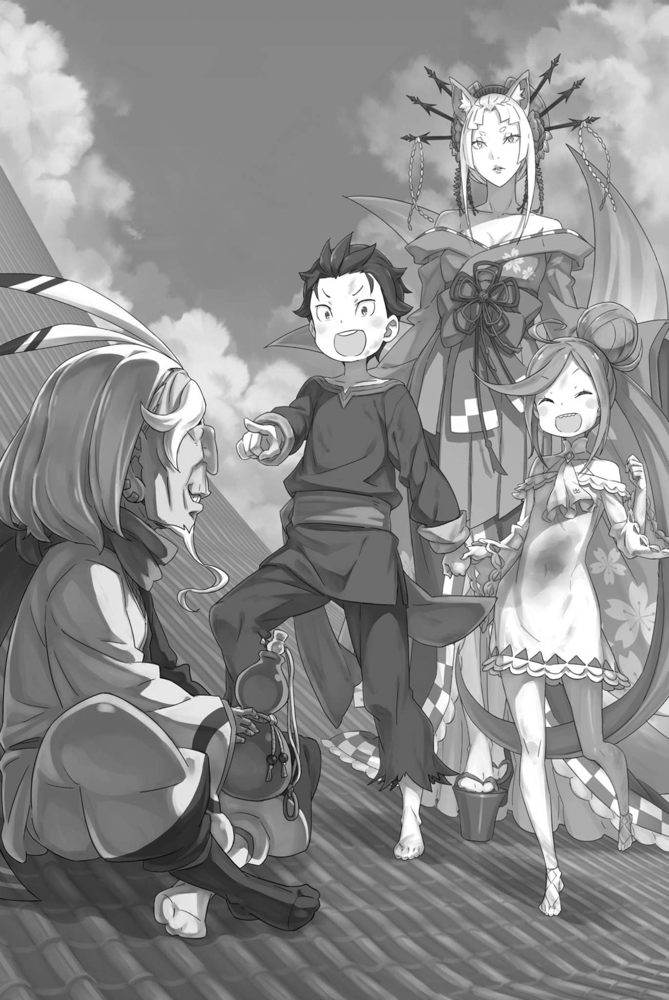

# 『视野绝佳的「深渊」』

------

与散发着可疑气息的乌比尔克分别后，走过几条小巷，停下了脚步。

昴向四周张望，确认是否有人在附近。当然，他也仔细确认乌比尔克没有跟着他，

「——答案，在我心中。」

「啊呜。」

路伊歪着脑袋望着昴，昴在反思乌比尔克告诉他的话。

乌比尔克说自己从事『顾问』一类的工作，具体做什么却全然不明。虽然那股骗子般的气息始终挥之不去，他的指点倒似乎颇为准确。

确实，昴想知道乌比尔克是否真的看到了他想要的东西，但他并不十分确定——，

「……『视野绝佳的深渊』，或许我明白了。」

乌比尔克说答案在昴的内心，这成了提示。

当然，消失的奥尔巴特并不是指他悄悄藏在昴体内的意思。那是一个比喻，奥尔巴特的线索也是个谜。

『眼皮子底下』的谜语，答案是第一个房间。

所以，理所当然地，『视野绝佳的深渊』也是个谜语，答案一定藏在某处。

然后，乌比尔克说的答案，就在昴的内心——，

「我去过的地方，似乎会让人这么想，但不是这样。」

「啊呜啊呜？」

「在这座城市里，我去过的地方并不多。除了旅馆外，就只有尤尔娜的城堡。但是，那里并没有深渊的感觉。不是这个意思。」

「嗯。」

「像深渊的，究竟是什么意思呢。」

奥尔巴特提出的『视野绝佳的深渊』，但从一开始，『绝佳视野』和『深渊』就是截然相反的词汇。

视野好，便是能看见开阔的景色。深渊，却是深不见底的洞。一个视野开阔的洞，怎么想都不对劲。

所以，其中一个词是假的。而绝佳视野无法说谎，所以唯一可能撒谎的就是深渊。

「像深渊的东西，却又不是深渊……」

在昴曾去过的卡欧斯弗莱姆里，这样的地方是不存在的。

没有离开旅馆的埃布尔他们，肯定也是一样。——说实话，奥尔巴特对魔都的了解程度也不是很清楚。

但是，昴觉得奥尔巴特也很难经常外出。毕竟，他的工作就是跟着保护假皇帝——文森特。

因此，答案应该是即使不熟悉这座城市，也不至于弄混的地方。

以『视野绝佳的深渊』为描述，不仅限于卡欧斯弗莱姆的地方。

那就是——，

「——路伊，我们去一个高处。」

「啊呜？」

路伊瞪大眼睛看着紧闭双眼的昴，然后昴说出了这句话。

他并不认为自己的意思已经表达清楚了。只要能确认路伊乖乖地跟着他走，他就不再追求其他。

剩下的时间已经不多。虽然很担心自己猜错了，但只能试试看。

奥尔巴特隐藏的『视野绝佳的深渊』，到离那里最近的地方——，

「——我们必须去离天空最近的地方。」

※ ※ ※ ※ ※ ※ ※ ※ ※ ※ ※ ※ ※ ※ ※ ※ ※ ※ ※ ※ ※ ※ ※

乌比尔克单方面塞来的『忠告』，让昴想到了这个答案。

『视野绝佳的深渊』，换句话说，便是『景致开阔的洞』。

深渊并不仅仅是一个洞，而是一个似乎无底的深洞。换句话说，它就像一个看不到尽头的深洞。

正如乌比尔克所言，昴曾经感受过这种感觉。

而且，那是在刚刚过去的现实中。

「当然，那是在被那个男孩子扔出去的时候。」

昴头脑一热冲上街道时，羊人少年抓住了他的胳膊，一边道歉，一边将他抛上高空。身子不断翻转，昴也一遍遍地想到——

——自己正朝着蓝天『坠落』。

当然，从发生的事情来看，这是错误的。

实际上的昴被扔向空中，从周围看起来是被扔到了高处。但是，当事者的昴甚至搞不清楚哪个是上哪个是下，于是这样想了。

自己正朝着蓝天坠落。

掉入无尽、蓝色的无底『洞』。

「那就是那个景致开阔的洞……所以，要找的就是这座城里离天空最近的地方。」

昴认为那个地方就是奥尔巴特所说的『视野绝佳的深渊』的真面目。

所以，他想要去的是最高的地方——

「啊，呜！」

不知道是否知道昴的心情，露出笑容的路伊猛地指向一个点。

挥舞着牵着的手，空着的手指向远方的路伊，而昴则用空着的手捂住了自己的脸。

不是因为跟不上谈话的路伊在胡闹。

相反，至少在这次，路伊完全理解了昴的想法。在这座城市里，离天空最近的建筑物就是她正指着那座建筑。

然而，那座建筑正是让昴烦恼的原因。

「呜！」

「你也觉得，那就是那个地方吧……」

在被牵着的手不断拉扯之下，昴抬头看着路伊所指的建筑——红琉璃城。

那是尤尔娜・米希格蕾的城堡，这座魔都最高的建筑。而对于缩小了的昴来说，无疑是个进不去的地方。

原本，和奥尔巴特玩捉迷藏的目的就是为了回应在城堡里等待的尤尔娜的要求。——这样一来，顺序都颠倒了。

「不过，奥尔巴特先生的性格那么糟糕，他完全可能是故意安排的。」

奥尔巴特也知道，昴他们想要恢复原状的原因。

为了恢复原状，需要先去一趟红琉璃城。这看起来就像是被称为『恶毒翁』的奥尔巴特典型的恶作剧。

问题是——

「如何才能进入城堡呢……？」

在『幼儿化』状态下，无法以夏美・施瓦茨的名义自我介绍。事实上，如果能做到这一点，他们本可以先把和奥尔巴特的捉迷藏放到后面去。

他们不能把这边的情况告诉尤尔娜。在她的随从坦萨是奥尔巴特的合作者的情况下，更是如此。

这样的话，靠近城堡似乎也相当危险。

「呜啊呜」

「嗯，我知道了。……如果坦萨真的是在瞒着尤尔娜，私自和奥尔巴特合作的话。」

红琉璃城周围，坦萨那些长着角的亚人同伴，反倒似乎少了许多。

如果城周围发生骚动，尤尔娜肯定会注意到。这对坦萨来说也不是什么好事。

说不定，还是告诉尤尔娜坦萨的坏行为比较好。

「等等，那也太草率了。尤尔娜可能会站在坦萨这边。而且，这种可能性要高得多。」

如果自己疼爱的孩子和一个陌生的孩子出现，相信谁的话不用考虑就能知道。

告诉尤尔娜坦萨的阴谋的计划，还是考虑过后不采取为妙。

不过，红琉璃城周围敌人较少，这样想应该不错。

「果然，最好是潜入城堡。接下来就是城顶……除了祈祷奥尔巴特藏在那里，别无他法。路伊，你能做到吗？」

「啊？」

「你那个传送技能……我也能一起被传送对吧？」

昴注视着路伊的蓝眼睛，问道。

之前路伊在街上大闹时，她用短距离传送逃出倒塌的帐篷，把压在身上的昴一起传送到了另一个地方。

那一刻，感觉肚子里的东西都要翻过来，虽然不想再体验几次，但这个能力的实用性不言而喻。

至少，传送距离似乎是有限制的。

「如果有那个能力，就能进入城堡。你能好好使用吗？」

「啊哇！」

「真的吗？大概能用是不行的。如果不能熟练掌握，我和你都会有危险。所以」

「呜……」

对于再三确认的昴，路伊不满地鼓起脸颊。就这样，她用力握紧昴的手，

「哇哇哇」

「――」

瞬间，周围的景色变了。

因为一直在注意面前的路伊，所以路伊的身影并没有改变。只是，路伊周围的景色从昏暗的小巷，变成了明亮的大街，然后又变成了某座建筑的一间房子，接着又变成了建筑的屋顶，一下子不断地改变。

仿佛在证明她确实能熟练掌握这个能力。

「哇，知道了！知道了所以可以了！别再这样了！」

「啊哇ー」

「我认输了！我输了就行了！」

从鼓起的脸颊中放掉空气，路伊得意洋洋地松了口气。在她身边跪着的昴，感受到这种令人毛骨悚然的经历，背脊发冷。

一边牵着昴的手，路伊瞬间进行了五次短距离传送。每次周围的景色都在变化，这是一次难以置信的经历。

就像在做噩梦一样。

「但是，这样的话……呃」

「呃？」

「呕……」

想要握紧拳头表示可以，但立刻感到胃液烧伤喉咙。跪在原地，昴将胃里的东西全部倒在地上。

短距离传送和内脏翻转的感觉是密不可分的。

但是——，

「真、真方便。有这个的话……呕」

「哇啊」

在与涌上来的酸性冲动搏斗中，昴瞪向红琉璃城。

站在昴旁边，皱着鼻子的路伊第一次主动松开了昴的手，站在稍远的地方等待昴呕吐结束。

※ ※ ※ ※ ※ ※ ※ ※ ※ ※ ※ ※ ※ ※ ※ ※ ※ ※ ※ ※ ※ ※ ※

――指向飞行方向，紧紧握住路伊的手。

这是昴为了潜入红琉璃城，教给路伊的信号。

就像给小狗教技巧一样，但实际上并非如此简单。

他并无意将路伊当作狗，如果是小狗的话，反而更可爱。至少，不需要担心她何时会扑向谁，让人受重伤。

对待她需要格外小心。

「停下。」

轻轻呼唤后拉住她的手臂，让路伊停下脚步。

昴在嘴巴上做个「嘘」的手势，路伊也照做，在嘴巴上放了手指，「嗯」地学着封住嘴巴。

确定她的举动后，昴将路伊留在身后，小心翼翼地从拐角向前方窥视。――大约十米外，有个看上去强壮的门卫。

交叉双臂，在大门前堂堂正正地坐着的门卫，是一位长着蜥蜴般脸形的蜥蜴人亚人。全身覆盖着蓝色鳞片，看起来非常坚固且帅气。

他打了个哈欠，从远处看去，并没有认真守卫大门。但是，想要避开他通过大门似乎是不可能的。

所以——，

「路伊。」

喊出路伊的名字，让她注意到自己。然后，昴在她看着的地方，将手指指向红琉璃城的墙壁——围绕城堡的石垣。

紧接着，紧紧握住路伊的手。

「――――」

下一刻，昴和路伊的身体越过城墙，进入了城堡内。

绕过门卫的询问，直接闯入城堡，即使是孩子也会觉得这是作弊，会同情那些警卫。

无论多严密的警卫或警戒，在路伊的传送面前都毫无作用。

如果有监控摄像头可能会有所不同，但这个异世界并没有这样的东西。在只能依靠人力警戒的世界里，神出鬼没的传送简直就是作弊。

尽管如此——，

「不能被发现，还得小心翼翼地行动。」

在城堡外、城堡范围之外，他们或许还能找到借口。但是，要是在进入城堡范围后被发现，就无法找借口了。

借路伊的短距离瞬移赶路，连续两次便是昴的极限。三次以上肯定会恶心得吐出来，更糟的话，甚至可能昏过去。

如果被人发现，在逃跑过程中昴昏倒了呢。

「没人能阻止这家伙了。」

「嗯？」

路伊无邪地歪着脑袋，一副不明白昴担忧的表情。

他发誓不再让路伊杀人。——这就是带着路伊逃跑的昴的誓言。

变得幼小的菜月・昴，无法给路伊一个明确的答案。所以至少，他想要尽自己所能实现一个结论。

那就是不让路伊夺走别人的生命。

「……抓住外墙，边休息边飞行是不可能的吧。」

目标是『视野绝佳的深渊』。即便它指的是城堡顶端，想单靠路伊的瞬移从外墙爬上去，恐怕也很困难。

或许在某个地方滑倒摔下来，而且无论如何藏起来，只要爬上城墙，就会被人发现。

更何况，这里是尤尔娜・米希格蕾的城堡。

「如果被尤尔娜发现，那就糟糕了。」

一路上，他们与继承了尤尔娜部分力量的『魂婚术』追兵战斗了数次。

即使拥有强大力量，追兵的战斗方式太业余了，他们并不是路伊的对手，但毕竟『九神将』成员尤尔娜是另一个级别。

如果不得不战斗，即使是路伊也无法预料会发生什么。

更重要的是，如果不得不与尤尔娜战斗，昴他们来到这座城市的目的就无法实现了。那将是巨大的失败。面对雷姆，他们也抬不起头。

「只能小心翼翼地在城堡里穿梭了。」

昨天一度进入城堡的经验表明，城内几乎没有巡逻。

即使有客人，他们也会被扔在休息室。当没有人来的时候，保安更是松散。门卫的呵欠也证明了这一点。

这是城市统治者的城堡，竟然如此松散，这让人惊讶。

「——磨磨蹭蹭也没办法。既然已经进来了。」

「嗯？」

「啊，走吧。……祈祷着墙的另一边没有人。」

在城墙上，就算贴着耳朵，也听不到另一边的声音。因此，第一次穿过城墙时，是否被人发现完全取决于运气。

以至今的经历，昴无论如何都说不出自己运气好这种话。

尽管如此——

「……似乎没有人。」

在几乎没有巡逻的城堡内，他们并没有突然被发现的危险。

「——」

靠路伊的短距离瞬移，两人顺利潜入了红琉璃城的走廊。昴将路伊护在身后，向左右张望。昨日没留意，此刻走在木地板上，才发觉必须格外小心脚步声。

而且，在走廊里遇到别人时，几乎没有左右藏身之处。

万一被发现，他们可能不得不立刻使用传送进入房间。

「只要不连续使用，应该没问题吧。」

虽然不知道路伊自身的反作用，但昴在每次传送之间留有间隔，他大概可以忍住不吐。

根据情况，他们不仅要考虑左右，还要考虑向上传送。——不，反而应该积极地向上飞去。

「比起小心找楼梯，直接往上跳，反而能少在里面转悠吧？可要是跳得太随意，也可能撞上最不想碰见的人。」

当然，如果尤尔娜住在红琉璃城里，她会一直呆在这里。而且，作为城堡的主人，她的卧室肯定在城堡的上层。

朝着城堡顶端前进就意味着接近尤尔娜。

从昴的角度来看，他完全没有把握，但在这个世界里，有些高手可以感知对方的气息。

即使有路伊的传送，无论他们如何控制呼吸和脚步声，总有一些东西是无法完全消除的。这将在多大程度上对他们不利，从现在开始才是真正的较量。

「无论如何，我们要尽可能谨慎。如果被发现了——」

「——被发现了，该怎么办呢？」

一瞬间，一个令人背脊发凉的声音从后面传来，昴的肩膀颤抖起来。

这种冲击也传递给了紧握着手的路伊，她也睁大眼睛，露出惊讶的神情。就像被弹开一样，昴和路伊回头望去。

在那里——

「两个小娃娃手牵着手，真是可爱，奴家瞧着也忍不住笑了。」

遇见了不该遇见的人，尤尔娜・米希格蕾的美丽容颜正站在那里。

※ ※ ※ ※ ※ ※ ※ ※ ※ ※ ※ ※ ※ ※ ※ ※ ※ ※ ※ ※ ※ ※ ※

「啊——」

原本那里，应该没有任何人存在。

就在刚才的瞬间，除了昴和路伊，走廊里谁都没有。

然而，尽管如此，尤尔娜突然出现了。

她们拥有的力量足以让像昴这样普通人的警惕和谨慎、努力的准备都变得毫无意义。

——这就是异世界的超越者们。

「两个都是奴家没见过的面孔呢。」

手里拿着烟斗，烟雾缭绕，尤尔娜低头看着昴他们，嘟囔道。

就像昨天在城堡顶端见到的时候一样，她是个穿着华丽和服的女性。只不过，因为之前基本上只看到了她的坐姿，所以现在看到她站立的样子感觉压力很大。

尤尔娜个子很高，尽管不及米迪娅姆，但也有厚底鞋子的功劳。她的视线甚至比埃布尔还要高。

从那个高度望着他们的蓝眼睛，让人的喉咙感到冰凉。

「不必如此害怕。到奴家城里来，是有什么事？」

「呃……」

她用平静的语气询问，昴为自己的愚蠢而咒骂。

本来打算谨慎潜入的，却没有准备好任何被发现后的借口。这就是所谓的浅薄。

果然，见昴支支吾吾说不出话，尤尔娜眯起了细长的眼睛。再不开口就要被怀疑了——昴的心跳得仿佛要炸开。

「你们是来找坦萨的吗？」

「哎……」

「奴家是问，你们来城里的缘由。」

被这样指出，昴冰冷的喉咙仿佛发出了崩裂的声音。

竟然在这短短的几秒钟内被看穿了，完全出乎意料。与此同时，昴也意识到他的真实身份已经暴露。

仅仅是一瞥，就让前往魔都的漫长旅程以及所有努力都化为泡影。在脑海中，埃布尔似乎冷冷地说着「蠢货」。

就这样，仿佛脚下一片虚空，他直接跌入懊悔的深渊。在这样的错觉中，昴的冒险尝试就要在这里——

「呜啊呜」

即将陷入黑暗意识的昴被紧紧握住的手感叫醒。

昴下意识看向身旁。路伊正望着他的脸，那双微微颤动的蓝眼睛等着指示，仿佛在说——随时都能跳走。

路伊坚定的目光让昴险些崩溃的精神重新振作起来。

抬起头来，尤尔娜安静地等待着刚才问题的回答，没有催促昴。——或许，现在放弃还为时过早。

尤尔娜问他们来城堡里是为了寻找坦萨。

这个说法是对的。但只对了一半。为了填补另一半，他决定冒险一试。

「那个，尤尔娜女士……尤尔娜大人」

「有什么事吗？」

「坦萨小姐在哪里呢？」

鼓起勇气问了这个问题，尤尔娜的眼睛瞬间变得犀利。

在短短的几秒钟内，昴体会到了一种如同被狐狸捉住的耗子般的心情。现实中，他面对的这个对手力量上的差距比狐狸和耗子还要大。

面对这样的对手，昴度过了那漫长的几秒。尤尔娜在他和路伊面前沉默地把烟斗放进嘴里，将紫色的烟雾从肺里吐出，

「不巧，奴家派坦萨出门办事去了。按说，也该回来了……」

「――――」

听到尤尔娜的回答，昴微微加大了握住路伊手的力道。路伊看向昴，不知道他是不是在暗示什么，眼神四处游离。

虽然让做出反应的路伊感到有些抱歉，但这并不是让她飞起来的信号。只是昴在赌博中获胜时，下意识地用力握住了她的手。

是的，他赢了赌博。

刚才尤尔娜的问题，并没有看穿昴他们的目的。当然，她也没有揭穿他们的真实身份。

那是一个更为简单，平和的问题。

尤尔娜答过昴后，便眯起一只眼睛，轻声抱怨道。

「坦萨这孩子，真叫人没办法。尽心侍奉奴家固然是好，可若连与朋友的约定都忘了，又如何当好侍从呢。」

「朋友……？」

「那孩子一向认真守信，不是么？奴家总告诉她，不能只把这份心意用在奴家身上。」

说完，尤尔娜评价着坦萨的态度，耸了耸肩。

尤尔娜的话语和动作让昴感到意外。

在昨天城堡顶端所见到的那个狡诈且神秘的魔都女帝，她的印象完全改变了。

现在的尤尔娜的态度让人感觉完全不同。更像是一个关心孩子的成年人。

为了加强这个印象，尤尔娜轻轻叹了口气，

「虽是坦萨疏忽，奴家也不忍让你们就此回去。——去房里等她回来吧。」

说完，尤尔娜慢慢地走了起来。

尽管她穿着厚底鞋，但她的步伐在木板地板上却是无声的。这样的举止让人不禁怀疑她的双腿究竟有多么优雅。

就这样，在昴面前，尤尔娜突然停下脚步，

「跟上来，奴家替你们引路。」

「诶……！？是尤尔娜大人亲自带路吗！？」

「哎呀？」

面对尤尔娜出乎意料的好意，昴不禁惊呼起来。路伊也歪了歪脑袋，看着他们俩。尤尔娜轻轻地捂住嘴角，笑了起来。

这绝对不是恶意的笑容，只是单纯的温和微笑。

「这里是奴家的城，款待客人自然也是奴家的分内之事。坦萨不在，眼下也没人能陪你们。」

「啊，那个……」

「她的朋友来这里还是头一次。来吧，跟我来。」

尤尔娜用下巴指了指，示意他们跟上。昴盯着她的动作，犹豫了一秒钟该怎么办。

他怀疑这是否是一个陷阱，但很快就放弃了这个想法。

因为尤尔娜根本没有理由设陷阱来陷害昴和路伊。只要她愿意，她完全可以用一根手指就制服昴，用几根手指就解决路伊。

然而，如果她真的是出于善意主动帮助他们，那和昨天的尤尔娜印象就完全不同了。

「呜哇呜」

路伊拉了一下还在思考的昴。看起来路伊似乎没有异议地跟随尤尔娜。

路伊的反应成了最后推动昴行动的力量。

毕竟，路伊的危机感应能力应该比昴更高。既然路伊不警惕尤尔娜，那么他们应该不会立刻陷入危险。

「孩子？」

「我，我来了！」

尤尔娜再度唤他，昴连忙应声，嗓音都变了调。他迈着小短腿，碎步跟上，尤尔娜见状眯眼笑了笑，也继续往前走。

这是幸运吗？他不确定，但至少比被怀疑要好得多。

「你们都是外地来的孩子吗？」

「诶……」

「都是生面孔，也未曾收过奴家的『情书』。」

刚才也被告知了不认识的脸、没见过的脸这样的话。接着说的『情书』这样的表述也没有让他想起什么，所以昴只好点点头回应。

「从城镇外面来的……跟那个，可怕的大人一起」

「可怕的大人……那可真是很辛苦啊。为什么要和可怕的大人在一起？」

「这、这是顺其自然地……」

在尤尔娜的提问中，昴小心翼翼地回答，同时也表达了一定程度的真实想法。

事实上，跟可怕的大人——埃布尔一起行动的确是顺其自然发展的结果。当然，也许应该用过去式来形容他们『曾经一起行动过』。

他很难相信埃布尔会轻易原谅带着路伊逃跑的昴。

从一开始——

「是我必须被原谅的事吗……」

他不认为自己因为不确定如何对待路伊而受到指责是有道理的。

确实，隐瞒路伊的身份是不对的。但是，如果不隐瞒就直接说出来，结果会变成现在这样，那么果然还是隐瞒才是正确的选择。

如果有需要道歉的地方，那就是没能一直隐瞒下去，在中途就暴露了。

「——。看起来，你的心情很复杂啊」

尤尔娜突然放慢了脚步，瞥了一眼回头看，用手指轻轻敲了一下自己的眉心。她那白皙的手指碰到的皮肤上什么都没有。她是在指示昴的眉心。

那里大概刻着一个无法找到答案的思考造成的皱纹。

「小娃娃可不该总皱着眉头。——那位可怕的大人，要不要奴家替你教训一番？」

「惩罚……嗯，尤尔娜大人会这么做吗？」

「呵呵，别看奴家这样，力气可不小呢。」

尤尔娜抬起袖子，轻轻摆动手臂。看到她这个样子，昴幻想了一下被尤尔娜惩罚的埃布尔，立刻摇了摇头。

他预感到尤尔娜的惩罚不会像听起来那么可爱，而且她给人的印象之间有巨大的反差。尤其是后者让他感到吃惊。

「谢谢您的关心，不过没关系！我觉得他应该是个能够通过谈话解决问题的人……」

「是这样吗。如果能通过谈话解决问题，那就再好不过了。毕竟，这个世上有很多难以沟通的人」

「——尤尔娜大人」

「嗯？」

昴犹豫了一瞬，不确定是否要说出下面的话，这让尤尔娜停下了脚步。

他意识到自己让尤尔娜多次停下来，觉得很抱歉，但也担心说出下面的话会让尤尔娜生气。各种想法交织在脑海中。

尽管他已经感觉到自己变小后，判断力和思考力都下降了。

但是，最大的问题是这种忍耐力的缺乏，或者说难以抑制的感觉。带路伊离开的决定，以及在准备不足的情况下潜入红琉璃城，都是如此。

虽然犹豫要不要说出口，但还是决定说出来——

「那个，尤尔娜大人，您真的会好好听人说话呢。我擅自以为，地位高的人都很可怕……」

「嗯」

意识到自己说了一些非常失礼的话，昴中途不敢再看尤尔娜的眼睛。然而，听到他的话后，尤尔娜轻轻地咳了一声，

「瞧着，你们都不是亚人吧？」

「嗯，是的」

「那么，在你们的眼中，这座城市是怎样的呢？」

「这个城市……」

面对突如其来的问题，昴把视线转向走廊的窗户。墙上的窗户位置较高，小小的昴无法窥视到外面的情况。

然而，他依稀看到了蓝天，知道它就在附近。

「真是一个繁华的城市。有很多不同的人，各种各样的人」

昴小心翼翼地选择了词语，尽量说出自己真实的印象。

这座繁华的城市给人的印象始终很深刻。街道上五彩斑斓的建筑和生活在这里的各种各样的人们都给人留下了深刻的印象。

眼睛和耳朵都无法忽略这座城市繁忙的氛围。

「你真是个诚实的孩子。但是，这种诚实让人耳目一新」

听到昴的感想，尤尔娜微微一笑。

然后，她望着和昴一样的窗户——或许，看到了与昴不同的外面的风景，

「这座城市汇聚了许多在别处难以生活的人们。在城市之外变得渺小、无处可去的孩子们……即使大声呼喊，也无人理会的孩子们」

「即使大声呼喊，也……」

「这里已是这些孩子最后的归处，若连奴家也不肯听他们说话，又还有谁肯听呢？」

说着，尤尔娜含着烟斗，眼中闪过一抹迷人的光芒。

这种感觉让昴觉得非常羞愧。——现在，听到尤尔娜的话，他对她的印象发生了巨大的改变。

『她是一位深情之人。爱护同伴，憎恨敌人。——是生活在魔都的一切生灵的恋人。』

昨天，当昴向坦萨询问关于尤尔娜时，鹿人少女这样回答道。

那时候，昴完全不知道这句话是什么意思。当从埃布尔那里听到关于『魂婚术』的故事时，他以为这是在说这种力量。

但是，或许，坦萨真正想表达的意思，并非这个。

——这是尤尔娜・米希格蕾，真心关心着什么的答案。

「对不起，尤尔娜……」

一想到这里，昴再次忍不住道歉。

突然的道歉让尤尔娜笑了出来，吐着紫烟说道，

「不必道歉。那些身居高位的人之所以显得可怕，是因为若不如此，他们自己也会害怕。有时，让人畏惧，事情才更容易办成。」

「地位高的人，也想让人害怕……」

这是什么呢？感觉听到了非常值得记住的话。

而且，这对尤尔娜来说也并非与己无关的道理。

「放心，奴家还不至于为这点事就向孩子发火，做那没气量的事。何况，奴家此时心情正好。」

「哦？」

「是呀。——奴家期盼了许久的东西，如今总算有了得偿所愿的盼头。」

尤尔娜眼角下垂，再次摇晃着袖子。

她的回答中并没有愤怒的色彩。正如她所说，她并非会以小孩子般的态度对待孩子们，而且，实际上她此刻的心情也确实很好。

而她好心情背后的原因，很可能是埃布尔寄来的亲笔信的内容——，

「……」

在这样的想法中，昴这次终于忍住了，慎重地思考着。

尤尔娜对亲笔信的内容持有积极看法，但信中的承诺是否能实现，取决于埃布尔和昴等人能否顺利在红琉璃城会合。

然而，阻碍昴等人行动的是尤尔娜的随从坦萨。

从刚才的交谈中，尤尔娜非常珍视坦萨这一点已经传达出来了。

如果尤尔娜的愿望与坦萨的愿望发生冲突，尤尔娜会选择哪一边呢？——曾经为了某人反抗皇帝的尤尔娜。

当她知道所处的真相时，尤尔娜究竟会选择哪一方——。

「你又皱起眉头了。」

尤尔娜轻轻地用手指点了点自己的眉头，指出了昴的烦恼。被她这个动作感染的路伊也拍打着自己的额头。

看着尤尔娜和路伊的样子，昴轻轻地叹了口气。

这也许是过早的想法。

但是，这种想法究竟是正确的还是错误的，现在的昴没有足够的头脑来好好思考——

「那个，尤尔娜，有件事想请您听一听——」

※ ※ ※ ※ ※ ※ ※ ※ ※ ※ ※ ※ ※ ※ ※ ※ ※ ※ ※ ※ ※ ※ ※

――在红琉璃城的天守阁上，屋顶瓦片之上，蓝与红交织的光芒映照在身下。

他沐浴着高处清冽的风，将怀中的酒葫芦凑到嘴边，咕咚咕咚地润着干渴的喉咙，支颐俯瞰城中风光。

「哈哈哈哈，美景美景」

俯瞰着各种风格混乱、错综复杂的街道，老者发出沙哑的笑声。

被风吹散的笑声无处安放，消失在空中。这让恶毒翁感到快乐，仿佛他的笑声被魔都的喧嚣吞噬、消失在其中。

他喜欢混乱的东西。

喜欢混乱的街道，喜欢混乱的各种亚人种族，喜欢左右摇摆的思绪。

仅仅因为它们乱糟糟的，就让人想要加入其中。

「不管怎样，把事情搅拌起来吃掉可是老人家的坏习惯啊。尽管如此――」

老人仰起酒葫芦，用袖子抹去嘴角溢出的酒，耸了耸肩。他仍盘腿坐着，只挪转身子回头，挑起一边眉毛。

眼前的景象，正合这位酷爱混乱的老人的胃口——

「找到咱也就罢了，这阵容，可真是出乎意料啊。」

站在恶毒翁正前方的天守阁的瓦片上，是三个人影。

那就是――，

「奥尔巴特先生，找到你了！」

一个指着奥尔巴特的少年，以及牵着那个少年手的金发少女。

而在他们两人身后，如同保护者般站立着的，正是魔都的统治者——女帝。

