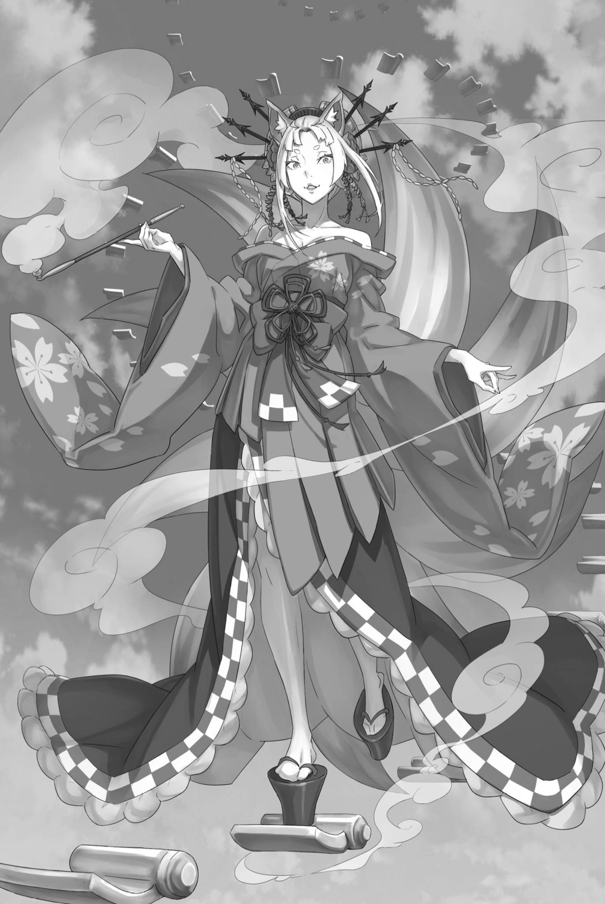

# 『魔都的女主人』

------

阳光洒下的温暖微风轻轻抚摸着昴的额前发。他在感受这种微妙的触感时，紧握着的少女的手以及站在身后的高挑美女的呼吸都传递给了他。

这里是红琉璃城的顶端，比最高层的宽敞房间还要高。他们脚踏城堡的屋瓦，置身于可以俯瞰整个卡欧斯弗莱姆的『离天空最近的地方』——也就是最接近昴所解出的『视野绝佳的深渊』的地方。

「奥尔巴特先生，我真的觉得你性格很差。」

昴指着坐在城堡屋顶边缘的矮个子老人。老人懒散地坐着，转过身来，奥尔巴特把嘴巴贴在手中的葫芦上，大口大口地喝着里面的酒。接着——

「那个，小子。你肚子饿不饿？」

「啊，肚子？」

「对，肚子。毕竟刚醒来就遇到这种事，你都没时间吃饭，对吧？肚子饿不饿这事儿，跟脑袋和身体的工作都有关系。」

说着，奥尔巴特放下葫芦，从怀里拿出另一个包裹。昴有些警惕地看着，奥尔巴特微笑着「哈哈哈」，解开包裹。包裹里裹着一个黑色圆球，大小跟高尔夫球差不多。

「那个是……」

「这个叫兵粮丸，是咱们忍随身带的口粮。吃一颗能顶一天，还能让脑子和身子都转得动。不过，味道糟透了。」

奥尔巴特用手指夹住兵粮丸，晃晃悠悠地给他们展示。这种应急食品看起来并没有什么讲究的味道。虽然可能富含营养，但昴看着也不觉得想主动去吃。而奥尔巴特在手心里滚动着兵粮丸，说道：

「咱年轻时就在做忍，自然也是打那时候起就跟这东西打交道了。每回出任务吃它，咱就想啊，真想跟里头那些老爷子一样，早早隐退，过上不用吃这玩意儿的日子。」

「……那你就退下来呗。奥尔巴特先生不是说自己是忍之里的首领吗？地位很高吧？」

「对，就是这么回事。如今的咱，比当年对咱呼来喝去的那帮老头子地位更高，也更强……可不知怎么的，咱到现在还在吃它。」

说着，奥尔巴特把手中滚动的兵粮丸扔进嘴里。他嚼着这个自己评价不好吃的食物，然后咽下去。然后张开嘴，向他们炫耀已经吃完了的样子。

「说到底，就是习惯改不了喽。这种不管味道卖相、什么都一股脑混在一起的吃食，对咱来说反倒成了最好的佳肴。听着不想哭么？不想啊。咔咔咔咔！」

奥尔巴特咧嘴笑着，昴却觉得有些不寒而栗。这一番话究竟意味着什么，恐怕与昴变得年幼无关，本来就让人摸不着头脑。可他又觉得，不能把这些话全当成耳旁风。因为，那或许是奥尔巴特独有的称赞方式吧。

「——奥尔巴特老爷子，这里可是奴家的城堡哦？」

趁着谈话暂停，开口的是魔都的女帝——同昴他们一起来到城堡屋顶的尤尔娜・米希格蕾。

被尤尔娜蓝色的眼睛注视着，奥尔巴特停止笑声。

「当然知道。把城主晾在一边，自己倒把人家的城堡坐在屁股底下，这滋味可真不错。做自己喜欢的事，才是长寿的秘诀嘛。」

「哎呀，以老爷子的身份，竟有如此低俗的癖好。奴家可真是想都不曾想过呢。」

「哦，是吗？」

「当然。毕竟，用所谓的长寿秘诀去缩短自己的寿命，这不是正常人该做的事。」

轻轻将袖子贴在嘴边，闪着艳丽光泽的尤尔娜微笑着，她身上散发出的热气让人感到不安。那是她在优雅的举止中流露出的愤怒，指向的当然是奥尔巴特。

尽管奥尔巴特也注意到了尤尔娜的愤怒，但他仍然悠哉地坐着，从自己膝盖上展开的包裹中，将下一颗兵粮丸扔进嘴里。

「所以，你们三个怎么又凑到一块儿去了？一个狐狸女人、两个小不点，不论脾性还是模样，都不像能交上朋友的啊。」

「可惜，奴家与心肠歹毒的奥尔巴特老爷子不同，既没有戏弄孩子的嗜好，也没有折磨他们的理由。既是孩子，自该好生款待。何况——」

尤尔娜在这里停了一下，将金色的烟斗在指尖转了一圈。然后将转动的烟斗朝向奥尔巴特，烟雾缭绕的烟斗尖端指向他，接着说道：

「听说奥尔巴特老爷子不但哄骗孩子，还唆使了奴家的侍从……身为这座城的女主人，该做的事，奴家自然不能袖手旁观。」

「哦，哦？」

轻轻抚摸着下巴，奥尔巴特愉快地将目光转向昴他们。

察觉到他视线的意图，昴深深地点了点头。

「抱歉，我只能告状了。按照奥尔巴特先生的规矩，这并不算是作弊。毕竟你也让我们受到了袭击。」

「咔咔咔咔！真是个嘴上不饶人的小子。不过，这样才对。既然是咱先出的招，被人还手就哭哭啼啼，咱可丢不起这个脸。不过……」

「然而？」

「脑子都快跟不上了，还能想出这些花招。你该不会是佛拉基亚的皇族吧？那帮人可个个都一肚子坏水。」

「别说那么吓人的话……」

单从头发颜色来看，现任皇帝埃布尔和昴确实有共同之处，但其他方面的差异实在太大了。面部结构和腿的长度就是明证。

话说回来，竟然说他跟佛拉基亚皇族一样坏心眼，这也太损人了。

例如——

「至少我知道，当别人对我好时，要表示感谢。」

「而且还笑着，大声道谢呢。孩子就该是这样。奴家真想让坦萨也学上一学。不过——」

尤尔娜唇角含笑，正赞许着昴的活泼劲儿，忽然压低了声音。她微微眯起双眼，方才融洽的气氛也随之消散。

那是因为——

「奴家就是想劝诫那一心为人的侍从，本人不在，也无从说起。那么，奥尔巴特老爷子究竟把那孩子藏到哪里去了？」

正是尤尔娜提出的这个问题，成为她陪同此行的最大原因。

「……」

在尤尔娜紧张的威压中，昴感受到了朝奥尔巴特发出的余波，紧咬着嘴唇，确认自己心跳的声音。

——方才在楼下，刚进城堡就被尤尔娜发现时，昴了解了昨天未能看清的她的为人，于是又一次下了重注。

关于他们所处的境地，以及在这个卡欧斯弗莱姆进行的『捉迷藏』，昴尽可能地向尤尔娜揭露了一切。

当然，他没有提及埃布尔的真实身份，也没有透露昴他们被奥尔巴特用『幼儿化』手段处理的事情。重要的是，他们正在和奥尔巴特进行『捉迷藏』，坦萨也参与其中。

尽可能真诚地陈述，耐心地消除她的疑虑，昴下定决心全力以赴，向尤尔娜坦白了事实。

而后，听到昴的诉求的尤尔娜在稍作思考之后——

『——奴家还不至于分不清，孩子拼命诉说的话是真是假。』

于是，她这样回答，并陪同昴和路伊来到了红琉璃城的顶端。

「老实说，我没想到会有这样一个可以交谈的人……」

「啊哦啊哦」

「嗯，我知道。」

听到昴的喃喃自语，路伊挥了挥握着的手，撅起了嘴。

看到这个反应，昴告诉自己这是许多巧合重叠在一起带来的幸运。缺少任何一个因素，这种情况都无法实现。

与心怀谋算的埃布尔分开了。

根据乌比尔克的『助言』，来到了红琉璃城。

被尤尔娜直接发现，而不是被守卫发现。

在一起的不是阿尔或者米迪娅姆，而是路伊。

然后，受到『幼儿化』影响最大的昴，决定去赌一把。

尤尔娜倾听昴的话，最大的原因是她相信这里没有谎言，而且是孩子们的真诚诉求。

就像有些成年人不把孩子的话当真，嘲笑他们。

有些成年人会认真对待孩子的话，尽力满足他们的期望。

谁也没想到，这位残酷的佛拉基亚帝国的『九神将』之一会是这样的人。

「谁说尤尔娜女士脑子有问题的……」

或许从理论上说，她因为完全不认同佛拉基亚所谓的『弱肉强食』常识，所以被这样对待。

至少，在这里受到如此优待的昴，除了这样想，别无选择。

「奥尔巴特老爷子，奴家有两个要求。」

说着，尤尔娜悄悄竖起两根手指。

在超越者之间的对话中，昴无法插嘴。他只能意识到路伊手上的触感，以便在发生什么事情时可以立刻采取行动。

一旦被传送到下面，他们就可以逃离屋顶上的战场。

「要求，先说说看。」

「首先，让坦萨回到奴家身边。」

「喂喂，这可不讲理啊。小丫头自有小丫头的想法吧。不然，她也不会瞒着最珍视的你，偷偷谋划什么事了。」

「——闭嘴。」

在尤尔娜的严厉一声中，承认自己知道坦萨下落的奥尔巴特的笑声戛然而止。

那个充满平静气势的话语，足以改变整个氛围。

实际上，即使不是被这句话针对的昴，也忍不住屏住呼吸。

于是，让奥尔巴特闭上了嘴的尤尔娜将手中玩弄的烟斗送到嘴边，慢慢地吸入紫烟，让肺部膨胀，

「坦萨有什么委屈、有什么想法，奴家只听她亲口说。何况，若是经了『恶毒翁』的舌头转述，只怕更是不堪入耳吧。」

「咔咔咔，咱还真是不招待见啊。」

「你自己心里清楚吧？」

攻击性地微笑着，歪着头的尤尔娜的发饰发出摇曳的声音。插在华丽编发上的簪子，甚至那华美的容貌，都让昴觉得是尤尔娜的武器。

——身居高位的人，希望别人畏惧自己。

是尤尔娜告诉昴这样的想法。也许，不仅仅是让人害怕，还有让人觉得美丽，也具有相同的意义。

「另一个要求，停止和这些孩子们玩的游戏。」

「游戏，呢。虽然看起来像游戏，但这可是真正的较量。」

「昨天在皇帝阁下面前，奴家应该已经说过了。——不得对使者们动手，即便是阁下，也请遵守。」

——不让任何人，对昴他们下手。

这是昴意外从坦萨口中得知的、尤尔娜的决定。而尤尔娜本人，不仅打算坚守这一决定，更为有人违背它而动怒。

所以——

「在这魔都与奴家为敌，你可做好觉悟了？」

「哎哟，可怕可怕，真是个吓人的姑娘。……唉，咱还是先辩解一句吧，咱可什么手都没动啊。」

「那只是奥尔巴特老爷子自己认定的解释吧？——这里究竟是谁的城，你以为呢？难道你觉得奴家心胸宽广到能笑着饶过此事？」

沸腾般的气氛感觉像空气被煮沸了一般，昴全身的汗毛都竖了起来。

随着话语的推进，尤尔娜的情绪逐渐变得高涨。当然，她并不是那种无法自我约束的人，以至于情绪在声音或表情上有所体现。

然而，昴能感受到。因为他见过很多真正生气的人。

那些真正生气的人会用他们的人生去激发情感。所以，当他们在旁边时，就能感受到那种情绪。那是一种非常纯粹的愤怒。

「嗯……」

路伊也被这种紧张的气氛感染，轻轻地嗟叹了一声。

在路途中，路伊对那些追逐而来的对手采取了积极攻击的策略，但现在在场的尤尔娜和奥尔巴特两人——与追逐者相比，他们的实力完全不同。

凭着动物般的本能，路伊也明白她是无法战胜他们的。也许，她还担心会卷入战斗的昴——

「奥尔巴特先生！」

就在昴感觉到对路伊的想法变得柔和的一瞬间，他振作了精神。在这个劲头上，他喊出了正在与尤尔娜对视的奥尔巴特的名字。

仍然坐在屋顶上的奥尔巴特，巧妙地将一个眼睛的焦点对准尤尔娜，另一个眼睛对准了昴。

「那、那个，你是怎么做到的……？」

「咔咔咔咔！控制身体可是忍最基本的功夫。左右手、左右脚，要是不能各干各的，还做什么忍啊。所以呢？」

「诶？」

「你刚才不是叫了咱么。先说好，咱现在可是碰上了这辈子屈指可数的险境，只能分一只眼珠子照看你啊。」

尽管态度依旧轻浮，但奥尔巴特似乎也清楚这里是关键时刻。如果能得到他的一个眼睛的注意力，那就太好了。

昴把手放在自己的胸口上，深呼吸了几次，

「要、要不我们就打和怎么样？」

「……嗯？」

听到昴的提议，奥尔巴特睁大了左眼。在吸引了他的注意力后，昴不耐烦地大声说道：「就是打和！奥尔巴特先生也试图违反规则，我又向尤尔娜告状。既然都是这样，那么……」

「你是想说我们都承认自己错了，然后就此罢休吗？」

「啊、对，就是这样！怎么样，不坏吧？你想要的东西也会好好交给你，我们的问题也能解决！」

奥尔巴特想要的东西，那就是埃布尔手中关于皇帝秘密的信息。

虽然不清楚具体的情况，但只要交出那个信息，奥尔巴特应该会放手的。原本，『捉迷藏』游戏就是为了确认那些信息的真实性而设计的。

「约定是三次，但到目前为止我们只找到了两次……不过，请宽容一下吧。我们已经设法爬到了城堡的顶端。」

「哼……顺便问一下，是你发现了这个藏身之处吗？而不是那个鬼面年轻人？」

「嗯、嗯，是的。『视野绝佳的深渊』这个想法是我突然想到的……还有一个地方，我也考虑过。」

也许埃布尔他们正在朝那个方向去。

无论如何，迟早埃布尔他们也会找到答案，来到红琉璃城。昴通过路伊的转移和乌比尔克的『助言』作弊了。

不过，只要在这里立下功劳，也许就更容易说服埃布尔他们，重新考虑如何对待路伊。要是依然说不通，也可以想办法争取尤尔娜站在自己这边。

当然，了解了路伊的身份后，尤尔娜会如何行动还是未知的。

「总之！怎么样，奥尔巴特先生？我的……不，我们的提议，你愿意考虑一下吗？」

昴摇了摇头，驱散了负面的想法，看着奥尔巴特。

之所以改口说『我们』，是因为这个和解的提议需要尤尔娜配合。若她执意不肯原谅唆使坦萨参与阴谋的奥尔巴特，昴绞尽脑汁想出的提议也会落空。

然而——，

「———」

尤尔娜闭上了一只眼，将烟斗放在嘴里，并没有反对。不反对意味着她尊重了昴的意见。

非常、非常感激。真的很感激。

为了不辜负尤尔娜的信任，或者是她的善意，

「奥尔巴特先生」

昴再次喊出奥尔巴特的名字，期待着友好的回应。

在昴充满期待的黑瞳中，奥尔巴特用手指捡起了放在地上的葫芦。然后将葫芦放在嘴边，把酒喝完，说道：

「小子啊，这主意是只有现在的你才想得出，还是原来的你也会这么想，咱可一点都摸不准……」

「――――」

「可咱既然挑起了这场较量，就不想半道上随手一扔，落得个有头无尾。——老头子，可是很顽固的啊？」

奥尔巴特这么怪诞地笑着，手中的葫芦被捏碎，破片飞溅。

听到碎裂的声音，昴屏住了呼吸。

就在那一刻——，

「连孩子伸来的手都不肯接的老害，就为你的顽固后悔去吧。」

尤尔娜飞跃过来，长腿猛地挥下，红琉璃城的天守阁轰然一声被劈成两半。

※ ※ ※ ※ ※ ※ ※ ※ ※ ※ ※ ※ ※ ※ ※ ※ ※ ※ ※ ※ ※ ※ ※

穿着厚底木屐的脚高高举起，随即笔直而迅猛地劈落。

瞬间，接受到脚跟直击的天守阁弯曲，裂缝在一拍之后出现，被击碎，就像遭到爆炸一样，发出轰鸣声炸裂。

被吹飞的瓦片飘扬，浓烟在空中升腾，站在爆炸中心的是放出了那强烈一击的尤尔娜。

尤尔娜一气呵成地跃起、劈落脚跟，这一击的巨大破坏力，竟令城堡半毁。

实际上，尤尔娜一脚使得天守阁崩塌，红琉璃城的美丽景观被彻底摧毁。

「啊哇啊啊啊——！？」

亲眼目睹这惊人破坏力，昴抱头蹲下。

昴险险避过了崩塌的城堡，却差点被剧烈的震动掀下屋顶。

当然，这也要归功于路伊牵住他的手臂。

「啊啊！」

「该死！怎么会这样……！」

手臂被紧紧拉住，昴半蹲着，泪眼汪汪地叫喊。

是飞扬的烟尘进了眼睛，才让他泪眼汪汪的。绝不是因为不肯通融的奥尔巴特拒绝了他的提议。

虽然那确实也让人难过，但——，

「尤尔娜！」

「退后些，别被卷进来。奴家不擅长手下留情。——不过……」

没有回头的尤尔娜回应了昴的呼声。

尤尔娜停顿了一下，把插在屋顶的脚拔出来，拂去和服的脏污，然后仰望天空——，

「真是身手轻盈啊」

尤尔娜喃喃自语，她直接盯着头顶的浓烟和飘散的瓦片，那里有一个旋转着飞行的小影子——奥尔巴特的身影。

在尤尔娜的注视下，奥尔巴特露出牙齿，大笑道，

「我们本来说好不互相动手的……现在，这样也无妨了吧？」

「竟以为在这座城里能胜过奴家，真叫人惊讶。若是老糊涂了，还是把『九神将』的位子让给后辈吧。」

「咔咔咔咔！那可不行。咱还打算做『九神将』里活得最久的那个呢。」

在空中和屋顶上互相对视的两人交换攻击意图，然后都摆出了战斗姿态。

尤尔娜叼着烟斗，奥尔巴特在空中倒立——紫烟喷出，奥尔巴特像箭一样飞踢进去。

「——！」

奥尔巴特双目精光闪烁，踢出的足刀正面撞上尤尔娜铺展开来的紫烟。

本应没有质量和硬度的烟斗烟雾，却接住了奥尔巴特的脚刀，在弯曲的动作中分散了冲击力。

看到这一幕，奥尔巴特的笑容更深了，

「哦啊啊啊啊——！！」

短腿高速旋转，猛烈的踢出十次、二十次。

紫烟化解了第一击、第二击的冲击，却在连绵的踢击之下不断溃散。等到烟雾终于四散开来，便再也无法充当盾牌或铠甲了。

本来，能在某种程度上发挥这种作用就已经很奇怪了，但——，

「这招有意思，咱都想把它记进术技书里了。」

「可惜，这是不懂爱人的忍学不来的秘术。」

奥尔巴特突破烟雾的瞬间，尤尔娜的身影出现在他的侧面。

尤尔娜跃上半空，挥起手中看似名贵的烟斗，直取奥尔巴特毫无防备的后脑。

作为钝器来说，长度和重量都有些不可靠，但奥尔巴特用高速挥舞的手臂——不，用手臂上藏匿的苦无接住了。

伴随着尖锐的声音，藏在奥尔巴特袖子里的苦无被击碎。

苦无明明也该是用上好的材料制成，却被生生击折，尤尔娜的烟斗反倒毫发无损。那烟斗究竟是什么做的？

「哈哈哈，应该怜悯老人家才对。欺负老人，真是太可恶的姑娘了」

「世上有值得敬重的老人，这一点奴家并不否认。可奥尔巴特老爷子，奴家实在不觉得你算其中之一。既然如此——」

「那就没法子喽，咱只好自己疼惜自己了。」

一边互相开玩笑，一边相互发动致命攻击。

尤尔娜纤细的手臂、修长的腿发出的每一击，虽然外表优美，但实际上都隐藏着足以摧毁城墙的强大力量。

相比之下，奥尔巴特的攻击并无华丽之处，只是巧妙地避开尤尔娜的攻击，在空当之间招惹她。

然而——

「不过，杀人并不需要摧毁城堡的力量。最终，只需在额头上插一根稍长的针就能致命了」

「那么，试试看吧」

接受尤尔娜平静的挑衅，奥尔巴特狡猾的脸色消失在空中。——不，是因为他以常人难以追寻的速度开始行动了。

有位昔日的著名拳击手，曾以『如蝶飞舞，如蜂蜇刺』形容自己的打法。眼下，奥尔巴特在半毁天守阁上的战斗，正是如此。

如果要更贴切地描述，就像战斗机在空中飞行，狙击枪射击一般。

「真是个到处乱飞的家伙。有点过分调皮了」

奥尔巴特的脚力使得踩碎的瓦片爆炸，下一刻他的身影出现在另一个地方，对尤尔娜发动攻击。

尤尔娜利用超人般的反射神经，用烟斗接住攻击，或者躲避。两人都是超越者，因此战斗激烈，使得昴忘记了呼吸。

「啊呜……！」

在那个昴旁边，看着同样的景象的路伊紧紧地缩起身体。

战斗刚开始时，昴还担心路伊会受不了在这种局面下干等，擅自冲出去。

但是，尤尔娜和奥尔巴特的战斗已经超越了这样的层次。

无论谁赢了，都将带来巨大的损失。

这与昴的理想结果完全不同。

「但是，我们该怎么办？无论如何都无法阻止它……！」

战斗如此激烈，城堡也被破坏得一塌糊涂，城里的人们应该都知道城堡发生了什么。

这样一来，尊敬尤尔娜的城里的人们可能会纷纷涌入，或者奥尔巴特的假皇帝同伴们可能会采取行动。

那将是城市陷入大战的开始。

这不是昴所希望的。

就算此行本就是为了邀尤尔娜参加那场助埃布尔夺回皇位的大战，可毫无准备便开战，究竟会酿成怎样的悲剧？

「咻啊啊啊！！」

高声尖叫，旋转的恶毒翁双腿穿过尤尔娜面前的屋顶。紧接着，冲击沿着屋顶传播，尤尔娜的脚下爆炸，她的身体高高飞起，空中的和站在地面上的，最初的状态互换。

「——」

在飞上空中的尤尔娜下面，四面八方逼近的是奥尔巴特投掷的手里剑。

昴完全看不出那些手里剑是何时投出的。是在将尤尔娜击上空中之后，还是早料到她会到达那个位置，提前投下的？无论如何，她已经无处可逃。

在空中，手里剑划过尤尔娜的柔肌，留下残忍的伤口——不，

「你该明白吧。奴家是这座城的主人，魔都的支配者。」

尤尔娜如此回应。她的周围，手里剑停止了旋转，凝滞在半空。

做到这一点的并不是以超高速运动的尤尔娜。尤尔娜甚至不需要动。停下手里剑的是飞上空中的一片屋顶瓦片。

这可不是令人恐怖的幸运。

因为，从四面八方逼近的十几片手里剑，全都被瓦片挡住这样的巧合，无论多么幸运，都不可能发生。

在目瞪口呆的昴和奥尔巴特的视线中，尤尔娜轻轻挥动着手臂。

随着她手臂的动作，挡住手里剑的瓦片在空中游动，然后在她周围形成螺旋状的阶梯，停在空中。

尤尔娜悠然踩着悬空的瓦片，一步步沿阶而下，缓缓回到天守阁。

这景象如同突如其来的幻术表演，又像是念动力在发挥作用。当然，也可以说是魔法，但又与昴所知道的魔法有些不同。

操控的不是火、冰、风、土，而是建筑物的部件本身。

「可恶，你真是个麻烦。这就是那个吧。塞西尔斯和亚拉基所说的魔法。到底是怎么回事？」

「奴家说过吧，这是不懂爱人的忍无法施展的秘术……别看奴家这样，可是个很爱惜东西的女人呢。」

微笑着，夹着烟斗的尤尔娜拍了拍空闲的双手。

随着这个信号，半毁的城堡发生了变化。——不，这不仅仅是变化。这是把现实扭曲得如同梦境般的魔术。

「这、这是……」

脚下扭曲，屏住呼吸的昴，路伊紧紧抱住他的胳膊。扶着她的身体，昴目睹了眼前发生的异常，半毁的城堡得到修复。

建筑物缓缓复原，宛如伤口愈合的影像被加快了数倍。

埃布尔推测的『魂婚术』的使用者尤尔娜，再结合她之前的话，一个假设浮现在脑海。

这个说法非常荒谬，尤尔娜・米希格蕾——，

「她、她对城堡也使用了『魂婚术』吗？」

是的，面对这位展现出真正超凡规格的魔都主人，昴无语了。

