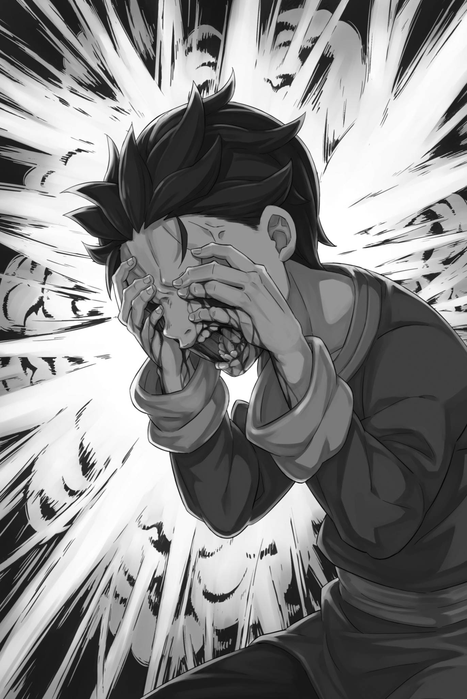

# 『恋慕之心绝不让步』

------

——对城堡施展『魂婚术』，让欧德甚至与无机物相通。

尤尔娜以螺旋盘绕的屋瓦为落脚点，这不可思议的现象，真相大概便是如此。埃布尔曾说，光是把『魂婚术』施加在追赶昴等人的至少一百人身上，就已超乎常理。然而，实际情况远不止于此。

若是她甚至将欧德的一部分赋予了自己的城堡和烟斗的话。

「这样一来，感觉对身体非常不好啊……！」

说到底，光是把玛娜分给别人，本身就是件相当累人的事。

昴与碧翠丝缔结了契约，定期向她输送玛娜，因此深知其中的辛苦。为抵达监视塔而穿越沙海时，即使是不得已，碧翠丝一次取走了大量玛娜，还是让他累得浑身无力。

然而，与碧翠丝建立欧德联系所带来的麻烦仅仅是一人份——尤尔娜面临的风险简单计算就超过了一百倍。

在此基础上，她还拥有强大的战斗力，可以进行惊人的战斗。

即便有人说她在将力量分给大家后变得疲惫不堪，但她用脚跟破坏了城堡，这让人难以置信。

「哈哈，真是使用了奇怪的技巧啊。真是的，无论活多久，总会有不知道的技巧出现，真让人头疼」

「这里本就是会孕育出这等技艺的地方，叹气也无济于事。于奴家而言，奥尔巴特老爷子的手段也够棘手了……还是早些除掉为妙。」

「咔咔咔咔！咱可没那么容易被除掉……哇！？」

大笑着的奥尔巴特，感受到敌意后向后跳去。

就在那一瞬间，奥尔巴特脚下的屋顶炸裂，屋顶瓦片被从下方的冲击击飞。这简直就是对之前击飞尤尔娜的攻击的还击。

而且，与奥尔巴特的攻击不同，尤尔娜的攻击接连不断地追击着他。

咚咚咚，随着声音响起，奥尔巴特一边向后旋转一边飞跃，冲击波紧随其后。尤尔娜仅仅通过在空中固定的瓦片上轻盈地挥动手指就实现了这一切。

「哟！呼！哈！真厉害！」

「奥尔巴特老爷子，也真够难缠的。」

「拿形容飞虫的话来说咱，你这丫头可真不懂怎么对待老人家啊。不过——」

话音未落，向后翻转的奥尔巴特扭动着身体。就这样，倒立着的奥尔巴特向后转过头去，屋顶瓦片波涛般升起迎击。

正面的冲击波追击，背后的屋顶瓦片波涛夹击——恍如汹涌大海的天守阁景象，让正看着的昴不禁怀疑自己的眼睛。

然而，令人怀疑的事情接连发生。

「……」

屋顶瓦片如波涛般涌来，看到这一幕的奥尔巴特在空中一踢，径直朝着屋顶瓦片扎去。

表面看似波涛，但瓦片的硬度和重量并未减少。

一头扎进去，整个身体都会被砸伤，骨头折断，头颅砸碎。情不自禁，昴捂住了抱在怀里的路伊的脸，听到了她的抗议声「嗯！」。

但是，这残酷的结果并没有发生。

「把钻地的术稍微变通一下，头回试就成了，咱是不是挺厉害？」

相撞的一瞬，奥尔巴特如潜入水中一般，无声没入瓦片的波涛，又从浪尾钻了出来。他脚跟擦过剥落了瓦片的屋顶，露出一口白牙，老奸巨猾地笑着，一副游刃有余的模样。

事实上，奥尔巴特并未展现出他真正的实力。

而尤尔娜也许确实暴露了『魂婚术』的恐怖，

「只顾着这样四处逃窜，老爷子还能达成目的吗？」

悠然地，从空中俯视着恶毒翁的她身上还没有一丝伤痕。

双方都只展示了实力的冰山一角。仅凭此，帝国最高战力『九神将』的强大已经得到了证实。

然而，这种情况下的战斗即使持续下去，双方也不会让步，僵持局面预计会持续。

不仅仅是在场外观战的昴他们有这样的印象，其他人似乎也有同样的感觉。

「哎呀，真会戳人痛处。不过，咱这『弎』要是被『漆』死死拖住，挨阁下的骂也是活该啊。」

「那么，你打算如何是好？」

「这个嘛，咱也不是什么都没想，就一味逃来逃去啊……」

整齐的眉毛皱起，尤尔娜这样问道，奥尔巴特抚摸着自己的下巴。一边抚摸，恶毒翁扭曲着脸颊，将目光瞥向另一个方向。

那双炽热闪耀的黄色眼睛，注视着旁观战斗的两个孩子——

「——啊」

「老爷子！！」

奥尔巴特的目光瞬间变得锐利，昴不禁畏缩。

紧接着，皱起眉头的尤尔娜踢破瓦片，猛地朝奥尔巴特扑过去。再次，尤尔娜强烈的一击如同开局时一般，向奥尔巴特倾泻而下。

然而——

「就因为你这样，造反那么多回，也一次都没能碰到阁下啊。」

奥尔巴特撂下这句话，猛地踢起比尤尔娜短得多的腿。他的鞋底正撞上尤尔娜厚底木屐的后跟，激起的冲击波将两人的长发掀得飞扬。

尤尔娜咬紧牙关，奥尔巴特紧咬牙齿，一秒钟后，双方的身体被大力弹向相反的方向。尤尔娜和奥尔巴特，各自前后飞出。

趁着距离拉开的间隙，奥尔巴特将左右手伸进自己的袖子里，拔了出来。——从指间抽出的，是分别有四个黑色圆球。

「兵粮丸！？」

「看着像吧？可吃了这玩意儿就要出大事了。——里面塞满了敲碎的火之魔石啊。」

听到昴的惊叫，奥尔巴特嘲笑着挥舞着双臂。

照他所说，那些黑色圆球其实是炸弹。而它们要飞向的，正是被冲击弹开、露出破绽的尤尔娜——不，并非如此。

「上回造反，跟你交手的是那几个家伙吧？他们可不会干这种事，挺新鲜吧？」

奥尔巴特歪嘴一笑，从屋顶朝辽阔的空中抛出了炸弹。

看似没有特定目标的投掷方式，但毫无疑问，对于奥尔巴特而言，炸弹只要落在人群中就行了。

只要这样——

「听说你这城里的人都挺结实的……不知道，比起咱们里头那帮家伙，哪个更经打啊？」

「——卑鄙的家伙！」

尽管炸弹尺寸较小，但其中蕴含的威力却无法预测。

而且，也不知道尤尔娜的『魂婚术』覆盖了城里多少人。换句话说，放任那些炸弹是非常鲁莽的。

尤尔娜也在瞬间做出了相同的判断。因此——

「啊，啊啊啊啊！！」

尤尔娜重重踏下，力道足以踩碎屋顶，随即大幅扬起手臂。她手中握着的，正是方才用来攻击奥尔巴特的烟斗。

握着烟斗的手臂猛然挥出，烟斗尖端涌出的烟雾也循着同一道轨迹，化作具有实质的紫烟，宛如横扫的斩击，掠过卡欧斯弗莱姆的天空。

——这股带着质量的紫烟，将散落的炸弹一网打尽。

紧接着，惊人的爆炸接连响起，轰鸣与冲击波席卷城堡上空。其中一枚就在昴他们身旁炸开，昴眼前一花，再也站立不住。

「啊――」

当爆炸发生时，昴记得曾在电视或书上看过，要捂住耳朵，张开嘴巴。

由于忽略了这两点，昴的身体受到了巨大的损伤。他的头晕眩，视线变得一片深红。奥尔巴特的炸弹威力非同一般。

他竟然随身携带这么多炸弹，奥尔巴特真的是疯了。

毫不留情地想把它们撒向城中，这做法，也显然——。

「呜哇！」

有人尖叫着，昴的肩膀被小手摇晃。

望过去，血红而模糊的视野中，映出了路伊惊恐变色的脸。她嘴唇颤抖，蓝色眼眸里逐渐蓄满泪水。

看到这一幕，昴想要回答「没事」，但是，

「――啊」

――他在视线的边缘捕捉到奥尔巴特出现在尤尔娜的背后。

「――――」

忙于应付炸弹的尤尔娜，仍保持着挥出烟斗的姿势。奥尔巴特现身于她身后，收回手臂，正要刺出一记手刀。

他的目标是尤尔娜背后的中心位置，就像漫画中那样，一击就能穿透心脏的位置。

昴不知道现实会不会真变成漫画那样。可经过方才的交锋，他已充分见识到，尤尔娜与奥尔巴特都是拥有漫画般力量的超人。

如果这样下去，尤尔娜会死。所以――，

「路伊――！」

昴抓住路伊搭在自己肩上的手，指向尤尔娜他们。

进城堡前反复叮嘱过的步骤，此刻付诸行动。路伊睁大圆圆的眼睛——下一瞬，昴眼前一闪，转移发生了。

接着――，

「啊」

连喘息的工夫都没有，昴便呆呆地漏出一声。

原因很简单，原本一片深红的视线突然被某种温暖的触感夺走了。他感觉到这是突然喷在脸上的某种液体。

他试图用手臂擦去那种感觉，却注意到了一种不适感。

握在手中的路伊的手臂，实在太轻了。

「刚才那是什么？你们不是应该在那边吗？」

奥尔巴特疑惑地问道，昴愣住了。他抬起头，视线中出现了歪着脖子的恶毒翁，他正在挥舞着手。

在红色的视野中，那只比红色更红的手，挥舞着。

「路伊……？」

看着那只手，昴喊出了路伊的名字，紧紧握住了她的手。

得立刻离开这里。也许要接连转移两次，甚至更多次。大概又会吐出来，但昴会忍着。

他会忍着的，所以必须马上离开这里。

所以――，

「路伊！快点……」

「哎呀，别逼得太紧了。她的头已经没了，知道吗？」

「――诶？」

被如此随意的话语击中，昴无法理解其中的意义。

是身体缩小，连脑子也变幼稚，才理解不了吗？听到无法理解的话，幼小的脑袋抗拒着去理解，所以。

所以，就算听到她已经没有了头这种话。

「你居然……真敢这么做！」

愤怒的喊声响起，某种东西掠过昴的头顶，奥尔巴特大幅向旁跃开，躲过这一击。一道冲击笔直贯穿他刚才所在的位置，才修复的天守阁又遭摧毁。

但是，奥尔巴特并没有在意这一击的巨大威力，

「哎哟，可怕可怕。不过，狐狸女人，你该心存感激才对吧。」

「你说什么！？」

「要是那个小子和女孩子没闯进来，死的可就是你了哦？不过，照这个样子，死也只是时间问题了。」

「——」

奥尔巴特摇了摇竖起的手指，轻松地说完。

尤尔娜屏住呼吸，她的注意力从恶毒翁身上转向了昴。但是，昴瘫倒在地，只能尽力拉紧轻飘飘的路伊的手臂。

「路，伊……」

视线中一片红色，昴看不清路伊的身影。

这是昴眼睛的异常，还是路伊的身影变得红通通的，他无法分辨。

但是，可以确定的一点是——路伊已经死了。

昴明明还没想出，到底要拿她怎么办，又该怎么办。

照着昴说的去行动，结果却死了。

昴，让她死了。

「孩子！孩子，看着奴家！」

紧接着，低头的昴的脸颊被两只手捏住，抬了起来。

正面，红色的视野里有一个漂亮女人的脸。因为那里的尤尔娜表情痛苦，一时间昴没能认出是她。

与昨天向昴等人和假皇帝们展示的自信满满的脸不同。

与今天对待昴等人的体贴温柔的脸也不同。

现在，尤尔娜的眼中闪烁着泪光，痛苦地凝视着昴。

原因终于在尤尔娜眼中的反射中显现出来。

「——啊」

跪在地上的昴，脸上一片狼藉。

左眼的眼球已在一片血红中爆裂，右眼则脱出眼眶，后面还牵连着丝状组织。爆炸的冲击没能得到丝毫缓解，竟将眼球挤了出来。

简直像粗制滥造的丧尸电影里的特效，甚至有点滑稽。

「呼」

了解自己的状况，昴只剩下左眼的视线摇晃。但是，尤尔娜的手没有允许他倒下。

尤尔娜嘴唇颤抖，望着昴的脸，唤了声「孩子……！」，随即说道：

「——爱上奴家。现在就爱。」

如此直接而荒谬的要求。

要爱上她，而且是立刻，这太荒唐了。首先，具体应该怎么做才能爱上她呢？爱一个人可不是一件简单的事。

尤尔娜是个好人，而且很美，但是。

「孩子！只要你爱上奴家，这些伤也能……」

「咔咔咔咔！喂喂，你这丫头真敢说啊。咱虽说不懂这些，可爱情哪能说有就有啊？」

「闭嘴！」

后面插科打诨的奥尔巴特被尤尔娜怒吼，她的眼睛泛起深色。

近在咫尺看着这一幕，昴喘息着，慢慢开始接受逐渐袭来的疼痛。

一个眼球破裂，另一个眼球脱落，这种伤口并不致命。

与路伊不同，他的头还在。所以，接下来会发生非常痛苦的事情。肯定会尖叫，对尤尔娜造成很大的困扰。

再也不想给别人添麻烦——，

「孩子」

被叫了一声，昴的意识微微恢复。

趁着这个瞬间，尤尔娜认真的脸靠近了。

「——」

尤尔娜的嘴唇，和昴的嘴唇重叠在一起。

柔软的触感贴在脸上，近在咫尺的呼吸传来。昴过了好一会儿，才明白自己被吻了。

一方面是自己变小了，另一方面，本来这方面的经验就少。那仅有的记忆已相当遥远，当时明明是那么感动，可这一次——。

「奴家的唇，可不轻易许人。这下……」

一吻结束，尤尔娜拉开距离，近乎恳求的话语就此中断。可她没能说出口的后半句，昴也隐约明白。

她想说的是这个。——这样，你能爱上我吗？

如果昴爱上尤尔娜，情况会改变。

那一定是尤尔娜力量的源泉，或者说是她强大的原因。

但是——，

「因为，我已经有喜欢的人了……」

在通红的视线的另一边，远方的喜欢的女孩的脸浮现出来。

看到那微笑的女孩，心脏跳动得更快。所以，昴无法爱上尤尔娜。

不能爱上她，听到这个的尤尔娜的脸上露出非常痛苦的表情，让人心疼。

「——嘛，男女之间的事情总是不容易解决的呢」

刹那间，昴的视线切换了，伴随着一声似乎有些失望的嘟哝。

「————」

就在眼前消失的尤尔娜的脸庞，看到的是染红的天空。

和路伊的瞬移一样，视线迅速切换——不，与路伊的瞬移不同。

若是路伊的转移，眼前的世界会更加干脆利落地，在一瞬间换成另一幅景象。

可如今发生在昴身上的，却粗暴而凌乱得多。视野不停打转，却没有转移时那种骤然中断，眼前的景象始终连贯。

就在下方，跪着的尤尔娜和站在尤尔娜面前的奥尔巴特的身影。在尤尔娜的旁边，有一个倒下的女孩子的身体，那个可能是路伊。

还有一点，在尤尔娜和奥尔巴特之间，有什么东西，有人站着。

那就是——，

「——啊」

——那是，一个没有头颅的孩子，年幼的昴的身体。

「哎呀哎呀，杀孩子对心灵可真是痛苦啊。嘛，不过在体力上倒是轻松了点呢？」

「你这老头子——！！」

尤尔娜痛苦地喊叫着，她的身体冲向奥尔巴特。奥尔巴特正面应对，两人的身体激烈碰撞，红琉璃城剧烈地摇晃。

摇晃，裂开，崩碎，破坏再次蔓延，蔓延，到底会变成什么样？

从那里开始，昴无法知道。

他已经，什么都，不知道。在一无所知的情况下，昴的头颅在屋顶上弹跳着——，

弹跳着——。

※ ※ ※ ※ ※ ※ ※ ※ ※ ※ ※ ※ ※ ※ ※ ※ ※ ※ ※ ※ ※ ※ ※

——被拖入黑暗、黑暗的空间。

「——」

什么都没有，漂浮着，没有手脚，无法理解的，没有天空也没有地面，摇曳着，不能摇动，不能抵抗，不能品味，不能颤栗的，空间。

好像曾无数次见过，又像是第一次目睹，

仿佛缓缓远离，又似乎无尽地靠近。

仿佛永夜一般，被漆黑支配的空间中，有声音回响。

回响着，抽泣声，某人的哭声，击打着不存在的心脏，声音。

『我爱你』

那是，爱的话语。

表达爱意，恳求爱意，乞求爱意，让渡爱意，自己也爱着爱意的声音。

『我爱你。我爱你。我爱你』

重叠的爱意，本来应该蕴含着各种感情的话语。

喜悦、愤怒、悲伤、欢喜，诸如此类，感情的漩涡。

然而，这里，充斥着这永恒黑暗的爱意，只有一个。

『我爱你。我爱你。我爱你。我爱你。我爱你。我爱你。我爱你。我爱你。我爱你。我爱你。我爱你。我爱你。我爱你。我爱你。我爱你——』

那些感情的全部，涌动着的爱意的全部，只被『悲伤』填满。

悲伤，悲哀，悲痛，以悲痛哀嚎，使爱意抽泣。

抽泣声，不停歇。

仅仅听着，就让人想要死去的抽泣声，不停歇。

爱意带着悲伤，爱意是悲伤，爱意成了悲伤，爱意本身就在悲痛中哀嚎。

伴着抽泣，那不断诉说爱的爱意，为悲伤而悲伤，最后汇成了一句话。

『——你在哪里？』

※ ※ ※ ※ ※ ※ ※ ※ ※ ※ ※ ※ ※ ※ ※ ※ ※ ※ ※ ※ ※ ※ ※

「听说你这城里的人都挺结实的……不知道，比起咱们里头那帮家伙，哪个更经打啊？」

「——卑鄙的家伙！」

视线突然一转，回荡在耳边的是紧迫的声音。

一个是老人，另一个是女性――分别是奥尔巴特和尤尔娜。

然而，这仅仅是所知道的。

「啊……」

「哈，啊啊啊啊！！」

正当他惊愕地发出声音时，一声沉闷的响声传来，尤尔娜的脚用力踩碎了城堡的屋顶。与此同时，她挥舞着手中的金色烟斗。

巨大的，横向挥动的烟斗一击划过一道弧线，以惊人的速度和破坏力，在卡欧斯弗莱姆的天空中掀起一片紫烟。

昴知道这是为了什么，也知道接下来会发生什么。

然而，在他的知识追逐现实之前，事情就发生了。

――被尤尔娜的紫烟击中的炸弹爆炸，冲击波吞噬了周围。

「啊――」

沐浴在与一分钟前相同的冲击中，昴的视线被染成了鲜红。

似乎听见了什么东西轻轻破裂的声音，昴立刻将它与染红的视野联系起来。是眼球破裂时发出了声响，所以视野才变得血红。

那么，另一边视线变得昏暗的原因是――、

「啊，哎，啊啊啊啊啊――！！」

昴双手捂脸，同时被疼痛与『理解』击中，发出惨叫。

他已经『理解』了。一只眼球破裂，另一只眼球脱出。在脑袋拒绝理解的时候，他还能忽略那份疼痛。

但是，一开始就知道发生了什么，那种痛苦就无法忽视。

「啊啊！啊，哎，哎哎哎啊啊！！」

「呜啊！呜啊！」

昴仰面翻倒，哭喊不止，一具小小的身体紧紧扑到了他身上。

叫着名字。听不清。耳朵嗡嗡作响，自己的声音也很吵。疼痛，以及血液流动的声音一直在回荡。甚至无法分辨这是自己体内还是体外的血。疼痛，无论如何都疼痛。疼痛疼痛疼痛疼痛，疼痛。

谁来救救我。不要疼。讨厌疼。疼痛，好讨厌。

好疼，疼得，疼得好疼好疼，因为太疼了好疼好疼好疼好疼好疼——。

「孩——」

「喂喂，这可不是明智之举啊。」

「――！」

疼痛在头脑中不断旋转，红色视线闪烁着耀眼的光芒。

紧挨着，一只手按住滚动的昴，这让他感到不便。他想发出更大的声音，更疯狂地挣扎，把疼痛从身体里逼出去。

不对，疼痛在脸上。眼睛和耳朵疼。所以，如果其他地方也很疼的话，这种疼痛就会转移到其他地方去。

「呜啊！啊，啊！」

他猛地用头撞地面。强烈的力量把他拉起来。被从后面抱住，无法动弹。疼痛，疼痛让人害怕。讨厌害怕会死掉。

「咕……」

「啧，真的假的，狐狸女人。挨了刚才那下都死不了，你究竟是什么身子？难不成，塞西尔斯说斩不断你的脖子，也是因为这个？」

「……奴家怎会把女儿家的秘密，告诉对孩子下手的匹夫。」

远处，有人在争论。但在自己的声音和努力阻止自己的声音之间，什么都听不到。不明白。疼痛，一切都是疼痛的错。

对，都是它的错。红色和疼痛，都是它的错。一切都是因为它。

「都是那个的错……！那个，那个，就是那个害的！不是我！明明不是我，呜，咿呀呀呀！」

「呜～！！」

挣扎着，颠簸着，昴试图把所有事情都推给别人。把责任推开，然后从此逃脱，如果逃脱了，接下来该怎么办呢。

这种事情，逃跑后再考虑。逃跑后再考虑，所以。

「哼哼，孩子的哭声听起来让人受不了。——真烦」

「等等啊——！」

一个女人拼命的声音，和一个漫不经心的沙哑声音。

听到这些声音后，有什么东西发出轻轻刮过的声音靠近过来。从头后方，抱住昴的那个人紧紧地抱住他。

但是，就算拥抱着，也无济于事。

因为，又一次红色的炽热光芒膨胀起来，吞噬了昴他们。

吞噬了他们，痛苦消失了，然后——。

「听说你这城里的人都挺结实的……不知道，比起咱们里头那帮家伙，哪个更经打啊？」

「——卑鄙的家伙！」

刹那间，刚刚听到的声音又响了起来，意识变得一片白茫。

「啊……？」

突如其来的一切，在短暂的中断之后又重新开始了。

视线中的红色消失，其他颜色回归，耳朵重新感受到风的声音，紧挨着的柔软少女的体温传来，然后——。

「哈，啊啊啊啊！！」

勇敢的女子高亢的声音响起，在那一瞬间，手臂被猛烈地甩了出去。

那一挥落下，将会发生什么，昴早已知道。

——连续响起的爆炸声，和红色冲击波染红了视线。

「咿，啊啊啊啊——！！」

抱住脸，感受着破裂的眼球和突出的眼球带来的痛苦，昴向后仰，跌倒在屋顶上，发出悲鸣。

「呜啊呜！呜啊啊！」

倒在地上的他，听到一个泣不成声的声音靠近过来。

感受着那个声音，在充斥尖锐耳鸣的世界里，忍受着痛苦与煎熬，昴脑海中只剩泪水、恐惧和『为什么』。

可能吧，他死了。他是死了的。

他知道自己已经死了。非常痛苦，难以忍受，然后被拉离了那里。但是，他又立刻回到了这个地方，然后死去，但是，痛苦，爆炸是红色的。

明明知道这些，昴却仍在脑中一遍遍追问着『为什么』。

——这不对。

这种感觉若有若无地在他的脑海中回响，痛苦和红色即将将其击退。但是，这是绝对不能放弃的感觉。

眼球破裂，眼球突出，耳膜破裂，痛得快要哭出来，之后又会立刻经历可怕的死法，甚至希望能因此远离痛苦，泪水、鼻涕、口水，小便流淌着，他拼命地思考着这个。

「这、这不……」

「呜啊呜！啊呜，呜～！」

「不对……这不、是我的……」

不对。

不对不对不对。

不对不对不对不对不对。

不对不对不对不对不对不对不对不对不对不对。

不对不对不对不对不对不对不对不对不对不对不对不对不对不对不对不对不对不对不对不对不对不对不对不对不对不对不对不对不对不对不对不对不对不对不对不对不对不对不对不对不对不对不对不对不对不对不对不对不对不对不对不对不对不对不对不对不对不对不对不对不对不对不对不对不对不对不对不对不对不对不对不对不对不对不对不对不对不对不对不对不对不对不对不对不对不对不对不对不对不对不对不对不对不对不对不对不对不对不对不对不对不对不对不对不对不对不对不对不对不对不对不对 ――。

「这个……！」

在痛苦充斥他的脑海之前，他必须始终牢记绝对不能忘记的事情。

一遍又一遍地，将昴扔回这个红色痛苦的世界的东西，这就是——、

「不对……！」

——这不是菜月・昴的『死亡回归』，而是另一种东西。

