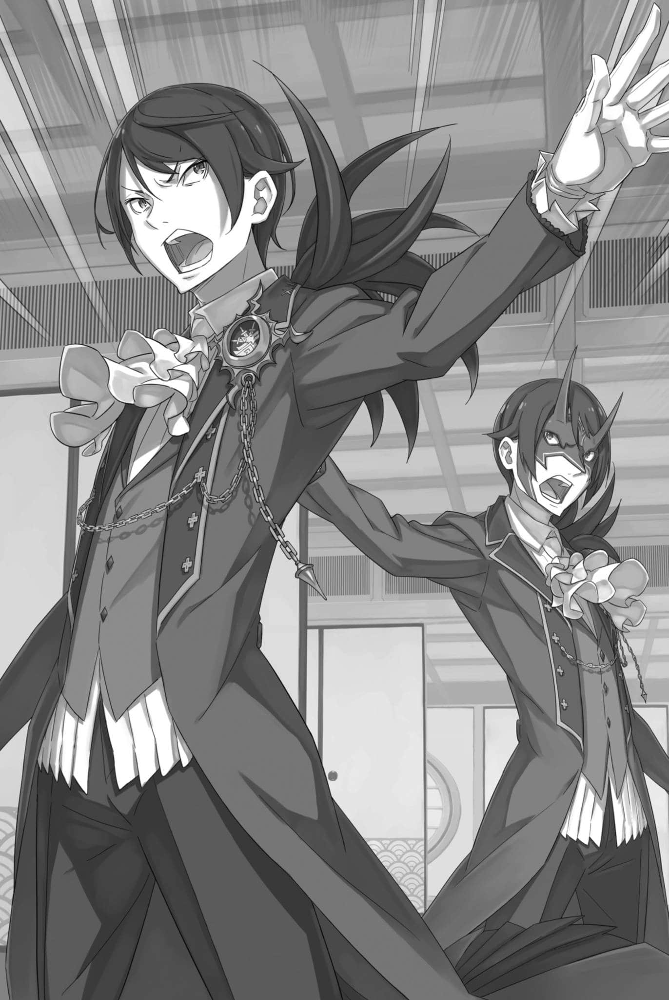

# 『魔都狂躁曲』

------

——一切都发生在魔都卡欧斯弗莱姆的中心，红琉璃城轰然倒塌，漆黑之影四散溢出。

目击者所目睹的噩梦光景，正是动摇整座魔都的轰鸣声的真面目。

红琉璃是一种美丽的宝石，赤与蓝仿佛在同一块石头中交织起舞。由这种宝石垒成的华美城堡，此刻却像沙堡般轻易崩碎。

对于那些熟知魔都的人和魔都的居民来说，这无疑是如天塌下来一般的冲击。

本不应该发生的事此刻呈现在眼前，令人分不清是梦境还是现实。而这种感觉哪怕是对魔都不太了解的人也是一样。

「——」

这一动静同样传播到了一间魔都为外来访客准备的小旅馆内。

有人凝然瞪大双眼，有人戒备地绷紧全身，有人惊叫着跌坐在地，也有人在慌乱中依偎同伴，勉强稳住心神。

尽管人们反应各异，但他们所面对的皆是同一个『威胁』。

就在他们被那威胁攫住、困于本能的恐惧之际，无可挽回的事态仍在——

「「——全都冷静下来！！」」

一瞬间，重叠的凌厉声音划破了因威胁袭来而僵持的时间。

两道交错在一起的——本质上内容却相同的声音敲响众人的耳膜，人们停止思考的大脑重新运转了起来。

众人猛然抬起头，发出凌厉声音的那两名黑发人物正站在他们面前。

一人素面朝天，而另一人脸戴鬼面，他们都朝着窗外压倒性的崩坏光景各自伸出了自己的手，说道：

「别停着不动！如果不及时应对的话全员都要殒命于此。」

「那贪婪之物吞了城堡，仍想将天空也吞噬殆尽。余等若不在此出手，转眼便会徒增伤亡！」

「————」

「「——卡夫马・伊鲁克斯！」」

两人似乎思路一致，目光汇集在了同一个人身上。

被两人注视的棕色皮肤男人——卡夫马・伊鲁克斯，陷入困惑之中，不知道该看向哪个方向。

但这种困惑并未持续太久，因为——

「「拖住那片黑影！记住，帝国子民的性命，容不得你迟疑！」」

「是！」

被明确告知他该如何行动以及行动目的，卡夫马眼中的犹豫顿时烟消云散。

卡夫马将手抵至胸前，行了一礼，说道：「我将离开您身边一会，愿阳剑的加护与您同在。」

「尔等的奋战便是余的加护。竭尽死力吧。」

「拼尽一切——！」

卡夫马给出了响亮的回答，随后径直冲向窗户。

借着这股劲头，卡夫马奋力一跃，伸出手击碎了窗户并飞出窗外，瞬时，玻璃碎片四处飞散。只见卡夫马后背高高隆起，紧接着，他的斗篷飘落，六片透明羽翼随之展开。

卡夫马扇动着这双昆虫一般的翅膀，身影划破魔都的长空。沿着道路直指即将被阴影摧毁的红琉璃城。

「你带来了多少人？」

望着卡夫马的背影，鬼面人——埃布尔凌厉发问。问题的矛头指向受到卡夫马敬礼的黑发美男子文森特。

这位身居佛拉基亚皇帝高位的男人听到埃布尔的询问，微微眯起了眼睛。

「如你所见，只有卡夫马和奥尔巴特。还有一个人就算在场也起不了多大作用。」文森特就这样揭露了自己的底牌。

「没有暗藏的棋子么。轻装简从，反倒成了祸根。」埃布尔毫不留情地说道。

「连这也要归咎于余，未免太不讲道理了。」文森特出言抱怨，埃布尔却未理会。

埃布尔用手摸了摸下巴，摩挲了一下鬼面的底部，沉思几秒过后望了一眼房间里那些因威胁脸上明显流露出不安的人。

能够回应他的目光的仅有两位并不说话，外表稚嫩的少女。

一位是金发碧眼的米迪娅姆・奥克尼尔，另一位则是身着和服的鹿女坦萨，她圆圆的眼睛此时正在微微颤抖，显然这两人都不能成为扭转情况的决定性因素。

那么唯一有可能成为某种关键助力的人就将是——

「啊，呃呃……，为啥，为啥，为啥要在这种时候……」

「阿尔亲……」

阿尔惊恐的声音丝毫没有理会埃布尔凝视他的平静目光。

用一块乱七八糟卷起来的破布遮住脸的黑发少年右手抱头，对于窗外的景象很是害怕，但又十分纠结的无法将视线从窗外移开。

在埃布尔所带来的人当中，从某种意义上来说，这个少年是最没有显山露水的。但他现在这种不像是演的胆怯让埃布尔正在犹豫是否要将其纳入自己的计划中。

这并不是出于情感上的考虑，——而是纯粹出于对他无法派上用场的判断。

「若能调动的力量仅仅如此的话，我们能采取的手段并不多。」 埃布尔绞尽脑汁的思考被身后文森特的声音打断。

两人，或者应该说是两位皇帝，并肩站着，望向窗外——

埃布尔流露一瞬感伤，很快又一扫而空，叹了口气。

文森特说得对，他们能用的计策并不多。

于是像是回应得出相同结论的文森特，埃布尔说道：

「——与尤尔娜・米希格蕾会合吧，她的力量是必要的。」

※ ※ ※ ※ ※ ※ ※ ※ ※ ※ ※ ※ ※ ※ ※ ※ ※ ※ ※ ※ ※ ※ ※

嗅出了状况的变化，塔莉塔用舌头舔了舔自己干裂的嘴唇。

气氛的变化、追兵的气味、扑面而来的杀气和如芒刺背的敌意，每一个细节都与她之前所面对的过的东西完全不同，这一判断让她神游了一瞬。

她急切的想知道这到底是好事还是坏事。

然而——

「——无论怎样都无关紧要。」

如果收获的结果总是相同的，塔莉塔就不必烦恼了。

她本来就有头脑不好的自觉。虽然她的头脑构造和她姐姐的差不多，但如果是姐姐米泽尔妲的话，也许就能够凭借本能的直觉找出正确答案。

但塔莉塔既没有和她姐姐一样对事物的灵敏嗅觉，也没有和姐姐一样的眼界，她一无所有。

即使花费大量的时间去担忧该怎么做，无止境的犹豫着哪个选项是正确的，也只是徒劳罢了。

所以她不再迷茫了。是非对错等结果出来后再烦恼也不迟。

因此，即使追兵的气息明显变化，她也没有改变应对策略。

「咕，呜……」，羊人发出痛苦的呻吟。

「无论你有多大的力量都不可能挣脱开的。」

被塔莉塔的上衣狠狠勒住脖子的男人眼睛布满血丝，正在拼命挣扎。

右眼烧伤的羊人男子拼命想要挣脱束缚，但塔莉塔脱下上衣，用袖子勒住他的脖子，切断他的肌腱，来阻碍他的行动。

说实话，这些健壮的追兵哪怕被剜出了要害都还能站起来，让她吃尽了苦头。

「只要知道应对的办法，就算是我，也能应付得来。」

「——」

最后，羊人的呻吟声消失了，身体也失去了力量，垮了下来。塔莉塔看准时机取下她的外套，任由羊人的身体倒在路边。

塔莉塔吐出一口气。身后，被她勒昏的追兵一个接一个，沿着街边的墙根躺着。

发现拳脚和短刀不起作用，而绞技有效之后，她便专用这一招制服追兵。

幸运的是，尽管追兵的力量和耐力都非同寻常，但他们对高效使用这种力量的技术不过门外汉。

也正因如此，塔莉塔的技巧十分奏效，让她可以妥善处理追击者。

——如果能直接杀了对手的话，那事情就简单多了。

『——尽量少杀人。』

这句话在塔莉塔脑子里一闪而过，践行这句话的塔莉塔因此陷入了苦战。

那是在她为了掩护大家从客栈撤离而分别时，埃布尔对她说过的话。

就现在的处境来看，或许当时她就该反驳埃布尔说这种话太过无理。但是像埃布尔这种眼界深远的人，会下达不可能完成的指令吗？

或许正是因为他认为塔莉塔可以做到，才下达了这样的指示。

如果事情果真如此的话，那么埃布尔对塔莉塔的能力可谓了如指掌。

「——」

埃布尔到底能看穿事物到何种程度？

从昴、米迪娅姆和阿尔被秘术袭击这件事上来看，埃布尔并不是能完美预见一切事态发展的人。

因为能做到这一点，那他就不再是人，而是一些常理之外的存在了。

她不认为有人能踏足这常理之外的理之领域。

但如果真有人能走到这一步的话，那就不得不再多想一点。

作为修德拉克之民，塔莉塔掌握了捕猎任何猎物的本领。

这样的塔莉塔也学会了对野兽不适用的绞术，这一事实以及其原因，应该也在埃布尔的考虑之中吧——。

「——啊呀啊呀，这~真是壮观呢~」

「—嗯」

声音流入停下脚步、陷入沉思的塔莉塔耳中。

声音突然将她拉回现实。塔莉塔握紧短刀转过身，就要朝悄无声息来到身后的刺客挥出一击——

「哇哇哇，等一下等一下！等一下好不好，你未免太~莽撞了一点啊。」

「——你是？」

「……啊，没事了？冷静下来了吗？这下，我可以把胳膊放下了吧？」

塔莉塔正要卸下对方的行动能力，闻言立马止住挥舞匕首的手。

站在她面前狼狈的抱着头为自己辩护的男子，披着一件蓝色连帽长袍，长着一头灰色的头发，看起来手无缚鸡之力。

他相貌堂堂，眼里也没有和前面的追杀者一样的杀戮之火，最重要的是，他举手投足间的业余气息让人感觉他完全无害。

不过，他躲过了塔莉塔的警戒，堂而皇之的站在她身后的事实却不能被忽视。

「——」

「哎呀呀，看起来我好像不太能取信于人呢，但我真的只是一个碰巧路过的普通人而已。」

「……我不觉得正常人路过这种地方时还能保持你这样的冷静。」

自称『无害』的儒雅男子在这种地方依然泰然自若，塔莉塔对他保持警戒的理由又多了一个。

沿墙躺着的追兵，远看简直是一排尸体——若不走近确认生死，会把他们当成死人也不足为奇。可见到这一幕，男人依旧神色自若。

要么是这个人已经心死麻木到无所谓这种场景了，不然唯一能解释这种现象的，就是这人已经对这种场景习以为常了。

面对塔莉塔警戒的眼神，儒雅男子露出了羞涩的笑容。

一瞬间，她的注意力几乎要被儒雅男子的笑容给勾走，然而在此之前，她对这人危险性的警戒压过了对美貌的反应。要说儒雅男子，有弗洛普一人就够了。

——不不不，现在可不是想这些东西的时候。

「别别别，我认输。确实，我可不能说我在故乡见惯了这景象。你看我刚刚都说了壮观----对了，塔莉塔小姐。」

「——。」

「啊，别动手别动手！虽然很可疑但我真不是敌人！」

本来塔莉塔的戒备心已经稍稍放松了，但是这个人竟然若无其事的如同多年未见的老友一般喊出了塔莉塔的名字，这让她的精神一下子又绷紧起来，因为塔莉塔并不认识眼前的这个男人。

这里应该没有塔莉塔的熟人，所以也就不可能有人知道塔莉塔的名字。

而唯一有可能告诉他名字的人，是和塔莉塔分开的埃布尔他们，——但是，

「你，见过我的家人了吗？」，塔莉塔说。

「——？你和你的家人是一起出来的吗？唔…听说修德拉克之民是不经常从森林里出来的，难道是族长的政策有所变化吗？」

「你怎么知道我是…！」

「哎呀呀，看来是越说越可疑了。我怎么总这样啊。」

他露出苦笑，这一温柔的态度似乎显得他和塔莉塔越来越亲近了，但与此形成鲜明对比的是，塔莉塔对他的戒心和厌恶感越来越强烈。

他并没有表现出任何敌意。

然而，这种愈演愈烈的危机感，却慢慢地向塔莉塔灌输着这样的印象——这人很危险，似乎应该在这里就将他给排除掉。

这些疑虑感的种子一旦在心里种下，势必会开花结果，包括这些东西带来的后果在内，塔莉塔是十分清楚的。

要问为什么的话——

「——修德拉克的污秽。」，男人这样低语。

「——。」

听到儒雅男子的低语，塔莉塔的意识一片空白。

「————」

这个人为什么会提到这个呢？——不，他为什么会知道？

因为以前对塔莉塔说过这些话的人已经——

「是天命哦。修德拉克的污秽，塔莉塔小姐——」

「天…命？」

「可以说是星辰的轮回或者说指引吧，就像人类命中注定的命运一样~。我的工作就是咏诵他们。」

塔莉塔此刻已然呆住，男人轻轻摇了摇头：

「不——」

随后，他把手放在自己的胸口，炯炯目光直视塔莉塔。

「或许该说，是我们的天命吧。」

「————」

听到他用「我们」这个复数来形容，塔莉塔喉头一动，倒吸了一口气。

咽口水的声音很大，让人觉得仿佛整个世界都在颤抖。——不，塔莉塔的呼吸怎么可能撼动世界。

但现实世界确实如地震般在剧烈颤动。

那是——

「哦，真糟糕。」

儒雅男子轻叹一口气，表现出一副悠然自得的样子。

然而，事态的严重程度却与他这声叹气的悠闲截然相反。

——远处，在远离塔莉塔两人的魔都中央，那座美丽的红琉璃城在滔天伟力作用下轰然倒塌，只见红蓝两色光芒被黑暗吞没。

这可不是比喻性的描述，红琉璃城被化作实体的黑影给吞没了。

如此美丽而又散发光芒的城堡，此刻却被这等污秽和受诅咒之物给肆意涂抹着。

「哎呀呀，怎么会……这或许是我没能咏见的发展呢。」

「你——」

儒雅男子一边用手挡着阳光，一边眺望着被黑暗吞噬的城堡。

塔莉塔怀疑，眼前这个神情如此淡然的男人有可能就是眼前这一恐怖事件的罪魁祸首。但男子像是察觉到了她的疑虑似的，耸耸肩说：

「虽然我刚说完天命云云的话就马上发生这种事是有些尴尬，但这件事和我无关哦。真要说这应该是露格尼卡王国那边的问题了，我对此可不负责。」

「不负责，露格尼卡王国……？」

「难道那孩子并没有身为『星咏』的自觉？若是如此，阁下这回下的赌注也够大胆的……不过，手里只有这些牌，或许也是无可奈何？」

「说些莫名其妙的……你都知道些什么！」

塔莉塔迅速逼近男子，一把抓住了他的脖颈把他抵在墙上，手上的一把匕首也对准了他白皙的脖子，想以此来威胁他。

只要塔莉塔一扭手腕，儒雅男子马上就会血溅当场。

刀刃的冰冷触感，应该让儒雅男子充分预感到了自己的未来。

「我想，我的生死对事态发展完全是微不足道的的……」

「——嘁」

尽管如此，儒雅男子却满不在乎地无视了匕首的触感，直视塔莉塔的眼睛，说：

「倒是你，我想现在不是在这里耽搁的时候。这不是咏星所得，只是我的直觉罢了。」

此刻，塔莉塔对这个男人的不满已到达了极点。说不出任何非常明确的理由，只是单纯的有想把他杀之而后快的冲动。

然而，在她的这种暴力倾向即将爆发之时——

「——就算杀了我，事态也不会好转。上一次不也是这样吗？」

—— 这句话，让塔莉塔止住了挥动匕首的冲动。

「哎呀呀！」

「从我眼前消失！现在马上！」

塔莉塔紧咬牙关，抓住他的衣领，把他扔到街上。

男人修长的双腿勉强止住了跌倒，用手摸了摸刚刚被粗暴对待了的脖子，窥视着塔莉塔的表情说道：

「这样真的好吗？我这么说，简直是在往自己脖子上套绳索……可你以后，未必还有这样与我碰面的机会哦。」

「那再好不过。光是看着你的脸，我就感觉……」

「——」

「感觉就像直面做过无数次的噩梦一样…！」

带着一种诅咒般的心情，塔莉塔挥了挥手，似乎是在赶走儒雅男子。

这个动作让儒雅男子叹了口气，随后远远的望着将要倒塌的城堡，说：

「看样子和我不同，你是有活儿要干的呢。这或许会成为镇压那影子的王牌也说不定。」

「我……？我没有这种力量……」

「——天命已至。你知道的吧，修德拉克的污秽。」

「——」

「而去不去完成是你的自由。相对还未收到天命的我来说，有前路可循的你真是无比让人羡慕呢。」

说完这句话的儒雅男子从头上戴上兜帽，转身背对着塔莉塔小跑离开了。

他跑的不算特别快，如果塔莉塔想去追的话，很快就能追上他。但她丝毫没有这么做的心情。

事实是，塔莉塔打心底里地不想再和他有任何的牵扯了。

不过，最重要的理由，还是听到了他离开前最后留下的话——

「——天命，已至。」

她要是真不知道这句话是什么意思就好了，但她其实心里有数。而且这种自觉延续数日，一直让塔莉塔苦恼不已。

明明她不想在采取行动前无谓苦恼的。

明明她也不想沉湎于无法回答又毫无结果的懊恼中的。

「塔莉塔酱！！」

「——米，米迪娅姆？」

此时正紧紧的环抱着自己肩膀低着头的塔莉塔忽然间听到耳边响起了熟悉的声音。

塔莉塔慌忙转过身来，看见一个小女孩朝她跑来，朝她的方向挥手——这是身体缩小了的米迪娅姆正朝她走来。

「太好啦！一下就找到你了，塔莉塔酱也平安无事！」

「幸好你们也没事……埃布尔和昴他们也都平安吗？还有，刚刚那是……」

塔莉塔看向跑过来的米迪娅姆，连珠炮似的问了一大堆问题。

米迪娅姆竟然独自来找她，这也出乎塔莉塔的预料。当然，发生红琉璃城倒塌这样的大事，还继续和奥尔巴特『捉迷藏』也未免荒唐，但她不觉得双方已经谈妥了中止游戏。

米迪娅姆微微喘着气，回答了塔莉塔的疑问。

「埃布尔亲和阿尔亲都平安无事！昴亲和路伊酱和我们走散了！还有就是我们得想办法处理掉那个城堡里的影子，塔莉塔酱，我们快走吧！」

「昴和路伊？那我该去哪……？」

「从现在开始，我们要和尤尔娜酱一起阻止那个影子! 过来找你是因为埃布尔亲说我们还需要塔莉塔酱的力量！」

「——」

塔莉塔瞪大了眼睛，不自禁地震惊于米迪娅姆刚刚说的话。

视野边缘，黑影正要将灾害扩大到匪夷所思的程度，连因那儒雅男子而心神动摇的塔莉塔，也不得不直面眼前的现实。

无论是去阻止它，还是挑战它，都是塔莉塔从未有过的想法。

而埃布尔现在却叫她去——

「塔莉塔酱，你没受伤吧！？还能坚持吗？我会尽力的，你能和我一起加油吗！？」

米迪娅姆不带任何犹豫的话语瞬间打消了塔莉塔的疑惑。

即使身体缩小，她那直率的心肠也不会缩小或弯曲。塔莉塔像是被开导了似的，静静地点点头说：

「我明白了。——我们马上过去吧。」

「嗯！谢谢你！」

米迪娅姆用力点头，显出如释重负的神情，却让塔莉塔胸口深处隐隐作痛。

那份烦恼长久地折磨着塔莉塔。她曾靠全心投入战斗将它暂时忘却，如今面对更大的战斗，它却再次昭示着存在，逼她作出决断。

「——天命。」

塔莉塔也在口中轻轻念出了那个已经离去的儒雅男子所说的话。

而痛苦似乎在她的胸膛里跳来跳去，仿佛它因为被人念叨着而欢呼雀跃。

※ ※ ※ ※ ※ ※ ※ ※ ※ ※ ※ ※ ※ ※ ※ ※ ※ ※ ※ ※ ※ ※ ※

——时光回到红琉璃城因为无边黑影泛滥而倒塌的时候。

「孩子——」

「呜啊呜！！」

在千钧一发之际，尤尔娜毫不犹豫的将正要往前冲的女孩——路伊拉到身边。

她身体的每一根神经都本能地对威胁做出反应，连天守阁的瓦片炸开都没意识到，她凭借脚下猛然发力跳向后方。

被厚底的鞋猛踩过后，以这个瓦片为中心，冲击向四周开始蔓延，其他瓦片随之破碎。

然而，和随后发生的事相比，瓦片碎裂这种事简直太微不足道了。

「——」

随着一声巨响，漫溢的阴影和深沉的黑暗吞没了城堡，刚刚爆开的屋顶瓦片也一并消失了。

——不，被吞没的并非只有这些而已。

尤尔娜眼中所见的景象是，红琉璃城的塔楼、上层和中层，都如浊流般泛滥的黑影吞没了，从世界上消失得无影无踪。

那是一种绝对不能陷进去，深不见底的黑暗。

那是一种无法被照亮的黑暗，任谁被吸进去都回天乏术。是绝望会遮蔽所有希望，目所不能企及的、真正的黑暗。

仅能用生物本能去察觉——那是不应该存在的东西。

「呜呜！」

尤尔娜把挣扎的小女孩搂在怀里，目光扫过了被染黑了的天守阁。

黑影溢出的瞬间，处于正中心的黑发少年，和用手触碰那个黑发少年的奥尔巴特不见了。

就在那一瞬，她看见奥尔巴特仓促抽回的手臂消失了。

就连对生存如此执着、极善于察觉危机的奥尔巴特，也无法避免失去一条手臂。那东西就是如此压倒性地可怕。

紧接着，由于她先一步抱着路伊跳下，这下连奥尔巴特是死是活都不得而知。

虽然她觉得那个老怪应该不会死，但另一方面，她脑海中仿佛有一个声音在说：看着那一片漆黑，你还能产生任何乐观的想法吗？

而且除了奥尔巴特的生死之外，让尤尔娜的思绪更加混乱的是——

「少年……」

吞噬了奥尔巴特的手臂的黑影，身处其中心的黑发少年也不知安危与否。

在尤尔娜的印象里，那个少年没有任何出众的能力。他有的仅仅只是出色的判断能力和不会出错的出牌时机决断。

硬要说的话，这种洞察力确实让他在与奥尔巴特的对峙中获得了胜利。但是，这也只展现了他那出色的决断力，而其他方面的优秀能力并没有体现。

因此，她只能下结论——那少年完全没有在那一瞬间逃脱的可能性。

不过，这一结论只适用于少年是受害者的情况。

「如果这是那个孩子干的……」

在那庞大的黑暗里，会不会潜藏着一个少年呢。

尤尔娜承认，自己不愿相信这是少年有意为之。但即便承认了这份心情，仍有必须作出的判断。

这是她作为魔都之主必须履行的职责，她必须承担的立场，她必须选择的爱的对象——

「——哈」

刚刚想到这里，尤尔娜眼前的黑暗就发生了变化。

是那吞噬了半个红琉璃城，甚至马上要蔓延到下层和城墙去的黑影，它徘徊在天守阁附近的那一部分蠢蠢欲动，将『手』伸向了空中的尤尔娜和路伊。

「——」

如字面意思地伸出来，再没其它词汇更能形容的『手』。

影之手朝着尤尔娜和她怀中的路伊伸来。而且还不止一两只手，十几二十只手同时伸来，显得十分壮观。

在日光照耀下长卷的影子画虽然呈现出如此模样，却毫无恬静的田园牧歌之感，皆因本来就没有任何表情的手臂上却充满了异样的感情。

庞大的阴影，漆黑的手臂所诉说的情感唯有一点----『饿』。

这不是单纯的、表示饥饿的『饿』。

而是想要吞噬世间万物，深不可测的『饿』。

「孩子，接下来会有点晕，小心别咬到舌头了！」

「呜、啊呜 --」

为了躲避袭来的黑影，尤尔娜在空中采取了非常手段。

她并不知道那黑影到底是什么东西，但她目睹了奥尔巴特所受的伤，意识到了接触黑影是十分致命的，所以她除了躲避别无选择。

因此尤尔娜瞪大双眼，看向之前因她跳跃而卷入的瓦片，牵引着它们作为自己的立足点，在魔都的天空中制造了一条逃生之路。

发出轻快的声音，尤尔娜踩在飞溅的瓦片上，身影在空中高高升起。

她将一片瓦片射入影之手想要牵制它，但瓦片无法穿透影子，在与影子接触的部分它被吞了进去，消失在虚空之中。

以此更加确信了黑影绝对不能触碰的推测，尤尔娜踩着立足点越升越高。

她踩着瓦片不断攀升，如果影之手追不上踩着瓦片前行的她那就再好不过了，也许还可以找到影子伸长的极限距离，卡着这个距离来采取对策。

话虽如此——

「一直挨打不能还手，怎么说都火大得很。」

不是在生气被追赶的问题。

虽然这也确实是屈辱的，但要说到最受损的果然还是红琉璃城。

红琉璃不仅美丽，更是极为稀有的宝石。

想要建造一座这样的城堡，光是想想就愚蠢至极。也因此，这座城堡能建立起来与尤尔娜的财力或权力有多么庞大无关。

最开始，想要建造红琉璃城的并不是尤尔娜。

是魔都的居民们建造了这座红蓝相间的美丽城堡——红琉璃城。

居民们觉得魔都之主的居所不能如此破败不堪，于是他们收集了珍稀的宝石，建造了这座美丽的城堡。

那是稀有而又难以加工的宝石。为了建起这座城堡，人们究竟吃了多少苦，旁人恐怕无从想象。尤尔娜也一样，从未想象过这些艰辛。

因为也根本不用她想象，尤尔娜见证了这座城堡从无到有的整个过程。

所以——

「竟敢吞噬奴家的爱，你这狂徒——！！」

朝着笼罩城堡的黑影，尤尔娜伸出了她那修长的手指，

指尖并没有放出什么，这也不是什么必需的动作。她只是想指着那黑影，让它明白——这就是自己的怒火。

——刹那，吞下红琉璃城的庞大黑影，被内部爆发的猛烈冲击贯穿。

「——」

黑影是否有实体或者意志，这是尤尔娜无从得知的。

然而，尤尔娜确信自己实实在在的击中了黑影。

黑影吞没了红琉璃城——它的一切，包括城墙上的每块石头，都是居民对尤尔娜的爱戴之情的产物。

她怎会认为这只是一座城堡呢？

她怎会不喜爱这座城堡呢？

城堡炸裂的冲击波从内部狠狠削弱了那片黑暗的势头。

证据就是，想要追上尤尔娜的黑色手臂悉数消散，没有一只能追到逃往空中的尤尔娜。

就连在她怀里扭来扭去的路伊也被尤尔娜爆发的爱意给惊呆了，睁大了眼睛。

然而虽然收到了女孩堪称赞赏的反应，尤尔娜却一点都高兴不起来。

「也许有人会说，终究不过一座城，再建便是。可是……」

「唔？」

「纵使另建新城，在那些岁月里爱过的，也只有这一座……对这份毁去的爱心怀怨恨，莫非是奴家的情意还不够深么？」

被阴影吞噬一半以上的红琉璃城已经看不出原来的样子了，尤尔娜心如刀绞。

但尤尔娜已经没有时间沉溺于感伤中了。

尽管追逐他们的影之手已经消失了，但影之手的源头，那巨大的黑暗之源却没有消失。

更何况——

「奴家这一身肌肤，仍在警告奴家——那东西的威胁并未消失。」

被吞下的红琉璃城轰然炸裂，威力无疑等同于将整座城堡砸向黑影。可即便受此重击、势头减弱，那片黑暗带来的压迫感仍未动摇分毫。

而黑影依然存在，那么理所当然的，威胁就还存在。

也就是说，在绝不能触碰它的前提下，无论如何都得想出或找到驱散那片漆黑的方法——

「——尤尔娜大人！！」

在尤尔娜神经紧绷的同时，她听到了地面传来的声音。

循声望去，呼唤她的是正向倒塌的城堡聚集的魔都居民。他们伸出援手，帮助那些被卷入坍塌、正从瓦砾中爬出的城兵脱险。

在黑影看来，这些人简直就是令人垂涎的猎物。

「所有人，赶快逃——！」

尤尔娜意识到了危机将至，她呼吁眼下的市民赶快撤离。

但是她飞的太高了，不能马上跳到地面上。距离太远，也无法触及。而且也不可能要求他们所有人都具备和尤尔娜同等敏锐的危机感。

——结果就是尤尔娜只能眼睁睁地看着黑影涌向聚集在城堡里的居民们什么也做不了，而居民们之所以会在这里都是因为担心身为魔都之主的她而赶来的。

这可真是——

「——休想轻易得逞！！」

市民们呆若木鸡地站在那里，无数只影之手向他们伸去，而就在他们被永恒的虚空吞噬之前，他们却从侧面被救走了。

做到这一点的，是从远处延伸至市民身下的深绿色荆棘。

尤尔娜以前也见过这种荆棘，它们速度极快，甚至快过了黑影，钩住了居民们的身体，帮他们逃出生天。

能做到这一点的，就算是在拥有各种奇怪生态的魔都，尤尔娜能想到的人也只有一个。

「卡夫马・伊鲁克斯，奉皇帝阁下之命，前来助阵 -- !」

男子伸出双臂，荆棘从他的手中生长，他背上透明的翅膀不断扇动，—— 卡夫马・伊鲁克斯出现在事件中心，尤尔娜瞪大了眼睛。

不仅仅是惊讶于他奇特的外表，更因他挺身而出保护魔都的市民而惊讶。

过去，皇帝文森特曾经派遣过军队去镇压尤尔娜在卡欧斯弗莱姆发起的叛乱。

而卡夫马，正是当年那支军队中在卡欧斯弗莱姆大闹过的一员。

而现在，他正在保护尤尔娜的市民们，是因为——

「无论这些人为谁效力，他们都还是帝国的子民。」

「——」

「尤尔娜一将！我知道我与阁下想法水火不容，但我决不能放任这种事发生！我会鼎力相助的！」

卡夫马如此回应尤尔娜的注视，身后翅膀不断振动，在空中自由翱翔。

在空中飞舞的卡夫马，吸引了盘踞在红琉璃城上的黑影的注意，他似乎打算凭借他的机动性和掌控力来争取时间。

问题是该怎么利用他争取来的时间呢？

「呜! 啊 -- 呜!」

「小姑娘？」

「呜！」

尤尔娜正在思考进一步的行动，被她抱在胸前的路伊却突然开始挣扎。然而，这次她的挣扎却不同于刚才的乱动。

少女在尤尔娜的怀里转动着身体，哼哼唧唧地指向了地上某点。

尤尔娜看了眼路伊所指的地方，觉察到了她要说的话。

于是——

「卡夫马二将，此处就暂且托付给你了。」

「如果这是必要行动的话，我了解了！」

「还有……」

「怎么了？！」

卡夫马正在于不断盘旋，避开延伸着的黑影，专注于与强敌对峙的他听到尤尔娜的话，略微提高了嗓门。

虽然尤尔娜考虑到了这时候和他说话可能只会干扰他，但她还是想说，

「还有，多谢你方才护住了奴家的孩子们。」

「——。身为『将』，这是理所应当的！」

尤尔娜的话感谢让他有点不知所措，卡夫马如此回答道。

坚守职责，为她争取时间的卡夫马在尤尔娜心中的形象有所改变。

虽然这并不能颠覆她对卡夫马的印象——固执、死板。但他如果能将自己的固执贯彻到底那就是一种美德。要是环境和情况允许的话，他或许也能成为她所爱之人中的一员。

虽然尤尔娜心中的第一位永远都不会动摇——

「我们要下去了，抱紧我。」

路伊紧紧攀住她，以握紧的力道作答。尤尔娜则让建筑残骸、剥离的地面乃至土块浮在空中，踩着这些落脚点，向目的地而去。

一路上，她都在指挥想要了解情况的居民们，叫他们无论如何都要远离红琉璃城——或者说是城堡的旧址。而她自己正朝城堡外一所房子的屋顶走去。

而在那里，悠闲的等待着尤尔娜的到来的人，正是——

「奴家还以为，会是皇帝阁下亲自前来呢。」

「哼。」

一名黑发男子脸带鬼面，双手交叉，威风凛凛站在那里。

尤尔娜在男人面前落地后，路伊迫不及待地离开她的手臂跑到男人身边。

接着，路伊抓住了男人的手臂，一头长长的金发随她的跳动而上下摆动，她指着城堡说：

「呜啊呜！」

「不用说我也知道。说起来，关于对你的处置，我和他的意见不一样。亏你还敢在我面前露脸。」

「呜！呜！」

「你打算跟随我吗？那算你一个吧。」

男人的胳膊被路伊拉着，他冷淡的回应了路伊的抱怨。路伊对他的回应好像很不高兴，但最后还是无可奈何的放开了他的胳膊。

即便如此，她还是没有跑开，大概少女自己是认真的考虑了一下吧。

无论如何都要把那个被黑影吞噬的少年给找回来。

「尤尔娜・米希格蕾，你知道事态的严重性。这是不能放任不管的大灾。」

「奴家也这么想。那漆黑的暗影，只需触及便能将一切化为虚无。身为魔都之主，奴家岂能置之不理。何况，它还吞了奴家的城。——莫非，你早知道会发生这样的事？」

「我料到了肯定会有事情发生，但具体会发生什么，就在我的预料之外了。」

「——」

尤尔娜双眼微眯，试图揣摩眼前男人的真正想法。

然而，男人的心思藏在鬼面背后，想看也看不透。不过，就算没有面具恐怕也无法看透他的内心。

不让任何人了解自己的想法、内心的孤高存在——这就是这位神圣佛拉基亚帝国第七十七代皇帝的作风。

换而言之——

「——阁下。」

「别如此随意的这样称呼我，除非你不想实现你写在亲笔信里的愿望。」

「是奴家失礼了。……你究竟从何处得知奴家的心愿？」

「没有确证。直到我派去你那的使者平安归来。」

听到这个答案，尤尔娜很佩服眼前这个男人的想法，同时也感到很无奈。

昨天接见使者之后，他竟打算通过使者能否平安返回，来判断自己的猜测是否正确。

知道了这一点后，尤尔娜感觉有点苦涩，好像自己只是一直在他的掌心上跳舞一般。

但在此之上——

「阁下理应被小使者们训斥一顿。」

「那也得等事情平息了再说。尤尔娜・米希格蕾，听我指挥。」

「——既是最善之策，奴家也唯有听从。」

面对男人高压的语气，她的踌躇和抵抗也不过刹那间的事。

尤尔娜也有东西要守护，是魔都卡欧斯弗莱姆和它的居民们。为了守护这些，她需要一位能完美处理这件事情的主持者。

这并不意味着需要这个人的战斗力，需要的应是高超的筹划能力。

虽然尤尔娜也自负有优秀的筹划能力，但显然不能与眼前的这位相比较。

谁能与这位拥有世界上最大国土的帝国皇帝——佛拉基亚的统治者相比较的能力呢？

「那么你有什么打算？」

尤尔娜如此问到，她已经抱有了不惜一切代价保护魔都的觉悟。

不知何时站在旁边的路伊目光炯炯，也表露出了对尤尔娜的赞同之情。

被两人目光注视着的男人——不，帝国的统治者微微颔首。

然后——

「——放弃城市，展开撤退战。魔都注定只能让那个影子吞没了。」

