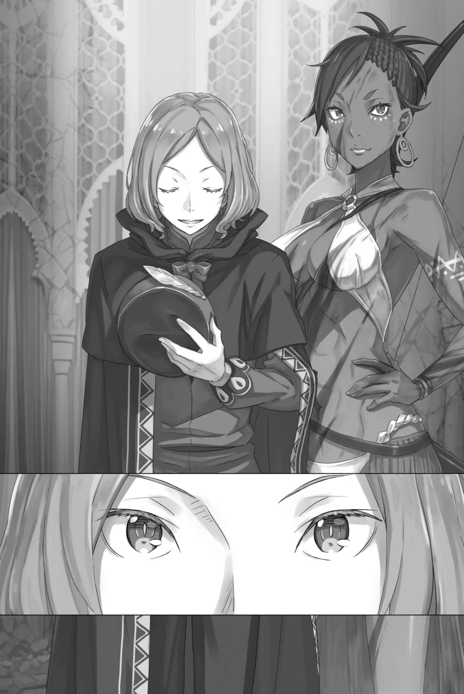
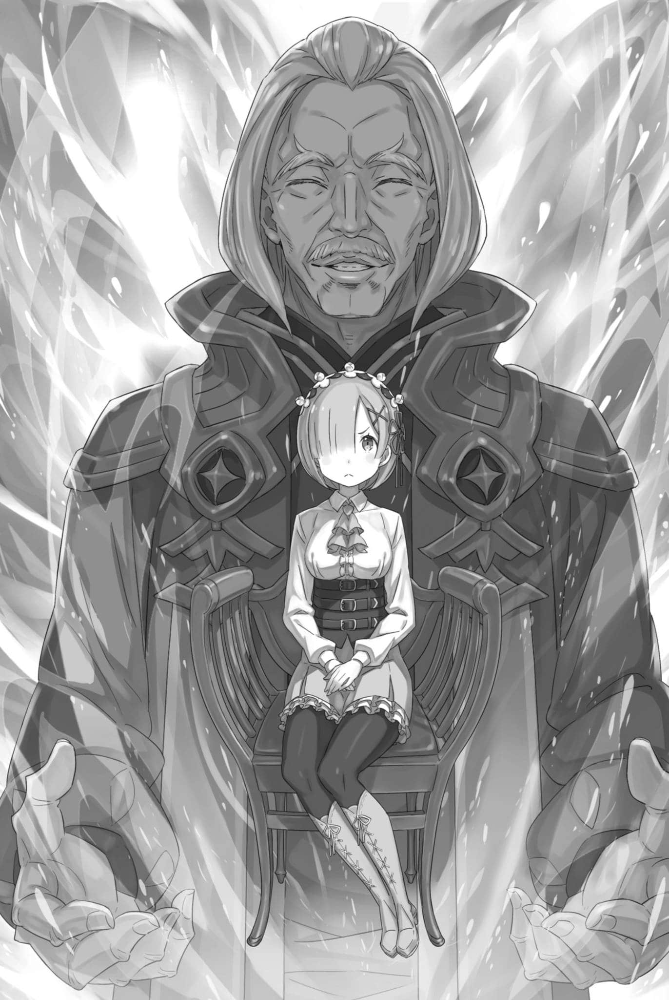
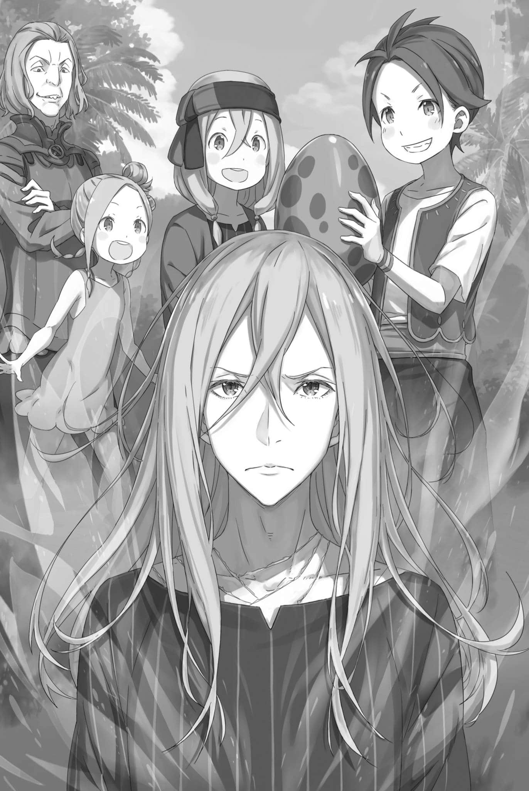

# 『弗洛普・奥克尼尔』

------

「――珍爱自己的生命，弗洛普。自我牺牲这种事只有大傻瓜才会去做。」

这是对弗洛普的忠告，出自他的恩人，那个从恶劣环境中把他带出来的迈尔斯。

弗洛普和米迪娅姆，两人在年幼的时候住的孤儿院，看来比他们想象的要恶劣得多。

孤儿院收留无亲无故、无处可去、无人可依的孩子，给他们一处有屋顶、有墙壁的栖身之所。院里的大人总把这样一句话挂在嘴边：

「外头多少人没饭吃、没活干，你们已经够有福气了。」

实际上，他们也是这么想的。

被家人抛弃后，他和妹妹米迪娅姆相依为命，靠着啜饮泥水过活。能吃的无非野草和虫子，偶尔捉到兔子之类的小兽，便欢天喜地。最难熬时，他们甚至啃过泥土和青苔充饥。

与这些相比，孤儿院的生活要好得多。

毯子虽薄且破，终究有人给；汤虽淡得没味，面包也只有一小块，终究有人供饭。他们被安排做些靠人数堆出来的简单劳动，至于大人随心情而来的拳脚——也并非天天都有。

大人们总是告诉他们，外面的世界更加艰难。于是，他们从未考虑过要逃跑。

然而，看到米迪娅姆和其他孩子们被大人们殴打踢击，弗洛普无法忍受，于是他学会了尽可能地保持欢快，以吸引大人的注意。

每天，弗洛普都决定让自己成为大人们最关注的人。

如果引人注目的弗洛普能被大人们喜欢，那么他们对其他孩子的态度也会变得柔和。即使大人们有心情不好的日子，首先被他们抓住的也是引人注目的弗洛普。

只要引人注目，就能成为武器。

他尽可能地放大声音和肢体动作，夸张表情和手势。幸运的是，养成这些习惯并不困难。他似乎在吸引人的眼球上有着天赋。

——有一夜，他替年幼的孩子引走了大人的怒火，遭到一顿几乎丧命的毒打。米迪娅姆整夜抚着他的伤处。正是在那个夜晚，他确信了这一点。

这就是他在这个地方必须承担的角色。

在痛得几乎要昏过去的时候，弗洛普告诉自己――

「哪有这种道理，你这蠢小子。」

「啊……」

「隔了几年回来瞧瞧，还是这么个叫人火大的老窝，偏又有个傻孩子在犯傻。疯小子有巴罗那小子一个就够了。」

弗洛普认定这是自己的职责，也下了决心，要独自扛起孤儿院里所有的阴暗。

但是，他的计划在某个夜晚被突然打破了。

那人骑着飞龙而来，无论如何也称不上相貌端正。

他粗野，毫不掩饰教养欠佳，烦躁地抓挠着灰色头发。在孩子眼里，这是最好别去招惹的人。那张让人联想到卑怯老鼠的脸，又加深了这种印象。换作平时，弗洛普一定会低头缩颈，免得挨打。

然而，那人——迈尔斯，却带着一副嫌麻烦的样子，做出了与弗洛普这番失礼印象截然相反的事。

「我以前也跟你们一样，是从这儿出来的。那会儿这里就够烂了，所以我早早逃出去，喝着泥水熬了下来。」

在晚上，为了防止孩子们逃跑，孩子们的房间的门上有一把粗糙的锁。

迈尔斯粗暴地砸开锁，探头看见近二十个孩子挤在一间小屋里，狠狠咂了咂嘴，满脸烦躁。

然后他把那些因为陌生大人的出现而感到惊讶和恐惧的孩子们带到了房间外面，留下一句「等着」，然后去了大人们的房间。

然后――

「天天都在死不死得了之间打转，好歹算捡着了点运气。过了几年，忽然想起这个晦气的老家，回来一瞧……就是这德行。」

他将大人们捆好，扔在屋内地板上。那些人骂他忘恩负义，他便踢向他们的脸，露出粗鄙的笑，啐了一口：「活该。」

想必迈尔斯过去也被这些大人折磨得很惨。可即便如此，做到这一步真的好吗？弗洛普仍不免心生疑惑。

迈尔斯转过头来看着弗洛普，扬起了他稀薄的眉毛。

「怎么，你也想来？那就报回去，百倍奉还。」

「啊，我……」

「——我要！！」

在迈尔斯魔鬼般的耳语下，弗洛普犹豫了。

然而，从弗洛普的背后冲出来的米迪娅姆毫不犹豫地用拾起的木枝打向被捆绑的大人的头。——不，不只是米迪娅姆。

除了被惊呆的弗洛普，所有的孩子们都变成了愤怒的反叛者。

「我一直都很痛！」

「讨厌！」

「这是我哥哥的仇！」

被捆绑而无法抵抗的大人的哀叫声被孩子们的怒吼声吞没。

孩子们用指甲抓他们的脸，扇他们耳光，最后甚至朝他们身上撒尿，将日积月累的愤怒一口气发泄出来。

「哈哈哈哈哈！看看他们的脸！真是好戏！」

弗洛普呆呆看着妹妹和孩子们的反抗，迈尔斯则在他身旁粗声大笑。

弗洛普实在笑不出来。他只是心慌意乱：把大人们弄成这样，自己这些孩子之后又该怎么办？

「行了，往后随你们高兴……本来想这么说。可要就这样扔下你们，德拉克洛伊伯爵指不定要怎么骂我。」

迈尔斯边看着刚刚冲出设施的孩子们，边对他的年轻后辈们继续说道，

「先带你们去伯爵那儿，往后怎么过，你们自己选。当然，也不是非得跟着我走。」

在接受迈尔斯的这个随意的邀请后，孩子们面面相觑。

他们的脸上充满了不安和困惑。迈尔斯说过，他们是否要跟他走，这完全是他们的自由，但这对于弗洛普他们来说是前所未有的『选择』。

这些孩子一直以来都是按照大人的指示行事，他们从未有过选择的权利。因此，当他们突然被赋予了这个权利，他们感到手足无措。

看到孩子们的这种状态，迈尔斯耸了耸肩，说道，

「都到这会儿了，还畏畏缩缩的。——你们不是已经报复过那些家伙了吗？想怎么选，都由你们自己。」

听到迈尔斯这么说，孩子们才恍然大悟。

正如迈尔斯所说，他们早就已经做过选择——他们选择了反抗。

——结果，没有一个孩子选择留在孤儿院。

当然，尽管弗洛普没有参与其中，但他无法开口说要留在那个发生了那么多事情的孤儿院。首先，米迪娅姆很快地接受了迈尔斯的邀请，并向弗洛普呼喊道，「我们走吧！」。

弗洛普无法拒绝米迪娅姆的请求，也无法选择和妹妹分离的道路。因此，虽然他的原因相比其他孩子更为消极，但他还是离开了那个设施。

他做出了一件无法置信的事。

他被卷入了一件无法置信的事，内心充满了后悔。

然而——，

「晚安，哥哥」

在前往迈尔斯的主人所在的路上，他们在没有屋顶的地方，用从设施里带出来的毛毯和妹妹一起蜷缩在一起睡觉的时候，这句话刺入了他的心。

妹妹安心地依偎过来，眼前是没有屋檐与墙壁那般牢笼束缚的天地。

他意识到，他不再需要担心被人打，也不再需要担心让妹妹哭泣。

「——嗯」

意识到这一点后，弗洛普哭了。

他哭了又哭，哭得无法自已，他在这个哭泣中尝到了自由的咸涩的味道。

※ ※ ※ ※ ※ ※ ※ ※ ※ ※ ※ ※ ※ ※ ※ ※ ※ ※ ※ ※ ※ ※ ※

——遥远的地方，一只飞龙在被灰色云层覆盖的天空中翱翔着，逐渐远去。

直到远处的影子变得小到只有豆粒大小，兹克尔都持续保持警惕，确信这并非下一轮攻击的预备动作后，他才松弛了紧绷的身体。

飞龙群撤退了，理由尚不明确。只要城市府舍尚未完全陷落，撤退的可能原因就有两个——要么他们已经达到了战略目标，要么他们判断目标无法达成。

从兹克尔的立场看，他更希望是前者。回顾这短短一个小时的激战中接连发生的剧变，客观而言，他也认为前者的可能性更大。

「骤然下降的气温，以及城市南部的毁灭性破坏……」

兹克尔将手插进浓密的头发，逐一思索这两场尚无法判断的异变。

战斗正在进行中，城郭都市的气温迅速下降，最后甚至开始下起了小雪，这让他怀疑自己的眼睛。在高高的山上有时能看到雪，但在佛拉基亚想看到雪，除非是遭遇了天灾地变。

也就是说，战斗中的降雪实际上就是一场天灾地变。

不过，这对兹克尔他们来说反倒是一种幸运。

飞龙对气温的剧变，特别是寒冷，非常敏感，这使得那些讨厌的飞行战力明显下降。如果没有这个因素，伤害可能会更大更深。

然而——

「那个白色的光究竟是……」

无法阻止的绝望性破坏，将城市的南部完全抹去。

用「天灾地变」形容都嫌轻了，那已近乎世界末日的一幕。即便没有后续攻击，仅此一击，就让城市遭受了重创。

指挥系统陷入混乱，战况判断也停滞。如果继续被飞龙压制，城市可能就会不堪一击，最终陷落。

因此，飞龙群的撤退无疑是一种幸运，也是令人困惑的。

因此，兹克尔推测攻击方，即敌人那边，可能出现了什么情况。

可能有人代替正在城市防卫工作的兹克尔他们，对敌人发动了重击。这个人可能是率领修德拉克的米泽尔妲，也可能是有着击退亚拉基亚一将战绩的普莉希拉。

不论是谁帮助他们——

「果然，女性真是了不起。但是，我并不想把被女性在背后保护当作理所当然的事」

女性的优越性并不能成为兹克尔可以放任自流的借口。

虽然他敬爱并珍视女性的伟大，但他也应当反省自己的过错。

无论如何——

「没想到我们会遭受如此猛烈的攻击，事前的准备发挥了作用」

「……攻打城郭都市，用飞龙是常策。不过，我本该料到，派来的会是『飞龙将』，而非飞龙队。」

兹克尔对受伤、头部流血的参谋官的话摇了摇头。

是他估计得太过乐观。为对付飞龙而准备的攻龙兵器，大多布置在西面城墙，以防来自帝都的攻击，飞龙群却从四面八方扑来。

他原以为，亚拉基亚一将退走后，再派另一名一将过来还需要时间。可这也料错了——细想当下的局势，对方这样做本就理所当然。

这不仅仅是一个城市的反叛，更像是一个更大的政治变动的前兆。

帝都的奸臣既知内情，自会趁火势未起，倾尽全力扑灭这场叛乱。因此，他本该将一将接连出动的可能也考虑在内。

「算了，反省的事留到以后再说。城墙已经被破坏，就算没有飞龙，攻击城市也很容易。我们要确认损失情况。看看能不能修复城墙……」

「——立即放下武器！这是命令！」

「嗯」

兹克尔迅速理出这些失策之处，暂且记在心里。

他正要着手查明损失、安排下一步应对，一声紧迫而锐利的喝令，却震动了冰冷的空气。

循声看去，用作指挥所的市政厅刚刚击退飞龙，一道人影便被守军团团围住。原先对准飞龙的武器与戒备，此刻都集中到了这名态度恶劣、睥睨众人的男人身上。他双手各握一柄长剑，剑尖仍滴着血。

然而，那并非人的血，而是飞龙的。

「那是……」

「他是我们为对抗飞龙，从地下牢房中放出的士兵之一。他是个双剑使……」

「啊，我也看到了。他的战斗就像一骑当千。——喂，住手！」

在参谋官的指出下，兹克尔点了点头，向他的部下发出了命令。听到兹克尔的指示，一个士兵高声叫道，「二将！」

「这很危险！考虑到现在的情况，我们是从牢房里放他出来的……」

「飞龙的威胁消失后，就应该立刻把他送回牢房？他不会接受的。我们应该关注的是为此付出的牺牲可能会带来的问题。」

兹克尔回应了紧张的部下，向被围困的男子迈进。

这个双剑使者的实力，比起普通的帝国士兵要高出许多。实际上，如果没有他在战斗中的卓越表现，他们能否击退袭击市政厅的飞龙群还真是无法确定。

如果他的剑指向这边，恐怕会造成相当大的伤害。

「无论如何，如果你发起暴行，你的生命也不会保全。所以......」

「所以，是什么呢？」

对兹克尔的发问，男子以尖锐的声音和态度回应。更甚的是，他将手中一把剑指向兹克尔，咧嘴大笑道，

「你是让我乖乖投降吗？那跟其他家伙说的没什么两样，『女奴』二将大人」

「你这家伙！竟敢嘲弄兹克尔二将！」

兹克尔以被冠以不光彩头衔为荣，但此刻男子的话语显然是在嘲讽他的头衔。因此，部下们愤怒地增加了敌意，而兹克尔再次用手示意他们平静。

「肯投降自然最好，但我并非要你如此。你的奋战十分出色，纵然立场不同，守护这座城的功劳也不能抹去。所以，我会释放你。」

「真的吗？」

「信赏必罚是佛拉基亚的法则，也是皇帝的愿望」

以实力和贡献作为评价标准的佛拉基亚皇帝，他的存在就是帝国实力主义的典范，也是兹克尔深感尊敬的忠诚的根基。

然而，一听到兹克尔的回答，男子的态度明显变得更加尖锐。

男人浑身散发着迫人的煞气。右眼被眼罩遮住，他便将全部情绪都倾注在左眼中，狠狠盯着兹克尔。

「背叛皇帝和帝国，投向敌人的『将』，你还真好意思说这些话……如果是我，我会因为羞愧而切腹自杀」

面对男子的强烈敌意，他的言语让人猜测他对帝国的忠诚，兹克尔微微地屏住呼吸，然后静静地注视着他。

这个被关在地下牢的士兵，当文森特用计谋攻下古拉尔时，他并未服从投降的命令，一直坚持到了最后。这说明，他是一个对帝国主义有极强归属感的人。

那么，如果......

「如果我告诉你，我和你一样，对帝国和皇帝始终忠诚，你会愿意倾听我说话吗？」

「啊？」

面对兹克尔的问题，男子瞪大左眼，露出粗鄙的声音。但是，他看着毫不畏惧的兹克尔，沉默了一会儿，然后把剑扔到了地上。

剑落地发出清脆的声音，男子双手举起。

「我可以理解为，你愿意听我说了吗？」

「我暂且不跟你们拼个鱼死网破。真要豁出去，取下叛将的脑袋应该还是办得到的……」

他四处打量一圈，挑衅地看着兹克尔的部下。他们对他的警惕性提高了，但他嗤之以鼻地笑了笑，

「不过，就先放你一马。可要是说些无聊的话……」

「我打算说一些你可能会感兴趣的话。......对了，你的名字是什么？」

见他放下武器，兹克尔认为双方已有了交谈的余地，便问起姓名。男人犹豫片刻，又觉没有隐瞒的必要，挠了挠头道：

「我叫贾马尔・奥雷利，上等兵。」

说出了他的名字和军衔。

听到这个，兹克尔深深地点了点头。

「贾马尔，你应该知道，我是兹克尔・奥斯曼，被赐予帝国二将的地位，也被称为『女奴』。不过......」

「嗯？」

「现在的我，更愿意被称为『懦夫』，这更能激励我前进。」

曾经认为是耻辱的绰号，在兹克尔心中已经变成了特殊的光芒。

听到兹克尔的回答，男子——贾马尔显得困惑。他的武艺高强，但似乎不擅长思考和解决问题。

如果是这样的话，只要说出道义，他也许会愿意倾听。

就在这时 ——

「——不好意思，请问这座城的负责人是在这里吗？」

贾马尔投降了，城市市政厅从紧绷的气氛中得到了解放。正是此时，一个仿佛在寻找插话机会的声音滑入了大厅。

那平静而柔和的声音，犹如轻轻拍打听者鼓膜的慰藉，带给人们一丝安抚。

然而，对这个陌生声音的主人，兹克尔转过身，皱起了他那圆圆的眉头。

声音的主人出现在了楼梯上，这是通往指挥所的楼梯。他举起双手，表示自己无敌意，灰发的男人环视四周，

「那位就是，『二将』兹克尔・奥斯曼先生吗？」

他在身着同样红色制服的人群中，毫不犹豫地确认了兹克尔的『将』身份。

当然，他身披的披风和肩头的军衔章表明，要在这里看出兹克尔的地位最高是很简单的。——问题是，有胆量指出这一点。

他冒着危险，出现在刚刚结束战斗的指挥所，名指陌生的指挥官。兹克尔对这个看似毫无畏惧但却保持低调的男子的归属感到疑惑。

他并不像是城市的居民，所以他可能在战斗中混入。

在这种情况下，最可能的是——，

「帝都的使者……来向我们传令的吗？」

「哎？啊，不，不是的，完全不是！我们的情况更复杂，解释起来很麻烦，我们并非帝都的人员」

男子摆动他举起的双手，急忙否定了兹克尔的怀疑。如果接受这个否定，那么男子的立场就更加模糊了。

兹克尔皱着眉头深思，贾马尔则咬牙切齿地说：「你这个……」

「我们先来的！你后来的还敢嘟哝嘟哝……我要杀了你！」

「对此我感到非常抱歉。我现在也不认为我们能平静地谈话。所以，如果你能给我许可的话」

「许可？什么许可？」

「照顾伤员，修复城市……简单地说，就是帮忙处理战后的事务。我和我的同伴们应该可以提供一些帮助」

答完皱着脸的贾马尔，青年又叹道：「不过……」他似是疲惫，又似无奈，略微放松了脸上的表情。

「我们已经开始工作了，所以部分工作需要您事后批准」

「——这个提议本身是非常感谢的，但是……」

「这并不是什么困难的事情，兹克尔。那个男人的话并没有说谎」

兹克尔还没来得及追问，一个坚定的声音打断了他的话。楼梯上传来犹如杖子敲打地板的声音，一个影子上了楼梯，站在青年的旁边。那是全身浴血，看起来更加威猛的米泽尔妲。

看起来，她身上沾染的血都是别人的，除了之前受伤的腿以外，没有其他明显的伤口。看到她平安回来，人们都松了一口气。

米泽尔妲回来后，友好地拍了拍青年瘦小的肩膀，

「他的同伴已经开始工作了。我也保证」

「米泽尔妲小姐，你平安无事真是太好了。他是？」

「我不知道。他不是我们的敌人，而且是个长得不错的男人，所以我让他进来了」

「米泽尔妲小姐……」

米泽尔妲看人的眼光与兹克尔有些不同，但诚如她所说，这青年的确眉目端正，面相温和。

他周围弥漫着一种中性的氛围，然而他的目光却显得异常坚定。

兹克尔也觉得他并非坏人。只是，他肚子里可能还藏着一些事。

「在这种情况下，我不会认为会有无私的援助。你，究竟是何方神圣？」

「我刚才也说过，我在一个解释起来比较复杂的位置。但是，我并没有打算和你们对抗。——我只是在找人而已」

「找人……」

听到兹克尔重复他的话，青年点了点头。

青年摘下绿色帽子，按在胸前躬身行礼。虽不是帝国的礼节，却清楚地表达了敬意。

「我的名字是奥托・苏温。——我正在寻找我的朋友，和我的朋友的妹妹」

他如此道明来意，眼神却像鬣狗一般，叫人片刻不敢轻忽。

※ ※ ※ ※ ※ ※ ※ ※ ※ ※ ※ ※ ※ ※ ※ ※ ※ ※ ※ ※ ※ ※ ※

——迈尔斯的主人，塞琳娜・德拉克洛伊上级伯，是位作风凌厉的女杰。

年纪轻轻就在帝国贵族的上层社会中崭露头角的她，遵循着帝国主义的铁血法则，坚信实力至上，奖励有才能的人。

同时，她又有着高尚的品质，不会允许强者随意侮辱弱者，因此，迈尔斯带回的孩子们并没有受到恶待。

「事情我听说了。连嫌麻烦的迈尔斯都把你们带回来，想必你们的遭遇着实令他不忍。在我的领地里，自在过活便是。」

塞琳娜这样答复了被迎进屋的弗洛普等孩子们，然后痛快地笑了。

那股威压远远超出了身躯所能容纳的分量，令年幼的弗洛普几乎想俯身拜倒；再加上从未见过的宏大华美的宅邸内饰，更让他不知所措。

「像伯爵一样富有的人，没有理由特意去欺负底层的人。最终，那些欺负孩子的大人，只不过是自己在小时候被大人欺负过的人罢了。」

弗洛普和孩子们洗了热水澡，吃得肚子饱胀，又换上干净芳香的衣服。迈尔斯就这样，以一贯粗鲁的口吻对他们说。

与那些眼花缭乱的孩子们不同，弗洛普对他所不知道的世界，新的思考方式产生了深深的印象。

尤其是，迈尔斯无意中提出的哲学对他产生了巨大的影响。

他从未想过的观点和视角，在他被迈尔斯带到外面的世界之前，他是无法知道的。

最重要的是——

「哟，看来是同道中人啊。你们也都是迈尔斯大哥捡回来的？」

在追逐在府邸里自由奔跑的妹妹们时，弗洛普在这片广大的庭院中的一个美丽的花园里停下了脚步。

在这大片盛开的花朵面前，他听到了这样一个温柔的声音。

即使惊讶地寻找声音的来源，庭园里也找不到声音的主人。当弗洛普疑惑地歪头的时候，

「我在这儿。对不起啊，我是从下面说话的。」

「哇啊！」

「哦，你跌倒了。」

突然，从弗洛普倚靠的栅栏另一边，也就是他正在观赏的花园的那一边，突然探出一个头来，弗洛普被吓得往后一跳。

他跌倒在地，被人笑了。弗洛普眨了眨眼。

笑他的是个比他年长几岁、仍带稚气的少年。大约十二三岁，一头棕发，面容颇为讨喜。

「……你竟然笑，真是无礼。」

「哦，对不起，对不起。你跌得那么狼狈，我忍不住。我本想帮你起来，但是我现在不能动。」

「不能动？……啊」

弗洛普起身拍去屁股上的灰，绕过栅栏来到少年面前。只见少年盘腿坐在地上，膝头放着一个圆滚滚的东西。

看到那个，弗洛普的眼睛瞪得老大。

「那不会是，蛋？」

「没错，是个大蛋，这其实是飞龙的蛋。」

「飞龙的蛋？你要用它做什么？」

「当然，我打算孵化它。」

少年用整个身体搂着那枚足有一抱大的白蛋，冲弗洛普咧嘴笑了。

——这就是弗洛普和米迪娅姆・奥克尼尔兄妹，以及他们将来的义兄弟，巴罗伊・特梅格里夫的初次相遇。

※ ※ ※ ※ ※ ※ ※ ※ ※ ※ ※ ※ ※ ※ ※ ※ ※ ※ ※ ※ ※ ※ ※

——对于飞龙的威胁，已经超越知识的范畴，得到了实际的认识。

被摧毁的街道与遭袭的人们，让雷姆深切体会到了飞龙爪牙的威胁、双翼带来的多变战术，以及伤害敌人时毫不迟疑的凶性。

坦白说，她无法理解为何会有人想要驯养、重用如此危险的生物。那根本是无法相容的敌人——就如密林中遇见的巨蛇，在她看来，只有危险可言。

然而——，

「……」

雷姆眯起眼，静静望着窗外那出乎意料的一人一龙。

在豪宅的庭院里，一头飞龙在休息，旁边有一名正在喂飞龙食物的士兵。本应令人恐怖的飞龙，但它却展现出了柔和的眼神，发出宛如撒娇的声音，接受士兵手中的食物。

从雷姆的角度来看，被告知是凶猛且凶恶的飞龙，实际上见证了其危险性，如今看到它如此亲近人类的景象，令人震惊。

何况，那个似乎对龙知之甚详的少女，还反复告诉她，高傲的龙不会亲近人类。眼前这一幕，让雷姆觉得「这和说好的可不一样」，也无可厚非。

「你看起来有些忧郁呢」

突然，一个声音在她背后响起。

然而，由于雷姆已经听到了步伐声，所以并没有被吓到。

不过，这是一个陌生人的声音，考虑到地点，她还是有些紧张。

「不知道是否忧郁，但是的确有一些想法。毕竟，我并不是自愿来这里的」

「呵，倒是直言不讳。说话真叫人痛快。」

「……你是？」

在她所在的房间里，这座建筑即使是为俘虏提供的房间也是奢华的。她坐在一把让人坐得不舒服的豪华椅子上，问出了对面老人的身份。

那是一个白发白须、眼睛狭长的老年男子。

他的装扮看起来并非战士，而更像是某个高位的人物。

从他的行为和年龄，以及看守雷姆的士兵们端正的姿态和低头，都可以看出他有一定的地位。

面对雷姆直接的目光，老人轻轻挥手，示意守卫的士兵离开。士兵们立即服从，行了一礼后离开了房间。

然后，老人指向对面的座位问道，

「我可以坐下吗？」

「……请坐」

在雷姆面前，老人缓慢地坐下。他直视着雷姆，手指抚过自己的下巴，

「关于老朽，您什么都没听说过吗？」

「没有。除了『治好他』『好好休息』『擅自行动就杀了你』，我什么都没听到。」

回味着那个不愿倾听的房主——玛德琳的指示，雷姆摇了摇头。

她被看守着，被严厉地告知不准逃跑，处于软禁状态。虽然雷姆没有逃跑的意图，但她对这种状况感到不悦。

老人对雷姆的回答点头说，

「这种对客人的态度确实有问题。我也会向玛德琳警告的」

「……你能警告她吗？」

对这个神秘老人的话，雷姆不由得瞪大了眼睛。

从城郭都市被带到这个府邸的过程中，她和玛德琳共度了一段既长又短的时间，深受她不听话的困扰。

她固执而倔强，尽管有时会被说服，这给了雷姆一些安慰。

「我原以为她是那种不喜欢被别人指挥的人。如果有人对她说什么，她会立刻生气并使用暴力……」

说到这里，雷姆双手重叠在一起。

静下心一想，她自己有什么脸说这种话？毕竟，自己也曾不听旁人解释，直接折断对方的手指。雷姆不禁羞愧起来。

然而，看到雷姆这种反思的态度，老人微微一笑，

「倒也不能说您错了。这些话，老朽听着也颇觉刺耳。事实上，这回她也未依令行事。不过——」

「――――」

「这次并不是玛德琳的任性，而是另一个因素起了主要作用」

老人嘴角微微上扬，但话语里已经没有了笑声。他的视线似乎在打量着雷姆，把她视为那个『另一个因素』。而这个因素，显然给老人带来了不愉快的结果。

「……你，是谁？」

「抱歉，我没自我介绍。我是神圣佛拉基亚帝国的宰相，皇帝陛下赐予我的职务，我叫贝尔斯提兹・冯达尔福。」

「宰相……贝尔斯提兹……」

对于雷姆的疑问，老人——贝尔斯提兹，恭敬地低下了头。听到他的名字和职务，雷姆的脸色变得更加严肃，肩膀上的力量也增强了。这个名字和职务，她都听说过。

「那么，你是……」

「是的。——我，就是文森特・埃布尔克斯陛下的敌人。」

「——」

明确地告诉了雷姆，她一时间无法接话。虽然她已经知道，但没想到他会如此直白。同样的，她也无法避免被卷入这场大麻烦，她现在正站在风暴的中心，这一切都让她感到十分讽刺。

本来，应该在这里的人应该是埃布尔、普莉希拉，还有昴。

想到这里，雷姆觉得幸好昴不在这里。

「如果他在的话，肯定会一个人做出鲁莽的行动……」

黑发少年的决断力，和他总是能做出超出想象的事情，是毫无疑问的。在这样的情况下，他可能会引发出雷姆想象不到的奇特状况。

从这个意义上说，昴没有在被飞龙袭击的城市里是正确的。即使他在那里，雷姆也不觉得他能够做什么，只会增加更多的伤害。

只是——

「——」

只是，如果他知道雷姆被玛德琳带走了，他会怎么想呢？

那个想法让雷姆的心如被锋利的刀刃划破一般的疼痛。

「——埃布尔先生，您知道他是真正的皇帝吧？」

尽力忽视胸口深处剧烈的痛楚，雷姆向贝尔斯提兹提出质疑。对于她的疑问，贝尔斯提兹淡然地回应道：

「当然。让他逃脱，确是失策，但之后一切都依照计划进行。不，应该说，原本如此。毕竟，古拉尔的毁灭最终只进行到一半。」

「为什么是埃布尔先生？我无法想象决定叛变会需要多大的决心……是因为埃布尔先生的性格吗？」

「一个国家的领导者，皇帝，我们并不需要他的人格。个人的情感和思想，从国家运作的角度看，都是微不足道的。如果说我们需要的是什么，那就只有他的能力，以及能够履行职责的信任和实绩。」

他慢慢地摇了摇头，贝尔斯提兹用无法窥探的声音和表情回答。

声音中没有丝毫的动摇，表情也没有丝毫的改变。这不仅是因为雷姆的人生经验有限，更是因为贝尔斯提兹的卓越谈判技巧，使得完全无法读取他的内心。

那份毫无波动，究竟是在掩饰谎言，还是在陈述事实，她连这一点也无从分辨。

只是，他说这并不是因为埃布尔的人格引发的叛乱，这是雷姆想要相信的。

她亲眼目睹了在城郭都市中大量的血腥和死亡。如果说这一切都是因为埃布尔的性格不好，那么无论是死者还是雷姆都无法接受。

因此——

「是因为埃布尔先生不适合做皇帝，所以被放逐的吗？」

「放逐，并非我们的初衷。那只是结果论。」

「埃布尔先生缺少了什么？我不清楚皇帝这个地位需要承担的重任，也不了解所需的能力，但我认为他是一个优秀的人……」

虽然自己也觉得奇怪，为什么要为埃布尔辩护，但雷姆为了说服自己的困惑，选择了这样的话。

实际上，不论战斗能力如何，埃布尔在思考能力和知识深度上都是出类拔萃的。

米泽尔妲，兹克尔，甚至昴，他们都愿意遵循埃布尔的意见，这是他拥有说服他人的领导力的证明。

虽然具体情况不太清楚，但雷姆也认为，这是站在高位的人所需要的品质。

这也是，对于在国家中拥有最高地位的人来说，必不可少的。

就在这时——

「我还没有问过您的名字，治疗师小姐。」

「……听说，我叫雷姆。」

「嗯。」

因对贝尔斯提兹心怀反感，她不禁又用上了仿佛转述旁人之言的说法。

然而，雷姆已经接受了自己的名字是『雷姆』。从强烈地向普莉希拉自我介绍，或者是允许昴这样称呼自己的时候开始。

贝尔斯提兹将雷姆的名字在舌尖过了一遍，轻轻呼出一口气。

「雷姆小姐，您认为，如今皇帝陛下有几位子嗣？」

「子、嗣……嗯，您是说孩子吗？」

「是的。」

当贝尔斯提兹静静地点头的时候，雷姆脑海中浮现出埃布尔的形象。

虽然失去了记忆的雷姆，但是在丧失记忆之前获得的知识并没有丧失。人类如何繁衍后代，她也记得很清楚。

但是，埃布尔是否能和其他人建立这样的人际关系，这一点她还有些怀疑。甚至，她甚至想不出和埃布尔并肩的女性。

「我无法想象。他没有孩子吗？」

「——您猜得很准。事实上，他没有孩子。」

「啊，果然是这样。这样说可能对埃布尔先生很不敬——」

就在雷姆要继续说下去的时候，她突然停住了话。

并不是贝尔斯提兹说了什么，也并没有被他指示要保持沉默。只是面对着他紧闭的眼睛微微睁开，能看到他眼睛深处的表情，雷姆的喉咙被那难以置信的恶魔般的气息所束缚。

贝尔斯提兹静静地将手放在他们之间的桌子上，那种强烈的愤怒从他沉默的全身流露出来，简直超乎想象。

「他没有孩子，没有继承人。——这是个问题。」

「——啊」

「帝国必须强大。否则，这个国家......」

在雷姆喘息微弱的面前，贝尔斯提兹停下了话语，打开放在桌子上的拳头，深深地吐出一口气。

随后，他再次眯起眼，将瞳孔藏于眼睑之后，看向雷姆。

「对不起。这是我第一次成为叛徒，我不能不说我感到有些紧张。」

「……为什么，你要告诉我，这个故事」

「——」

「这本来是，不需要告诉我的事情」

贝尔斯提兹的话语中，蕴藏的已不只是情绪，而是某种更沉重、更澄澈的东西。

虽然雷姆没有觉得这是谎言，但她还是有疑问。为什么，他要告诉雷姆这个故事。

雷姆不认为自己处于如此重要的地位，事实也确实如此。

虽然她偶尔也会被放在接近埃布尔和普莉希拉的位置，但那只是因为事情的发展，不是因为雷姆特别。

「然而，为什么」

「……你是个治疗师，而且是鬼族。我希望能够招揽你。你是个珍贵的存在」

「——」

这并非谎言，但也并非全部是真相。

然而，寻求更多答案的雷姆，似乎贝尔斯提兹已经没有更多的时间给她了。他慢慢地，从他坐着的椅子上站起来。

「原想再与您聊一会儿，可老朽也有必须处理的事务。还得请您暂且忍受些不便。我会吩咐宅里的人尽量照应，您就安心休息吧。」

「……贝尔斯提兹先生，您和玛德琳小姐是什么关系？」

「合作者，可能是最合适的描述。当然，从她的角度看，可能会认为是在利用一个聪明的人。这个府邸，也是我的府邸」

贝尔斯提兹耸了耸肩，他的回答让雷姆看了看房间和花园。

玛德琳在这里俨然一副主人姿态，雷姆一直以为这是她的宅邸，原来连这一点也弄错了。不过，这样一来，建筑与陈设的雅致倒也说得通了。

「可是，我既不觉得能在这里安心休息，也不想这样做。」

「直率的说话，真是令人愉快。那么再见，雷姆小姐，祝你健康」

贝尔斯提兹淡淡一笑，再次躬身行礼，离开了房间。

雷姆曾想叫住他，但找不到应该说的话语，也可能无法停住他，所以雷姆什么也没说。

贝尔斯提兹离开后，被送出去的守卫也回来了。

在他们严厉的视线下，雷姆再次望向窗外。

刚刚喂完食的飞龙，正在慢慢地展翅向空中升起，背上骑着刚刚喂食的男人。

「——」

飞龙凶猛可怖，可雷姆确实体验过，乘在它背上飞翔时那份畅快。

当然，考虑到现在的状况，雷姆并没有享受这种乐趣的余裕。从古拉尔出发，不到一天的时间就被带到了目的地，让人不禁感叹，之前的旅程都是为了什么。

在治疗受伤的弗洛普的同时，被玛德琳带到了这个地方——

「——帝都，鲁普加纳」

埃布尔被赶下王位，然后又决心夺回的城市。

雷姆成了阶下囚，只能遥望城中央的水晶宫。她抚上无法打开的窗，指尖感受着玻璃的触感，忽然想道：

「……如果他知道」

如果他知道雷姆不在了，他的心会痛吗？

就像雷姆心中被刀刺一样痛，他的心会痛吗？

雷姆并不知道，这是出于自己的何种情感而产生的想法。

※ ※ ※ ※ ※ ※ ※ ※ ※ ※ ※ ※ ※ ※ ※ ※ ※ ※ ※ ※ ※ ※ ※

――慢慢地，弗洛普睁开了眼睛，看到了陌生房间的天花板。

「……」

他用了一瞬间整理思绪，然后立刻开始观察周围，以便掌握当前情况。

这是经常露宿野外的行商人养成的习惯。警戒虽由感觉远比自己敏锐的妹妹负责，却不是他可以始终懈怠的理由。

反应迟钝片刻，就可能决定生死。因此，一醒来便迅速清醒，是他理所当然掌握的求生本领。然而——

「这里是……嗯哼！」

刚想仔细观察周围，弗洛普突然感到胸口一阵剧痛，忍不住发出了哀叫。

如果这是在夜晚的外面，这将是一个愚蠢的行为，将他的位置告诉了野兽。然而，既然已经发生了，也无法改变。

为了挽回，弗洛普边喘着气，边试图起身，

「怎么回事……我全身都动不了……！」

手上无力，加之床铺柔软，仿佛吸收了全身的重量。整个人沉入床铺，这种感觉倒像是陷入了牢笼，而非安息的床铺。

尽管如此，他还是拼命扭动身体，试图挣脱束缚。

「这、这……！这可真是个难题！」

「……你，真是个古怪的家伙。」

「啊！？有人在吗！？」

他在床上挣扎的背后，传来了高亢的声音，弗洛普试图转过身去，然而努力无果，他的身体已无法做出转身的动作。

像是在陆地上挣扎的鱼，弗洛普的样子引起了深深的叹息。

「是龙。你的伤还在治疗，别瞎折腾。」

说着，从床边走来的那人，弗洛普看到她，忍不住轻轻地呼出声来。

天蓝色头发、金色眼眸，头上长着两只黑角的少女——玛德琳。她是帝国一将，是袭击城郭都市的『飞龙将』。

而在弗洛普的最后记忆中——

「我记得，好像被你的爪子抓伤了……」

「没错。我的龙爪撕裂了你的生命。……是那个女孩治好了你的伤。」

「那个女孩……啊」

玛德琳避开视线，露出了尴尬的表情。她的话让弗洛普想起了一个脸庞，让他明白了自己所经历的一切。

与此同时，他也想起，意识消散之际，自己向她——向雷姆，提出了多么残酷的请求。

「玛德琳小姐，我想问问，古拉尔现在怎么样了？那个巨大的爆炸，还有你的朋友对城市的攻击」

「……」

「看我还勉强捡得一条命，想来我和夫人都活下来了。可如果只是这样，在我心里也只能算倒数第二坏的结果。当然，最坏的就是我和夫人都死了。」

弗洛普竖起手指，连珠炮似的向玛德琳问道。

一边侧眼看着他手指的动作，玛德琳的尴尬表情依旧。他认为那是她对于事情进展不如意的痕迹。尽管如此，弗洛普依然追问。

「你怎么看，玛德琳小姐。你的表情看起来不太满意，或者说是有些闹别扭。我妹妹也经常会这样，生闷气的时候会扭扭捏捏的。她身体大，即使闹别扭也无法掩饰，这点反倒挺可爱的，你也是这类人吗？」

「……啦。」

「嗯？什么事？」

「城市没事！我没有完全摧毁它！这样可以了吗！？」

玛德琳露出尖牙，冲他厉声吼道。弗洛普仿佛被猛烈的龙息兜头罩住，却终于长长松了一口气。

「没事」，按照弗洛普的记忆中的古拉尔的情况来看，这个回答并不十分恰当，但是玛德琳说她没有完全摧毁它。

那么——

「那位夫人，应该是好好利用了我的生命吧……」

在朦胧的意识和耳鸣中，弗洛普回顾了自己濒死之前的所作所为。

当时，他余光瞥见玛德琳面对浑身是血、命悬一线的自己，显出了强烈的动摇。她急切地追问着什么，似乎将希望全寄托在那个答案上。

所以，他想到了利用这一点。以救活自己、给出玛德琳渴求的答案为条件，也许就能让遭袭的古拉尔脱离险境。

他不知道，那个热衷于和平的雷姆能否做出这样无情的决定，即使看起来现状已经成功，他也认为给她带来了巨大的负担。

「救了我，治愈了我的伤的那位夫人，她在哪里？」

「……一起带回来了。这是龙提的条件，那丫头答应了。龙会守约，跟龙做下的约定，也得给我守住。」

「约定……」

「就是这个」

弗洛普听到雷姆平安无事的消息后，松了一口气。突然出现在他眼前的是一个红色的装饰品——一颗兽牙，不，是龙的牙。这是他平时挂在脖子上，时刻带在身边的重要物品。

那枚牙被举到趴在床上的弗洛普鼻尖前。

「啊，你替我捡回来了？真是谢谢。那可是非常、非常重要的东西。要是弄丢了，我都没法若无其事地活下去。所以……」

「——卡里昂」

「——」

弗洛普伸出手，试图拿回那颗牙，但玛德琳轻松地避开了他的手，取而代之的，她口中叫出了一个名字。

弗洛普听到这个名字后，他的呼吸顿了顿，然后玛德琳继续说道。

「这是卡里昂的牙。为什么，会在你手中？」

卡里昂——这个名字，玛德琳说了两次，这肯定不是听错了。

他没有听错。因为，那个名字——，

「回答我！为什么，你会有卡里昂的牙……」

「当卡里昂出生的时候，我也在现场。我也参与了给那个孩子起名字的过程，和迈尔斯哥哥以及巴罗伊一起。」

「——」

「那孩子换牙时，我得了它作纪念。说是义兄弟……是家人的凭证。所以，我和妹妹都带着卡里昂的牙。」

就像在心中打开一个宝箱，弗洛普静静地给出了这个答案。

在玛德琳手中摇晃的飞龙的牙，这就是它的来源。那是他珍视的家人——恩人和义兄弟，已经离世的两个人的遗物。

听到这个答案后，玛德琳无言以对，她的嘴唇颤抖，眼睛睁得大大的。

从她的反应，以及她认得卡里昂这一点，弗洛普心里也有了些猜测。他先问了声：「我能问问吗？」

「你是在哪里听说卡里昂的名字的？一眼就认出那孩子的牙，想必关系不浅。而且，你……」

「——呃」

「你是接替巴罗伊成为『玖』的孩子。难道你以前就知道巴罗伊和卡里昂吗？」

玛德琳的反应令人不忍。像这样逼问一个看起来还很年幼的女孩，也让弗洛普心痛。

然而，同样的话题曾带给弗洛普远胜于此的痛楚。世上再没有比妹妹那张泪流不止的脸，更能猛烈刺激他的东西。

因此，弗洛普毫不犹豫地逼迫玛德琳，听她说出心中的思想。

——巴罗伊・特梅格里夫。

佛拉基亚帝国的『九神将』之一，弗洛普和米迪娅姆的义兄，背叛皇帝而丧命的叛逆者，他深深地爱着他的爱龙卡里昂和他的恩人迈尔斯，他是那么的温柔，那么的可爱。

他和玛德琳之间有什么关系？

然后——，

「你为什么要成为『九神将』呢？」

「——为了复仇。」

犹豫了一下，然后回答了。但她说出的话是明确的。

她的嘴唇颤抖，眼睛睁得大大的，玛德琳的表情慢慢地变化，她金色的眼睛里充满了激情——怒火。

龙人少女的强烈愤怒，仿佛烧焦了躺在床上的弗洛普的全身。

以至于产生错觉，玛德琳的愤怒是如此的强烈。

玛德琳坦白说，她为了复仇才成为了『九神将』。

对于复仇这个词，弗洛普也有自己的看法。——那是因为，对于弗洛普来说，复仇是他人生的目标。然而，弗洛普的复仇目标不是个人，而是世界。

他要报复的，是这个总有人不得不屈膝低头的世界本身。

然而，玛德琳眼中的怒火，与这完全不同。

燃烧在她金色瞳孔中的激情，知道该向谁指向。

「你想为谁复仇？」

「……为巴罗伊，为那个本该成为龙的伴侣的男人报仇。」

「———」

「杀了龙的夫君的家伙，龙绝不原谅。为了这个——」

玛德琳充满怒火地回答，她要为已故的巴罗伊复仇。

弗洛普不知道巴罗伊和玛德琳是如何相识的，他们经历了什么，他们之间有什么样的关系。

只是，弗洛普知道玛德琳真心地后悔他的死，深感痛惜。

因此，因此，因此——，

「——你认为谁是巴罗伊的仇人？要怎样，才算报了这个仇？」

如果在场的是米迪娅姆，她肯定会紧紧地抱住玛德琳。

因为巴罗伊和迈尔斯两人的死，米迪娅姆痛哭流涕，大声哭喊。如果是那个米迪娅姆，她肯定能教玛德琳如何哭泣。

重要的人被杀害，玛德琳因此怒不可遏。

她不知该如何悲伤。这个统御飞龙、头生黑角、蕴藏着惊人力量的存在，竟只想得到用愤怒来悲伤。

而这正是忘记了如何哭泣的弗洛普的感受。

所以——，

「巴罗伊的死，是由于——」

弗洛普的问题，被紧握着小手的玛德琳回答。

失去夫君的玛德琳，将无处安放的爱挤在小小的身躯里。她不曾落泪，而是让那份爱燃成怒火，决意复仇。

「———」

然后，当弗洛普从玛德琳口中听到那个名字时，他闭上了眼睛。

他闭目，久久无言。唯有此刻，他连胸口被玛德琳剜伤、尚未治好的疼痛都忘了，只将自己沉入紧闭眼睑后的黑暗。

如果他闭上眼睛，他仍然可以记住他所爱的人的脸。

『你和米迪娅姆都想得太少！老实待在伯爵这儿不好吗？以后我可管不了你们，真是的。』

『迈尔斯大哥这是在担心你们呢。是说，你们要留在这儿，他就能一直照应着了。这人不坦率吧？』

『闭嘴，巴罗小子！都混出头了，还成天往回跑！！』

『哎呀，那种日子不适合我嘛。还是在这儿，跟迈尔斯大哥、弗洛普，还有米迪她们一起过，更合我的性子。是不是？』

启程那天，巴罗伊特地从远方赶来，迈尔斯明明前一夜歇得很晚，也来送行了。两人的那番斗嘴，如今化作令人怀念的往事，重新浮上心头。

他与米迪娅姆用力挥手，离开了那片长久受人照料的土地，然后——

然后，弗洛普・奥克尼尔来到了帝都，他蓝色的眼睛中闪烁着光芒。

他的眼神闪烁着，嘴唇编织出了话语。

那就是——，

「——你就是巴罗伊的仇人，是吧。村长先生……不，皇帝文森特・佛拉基亚」

