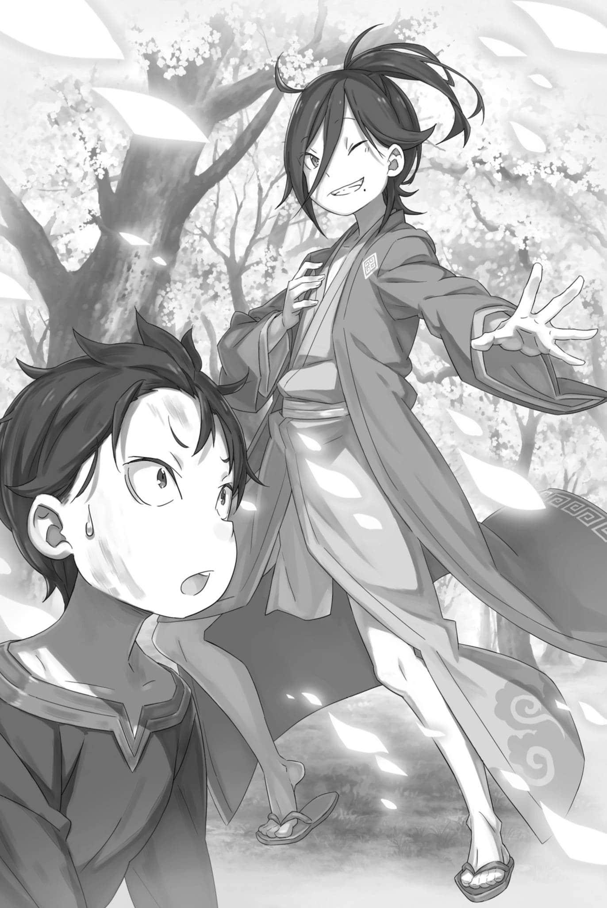

# 『欢迎来到剑奴孤岛！』

------

——感觉自己像是被抛弃在了一个阴暗寒冷的空间之中。

处于这种环境，周围像是闭上眼睛一样漆黑，温度如同脸颊放在铁块上一样冰冷。一边忍受着被锁链束缚全身般被剥夺自由的感觉，一边拼命呼救。

所以他才会不顾一切，忘我地向四周不停伸手。

但这并不是他在最后瞬间把手伸向眼前白光的理由。

光——不对，那是一个表情中隐藏着悲怆决心的少女。向她伸手，并不是为了寻求救赎，而是觉得必须要救那名少女。

所以，他挣动那连一丝动弹都不肯容许的锁链，伸出了手——自己的手。

自己的，这只手——。

「——好小。」

菜月・昴望着映入模糊视野的手小声嘟囔着。

那只朝向天花板的手，是沿着肩膀延伸出来的自己的手。无论是握紧还是放松，都可以按自己的想法行动。毫无疑问，这是他自己的手。

不过，这是一只小孩子的手，比昴所期望的要小一号。

也就是说——

「没有恢复……」

历尽千辛万苦，才终于抓住的起死回生的机会。明明是真真切切地一次次以死亡换来的结果，却还是从手中溜走了。

为了这些失去的东西，他到底付出了多少代价。

到底有多少牺牲，

「————!?对了，我这是在干嘛？」

瞬间，模糊的意识有了回稳，昴把刚刚凝望着的手放在自己脸上。

涌回的记忆，连向了魔都里遭逢的异常事态，以及比那更加惨烈、与奥尔巴特展开的夺命追逐。

在无数『死亡』积累的基础上夺下胜利，昴本应成功获得胜利者的桂冠——解除『幼儿化』。

昴还记得奥尔巴特把手放在了他的胸口，尝试解开昴的『幼儿化』。

下一瞬间，昴的耳边响起了爱的话语——

「突然意识就被吹走了，然后……然后呢?」

究竟发生了什么？昴试图寻找自己空虚的记忆。然而，无论推还是拉，那扇装有中断记忆的大门始终打不开。

面对这扇门的坚硬和逐渐高涨的焦虑，昴狠狠地咬住了后牙——

「——好了好了，不用那么焦虑也没关系吧。幸好你捡回来了一条命，要是有什么想做的事，等跟你一起到这里的小姐醒了再做也不晚。」

「——啊？」

声音忽然从身旁传来，昴愣愣地转过头。躺着的他，与一个将双肘支在硬床上、双手托腮的人对上了视线。

和那个满面笑容，近距离窥视昴的人。

「哇哦?!」

「哎哟，虽然醒来之后的反应很不错，但还是收敛点比较好哦。如果太吵闹的话，岛主就会盯上你，到最后给你搞一场麻烦的死斗。不过。」

「欸，啊，欸？……」

「不过我并不讨厌那种低级趣味的设计，倒不如说喜欢。」

昴吓得猛然弹起，瞪圆了眼睛，青发的人却在他面前若无其事地说着。

他的长发扎于脑后，身穿很少看到的和风装束。在惊讶于这张陌生面孔的同时，昴吞了吞口水，选好措辞问出了问题。

不仅是陌生的对象，还有陌生的地点、陌生的环境、陌生的空气——

「……你是谁？ 这是哪里？」

「——啊，真是太好了！这个问题棒极了！正如我所期待的……不，简直超出了期待！！」

「哈？」

昴正小心试探对方的反应，手已被喜形于色的对方一把抓住，上下猛摇，力道大得几乎要把肩膀甩脱。

并不是说昴大意了，而是他根本反应不过来。

面对惊愕的昴，对方「呼」地松开他的手臂，像跳舞般原地转了一圈。

「就让我来做出回答吧！渡过黑色的湖水，艰难到达了这个岛——剑奴孤岛基奴海布，眼神凶恶但给我带来美好预感的你。」

是个用戏剧般的语调和动作，初次见面就做出不礼貌发言的人物。然而，对方仿佛对昴心中所想之事一无所知，堂堂正正地将这种态度贯穿于整个戏剧之中。

就好像自己是一个理所当然能获得雷鸣般掌声的优秀舞台演员一样——

「塞西尔斯・赛格蒙特。」

他向两侧张开双臂，自报名号的姿态，宛如歌舞伎登台时的定式亮相。

当然，这个世界上应该没有歌舞伎，所以应该不是照着歌舞伎模仿的吧。即使如此，他的亮相却有着令人窒息的魄力。

不过，让昴喘不过气来的，不仅是它那扣人心弦的姿势，还有刚刚听到的耳熟名字。那是在哪里听到的名字，一想到就皱起眉头。

昴是从埃布尔的口中听到的。

他的名字，好像是『九神将』中的一人——

「我正是佛拉基亚的『青色雷光』——是这个世界上的当红演员。」

面对如此理直气壮说出豪言的对手，昴大为惊叹。

对方所报的名字和头衔，这两者都与昴的记忆一致，却有一点非常大的问题。

那就是——

「——佛拉基亚最强者，竟然是个小孩吗？」

——眼前笑着的塞西尔斯・赛格蒙特，竟与缩小后的昴年纪相仿，是个一看就调皮捣蛋的孩子。

※ ※ ※ ※ ※ ※ ※ ※ ※ ※ ※ ※ ※ ※ ※ ※ ※ ※ ※ ※ ※ ※ ※

——『幼儿化』带来的严重影响，正侵蚀着菜月・昴的身心。

身体上的影响很容易理解，如今的昴如同外表一样，只有十岁左右孩子的身体素质。不仅是臂力和脚力，耐力和爆发力也回到了青春期前。

不过，让人悲伤的是原本昴的身体素质，在这个异世界的标准下也不能起到多大的作用。所以在这方面，差距所带来的影响微乎其微。

比这更严重的是，比起外身，对内在的影响更大。

「大概脑子变弱了……」

虽然说法有些语病，但这一表述能直接表达出昴所处境况的糟糕。

想象力、思考能力、引出知识运用的能力越来越弱。即使和以前使用的桌子一样，昴不仅打开抽屉更加费力，而且高处的抽屉也够不到了，大概就是这样的感觉吧。

——在红琉璃城的天守阁，与奥尔巴特展开的地狱般的追逐。

为了找到对策而经历那般超乎常理的尝试次数，思考能力下降是个极大的原因。若是还没变小，一定能更早些找到解决办法。

大概，至少能早一点摆脱那些疼痛吧。

幸运的是，当时靠的不是昴，而是昴重要的伙伴帮了大忙。

大家的声音、鼓舞，在昴脑海中回荡。

「不，不，不是……」

突然鼻子一酸，有一种东西突然涌上心头，昴慌忙用手擦拭。

安心与惆怅交织的感情，大概就是思乡吧。幼儿化之前，他还能凭忙碌与责任感撑住，可孩童的身体似乎连阻挡泪水的堤防都变低了。稍不留神，眼泪就要滚滚而下。

「……不要哭，不要哭，傻瓜吗我？还真的是傻瓜，我。」

再怎么感叹，也借助不了与自己分开的大家的力量。

用手快速擦掉、让眼泪通过摩擦蒸发，昴努力回归正题。如果不这样做，或许再也没有和大家再见面的机会了吧。

现在重要的不是自己头脑的软弱，也不是萌生的思乡之念。要更加看清问题的本质。

也就是说——

「埃布尔或兹克尔先生，有没有说过『壹』的年纪来着……」

昴吸了吸鼻涕，在自己的记忆中寻找疑问的答案。

塞西尔斯・赛格蒙特——听说那是佛拉基亚的『九神将』之中最强的存在。也就是说，他就是帝国里最强大的人物。

说到底，前往魔都卡欧斯弗莱姆，就是为了争取『九神将』之一的尤尔娜相助。要夺回帝位，就得尽可能多地让『九神将』站到自己这一边。

那么当然，『壹』相关的人物话题，大家也应该是好好探讨过的。

所以，昴想要撬开坚硬的『抽屉』，想方设法的寻找答案——

「没人望，是个不太靠谱的人……有关他的信息只能想起这么多。」

究竟是因为这部分信息对昴产生了冲击，还是昴实际上只听过这些事，他已经记不太清楚了，不过昴所拥有关于『壹』的信息就只有这些了。

遗憾的是，这部分信息中并没有关于『壹』的外貌、年龄等现在想要的信息。

「不过，如果说没人望是因为他是个小孩子，那就很容易理解了。」

在这个帝国之中，一个强大的人通常被认为是了不起的，本应是最强大的人却没有人望，这听起来让人觉得匪夷所思。

如果说最强的人物是小孩的话，或许就能说的通。因为即使再强大，也会有很多成年人不愿意屈服于孩子吧。

所以，在昴把已知信息和新知识融合之后，

「——看来你好像有什么结论了呀。」

昴正在思考的时候被搭话，他抬起头看向前面，那里有一个青色头发的少年——塞西尔斯，和刚才一丝不差，用一副以亮相的姿态站在那里。

对他置之不理，埋头思考的昴突然眨了眨眼睛；

「啊、抱歉，刚才一直无视了你。」

「哦，不，不，没关系。因为我经常在谈话的场合被孤立呢！默默地被甩在一边也是习惯了，啊哈哈！」

「这、这样啊……」

塞西尔斯露出洁白的牙齿，若无其事地说发生在他身上的悲伤故事。

虽然对他的态度感到奇怪，但并没有因为自己的无礼而得罪他这件事让昴松了口气。毕竟，昴想要问他的事堆积如山。

从哪里开始问才好呢，昴绞尽脑汁的思考着。

「对不起，我刚刚的态度太无理了，再一次向你道歉。我……」

「所——以——说——！已经说了没问题的啦。当然我不是纵容那些失礼、无礼、目中无人之辈，但只要不太过分有个度的话，我也会不去计较，这种度量我还是有的。如果器量变小变窄变浅的话，就会给人配角的感觉吧。」

「哦，哦，是这样啊。谢谢，帮大忙了所以我……」

「说起来！刚才见您在想事情，我就没问，我方才的亮相怎么样？那可是使出浑身解数摆出的表情，很想知道效果好不好。我正犹豫，要不要把它编进自报名号的固定动作里呢！」

「等、等一下，我的话还……」

「哦，对了对了！我还有其他堆积如山的事想问你，现在兴致勃勃！怎么样！让我问个够吧！关于这方面的事情也请你仔仔细细地说说——」

「——听我说话！！」

即使想要冷静地说话，但这一切都被对方风驰电掣的语速所覆盖。

怕被那股气势彻底压过去，昴不由得大喊了一声，喊完才猛然回神。塞西尔斯细长的眼睛则睁得圆圆的，

「啊嘞嘞，难道我又做了什么不好的事吗？」

「这台词老套到如今都快听不到了……」

「老套？台词？」

「呃，就是我老家说的那种惯用说法，太常见、太没新意的意思。」

「哦哦，老家的说法！真有意思！啊，不对，刚才就是说我这样不行吧。」

马上要飞向自己好奇对象的『青色雷光』，眼睛正闪闪发光。

这个别名，或许也象征着他像闪电瞬间劈下来的速度那样，对欲望的渴求过于坦率的性格吧，真是非常不安分的性格。

——也许，这也是为了隐藏本性的表演。

「所以所以，你要跟我说什么？我不知道能听到些什么，心中的激动是停不下来的！哈~，感受到了活着的感觉！」

「……一点也不像表演。」

一个少年眨着一双闪闪发光的眼睛，渴望从昴口中讲述出的故事。

他的态度与隐瞒和诡计毫无关系，甚至连他是否会说谎也是个疑问。说到底，给如今的昴设这样的陷阱有什么意义？

如果不是和埃布尔在一起，昴这样的人在帝国是不会引起任何关注的存在。——当然，也有执着瞄准昴生命之人这样的例外。

「不过，那是例外中的例外，能不再碰到那家伙就最好了。」

「——？怎么了？」

「没事，不是你的事情。对了，我叫菜月・昴……啊。」

向着歪头不解的塞西尔斯，昴为了搪塞刚刚的问题所以报上了名字，然后很快昴就发现自己大意了：「糟了。」

在女装状态下，昴自称是『夏美・施瓦茨』，明明自己的名字不能在帝国中传开，但幼年昴的一时大意却让这一切化为乌有。

也许，万一，拥有帝国一将地位的塞西尔斯，知道露格尼卡王国的王选及其相关人员的名字，

「菜月・昴……啊。总觉得这是一种在舌头上打转不可思议的发声方式。顺便问一下，菜月和昴哪个是你的家名？」

「――。家名是菜月，自己的名字是昴。」

「哈哈，了解了。那我就称你为昴先生吧！但是，如果能找到更好的称呼，就会根据心情来改变，请不要见怪。」

轻轻地挥手回答的塞西尔斯摆着一副毫无头绪的表情。

昴在对此感到欣慰的同时，心中也萌生了一丝疑虑——这个孩子真的是塞西尔斯・赛格蒙特吗？

「——」

仔细想想，仅仅是从自己嘴里报出的名号，谁都有可能说自己是塞西尔斯。当然，眼前的少年也能做到这一点，正如昴自称『菜月・昴』。

当然，佛拉基亚最强者『青色雷光』的名字和别名是家喻户晓的。

在这样一个来历不明的地方，碰巧遇到佛拉基亚最强之人，实在是太难以置信了。相比其本人而言，憧憬其名字和称号的孩子自称『青色雷光』，这样想的话或许要自然得多。

「嗯哼？总觉得你看我的眼神有些奇怪呀？我怎么了吗？」

「……你是真正的『青色雷光』吗？」

「出现了！又被这样问了！每次都被这样说！」

互相试探之类的昴并不擅长，面对用直线球提出的怀疑，塞西尔斯发出爆笑。

到底，这个少年是否可以继续叫塞西尔斯也是个疑问，看来除了昴以外的人也会对他的真伪产生怀疑。

但是。

「如同字面上一样，货真价实！虽然这样说很容易，但这貌似也不能证明吧？可能够证明的隐藏信息……即使说出这些信息，也无法分辨真伪。昴先生，你不是那么了解我吧。」

「这个……嗯，说得对。」

「那么，争论我是真是假就是浪费时间。不必要的事就干脆斩断，进入下一个话题吧！这样更有建设性，虽然我专长的是破坏！」

总觉得被人用说话的气势和嘴皮子套住了，但如果被人猛然套住的话，那确实就没有反驳的空隙了。而且，他的说法虽然极端，但却是事实。

昴根本没有办法分辨『青色雷光』的真假，也没有分辨真伪所需要的线索。那么，就算怀疑塞西尔斯是假的，目前也暂时找不到答案证明。

如果这样的话——

「——」

一旦将兴趣对象排除在塞西尔斯之外，接下来浮现出来的就是对其情况的疑问。

本想让奥尔巴特解除『幼儿化』，随后昴的意识却成了一片空白——不，是被某种更加漆黑的东西吞噬、抹去了。

可眼下的情形已经说明，他绝不是单纯昏过去、什么也没发生。

比如，与塞西尔斯面对面的昴躺在一张破旧的床上。

就连物件有限的修德拉克村落，床上也用柔软的草木，能看到他们在睡觉舒适度这点上下功夫的努力。然而，这张床丝毫感受不到这样的关怀。

有的，只是能躺就行的台面。

衬托这种杀气腾腾的印象的，是除了床以外什么都没有的冷清房间。

灰色的墙壁干燥开裂，地板上粘满了无法掉落的污渍。呼吸着阴沉潮湿的空气也使胸口难受，是个根本谈不上舒适的环境。

感觉就像被关进监狱一样的封闭。

「嗯，塞西，我能问你几句吗？」

「塞西！什么，难道是在叫我？」

「面对不知真假的对象，不知该不该叫你塞西尔斯……」

并不是为了防备在什么地方遇到真正的塞西尔斯，但这么叫就是昴对一个不知真假的少年的称呼所得出的结论。

暂定塞西尔斯这种称呼很失礼，另外也很麻烦。除了令人感到奇怪的亲昵以外，他的态度非常友好，所以也想避免被他讨厌。

「甚至可能是帝国里最友善的人……不，再怎么说也比不过弗洛普先生和米迪娅姆小姐吧。不过，倒是有得一比。」

不过，也有最初友好却突然改变态度的例子，因此不可过于相信他。

如此一来，和雷姆在一起时偶然遇到的是奥克尼尔兄妹，这种好事不像昴所拥有的运气能够碰到的。这可能是昴人生中最大的幸运。

那时，是弗洛普主动搭话的吧。大概是和雷姆在一起的昴实在太狼狈，让人看不下去了。

「塞西、塞西啊……感觉很特别呢！奇妙的发音！回想起来也没有被别人起昵称的经历，这种感觉对我来说甚是新鲜啊。」

相反，塞西尔斯对他的第一个昵称感到情绪高涨。

虽然选择了一个简单的称呼，但他高兴就好。泼冷水也不好，也没有选择替代方案的必要，更没有其他什么特别想法。

「那么，话说回来……这里不是卡欧斯弗莱姆吧？」

「卡欧斯弗莱姆……是魔都吗？是啊，完全不是。相反，这里与魔都在帝国之中是东西对立的位置！正如我所说，这里是剑奴孤岛基奴海布。」

「剑奴孤岛？……」

昴动了动嘴唇，卷了卷舌头读出这个陌生的单词。

抛开地名不谈，昴对这个名字的字头有一种不祥的预感。如果说卡欧斯弗莱姆是因为生活着很多亚人而被称为『魔都』的话，那么基奴海布也应该有理由被冠以这样的名字。

剑奴孤岛，那就是——，

「——剑奴，孤岛？」

剑奴，听到这个词，对它的印象很容易涌现出来，也很耳熟。

好像是，没错，这应该是阿尔偶尔会念叨的词。他说他在某处当过剑奴，十几年都是在死里逃生的感觉中度过的。

虽然失去了左臂，但总算是从那个环境中逃出去活了下来。

那么这里就是——

「不会是死亡游戏会场吧……？」

「死亡游戏？那也是您老家的说法吗？是什么意思？」

「……竞技场、互相残杀的会场之类的意思」

「啊，原来如此！您理解得真快！没错，这里正是『死亡游戏会场』！」

「——！」

昴感到一股寒意袭来，战战兢兢地说出了这个名字含义的可能性，塞西尔斯对此笑了。

他在胸前拍手，轻描淡写的语气让昴甚至怀疑是自己听错了。但无论等待多长时间，昴也没能听到从塞西尔斯的口中漏出想听的话。

——不对，说是说了，但那不是昴想听的话。

「那么，再次欢迎来到剑奴孤岛！像我和昴先生这么小的孩子很少进来，十分稀罕，就算进来了也活不长。所以我很期待您的表现哦。」

「荒……」

「荒？」

「这太荒谬了！这种事……这种事一定是哪里搞错了！」

昴脸色一变，把声音抛给眼前的塞西尔斯。

这实在是太让人无法接受了，自己竟然在这样的地方，肯定是出了什么差错。

「因为，我在醒来之前一直待在卡欧斯弗莱姆里……」

「不不不，你睡着的时候也在这个卧铺上。还做了噩梦。虽然也能理解因为睡得不舒服而做噩梦的心情，但是在这期间在卡欧斯弗莱姆的话——」

「我不是这个意思！你不懂吗！？」

「嗯？」

面对没听懂的塞西尔斯，昴生气地喷出口水咆哮着。

面对他的诉求，塞西尔斯闭上了一只眼睛，决定不在插嘴。这一幕让昴一边不停地环顾屋内，一边说：

「我之前在卡欧斯弗莱姆。会在这里，一定是哪里弄错了。我还有一起行动的同伴。」

「可就算说弄错了，您人确实在这里呀。若按您的说法，岂不成了我反倒从岛上被送去了魔都？」

「既然我都能来到剑奴孤岛，那反过来也不是不可能吧！？」

「究竟能不能呢——如果是这个问题的话，我可以马上告诉你答案。」

面对不肯接受现实、大发脾气的昴，塞西尔斯耸耸肩，静静伸出手，指向房间深处的墙壁。

——不，并不是墙。他指的是那里的一扇镶着铁栅栏的窗户。

那有着潮湿的风流入的窗户虽然位置较高，但与屋外相通。

「不对，不对不对……！」

嘴唇颤抖着，昴慌忙从床上跳下。

刚光着脚站在冰冷的地板上，头就摇晃了一下，身上感觉有些无力，但他还是咬牙压住了不适，向窗户跑去。然后他跳起来抓住铁栅，一边难受地扭动着身体一边强行抬起身躯，将下巴搭在窗台上。

想要看看外面的景色究竟是什么样子，

「大……海？」

「是的，是湖。」

看着窗外的景色，昴目瞪口呆地这样嘟囔着。

塞西尔斯接过他的低语，像是在肯定他的话。可这肯定却不对。昴说的是『海』，可不是把『湖』说岔了。

没错，是塞西尔斯搞错了。如果词搞错了，外面的景色他可能也记错了。

昴也明白这只是自己所希望的事情。

「能看见的范围，全是黑色的湖……」

「岛的四周全都被湖包围。要往返对岸，只有把唯一的吊桥『升起来』才行。名副其实的天然要塞，或者说监狱！」

再也撑不住身子，昴慢慢从窗沿滑了下来，双膝落地，垂下头。塞西尔斯的介绍却正说到兴头上。

在这样一个令人绝望的地方，他为什么心情这么好？

「为什么……」

「嗯？」

「你为什么这么开心？」

如果是成熟的昴的话，大概会吞吞吐吐，不敢直截了当地问。

因为他现在是没有自制力的孩子，所以有疑问就会脱口而出。面对昴这个过于坦诚的问题，塞西尔斯用充满童心的眼神说：「那是因为！」然后回头说：

「因为我感觉到了，序幕的结束！」

「序幕……」

「可怜的我，稀里糊涂地被扔进『死亡游戏会场』，不得不一场接一场地投身腥风血雨的死斗！如今，一阵带着别样预感、不同于血腥气的新风吹到了我身边！如此一来，故事怎能不动起来呢！」

他完全听不懂塞西尔斯在那里比手画脚自我投入所说的话。——不，不是不能理解。是不想理解。

因为如果你想完全理解他的说法的话——

「不然就太没意思了。把当红演员困在台侧，养着却不让上场，哪有正经剧本会做出这种亵渎啊！」

——佛拉基亚最强的『青色雷光』，难道是个故事脑吗？

※ ※ ※ ※ ※ ※ ※ ※ ※ ※ ※ ※ ※ ※ ※ ※ ※ ※ ※ ※ ※ ※ ※

为了追求波澜壮阔的故事，塞西尔斯・赛格蒙特的话特别多。

正因为如此，让人怀疑如果放任其不管的话，他就会没完没了地喋喋不休下去。

「话说回来，我在外边闲逛的时候，正好看到你爬上岸了。你这不是挺厉害的吗？这可不是常有的事。真是命中注定！或者说是戏剧性的。」

「——」

「你可能不知道，但我一直以来就是一个直觉很准的人。今天也是感觉被风所吸引，走着走着发现你的，我都有点害怕被世界偏袒的自己了。」

「——」

「当然，您能从那种局面下活下来，也大有获得世界宠爱的潜质！让我们好好表现吧，斯巴……巴鲁……嗯？」

塞西尔斯扭着脖子，一字一字地思考着昴的名字读法。

从他嘴中流露出的话语让人一头雾水，昴一边左耳进右耳出地听着，一边赤着脚在冰冷的石地板上前进。

走出醒来的房间，在一片来历不明的土地上就这样直接走是一种鲁莽的行为。

即便如此，也有必须需要确认的事情。

「真的吗？我不是一个人在这里。」

「欸？啊，是啊，是真的哦。包括这一点，我都想称赞你做得真的很好。在那种情况下你自己不仅得救了，还好好地帮助了对方，真是有胆识的行动，还有好运……这是你有才能的表现！」

「才能、胆量之类的先不说。那个人呢？」

「是个小女孩哦。大体上和巴斯的年龄差不多吧……哦！这样子叫你的话听起来很不错吧？」

虽然他说话很容易地离题，但还是问出来了。

塞西尔斯苦恼的是自己的叫法能与昴对自己『塞西』的叫法所匹配。如果不是很过分的外号，对自己怎么叫都无所谓。

重要的是，这之前问出的东西–—

「——路伊」

和自己年龄差不多——说到底，和现在的昴差不多年纪的，想到的对象当然是路伊。从所有的状况来看，虽然米迪娅姆也被幼儿化到了和现在的昴差不多的年龄，但因为她不在天守阁，所以在这里的那位同伴不会是她。

说实话，昴心中对路伊的印象十分混乱复杂。

「没想出该怎么做之前，我不会把你扔下不管。何况，要是有你的力量……」

如果使用路伊的『转移』，也许就能逃出这座骚动不安的岛。

昴还不清楚整座岛的情况，见过的人也只有塞西尔斯一个。但听他的描述，这里对孩子而言，无疑是最糟糕的地方。

所以说——

「即使只是一秒，也必须要抓紧时间离开这座岛。」

「志向远大，不过困难恐怕也不少。据说过去只有一个人成功逃出去，也正是因为那件事，才设下了『咒则』。」

「那我就做第二个。不，加上同伴，就是第三个也有了。」

面对塞西尔斯的插嘴，昴直接将自己的决心脱口而出。塞西尔斯听后微微睁大了双眼，然后吹起了高音哨。

昴的话好像让他变得很高兴，但昴无暇顾及他的心情。

然后——

「巴斯，就在这里。」

沿着昏暗湿冷的通道走了一阵，塞西尔斯忽然停下。他双手枕在脑后，用下巴指了指一间装着脏旧木门的房间。

昴仰望那扇门，问道：「这里是？」

「治愈室。也有人叫它尸体房。毕竟不少人在斗技场上没死成，进了这里才变成尸体。」

「用来治、治疗的房间吗？治愈师呢？」

「治愈师！普通医者倒是有，能用那种珍贵魔法的人可没有。安排一个的话，死的人会少些，可那不合岛主的方针。」

「——」

面对他喋喋不休地回答，昴不禁哑口无言。

虽然昴已经忘记了，但在佛拉基亚帝国，能使用治愈魔法的人是非常少的。正因为如此，雷姆的治愈魔法才被视为珍贵的东西。

也就是说明明治愈室里没有治愈师，但路伊却被丢了进去。

「跟您一起的女孩十分虚弱，所以才送到了这里。这屋子名义上毕竟是治疗伤者的地方，处理伤口的工具和毛毯还是备着的。至于我们剑奴的待遇，您也看到了，睡得很不舒服吧？」

「……剑奴是塞西你，可不是我。」

「啊哈哈，是这样哦！来，赶紧进屋里面接受感动的重逢吧。」

两次读懂了昴的内心，塞西尔斯拍了拍他的肩膀。

在气势的压制下，昴吞下口水，下定决心走向那扇门。然后他推开门，却被从里面溢出来的刺鼻臭味熏得皱起眉头。

溢出来的是极不卫生的血和腐肉混合的臭味。

仿佛根本没有卫生观念，狭窄的室内放着陈旧的器具，旁边晾晒着随便洗过的绷带。

在这个实在是说不上好的环境之中——

「在那里睡着的是你的同伴。」

「——露、路伊」

塞西尔斯向东张西望的昴指了指里面的床。

这里好歹起着医务室的作用，摆着两张比昴睡过的稍好些的床，里面那张床上的毛毯微微隆起。

在急躁的情绪催促下，昴向路伊那边跑了过去。虽然不知道对躺在那里的路伊说些什么好，但昴还是急急忙忙地跑了过去。

但是——

「欸？」

想要跑过去摇晃她的小肩膀的昴惊呆了。

并不是因为找不到想要对她说的话——而是因为找不到说话的对象。

那个躺在那里，和昴一起被拉到岛上的女孩，并不是让昴内心感到五味杂陈的路伊。

小小的脑袋上，两根角格外显眼，亚麻色头发齐肩剪平。包裹娇小身躯的华美和服已被脱下，只剩简朴的贴身衣物。

她既不是路伊，也不是在魔都与之同行、被奥尔巴特缩小的同伴米迪娅姆。

在那里躺着的是——

「……坦、坦萨？」

面对颤抖的呼唤，睡着的少女并没有做出反应。

不过，即使没有回复，看了就知道了。这是一个既不是路伊也不是米迪娅姆的少女，其出身是魔都女主人尤尔娜・米希格蕾的随从——鹿人坦萨。

「为什么，为什么这个孩子会在这里……？」

「啊嘞嘞？难道我又做了什么不好的事吗？」

昴看到了与想象中不同的睡脸，塞西尔斯站在惊讶的昴后面糊里糊涂地说着这句话。

当然，这并不是他的错。虽然不是他的错——

「不对！应该是路伊在这里吧。」

「哎呀，怎么了。我应该向你解释过有个女孩和巴斯一起上了岛。我也很惊讶，她竟然和巴斯所想的孩子不一样。」

「唔，唔……」

塞西尔斯有理有据的回答让昴无言以对。

的确，被说成是『一起来的少女』，让昴深信这里躺着的应该是路伊。这一点昴只能向塞西尔斯道歉。

但是，这也太奇怪了。为什么会坦萨会和昴一起出现在这里呢？

说到底，如果和他在一起的是坦萨的话——

「路伊现在怎么样了……」

昴双手抱头，为不见踪影的路伊的安危感到不安。

由于说出了她的真实身份，埃布尔、阿尔和米迪娅姆都认为路伊很危险。尤尔娜可能会保护路伊，但那也是因为她不知道路伊的真实身份。

如果她知道路伊是大罪司教的话，就会像米迪娅姆一样，对路伊的看法产生改变吧。

而昴找不到任何理由，认为埃布尔他们会替路伊隐瞒身份。

「我必须把她带回雷姆那里。」

路伊的存在就像一根细细的线，连接着没有记忆的雷姆和昴。

即便是路伊擅自跟来的，昴也有必须把她带回去的理由。更何况，就连昴自己，也还没想好该如何对待她。

尽管如此，不仅不知道路伊现在在哪里，昴也不知为何出现在这座岛上。

「现在不是想这些事情的时候……！」

各种事情混在一起使昴的想法无法统一。

尽管如此，他也知道现在必须从这个岛上回到卡欧斯弗莱姆。

「如果可以，也得带上这个孩子……」

「哎呀，这么做好吗？那孩子不是巴斯所期待的人吧？」

「不是的，虽然不是，但也没有理由将她丢在这里不管吧？另外，尤尔娜也应该在找这个孩子。」

尤尔娜的爱很深沉，甚至可以为了刚刚遇到的幼子而不惜自己。

若没有她，昴不可能赢下与奥尔巴特的追逐，甚至根本无法让那怪老答应这场较量。

所以，昴觉得把坦萨还给尤尔娜，是对她给予自己帮助的一种报恩。

「我觉得干劲和想法都很好，但就像我刚才说的那样，很难的哦。」

但是，对于昴这种心情，塞西尔斯的意见却给他泼了冷水。

即使说话的方式和举止从一开始就没有变化，但塞西尔斯讲的话基本上都是毫不留情。话虽如此，昴也没有对残酷的现实感到挫败。

「我听到了，你是说出去很难吧。可找条船，或者把刚才说的吊桥放下来……」

「吊桥是要『升起来』的。那也是个难关，不过问题另有所在。最大的麻烦是咒则，咒则啊。」

「咒则……？」

虽然这是一个从未听过的词，但如果说这才是最大的问题，也不能忽视它。

面对皱着眉头的昴，塞西尔斯「嗯~」地一声，双手缩回自己的衣袖里；

「象征诅咒的规则，即『咒则』。这是由支配着剑奴孤岛的岛主所制定的非常麻烦而且很强大的规则。打破规则就会死！违背规则就会死！反抗就会死！——死之诅咒！」

「……啊？」

「这个规则把整座岛完全覆盖了。明白了吗？」

塞西尔斯一边在原地转来转去，一边翩翩起舞地挥着袖子说道。

他说得轻巧，毫无认真之色。可那所谓的死亡诅咒又太符合帝国的作风，让昴实在无法当成谎话一笑置之。

「那、那么，谁也不能离开这里吗？」

「嗯，是这样的哦。要不然我早就离开这里了。虽说那湖中的魔兽算是个劲敌，但我只要有这个想法，也完全能在那片水上奔跑。你知道吗？能够在水上奔跑的方法。也就是在右脚下沉之前把左脚伸出来……」

面对目瞪口呆的昴，塞西尔斯开始说起了令人无语的空话。

这似乎是忍者在水上奔跑的方法，但实际上在这个世界中能够做到这种事的超人貌似有非常多。但现在不是像那样子逃避现实的时候。

「是那、那个被叫做岛主的人在这里施下诅咒吗？那么，请他解除诅咒的方法是？因为我是被错拉上这里的。」

「哈哈哈，真是有趣的笑话！不管是办错事、弄错了还是认错人，只要登岛并被刻上咒印，就已经是剑奴的一员了哦。不过，骨子里还没有认命，倒也证明您是个有名有姓的角色。」

「——！」

央求岛主解除诅咒的可能性被否定了，昴听后不禁屏住了呼吸。

听到『诅咒』这个词，只会唤起令昴讨厌的回忆。而且果不其然，现实的色彩比起回忆起的画面，被以一种更加糟糕的方式上色。

「不是……开玩笑的……」

在不知不觉中，他和一个并不认识的孩子一起被扔进了一个陌生的地方。不仅如此，如果擅自从这个从未来过的地方逃出去的话，可能会因为触发素不相识的对手施下的诅咒而死，这些几乎都是那个不认识的人告诉他的。

在这样的情况下，究竟应该相信什么——

「哦，对了！对了！塞西！你是『九神将』吧!?」

「哦呀。」

「那么，不是可以和外面取得联系吗？嗯……这个睡觉的孩子，是卡欧斯弗莱姆的尤尔娜小姐那里的孩子……」

一时心血来潮，昴抓住了塞西尔斯的双肩。

面对闭住一只眼睛的塞西尔斯，昴忘记了自己的矛盾。

刚刚还把塞西尔斯当成喊『狼来了』的撒谎孩子，如今却又盼着他真是自称的那位『青色雷光』。

因为他是佛拉基亚帝国的『九神将』之一、因为他是帝国最强的存在，而且是一个易于亲近的人，说不定会听昴的话来帮助他。

这只是昴的一厢情愿，自私的想法。

因此，昴的期待一如既往地落空。

或者说，如果不是因为『幼儿化』而导致思维迟钝，昴自己就会料想到刚刚提出问题所得到的，理所当然的结果。

那就是——

「你说的那个东西、巴斯。」

「啊，啊，怎么了吗？」

「那个九神将是什么东西？」

「欸……？」

塞西尔斯的肩膀依旧被昴抓着，听到九神将这一词不可思议地歪着头。

昴对于塞西尔斯不理解自己刚刚说的话而感到不知所措。面对这样一副样子的昴，塞西尔斯接着说，「话说回来，」

「其实，我也不太明白自己为什么会在这里。总觉得接下来该有什么转折，推动故事发展了，而巴斯您，说不定就是那个转机呢。」

塞西尔斯竟然说出了像是在年幼的昴脑袋放了颗炸弹一样使昴更加混乱的话。

