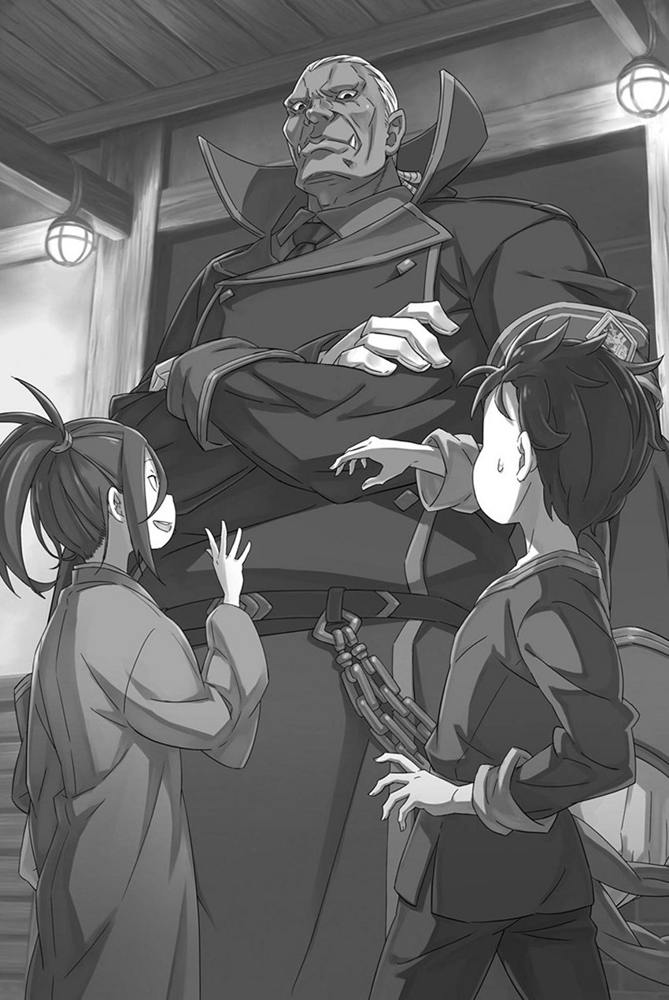

# 『孤岛的秩序』

------

Fandom Image

大只佬和两小只

翻译：绘名儿

校对：绘名儿

润色：宿星

仅供学习交流，严禁用于商业用途，详情见b站bot置顶公告

(bilibili.com)https://t.bilibili.com/569582671425064935?spm_id_from=333.999.0.0

动态-哔哩哔哩t.bilibili.com

动态-哔哩哔哩

T.BILIBILI.COM

※ ※ ※ ※ ※ ※ ※ ※ ※ ※ ※ ※ ※ ※ ※ ※

——不知道自己为什么会在这里，也不知道『九神将』是什么。

面对突然听到的炸弹发言，昴现在的头脑无法承受，被混乱的信息所吞噬。

比往身上泼冷水还强烈很多的冲击降落在昴身上，使他不由自主地眨了几下眼。

「这、这是什么意思？你说不知道自己为何出现在这里……」

「没有其他意思哦，就如同我刚刚所说那样。当我有意识的时候，就已经被扔在了剑奴孤岛上，事情前后的脉络和今后的展望目前我都不是很清楚。嘛，就这么说吧，这里对我来说是个比较适合居住的地方，所以住在这里对我来说算不上艰苦。」

「——」

「哦呀？又在想事情了吗？巴斯真是喜欢思考啊。不不，我觉得很好哦。我不怎么喜欢动脑筋，但不会嘲笑认真思考的人，也不会打扰他们。好，我这就闭嘴！」

在真正闭嘴之前塞西尔斯又话唠了好一阵子，不过总算是安静下来了。话虽如此，就算嘴是闭上了，他的双脚却仍在啪嗒啪嗒地走动着，在昴的视线中大幅度地晃来晃去。

他或许没有嘲笑的意思，但妨碍可一点都不少。

不过，昴并没有闲心去吐槽这些事情。而且就算吐槽的话，也得说些有用的。

比如——

「为什么连『九神将』是什么都不知道，却知道自己被叫作『青色雷光』？这不是很奇怪吗？」

「啊，这个问题的答案很简单。想出这个令人触电般激动的称号的人不是别人，正是我自己！佛拉基亚的『青色雷光』——塞西尔斯・赛格蒙特！你觉得如何呢？是一个让人感到既鲜明又优雅的名字吧！总有一天我会让这个名字响彻天下，创造一个谁都会因我这个主演而移不开视线的世界！这个名字就是我充满干劲的表现。」

「自己想出的……外号……」

虽然对方挺起胸膛回答了问题，但昴却失望地耷下肩膀。

面对这副样子的昴，塞西尔斯说「啊嘞嘞？怎么了嘛～？」他凝视着昴，看上去相当愉快。但是，昴却没有精神和气力去回答这个问题。

眼前的这个少年，是真的『塞西尔斯・赛格蒙特』还是假的，已经有了定论。

虽然有「很多成年人并不尊重小孩子」这种推测，但他自己竟然连『九神将』都不知道，这种推测完全不能推翻这个事实，

不管怎么说，真正的一将说自己不知道『九神将』这种事，实在无法让人相信。

「竟然不知道自己是帝国的将军，这也太荒唐了……」

用那种漏洞百出的说法来解释是无论如何也说不通的。

所以在昴心中，眼前的少年就是真正塞西尔斯的可能性已经消失了。他只是个胡闹过头、满嘴『狼来了』的孩子——假塞西尔斯。

于是，柳暗花明又一村的希望之线突然就这么断了。

若还有让昴能燃起希望的，那就是假塞西尔斯一直在说谎，他刚刚所说的关于这座岛的事情也是他的谎言……

「——原来你在这儿啊，赛格蒙特。」

「哇袄!?」

下一刻，正在思考的昴背后传来一个粗壮的男人声音，把他吓得跳了起来。

这个声音既不是假塞西尔斯的，当然也不属于还在沉睡的坦萨，这个声音是从治愈室的入口传来，这让昴更加害怕。

——伫立在治愈室入口的那个人影，是一个非常高的壮汉。

「好、大……！」

那个男人的身高到了让人叹为观止的地步。

不，不仅是身高，无论是纵向还是横向的体型都很厚实，整个身体都很硕大，这样解释才合适。他的脖子和手脚像原木一样壮实，身上穿的像是警察或军人一样，一身紧绷绷的黑色衣服，被他撑的几乎要涨开了。

这不是因为昴缩小的原因，而是他的确是一个高到让人不得不抬头仰望到脖子疼的大汉。

身高轻松超过两米，可能是昴在异世界见过的人中最高的。巨大的身躯之上有一张非常严肃的脸、即使闭上嘴也露出来的獠牙、蓝色的皮肤……属于他的特征太多了。

尽管如此，这还没有提到他最鲜明的特征。

这个明显的特征就是——

「嘿，你好，古斯塔夫先生！今天早上也是华丽的穿着啊！讲究仪容是绅士的基本，我觉得这是值得我学习的地方！」

「客气话就不用讲了，你跟以往一样健康比什么都好。像你这样的存在就应该在角斗场之中战斗至燃烧殆尽，一向秉持公正的我是如此判断的。」

说这些话的大个子——被称为古斯塔夫的人，一边对潇洒轻松的假塞西尔斯说的话深深叹了口气，一边用粗壮的『四只』胳膊抱臂作答。

没错，就是四只胳膊。

魁梧的身躯包裹着成块的肌肉，面孔宛如恶鬼，左右两肩各长出两条手臂，共有四臂。昴记得，一位认识的老爷爷曾说过，多臂族这种亚人便有这样的特征。

认识的、老爷爷……

「嗯……想起来了，是威尔海姆先生。」

昴就连回忆熟人的名字都要费一番功夫。

假塞西尔斯没在意一旁苦思冥想的昴，对古斯塔夫的话「哎呀」笑了一声；

「您对我的挂念令我甚是感动！我明白古斯塔夫先生的意思！正是如此，即使我死了也应该是在战场。岛主是个明辨是非的人真是太好了，我真是个幸运的男人！」

「公私混淆有碍秩序。本官没有做出那等愚行的道理。」

「嗯，嗯，知道了知道了！非常感谢古斯塔夫总督的照顾~！」

面对喋喋不休、双手合十的假塞西尔斯，古斯塔夫眯着他那双理智的眼睛。

那句『不会公私混淆』，微妙地让昴觉得，他私底下其实很讨厌假塞西尔斯。不过，追究这一点也没用。

终于有一个除了假塞西尔斯之外能与昴对话的人了。

「话说回来，赛格蒙特，那边那个少年。」

正好，古斯塔夫也注意到了昴，并将视线投向他。

被对方从很高的高度俯视着，仅仅是被看着昴就感到无法呼吸般包裹着全身的压迫感。并且他每个手的拳头都有孩子的头那般大，如果昴被它击中的话，恐怕会直接一击毙命。

昴不由得吞了口口水，假塞西尔斯却在旁边拍手起哄。

「是的是的，他终于醒过来了。因为他很担心跟他一起来的那个小姐所以我就把他带到这里了。只是在这里睡着的小姐看起来并不是他要找的人，所以事实与他的想法貌似产生了各种各样的分歧。承受着这样的打击，故事将从这里展开！事情就是这样子哦。」

「辛苦你说明了。不过，本官应该吩咐过，他一醒来就先带到本官这里。这正是本官准许这名少年与少女上岛的条件。」

「有这回事吗？对不起，我太健忘了。」

「……」

古斯塔夫面对若无其事作出回答的假塞西尔斯，默默地用手揉了揉自己的眉间。

然后这个比起昴他们离天空近得多的男人瞪着天花板，嘟嘟囔囔地自言自语：「本官是秩序的守卫者，不会做出公私不分之事……」

虽然不知道他和假塞西尔斯有什么关系，但他也因为假塞西尔斯而变得很辛苦。

明白了这一点，虽然这么做有点儿对不住对古斯塔夫，但昴还是松了一口气。

「被塞西折腾的原来不只是我一个人啊。」

「说我折腾真是出乎意料啊，不管是给巴斯解释你想知道的事，还是带你去见你想见的人，我都觉得我已经很配合了。」

「嗯，也是，是我多嘴了。但是你的解释废话连篇，我见到的人也不是我要找的，我想去的地方也去不了，对此我还是有些沮丧。」

假塞西尔斯应该没有恶意，所以说这些也没什么用。

听见昴这么说，假塞西尔斯不满地撅嘴「切」了一声。古斯塔夫似乎终于平复了对他的不满，重新看向昴。

然后——

「少年，既然醒了那就让我们好好聊聊吧。」

「如果能这么做的话我很高兴，我也想与其他人对话。而且对象是岛上的大人物，真是太棒了。」

「嗯？」

古斯塔夫看着注意措辞的昴，用右边的两只手摸了摸自己的下巴。

乍一看他的外表虽说非常狰狞，但其言行举止却非常沉稳，眼睛里也流露出理智的光芒，给人的印象就像是那个头发凌乱的兹克尔。

也就是说，这代表他是能够与之对话的成熟的人。

如同印证了昴所期待的那样，古斯塔夫庄重地深深点了点头，

「本官是——受神圣的佛拉基亚帝国第七十七代皇帝文森特・佛拉基亚皇帝阁下之托，管理这座岛的古斯塔夫・莫雷罗。你能告诉我你的名字和所属的立场吗？」

古斯塔夫礼貌地报上了自己的立场和名字，认真地与昴进行对峙。

这让昴倒吸了口寒气，然后把手放在自己的胸前，低头行了个礼。

「感谢您的自我介绍，我的名字是菜月……菜月・施瓦茨。」

「我了解了，施瓦茨吗。」

尽管被对方强大的气场所压迫，昴还是这样向古斯塔夫报上了名号。

本名还是假名，昴犹豫了一瞬，结果答得有些不伦不类。不过眼下，能说成这样就算不错了。

说实话，昴不知道向古斯塔夫撒谎究竟对不对。

不过，昴的真名在帝国传开绝非是什么好事。对于假塞西尔斯这个虚假的一将来说可能算不上什么大事，但也指不定有什么人十分了解王国的情况。

该隐瞒的就应该隐瞒。假塞西尔斯听到昴现在的化名后把头猛地一歪并且疑惑地「咦~？」了一声。

「但是，如果真的叫菜月・施瓦茨，为什么赛格蒙特却叫你巴斯？」

「塞西应该有他自己的道理。要问问他吗？」

「――。不，不用了。交给本官的职务，没有时间花在这些无益的尝试上。虽然本官并非智者，但却希望做事贤明。」

古斯塔夫摇摇头，做出了在昴看来也十分明智的决定。

若把这归功于假塞西尔斯平日的表现，总觉得不甘心，姑且就当是昴自己平时做人不错吧。

不管怎么说——

「能够答上来名字，身体看上去也没有什么不适。据治愈者说你的体力消耗很大，你感受得到吗？」

「体力……感觉稍微有点累吧。但是，嗯……非常感谢您的帮助以及为我做出的各种付出。」

「有一点本官需要纠正一下，施瓦茨。帮助你的不是本官，而是那里的赛格蒙特。说到底，本官允许你们上这座岛只是因为附加了条件。」

「这、这样啊。」

面对古斯塔夫条理分明的回答，昴开始有些语无伦次。

他说话的方式和内容没有考虑到对方，声调也是处于冷淡和无感情之间，不过还好他用的是简单易懂的纯粹说明。

与假塞西尔斯相比，发言量和信息量的匹配度高了许多。

刚才的问题，似乎也在关心醒来的昴的身体情况。照这样看来，好好解释，也许他能理解。

理解昴和坦萨，是阴差阳错才来到剑奴孤岛的。

「古斯塔夫先生，我和这个孩子……她叫坦萨，是因为不知道搞错了什么，发生了奇怪的事才来这里的。」

「搞错了什么，意思是？」

「――！这个……我也不清楚原因。只是，我们是在非常遥远的……您知道卡欧斯弗莱姆吧？我们本来应该在那个城市之中！」

据假塞西尔斯说，这座岛与魔都似乎相距甚远。

光凭这一点，应该就能让对方明白昴他们遭遇了异常事态——从魔都被送到这座岛，绝非寻常之事。

「承蒙你们救了命，还提这些要求，我也知道太得寸进尺了，可我们不能在这里久留。同伴一定在找我们！可以的话，想马上给他们报个平安，回去会合。」

如果可以的话，最理想的情况是能和坦萨一起离开这里。

虽说不知道自己和坦萨怎么会出现在这座岛上，但想必尤尔娜一定在为坦萨的消失而担心。埃布尔原本的目的就是为了把尤尔娜拉入伙，所以做出让她高兴的事，埃布尔也不会对昴生气。

而且，昴很喜欢尤尔娜，如果能够让那个温柔的女性感到高兴再好不过了。

「即使只是一秒，也必须要抓紧时间离开这座岛。」

「——够了，到此为止，施瓦茨。」

昴探身向前，声音正要拔高，一只巨大的手掌便拦住了他。两只右手竖在面前，逼得他「唔」地噎住了话。

古斯塔夫隔着右手，一边用左手同时抚摸着自己的下巴和头部，一边说到：

「本官理解你的主张，也大体掌握了你的处境。在此基础上，你也必须听听本官的话。这才是公平。」

「公平……」

「不错，公平。公正、严正、不偏不倚的准绳……这是构建秩序不可或缺的绝对道理。」

自己的主张被打断，而且又听到了一串语速缓慢的重复话语，昴对此皱起了眉头。

什么公平、公正……在时间紧迫得状况下来听这些话显得十分漫长。但在这里顶撞古斯塔夫也无济于事，总之昴先顺着他说的话点了点头。

古斯塔夫看了看昴的反应，闭上了一只眼睛说：「不错。」

「你还记得本官刚刚说过的话吗？帮助你的是赛格蒙特，本官允许你和她上岸是有条件的。」

「那个……是的，我记得，可是……」

仅关注到了自己受到了帮助这点，却忽视了「条件」这回事。的确，古斯塔夫用沉闷的声音对昴说过这件事。

但是，条件究竟是什么呢？允许昴和坦萨上这座岛的条件是？

「施瓦茨，你有恰当的判断能力与能够灵活运用的知识，对本官使用敬语也说明你受到过良好的教育。你的身体根据治愈者的诊断能够做出健康的评价，你自己也向我申报过身体并未出现不适症状。这些我都将记录为事实。你有异议吗？」

「虽然一下子听到了这么多事有些反应不过来……但大概，没有异议。」

「‘大概’吗，这样的陈述有点缺乏说服力。请说清楚究竟是‘有’还是‘没有’」

「――。没有……异议。」

从古斯塔夫的眼神中可以看出，他不允许昴做出模棱两可的答复。

被对方强大的气场所压倒，昴再次抬头看向古斯塔夫的脸，他的眼神和表情都没有变化，石像般的脸将昴的视线一下子反弹了回去。

他们的对话单方面地在古斯塔夫的主导下开始进行。

这使昴感到非常不安和讨厌，但他也一时想不出对策来。和之前一样，昴并没有得到有用的信息。也就是说，昴并没有其他的选项可选。

这时张口的人并不是昴——

「看吧看吧，我不是说过吗？巴斯正好符合古斯塔夫先生的预期。而且日程也赶得上，难道不是吗？」

「但是，那个少女还没有醒过来。」

「关于她的话我们可以这么做，这样，利用总督的权限可以对规定做出灵活的调整对吧？」

「没错，既然少女还没有醒来，那就先以比规定少一人的状态开始。」

「哎呀哎呀，我闯祸了吗?!」

抛开处于困惑之中的昴不管，与古斯塔夫交谈的是假塞西尔斯。

虽听不明白这场交涉的全貌，昴还是听出了两点：他们谈的是自己与坦萨的事，而假塞西尔斯并没能把事情谈妥。

而且昴也意识到了，为假塞西尔斯捅的篓子买单的人并不是假塞西尔斯本人。

「对不起，巴斯。看来我能帮到你的事也就到此为止了。接下来请你自己加油，我相信你一定能做到的！」

「等、等等、等等等等！你们的话太奇怪了！刚刚说的话是什么意思？古斯塔夫先生！把我们留在岛上的条件究竟是……」

「——参加『斯帕鲁卡』」

「斯帕……？」

一个陌生的单词落到了昴的头上使他愁眉不展。

既然说成「参加」，也就是说『斯帕鲁卡』应该是某种活动。在这座剑奴孤岛上举行的某种活动——心中只有不详的预感。

阿尔曾说过在剑奴孤岛上的生活是非常艰苦难熬的。

在这个地方举办的活动，总有种一定会经历一些可怕、痛苦之类事情的感觉。

「等一下、古斯塔夫先生！为什么我们必须要去参加斯帕鲁卡?!我们并不是自己主动来这个岛的！」

「俘虏、奴隶、罪犯……登上基奴海布的人各有处境，但几乎无人出于自愿。本官的职责，便是在这聚集了无法无天之徒的剑奴孤岛建立秩序，为实现阁下的意愿而尽职。」

「阁下……皇帝的、期待。」

「——将这座剑奴孤岛，改造成帝国最有意义的流血之地」

这是一个让刚刚还在顶撞的昴吓得浑身发冷的嗜杀宣言。

原本觉得古斯塔夫的瞳孔颜色和说话方式给他的感觉是「冰冷且不易动摇」，但这是错误的。如果要形容古斯塔夫的话，还有更合适的词语。

就像是，没错，就像是机器人那样的冷漠、冰冷。

这种印象的变化让昴倒吸一口凉气，古斯塔夫叫了一声吓僵了的昴：「施瓦茨」。

他一边低头看着和自己相比体格小得多的昴一边说：

「要称皇帝阁下。第一次提醒，第二次警告，不会有第三次。」

「……唔」

「另外，再次告知你，『斯帕鲁卡』是不允许拒绝参加的。如果你拒绝参加『斯帕鲁卡』的话，那就得和那个少女一起，走上你们原本的命运。」

「原本的命运，您的意思是？……」

「拒绝赛格蒙特的恳求，禁止你们登陆——也就是说，你们只会成为生活在湖水中得水栖魔兽的饵料。」

古斯塔夫干脆的回答毫不犹豫地扼杀了昴的其他选项。

这个大块头明确地告诉一个小孩子，如果拒绝就只有死。这就是他冷漠到无血无泪的做法。即使变成了孩子，伴随周围的也净是些痛苦遭遇，真想诅咒自己的霉运。

正常情况下，对待小孩子不应该温柔些吗？

还是说，在强者为尊的佛拉基亚帝国，因为弱小而被一个接一个杀害的即使是孩子，人们也能坦然地遵循其道呢？

「如果是这样的话，这种国家还是毁灭吧……」

「虽然意图不明，但本官原谅你的咒骂。封锁一切言论的话就会积攒不满。愚蠢行为的萌芽，就是把不满作为苗床，把反感当作水来培育出来的。」

古斯塔夫缓缓地摇摇头，然后抓住了昴的肩膀。

面对那只可以轻松抓住自己脑袋的手掌，昴无法抗拒，虽然也想过干脆强行抵抗从而逃离这里。

「我不推荐你这样做哦，巴斯。或许这会造成更遭的结果。当然与其说这是我的一片好心，倒不如说是我觉得你这么做太无趣了，所以我极不推荐你这么做。」

「真是谢谢你能说出感受，给我去死吧，塞西」

「哇，明明救了您，却被骂得这么惨。不过，巴斯想这么说的心情，我也不是不能理解，所以不会生气哦。」

不经意间入口就被假塞西尔斯堵住了，昴因此失去了最后的抵抗心理。

最终，现在假塞西尔斯是敌是友还不得而知、虽然试着用脏话对假塞西尔斯发泄对目前所处境况的愤懑，但他的反应却轻浮的跟没事一样。

总之，昴要被派去参加这个叫『斯帕鲁卡』的无聊活动。

如果拒绝就会被当作鱼的饵料，如果顺从的话——

「如果你能证明拥有资格，本官将以总督的身份负责接手你做剑奴之事。」

「……那可太棒了」

就算成功了也只是当奴隶，如果失败了就被喂鱼。

之前说过自从缩小了以后一次好事也没发生过，现在更正一下吧。

——自从来到这个佛拉基亚帝国，就没有发生过一件好事。

「……佛拉基亚帝国，讨厌死了。」

昴满怀怨恨的低语，轻微、安静而细弱，仿佛还顾忌着仍在沉睡的坦萨。

然后——

※ ※ ※ ※ ※ ※ ※ ※ ※ ※ ※ ※ ※ ※ ※ ※ ※ ※ ※ ※ ※ ※ ※

——全身都能感受到将会场包围的热烈气氛。

令人毛骨悚然的是，尽管投来的视线数量众多，但几乎没有喧闹声。

不知该称之为无声的兴奋，还是疯狂——他头一次觉得，寂静竟也如此喧嚣。

不过，昴并没有多余的时间对此感到愤怒或抱怨。

「可恶，可恶……开什么玩笑，糟透了……！」

「能做到的，我一定能做到……」

「都闭嘴！你们老实听我的指挥！这样才不用死！」

划破这嘈杂般寂静的，是紧挨着昴的三个男人。

他们分别是拥有岩石般皮肤的蜥蜴人和身上刻着很多刺青的秃头男子，以及留着长长的铁锈色头发，五官端正的青年。

他们的出身与种族各不相同，却有一个共同点。

那就是他们都忽视了昴，还有都散发出命悬一线的紧张感。

这样下去的话，虽然他们的生日不同，但忌日肯定会是同一天了。

「——诸位，恭喜大家能够登上这座岛。身处帝都的文森特・佛拉基亚皇帝阁下想必一定也为你们感到高兴。本官作为由皇帝阁下钦点受任管理剑奴孤岛的总督，将在此给予诸位光荣的考验。」

如此高调宣言的，是从高墙上的特等席俯瞰角斗场的古斯塔夫・莫雷罗——剑奴孤岛基奴海布的总督，掌管这片土地的人物。

然后，古斯塔夫的脚下——送战士去往角斗场的通道栅栏打开后，从里面的黑暗中慢慢地，慢慢地，有着可怕异形的怪兽浮现了出来。

这玩意儿长着一张狮子的脸、眼睛是红色的，有着像鹿一样的四根蹄子，头上长着扭曲的犄角，嘴上露出凶猛的獠牙，身体后端拖着可怕的长尾巴。与其巨大的身躯相比，连古斯塔夫这样的大汉都显得很渺小。

它口吐着唾沫咆哮着，这只魔兽正呼啸而来——不对，这里叫剑斗兽，是可怕的敌人。

这正是昴和其他三人必须面对的对手——

「——请各位在此证明皇帝阁下所期望的，作为强韧帝国民的实力吧！」

——这头怪物，正是那场名为『斯帕鲁卡』、决定能否成为剑奴的野蛮试炼的考官。

