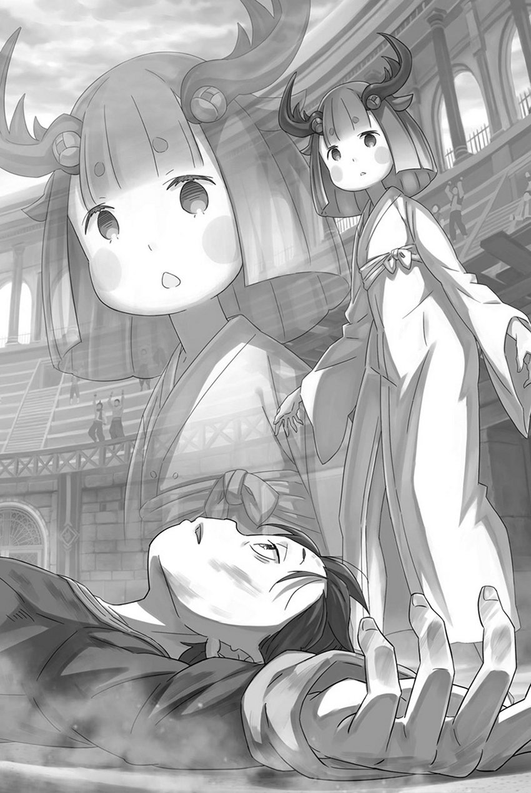

# 『魔法般的话语』

------

『恶毒翁』奥尔巴特・邓克尔肯留下的，那令人厌恶的忍术原理——

这是一种通过干涉他人的欧德，使其身体大幅度逆时生长、令其『幼儿化』的忍术。

这世上的生物，都不过是让欧德由无化有的容器。欧德的形态不同，适合它的容器大小与形状也各不相同。

因此，容纳它的生物千姿百态，各自拥有独一无二的生命。

如果这个原理正确的话，那么肉体只是充当欧德的容器，因此通过改变欧德的形状就可以自由改变容器的形状。

通过将欧德压缩，甚至能够将作为其容物的肉体随之缩小——。

「不过，说真的，咱也不明白忍的那些前辈怎么就想出了这种法子。还有那种把身体锻炼到濒死的修行，谁知道他们怎么判断快死了没有，不吓人吗？」

「所以说，忍就是这么回事。打算当忍的那一刻，就踏上了修罗道，一路踩着堆积如山的尸体往前走呗。」

「那么多术法，不拿命去试，哪能记进秘传书里？咱的杀手锏……几十种里头的一种罢了，也一样啊。」

「不过，那术的效果和带来的影响差得挺远，有意思吧？咱还以为只是人缩小了，谁知道连脑子里头都跟着变年轻了。」

「可惜，咱也不懂里头的道理。毕竟是硬去摆弄欧德嘛。就像身体会跟着欧德缩小一样，心也跟着欧德变了呗？」

「反正这术很少用，中招的家伙多半又非杀不可，咱也没想过特意弄清原因。身体连带脑子一块儿缩小，杀起来更省事，这不是什么都替咱考虑周到了？」

「不过嘛，偶尔也有打小就下定了决心的家伙！碰上这种人，光让脑子变小也指望不了什么。——啊，还有。」

「……」

「……没，没什么。总之，这术在忍的术法里也算有趣的，咱挺喜欢。敌人弱点，办什么事不都省心些？」

※ ※ ※ ※ ※ ※ ※ ※ ※ ※ ※ ※ ※ ※ ※ ※ ※ ※ ※ ※ ※ ※ ※

——愤怒，冲上头的愤怒，燃烧着昴的灵魂。

此时的他心中既有恐惧、又有紧张，也有不安。

数不清的、能够想到的所有消极的感情，几乎都塞在了他的心中。

但，这股炽热的怒火仿佛要把那些消极的感情全部燃烧，将其一个个仔细叠起来一个也不放过地燃烧殆尽。

「可恶！可恶！为什么我会沦落到这种地步……！」

吵死了，笨蛋。这样的丧气话，谁会听啊。

「我已经说过了吧。我是名战士。比你们这帮乌合之众要熟练的多。」

吵死了，笨蛋。你在撒谎，你爱逞强，这些早就露馅了。

「我说过，没打算把性命交到别人手里……」

吵死了，笨蛋。你以为自己一个人就能挺过去吗？好好看看周围啊。

——对，好好的看看周围，所有的，能够利用的东西。

「维茨，接好！拿着这把剑的人会被狮子盯上！」

昴抓住剑的瞬间，黑色狮子伴着响彻剑斗场的咆哮，猛然奔了起来。

昴已经知道它的目标是自己——不，是拿着剑的猎物。所以，他把插在地上的剑抽出来，直接扔给了还在傻站着的维茨。

起初，昴抢先冲出去时，三个人全都惊得愣在原地。

在这凝固了的三人中，只有在最后一刻清醒过来的刺青男子——维茨，是完美接过昴扔向他的剑的。

「小，小子……！」

维茨看到盘旋飞来的利剑插在了自己脚边，立即抓起剑柄拔了出来。

不过，他也理解了昴刚刚所说的话。所以，与其说那把剑是打败狮子的关键，不如说是让狮子改变目标的标志。

问题是——

「剑，把剑给我！我要把那只剑斗兽……」

接着缓过神来的锈发男想要从旁边一把夺过维茨手中的剑。

满脑子都是紧张和恐惧的锈发男此刻失去了冷静判断的能力。如果这两人就这样一直互相争夺这把剑的话，两人最终全都会成为狮子前爪的牺牲品。

所以，在事情发展到那个地步之前要尽快阻止他们。

「赫莱茵！看后面！！」

「后，后面……?!」

就在锈发男要扑上去抓住维茨的前一刻，昴喊出了置身事外的蜥蜴人——赫莱茵的名字，警告他身后有迫在眉睫的危险。

三人中最胆小的他听到了昴的话惊慌失措地回头看，想要确定自己将被什么所袭击。

但是，身后什么都没有。昴只是想让他转身。

当赫莱茵胆战心惊，身体僵硬地回头看的时候，

「哇袄！」

赫莱茵绷得笔直的尾巴从侧面扫中了锈发男的肋下。猝不及防的锈发男摔了出去，维茨手中的剑总算没有被抢走。

维茨因此来得及摆好架势，而将目标从昴转向他的狮子，也朝他扑了过来。

「快蹲下来！」

「切！」

维茨听到昴的声音后蹲了下来，与此同时狮子咬向了他的正上方。维茨扭曲着他那满是刺青的脸，钻到它的肚子下面，在狮子发动下一击之前把剑丢了出来。

他随手轻轻一抛，剑便落进了下意识伸手的赫莱茵怀里。

「嗯？」

「……」

「哇、哇啊啊啊啊啊啊啊——！！」

自然，狮子将矛头转向了反应迟钝的赫莱茵。

完全不了解情况的赫莱茵抱着剑背对狮子，以迅雷不及掩耳之势与狮子拉开了距离。

狮子毫不留情地紧追不舍，接连发动攻击。

「趁现在，我……！」

在维茨和赫莱茵创造的这个机会之中，昴跑到了剑斗场的墙边。在他视线前方，有一个安装在墙上的小把手——拉杆一样的东西。

乍一看，剑斗场上只有着插在地面上的两把剑，但如果仔细观察的话，就会发现这里还隐藏着这样的操纵杆。

「拉了这个，会发生什么呢！」

幼年昴扑向比他身高还要高的拉杆，将其使劲拉下来。被昴的体重拉下来的拉杆下降时，传来了沉重的声音。

齿轮啮合在一起，有什么东西开始咯吱咯吱地运动起来，脚下开始感到震动，感觉像是某种机械的东西在剑斗场正下方开始运转了。

就在机关触发时，昴回头查看剑斗场的情况——

「哇、哇啊啊啊啊啊啊啊——！！」

下一刻，伴随着巨大声响从地面升起的铁栅栏将剑斗场一分为二。

它如同墙壁一样，将圆形的剑斗场正好分割为两个半圆。如果能够好好利用的话，可以将狮子赶到墙的另一边。

但是——

「……」

但这一次，昴把它给赶错方向了。

狮子就位于升起来的栅栏跟前，栅栏的存在反而缩小了昴逃跑的空间。猎场缩小一半，相当于狮子的体型增大了一倍，它那张沾满鲜血的嘴巴里还叼着赫莱茵的尸骸。

「呃啊——」

不仅如此，锈发男惨叫着从狮子脚下翻滚过去。

栅栏升起时，他似乎恰好在正上方。因此被掀飞的他，不幸落到了狮子和昴所在的这一侧。

相反，在栅栏的另一边，毫发无损的维茨呆呆地看着这一幕。

「别、别过……！」

狮子抬起前爪，毫不留情地踩断了倒地的锈发男的脖子。

冰块碎裂般的声音响起，锈发男的惨叫戛然而止。狮子越不过身后的栅栏，便将目光转向了昴。

眼前的狮子微微屈身蓄势待发，让昴汗毛直竖。

虽然剑在栅栏对面的维茨那里，但如果攻击不到自己的话，狮子似乎不会认为他有威胁性。

所以，它猛然冲向了昴。

「施瓦茨！！」

维茨喊叫着，每次在昴临危之际，维茨都会叫出昴的名字。

当然，是在他没有先死的时候。

昴也将这一点记在了心里——

「——再来！」

剑斗兽挥起利爪朝着怒吼着的昴的胸口刺去。

不到一秒，昴的身体就像被闪电击中一般，瞬间被拍成两半，意识灰飞烟灭——

※ ※ ※ ※ ※ ※ ※ ※ ※ ※ ※ ※ ※ ※ ※ ※ ※ ※ ※ ※ ※ ※ ※

「伊德拉！栅栏要撑不住了！你那边剑怎么样了!?」

「拔不出来！太重了！根本不可能移动的了！！」

遭到猛烈撞击的铁栅栏严重变形，狮子正把身体硬挤到这边来。

听说即使是人，只要头能通过，一般狭窄的地方都能通过。虽然外形大不相同，但脸部感觉像是猫科动物的剑斗兽，可能会更容易穿过去。

在警惕着狮子、紧咬着后槽牙的昴身后，锈发男——伊德拉拼命想要拔出扎在地上的大剑，但无论多么用力，大剑仍插在地面之中纹丝不动。

在这剑斗场上四处寻找最终也只找到了两种东西——能够操控栅栏升起来的拉杆以及大小不同的两把剑。接下来就只剩靠货真价实的实力来取胜的决战了吗？

「少年！我该怎么办!?」

「不要害怕！你不是你那伟大父亲的继承人吗！？」

「没、没错！我才不害怕！」

伊德拉的声音变有些颤颤巍巍，但昴的话使他重新振奋起来。

伊德拉不是战士。他流落到剑奴孤岛是因为还不起债而沦为奴隶。

但是，他借钱的理由是为了守护父亲的家业将其继承下去。

伊德拉虽然不是战士，但他想做一个无愧于父亲的人，这才是他的本意。

「哦哦，哦哦哦!!」

这个没有什么才能的磨坊主之子，将体重压在大剑上，试图把它扳斜拔出。昴也跑到伊德拉身边，同样把自己的体重压了上去。

狮子正从栅栏对面一点点挤过来，而它身后，早已被杀的维茨与赫莱茵的尸体横陈在地。

已经几乎看不到任何胜算了——即便如此，伊德拉也没有抛弃昴独自逃跑。这是第一次他这么做。

「——！！」

「伊德拉，它来了！」

「我知道！」

铁栅栏由于狮子的破坏发出巨大声响，终于它挣出栅栏闯进了这边。

它长满黑色体毛的皮肤即使被破碎的栅栏划伤也不觉得痛，不，准确说是把这种疼痛归咎于昴这边，让这只狮子更有干劲地冲了过去。

「可恶……」

好不容易才从地上拔出剑尖的大剑，伊德拉又立刻硬将其扛了起来。昴从下面把手放在剑的前端顶着，用杠杆原理稍微帮助伊德拉去挥动这把剑。

如果昴把剑的前端从下面往上一推，应该会让伊德拉更轻松的去挥动它。

如果那把剑能砍中狮子。

「上——啊啊啊啊——！！」

「哦哦——！！」

昴和伊德拉合力挥剑，瞄准扑面而来的狮子的脸。

伊德拉以像是将背上的东西全部投出的气势一般将大剑向前挥动，在奇迹般的时机，稳稳地瞄准了狮子的头部。

然而——

「啊——」

这意图再明显不过的一击，被剑斗兽的利爪无情地弹开。它顺势撞了过来，将昴和伊德拉一起撞飞。

两人在空中纠缠成一团，又亲亲密密地一同撞上剑斗场的墙壁，化作再也分不清彼此的一团。

「咳。」

两人的血迹沾满了墙壁，无法区分——

「再……来……」

※ ※ ※ ※ ※ ※ ※ ※ ※ ※ ※ ※ ※ ※ ※ ※ ※ ※ ※ ※ ※ ※ ※

——愤怒，冲上头的愤怒，燃烧着昴的灵魂。

「其实我是因为吃不上饭而偷东西……只是想让你们觉得我是个危险的对象，也许这样就可以避免死亡……」

抚摸着满是刺青、几乎看不到原本肤色的皮肤，维茨如是说道。

这似乎是在为虚张声势的事道歉，但昴认为这是维茨在最后关头敞开心扉的证明。

「反正你们也想拿我当诱饵然后逃跑吧！ 我……我再也不会被利用了！我已经受够被利用的滋味了!!」

赫莱茵转动着自卑的眼睛，哭诉般的对昴他们说道。

改变鳞片颜色这种能够先隐藏自己再逃跑的能力，想必以前的同伴们早已知晓。总是被强迫做最危险的任务，最后被同伴随意地当作诱饵，沦为了奴隶。

这种胆怯，是身边的人助长的，并不是赫莱茵的错。

「我被信任的人骗了，家业被夺走，最后还沦为了奴隶。如果老实过活只会吃亏，那至少，最后剩下的我自己……！」

委屈和羞愧交织着，伊德拉咬破了嘴唇，如此哀叹道。

他不习惯说谎，也没法把谎圆到底。光是因为被带到剑奴孤岛，就自称战士，这谎话也实在太不顾后果了。

迟早都会暴露，果不其然，昴很快就将其发现了，虽然这是昴通过『作弊』得来的结论。

通过与卑鄙者、懦夫和骗子合作，在这『斯帕鲁卡』中生存下去——

「再来……！」「再来！」「再来！」「下次一定可以做到！」「再来一次……」「下次一定能……！」「下次可以的……！」「再来！」「下次的话……」「下次绝对——」「再来啊啊啊!!」

为了生存，却需要不断积累『死亡』，矛盾感正在不断叠加。

疼痛、痛苦、恐惧、艰难、想放手、想哭出来、想叫出来、想吼出来、想哀叹、想呼唤、想撒手、想拒绝、想懊悔、想放弃、不能放弃

将一种种可能性逐一排除。

从无穷无尽的可能性里，把那些通向死胡同的路一条条排除，排除，排除，排除，排除。

再将小小的身体挤向尽头那条尚未发现的生路。

维茨死了，赫莱茵死了，伊德拉死了。

当然，昴也死了同样的次数，但他还是抬起头来往前走。

「巴斯，你现在还有什么话要对跟你一起上岛的孩子说的吗？」

「再来——！！」

昴朝那不识趣的声音怒吼回去。即使全身承受着袭来的利爪，承受着『死亡』，菜月昴依然没有放弃。

因为，因为，因为——

「我不会认输的。」

——他丝毫不觉得自己会输。

※ ※ ※ ※ ※ ※ ※ ※ ※ ※ ※ ※ ※ ※ ※ ※ ※ ※ ※ ※ ※ ※ ※

「哦？你问咱刚才有什么话没说完？啧，眼睛真尖啊。」

「就是刚才说的，变小了也难对付的家伙啊。碰上从小就有同样觉悟的人，脑子变小的效果就得打个对折。当然，身体还是变小了的，杀起来确实更容易。」

「——可咱是说万一啊。万一有个家伙，偏偏是身体和脑子都还小的时候最厉害，你说对他用了这术，会怎么样？」

「啊，懂，咱懂。咱也一点儿不觉得真有这种人。可咱是个特别悲观的老头子啊。就是因为老想着最坏的情况，才知道怎么给别人添最恶心的堵，对吧？」

「所以，咱能想到这术被人反过来利用的最坏情况，就是这个。缩小了反而更可怕的家伙，这种人才吓人。」

「不光咱，谁上了年纪，不都得学着放弃点什么、妥协点什么？要是这些东西突然从一个人身上全没了，你说会怎样？」

「——真不吓人吗？」

※ ※ ※ ※ ※ ※ ※ ※ ※ ※ ※ ※ ※ ※ ※ ※ ※ ※ ※ ※ ※ ※ ※

「再来！」

这个结果过于讽刺了——

『恶毒翁』奥尔巴特・邓克尔肯『幼儿化』忍术所招致的危害，使菜月昴不仅身体变得幼小，甚至连仅有的智慧也都被削弱了。

逐渐丧失的知识和记忆将昴重新塑造成一个瘦小且脆弱的少年。

这个术的目的在于无论是肉体上还是精神上，都要将其带来的威胁消除掉。

对于为达目的不择手段的忍而言，这确实称得上相称的秘术。

事实上，昴的记忆正如片片剥落般逐渐淡去，那些珍爱的面容也越来越遥远。

就这样，菜月昴回到了与他外表相符的，十岁左右的幼童时期。

十岁左右——回到了曾经，菜月昴被称为『神童』的时代。

「再来！」

曾经，菜月昴是『神童』。

实际上，他是否真有足以被称为天才儿童的才华，并不重要。重要的是，昴本人确实如此肯定着自己。

小时候的菜月昴自信满满，坚信自己无所不能，毫不怀疑自己。

他带领着身边的孩子们，坚信即便是星空，自己也能伸手触及。

「再来！」

随着年龄增长，昴的这种自我肯定感在现实中一点点被磨损，最终失去了它。

无论做什么都能拿第一的日子一去不返。留给昴的已不再是无所不能的自信，只有无力与焦躁，闪耀的群星也隐入了阴云。

菜月昴个子越长越高，自信却渐渐消退。

「再来！」

突然闯入异世界的那一天，正是昴最能感受到失去自我肯定感的时刻。

此后的相遇、经历、交谈与行动，让新的愿望渐渐包裹了菜月昴，也让他终于能认可自己，觉得自己的努力也还不错。

即便如此，那颗叹息着仍然不够的心，却一直都在。

「再来！」

现在，菜月昴在那段时间成长中所得到的、所失去的，都将消失。

随着身体上的幼龄化，精神上的退缩，人本应变得更为软弱。昴在身体上确是如此——变得瘦弱了。但是，精神上又如何呢？

「再来！」

曾经，菜月昴是『神童』。

他不知道失败，不知道放弃，不知道梦想也会落空、努力也会够不到；不知道为无能为力而懊恼，不知道面对绝路而叹息，也不知道赌气撒手不干。

只是满不在乎的、没有道理地相信着自己的无所不能。

他就是那样一个少年，天不怕地不怕地相信，自己便是世界的中心，是世界的主宰。

而支撑着这样的菜月昴的，是一句魔法般的话语——

『——果然是那个人的孩子啊。』

这句话给昴注入了无穷的力量，解开了年幼的菜月昴心中的枷锁。

比恐惧更强烈的是恼恨，比疼痛更强烈的是不甘。比起哭，他更想笑。

在这个他极其讨厌的国家，和这些并没有什么羁绊的伙伴们齐心协力，为了回到自己喜欢的人们所等待的地方，自己到底在犹豫什么呢？

所以，在这个时候，菜月昴他——

「再来——！！」

将以被召唤到这个世界以来的最强姿态，蹂躏那个基奴海布。

※ ※ ※ ※ ※ ※ ※ ※ ※ ※ ※ ※ ※ ※ ※ ※ ※ ※ ※ ※ ※ ※ ※

「……」

无论是谁看到这样的场面都会失声。

原本身为岛主的古斯塔夫・莫雷罗为了营造『斯帕鲁卡』安静的观战氛围，命令这些剑奴们不能喧闹。

所以，异样的宁静笼罩着剑斗场可以说是某种必然。

但此时的寂静与沉默，并不仅仅是因为古斯塔夫的命令。

即使没有古斯塔夫的指示，也没人会在这时说话，因为他们被场上的鬼气压倒了。

「维茨！伊德拉！左右散开！赫莱茵，我知道你很害怕，但别逃跑！捡起剑，吸引它的注意然后扔出去！」

剑斗兽基尔提拉乌发出凶猛的低吼，在剑斗场里横冲直撞。

这只被折断角、专为『斯帕鲁卡』驯养的野兽，失去了野性的无拘无束，取而代之的，是被牢牢教会了如何判断剑奴这些人类的威胁程度。

因此，它率先瞄准持有武器的对手，排除危险性。

不过，它有一味重复这种攻击方式的毛病。可以想见，只要『合』的成员相互传递武器，就能不断转移它的目标。

不过，由于起初没看透这一点从而遭遇全军覆没的『合』也并不少见。

也可以说能够看透这点就证明有着一定的能力。

然而即便如此，这次的情况也实属罕见。

「哈哈哈！太棒了太棒了！已经相当努力了不是吗，巴斯！」

在所有人都失声的情况下，只有一个男孩在拍手为他们欢呼。

他将长长的青色头发扎在脑后，用笑容装点出可爱的容貌。少年连古斯塔夫的嘱咐也装作不知道，对在剑斗场顽强战斗的『合』给予声援。

虽然不知道他的声援是否有效果，但在千钧一发之际躲开了剑斗兽攻击的四人，正挑战着『斯帕鲁卡』，继续着殊死的战斗。

他们并没有发动能够决定胜负的攻击，从某种意义上说，这是一场无聊的死对峙。

可是，这些人每次眼看着就要被杀死却又能逃出生天，和能够让他们做到这些事在不停指挥的少年，绝不会让人觉得这场对峙很无聊。

按照少年的指示，三个男人也是拼命行动。

当然，他们有不听少年指示的自由。但是，既然少年的指示多次从剑斗兽手中拯救了他们的生命，不知不觉间那份自由也被封印掉。

就这样，『合』以这位年幼的少年为中心，像是一个人一样形成了完美合作。

即便如此，他们仍然只能一味防守，是因为战力差距大到令人绝望，还是说——

「——难道，他们在谋划什么？」

俯视战局的剑奴们心中，同样的期待正燃成火焰。

※ ※ ※ ※ ※ ※ ※ ※ ※ ※ ※ ※ ※ ※ ※ ※ ※ ※ ※ ※ ※ ※ ※

——愤怒，冲上头的愤怒，燃烧着昴的灵魂。

『死亡』堆积如山，全身被一层痛苦和恐惧笼罩，手、脚、内脏都蜷缩着。闭上眼睛，脑海中浮现出无数次近距离看到的狮子脸、獠牙和被它吞噬的黑暗。

深不见底的恐怖向他袭来。但和这感情一起涌出的——是愤怒。

那份不甘重新鼓动起畏缩的脏腑与手脚，菜月昴睁开了眼睛。

为了能够一点点地接近胜利，再次尝试这个已经尝试过无数次的挑战。

为了向自己证明，我不会输。

「赫莱茵！把剑扔给维茨，然后去伊德拉那里！」

「可恶！真是莫名其妙！！」

匍匐在地上以极快速度奔跑的赫莱茵，把手中的剑扔给了维茨。他保持加速终于跑到了站在大剑那里的伊德拉那边。

维茨险险接住在空中打转的剑。昴正要指示他接下来如何躲避，却蓦地睁大了眼睛。

「……」

狮子吼叫着，刚才还追着赫莱茵奔跑的脚步，此刻恰好停在将圆形剑斗场一分为二的中线另一侧。

与此同时，同伴们全都处在中线靠近昴的这一侧。

这是挑战『斯帕鲁卡』以来，第一次全员都活着，而且站在了理想的位置上。

「维茨，准备好！伊德拉和赫莱茵也是！」

昴以喉咙吐血般的气势将任务抛给了三人。

也许昴并没有很完美的做出指示，但维茨还是拿起小剑和狮子正面对峙，伊德拉和赫莱茵也慌忙扑向大剑。

而昴也是使出吃奶的力气朝着墙壁跑去。

「——！！」

一步、两步，在他以令人焦急的速度奔跑的同时，狮子在后面咆哮着。

就这样，狮子以爆炸般的气势从地面蹬起，向手握利剑的维茨冲了过去。

它笔直地冲了过来。维茨虽然举着剑，却根本挡不住那样的冲势。一撞就会死。这一点，昴再清楚不过。

但这些人中只有维茨有胆量和狮子对峙到最后一刻。

「啊，啊啊啊啊——！！」

狮子那张臭气熏天地嘴、长着利剑般獠牙的嘴，多次咬碎昴和其他三人的嘴，正朝着举着剑摆好架势的维茨冲去。

就在维茨的生命即将被其夺走之际。

「去吧——！！」

指尖勾住拉杆的瞬间，昴便用上轻小身体的全部重量，将它猛地拉下。

紧接着，齿轮转动的声响从脚下传来，猛然升起的铁栅栏从正下方重击狮子的脸。撞击直抵下颌，硬生生将它张开的嘴顶得合拢。

飞奔中的狮子就这样撞向了铁栅栏，维茨直到最后一刻终于把敌人吸引过来，面对巨大的冲击波，维茨不禁「哇?!」了一声然后被冲击波震飞。

铁栅栏被冲击压扁，狮子的头从弯曲的栅栏中挤到昴这边。面部受到重击的狮子前脚挠地，似乎要振作起来再次攻击将铁栅栏击破。

但是，昴不会让它得逞。

「伊德拉！赫莱茵！」

「哦哦，哦哦哦！——」

「惹啊啊啊啊！！」

伊德拉和赫莱茵跑向铁栅栏，顶替被震飞的维茨，这两个人手里握着的是一把非常重的大剑。

这把武器仅凭一个人谁也无法使用，但，并没有规定说必须单独去使用它。

也没有规定不能两人一同扛起它砍向不能动弹的敌人。

「……」

两人合力拼尽全力的一剑，从正上方落向狮子探出铁栅栏的脖颈。大剑深深砍入粗壮的兽颈，狮子的惨叫回荡在天空中。

鲜血喷涌，狮子仿佛要拒绝死亡一般拼命挣扎。

「去死吧，去死吧，去死吧，去死吧!!」

「给我结束吧——!!」

赫莱茵和伊德拉嚎哭一般喊叫着用尽全部的力气使在大剑上，让刀片更深地埋在狮子的脖子中。若是保持这种气势直到斩下狮子头颅，那么大家期待已久的胜利时刻就会到来。

多少次，多少次，他们都死在那利爪与獠牙之下——

「 ------！」

「啊?!」

「你们两个!?」

只差一步就能砍下那颗巨大的头颅，但是，狮子也一样不想被杀死。

大剑还嵌在颈中，狮子却强行扭转身体，将右前爪拖到了栅栏这一侧。那只前爪横扫过抓着大剑的两人。

只听两人发出一声惨叫，赫莱茵和伊德拉摔在地上向远处滚去。

不知道这一击使两人受了多深的伤。

不过，此时扑向那把大剑比扑向倒下的那两人更重要。

「我会让你跑掉吗！」

事已至此，昴不会让这只狮子趁虚而逃，他立刻扑向大剑剑柄那里。但他太轻了。对于现在的昴来说自己的体重太轻了，无法代替赫莱茵和伊德拉两个人。

大剑只又嵌入了些许，狮子便仿佛报复一般挥起前爪。

和刚才的两个人一样，即将被前足拍中的昴也要——

「休想得逞，你这畜生……！」

一把剑挥落，将那只前爪钉在了地上。

刺下剑的，是刚才被冲击波震飞的维茨。咬紧牙关，面部刺青扭曲着的维茨用尽全力，用剑封锁住狮子的前足。

然后——

「在这里睡觉，还配得上战士之名吗！」

「给我去死吧，混蛋！」

重新站起来的赫莱茵和伊德拉二人，扑向悬挂着昴的那把大剑。

三人份——两人和半人份左右的力量使大剑深剜进狮子的脖子。维茨也用小剑封锁住它的前足，『合』的四人齐心协力欲斩狮首。

狮子咆哮着大幅度扭动着它的身躯，铁栅栏因为激烈地晃动而吱吱作响。

对昴他们来说没有比现在更好的机会取胜了。不能输、不想输、绝不认输，昴咬紧牙关，拼命抱住大剑。

即便如此——

「……」

「呃啊啊啊——！！」

狮子拼命摇头，用巨大的头颅将昴他们甩飞。

狮子将这些抱住大剑的人甩下来，三个人——不，包括维茨在内，四个人都咕噜咕噜滚落在地上。

正如字面意思那样，此时的昴已经用尽了全力，连手都抬不起来了。

「我必……须要站起来……」

必须要站起来，必须再一次扑向那把大剑，将狮子斩首。

明明脑子里这么想，身体却不听他使唤。不仅是昴，其余三人似乎也是一样的情况。

已经战斗了这么久，到头来最精神的还是狮子。

「……」

大剑仍嵌在脖颈里，几乎深入了一半，狮子发出低沉的咆哮。

它的声音与其说是微弱，不如说是把怒气积累到了极限。当然，昴他们的攻击是有效的，但并没有达到让这只狮子力竭的地步。

「可恶……」

一次又一次地拼尽全力，明明这次只有一步之遥了。

还是没能做到，明明是用尽所有能想到的办法才走到这一步的。

所以，接下来他不会输。

「下、次……」

昴发誓，一定要更早地到达同样的节点。

狮子根本不顾昴发了什么誓，只是挣脱铁栅栏用它那只未受伤的前足朝着昴拍去——

「失礼了。」

下一秒，狮子粗壮的头颅被一击斩飞。

「啊？」

眼看着死亡即将到临的昴，呆呆地瞪着死去的敌人。

被砍的头颅落在地上发出巨大声响，慢慢地，狮子的身体也横倒在地。造成这样结果的，是深深扎在狮子脖子上的那把大剑。

像是突然袭击一样，天上掉下来一个小影子踩着大剑一下将其推了进去。

于是，狮子的头颅被砍飞了。

而完成这一击的人是——

「那个……我怎么会在这样的地方呢？」

只见平时那张没什么表情，现在却挂着一副为难样子的少女——坦萨站在那里。

面对脱下和服只着汗衫的少女抛来的疑问，昴微微叹了口气。

他什么也回答不出来。不过转头一看，除了昴的其他三个人，似乎也都死里逃生，各自捡回了一条命。

也就是说——

「到此为止！恭喜你们在『斯帕鲁卡』中成功生存下来!!以本官的权限，将接受诸位成为剑奴孤岛的一员！」

响亮、雄厚的声音高亢地响起，古斯塔夫宣布这场战斗的结束。

顿时，原本应该静静注视着战斗的观众们——不，剑奴们都站了起来，齐声为昴他们的胜利欢呼叫好。

「干得好！」

「真了不起！」

「挺能干的嘛，小家伙!!」

在这些激动的呼声中，古斯塔夫四臂交叉，一言不发。

昴在欢呼声中，猛然瘫倒在地。战战兢兢靠近的坦萨盯着昴那张脸。

「对不起，你是……」

「菜月・施瓦茨。」

「欸？」

原本就有圆滚滚眼睛的坦萨，此时眼睛瞪得更圆了，昴躺在地上对着一脸惊讶的她长长叹出一口气，接着说：

「首先，我叫菜月・施瓦茨，请多关照。虽然有很多话想对你说说……」

「嗯，但是？」

「在这之前……让我先稍微休息一下吧。」

虽然对此时歪着头的坦萨来说有些不礼貌，但昴也已经撑到极限了。

绷紧的那根弦被切断，沸腾着燃烧灵魂的那股热量也随之褪去。当然，他对这里发生的事的厌倦感仍存于心中。

尽管如此，他也顺利地在『斯帕鲁卡』中活了下来。

「拜托了……让我先睡会儿。」

说着，昴的意识如同一脚踩进陷阱般，倏地坠入了黑暗。

※ ※ ※ ※ ※ ※ ※ ※ ※ ※ ※ ※ ※ ※ ※ ※ ※ ※ ※ ※ ※ ※ ※

「……」

眼下，古斯塔夫对这个在剑斗场上成大字躺着的少年眯起了眼睛。

可以说这是一场轰轰烈烈的战斗，且结果出乎意料。

万万没想到，那个少年竟如此天赋异禀。

「啊，他很厉害吧，古斯塔夫先生。把巴斯捡到岛上真是太对了，没把他扔掉真不错！我这次立大功了，不是吗？」

「……赛格蒙特。」

在古斯塔夫陷入沉思之时，塞西尔斯随心所欲地向他搭话。

少年双手枕在脑后。听着他的话，古斯塔夫用两只右手分别揉了揉额头和眉心。

「你的说法有些道理，你早料到这一点了吗？」

「我是很期待哦？想着要是能这样就好了，结果还真就成了。简直有种相信就能得救的感觉！」

「……你就为了这种不确定的可能，赌上了自己的命？」

「——？是啊，怎么了？」

塞西尔斯扭了扭脑袋，露出诧异的表情。

他的态度仿佛在说，自己难道说了什么奇怪的话吗。

如果被他拉上岛来的两个人——施瓦茨和坦萨派不上用场，他会用自己的生命来替那两个人负责，但塞西尔斯表现得如同没说过这些话一样。

「结果不是什么事也没有嘛？对我来说，这可是求之不得的提议。我可不是会在这种地方白白丢了性命的人！」

「本官无法理解你的逻辑。还有，最后那时你做了什么？」

古斯塔夫对挺胸而笑的塞西尔斯提出了疑问。

最后一幕，在赌上自己性命进行的『斯帕鲁卡』正酣之时，塞西尔斯只消失了一次，也只消失了很短的时间。

如果想想在那之后发生的事情，就能大致想象出一二，

「你去叫醒那个女孩了吗？」

「哎呀，既然知道了，还问什么嘛。本来『合』就是五人一组，是古斯塔夫先生说的，那孩子没醒，就让他们人数不足也上场。那反过来说，只要她醒了，什么时候加入都可以吧？」

塞西尔斯眨了眨一只眼，仰望着比自己高出许多的古斯塔夫，又接着说：

「还是说，现在要推翻结果？说这次『斯帕鲁卡』查出了违规？」

「——。这并不构成违规。皇帝阁下也会为伟大剑奴的诞生而高兴吧。」

「哈哈，虽然只是我的个人看法，皇帝阁下貌似也不是一个正经的人啊！」

「不准侮辱皇帝阁下。不能再有第二次。」

古斯塔夫用严厉的声音叮嘱他，塞西尔斯耸耸肩，适当回避了一下。这一幕让古斯塔夫从鼻子里呼出了一口气，他重新看向了剑斗场。

头号功臣施瓦茨和他的三个队友被古斯塔夫的部下抬走。接下来他们应该会在治愈室里接受治愈者的治疗吧。

那个不知所措的少女，似乎也打算先跟着他们。

「以一己之力，让『合』的所有人都活下来了吗。」

虽然能达成这样的结局五个人缺一不可，但谁是最大的贡献者则不言而喻。

他没有遗漏剑斗场里设置的机关与武器，照应着处境相同的同伴，尽可能观察敌人的动作，终于走完了那条细若游丝的生路。

看到这样的结果——

「看吧？总感觉一个伟大的故事马上就要开展了，不是吗？」

面对塞西尔斯那副得意洋洋、征求认同的样子，古斯塔夫觉得无论答什么都叫人来气，最终只是板着脸，默默交叠起四条粗壮的手臂。

