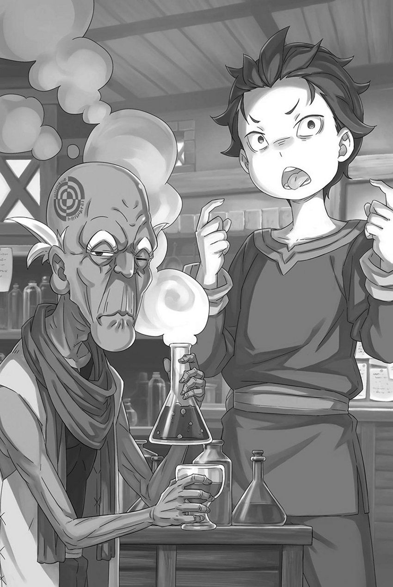
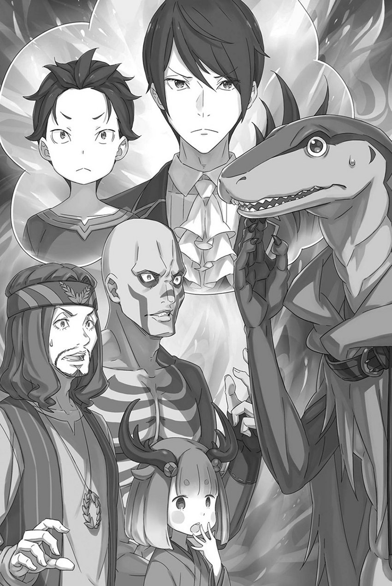

# 『后槽牙的内侧』

------

最初，当努尔爷爷听到昴的要求时，他破牙的嘴巴狠狠地扭曲了起来。

据说，努尔爷爷是岛上的治愈师——也就是所谓的医生，但在来到这里之前，他从未为别人治疗过伤口。努尔爷爷在岛上的管理者还是前任总督的时候就已经在这里，恰好在那个更为艰苦、更容易死去的时代获得了治愈师的角色。

最初，他只是给一名失去手臂的剑奴往伤口上按了块脏布。此后，凡是有人受伤，他便越来越常被叫去处理，最后终于接到命令：不必再作为剑奴上场，改在治愈室里当治愈师。

从那以后，他作为治愈师度过了漫长的时间，经历了许多与自己地位相称的惨烈场面。由于这些经历，他已经能够进行简单的缝合伤口和调制药剂，而且他露出黄色的牙齿，笑着说作为治愈师他会安稳度过余生。

自己的请求让努尔爷爷露出那样难看的脸色，昴也觉得过意不去。

但是，如果要在这个岛上实现昴想做的事情，必须要完成的事情，那就是不可或缺的。因此，昴向做着拯救他人的伟大工作的努尔爷爷提出了请求。

「只要咬一口或者舔一下就能让人瞬间死亡的毒药，你能准备吗？」

※ ※ ※ ※ ※ ※ ※ ※ ※ ※ ※ ※ ※ ※ ※ ※ ※ ※ ※ ※ ※ ※ ※

虽然对努尔爷爷做了对不起的事。

但是，这是必要的。在战斗中昏迷，以不完整的状态生存下来，对于昴来说是个大问题——重新开始的手段是理所当然的。

而且，只要得到这种手段，昴就是完全无懈可击的。

「嘛，如果腿再长点就好了」

这是因为在战斗中，总会遇到差一大步就够得着的局面，才有了这样的抱怨。

当然，下次只要提前两步冲出去，就能硬把这一点弥补上。不断尝试、不断修正，找出最优的一手，把期盼的未来抓在掌心。

所以——

「到此为止！恭喜你们在『斯帕鲁卡』中成功生存下来!!以本官的权限，将接受诸位成为剑奴孤岛的一员！」

响彻的低沉号令，称颂在剑斗场上展开的激烈战斗的结束。

剑斗场中央，剑斗兽的尸体仰面横陈，大小两把剑插在它的躯干上。两臂的翅膀和长尾都被斩断，模样惨不忍睹。

但是，那双翅膀的移动和锐利的尾巴攻击真的非常麻烦。

为了对本体造成伤害，必须解决这两个问题，所以不是故意让它受到不必要的伤害。

还有——

「古斯塔夫先生，真的吗？」

喘着粗气，昴抬头看着站在主席台的古斯塔夫。

岛上的统治者交叠着四条强壮的手臂，见证了『斯帕鲁卡』的结束。他给人的印象确实是不知变通的老古板，却没想到，连结束时的宣告都一字不差。

既然这次和昴他们的时候并不是偶然的巧合，所以大概每次古斯塔夫的喊声都是一样的。

不管怎么说——

「哇，成功了……成功了，活下来了！」

「我们，活着……！啊，哇啊啊啊啊！」

「咕嘿，嘿……」

「……难以置信。我还以为，这是世界末日……」

「难道，我们死了在欧德・拉格纳的彼岸……？」

在剑斗兽尸体周围，五个人各自以各种方式庆祝着胜利，呆然地站着。

奥索、希茨、纳德雷、喀什、科德罗。五人虽然都是蜥蜴人，却分别属于不同的种族。摸清每个人的特点，并让他们相互配合，便是通向胜利的方程式。

就像维茨他们一样，如果有人缺席，也无法获得胜利。——当然，如果没有昴，那是绝对不可能的。

「但是，我们赢了……！」

昴这样说着，猛地指着站在主席台上的古斯塔夫。

面对昴的挑衅，古斯塔夫那张威严的脸没有任何变化，只是微微眯起了眼睛。

没有多说什么，古斯塔夫转身离开，下了主席台，回到了岛上。

处理尸体和照顾幸存的剑奴是看守这些下属的责任。

「施瓦茨！」

「哦」

看着离去的古斯塔夫，跑过来的某人叫喊着昴。那是从观众席上跳下来，跑过来的赫莱茵。

他浑身的鳞片都竖了起来，用带有蹼的大手紧紧抓住昴的肩膀，

「你到底在想什么！？不过，首先为什么要参加『斯帕鲁卡』……」

「惩罚啊，惩罚」

「惩罚，是吗？」

「对。我问了其他剑奴的人。古斯塔夫先生和看守们……如果违反岛上管理层的规定，首先是警告，之后是惩罚。恶劣的违规者会被诅咒」

昴向数名剑奴询问过，已经交叉核实了这件事。

大家都知道古斯塔夫不想让剑奴的数量减少，对于这个规定的认识是一致的。

惩罚——也就是说，强制参加与自己无关的『合』实施的『斯帕鲁卡』。

「『斯帕鲁卡』这个东西，其实是新的剑奴们的通行仪式，一旦成为剑奴，就不再参加。因为他们自己有『合』，也没有理由去参加。」

而且，为『斯帕鲁卡』组成的『合』，是从同期抵达剑奴孤岛的人中随机编成的。合不合得来、喜不喜欢，谁都无从选择。

他们不知道彼此能做什么，擅长什么，甚至不清楚彼此的身份，却被迫组队，必须与队友合作才能战胜剑斗兽，这是一种艰苦的修行。

虽然做这件事没有任何好处，但死亡的可能性非常高，这是一场危险的死斗。

所有的剑奴都一致表示，『斯帕鲁卡』是剑奴孤岛上最艰难的死斗。

「嗯，现在看来，因为塞西的关系，和塞西进行的死斗被认为是最糟糕的。」

「……我明白了你参加『斯帕鲁卡』的原因。但是」

「但是？」

「话说回来！你为什么会受到惩罚！？那个，在上面谈话之后，马上就被加入『斯帕鲁卡』，这太奇怪了吧！就像……」

赫莱茵说到这里，突然停住了话，眼神游移不定。

从他的举止来看，他似乎在犹豫着是否继续说下去。昴不禁耸了耸肩，他大概明白赫莱茵想说什么了。

「就像是故意去帮助奥索他们一样？」

「――！」

「没错。如果没有我，他们都会被杀掉。」

实际上，即使有昴在，战斗的局势依然非常糟糕。

为了与战斗能力远不及赫莱茵的他们团结一心，昴不得不先成为这群蜥蜴人的朋友。

在这件事上，昴在卡欧斯弗莱姆的见闻派上了不少用场。

「听说，你们原本想一起去卡欧斯弗莱姆？」

「啊……」

「这些事，你们应该好好聊一聊。难得又见到彼此了嘛。」

说着，昴覆住了赫莱茵搭在自己肩上的手。

赫莱茵睁大了瞳孔狭窄的眼睛，紧紧盯着昴的黑瞳。昴回视着他，然后指了指五个人的方向。

生还的五人也渐渐恢复了观察周围的余裕，在他们当中的一个人，科德罗注意到了赫莱茵的存在。

接着——

「赫莱茵！赫莱茵！你还活着……你还活着！」

科德罗脸上露出欣喜的表情，他的声音一下子提高了，其他四个人也看向赫莱茵。他们纷纷表示对赫莱茵存在的欢喜，表现出积极的反应。

看着这一幕，看着赫莱茵的脸一点点皱成一团，昴说道：

「这可是我拼命挣来的机会啊。好好珍惜吧，兄弟。」

昴拍了拍驼背弯曲的赫莱茵的后背，将他送向伙伴们。

赫莱茵虽然犹豫了几次，但还是迈着蹒跚的步子向前走去——

「施、施瓦茨！」

「嗯？」

「……谢谢你。」

说完这句话，赫莱茵朝着等着他的五个人走去。

奥索他们对赫莱茵没有敌意，也没有恶意。因为，关于他们五个人被抓到剑奴孤岛的原因，昴已经知道了。

只要好好谈谈，他们也没有相互矛盾的理由。

「……施瓦茨大人？」

「哇！」

正看着赫莱茵和他的伙伴们重逢的昴，突然被背后的声音吓了一跳。

吓得跳了起来的昴，因为惊讶过度而咳嗽起来，

「啊，太危险了……差点就死了……！别吓唬我啊！」

「那是我应该说的！你突然……难道你想死吗！？」

「我才不想死呢！？」

昴用手捂住嘴，回头看到正在怒气冲冲地责备他的坦萨。

面对这小女孩激烈的抗议，昴有些气馁地摇了摇头。然而，坦萨对他的解释一点也不满意。

「你突然参加『斯帕鲁卡』比赛，真的让我吃惊。而且，还是自己主动找上古斯塔夫总督的，简直是不想要命了。」

「所以我说，不想要命什么的都是误会啦。我想比起其他人，我更了解生命的珍贵吧？不是因为这个才救了赫莱茵的伙伴们吗？」

「我指的是你自己的生命。……虽然结果上来看，救了他们是好事，但从我的角度来看，危险的时刻可不止一次。这简直就是个奇迹。」

「奇迹，是吗？」

坦萨压低声音，从现实的角度规劝昴不要如此莽撞。

她说得对，确实有好几次让人揪心的场景。也能理解坦萨想说这是奇迹的感受。——但是，事实并非如此。

「奇迹是从神那里得到的东西，但这是我亲手抓住的。」

所以，这并不是什么奇迹。

这是菜月昴将那混账命运踩在脚下的证明。

「……就只是为了救赫莱茵大人的同伴，便如此胡来？还是说，因为与赛格蒙特大人争了几句，就想争口气给他看？」

「不，虽然塞西确实让我生气，但如果因为这个把命也搭上那我就太危险了……救赫莱茵的伙伴们，确实是有目的的。」

「——」

「你的眼神怎么这么怀疑啊！」

昴的解释，说服力已经一落千丈。

看到如同审视犯罪嫌疑人的坦萨那不信任的目光，昴肩膀无奈地耸了耸，小声嘟囔道：「真的是这样……」。

看到他那可怜的样子，坦萨轻轻地叹了口气，

「那么，施瓦茨大人的目的是什么？」

「那个……」

面对重新振作起来的坦萨的提问，昴再次转过身来。

在那里，赫莱茵正和他的五个伙伴交谈。赫莱茵的声音微微有些紧张，这边也能听得到。

于是——，

「再等一会儿，然后再谈吧。」

「……施瓦茨大人？」

「你的眼神真是太怀疑人了！」

尽管对不受信任的自己感到无奈，昴还是偷偷地把手指伸进嘴里。然后，他再次确认了夹在后牙上的那个小包裹的位置。

「——」

那里有的是昴请努尔爷爷调配的最后一张王牌。

绝对不能让这次努力挑战所抓住的机会因为一时疏忽而化为泡影。为了不因为小失误而死去，必须要非常小心。

——一边这样想着，昴一边将装着『药』的小包塞回后槽牙内侧。

※ ※ ※ ※ ※ ※ ※ ※ ※ ※ ※ ※ ※ ※ ※ ※ ※ ※ ※ ※ ※ ※ ※

「据奥索他们说，卡欧斯弗莱姆已经被摧毁了。」

「……」

听到赫莱茵苦涩的报告，坦萨皱起眉头低下了头。

尽管早已料到最糟糕的可能，但当真相告诉她时，仍无法抑制心头的震撼。即使知道会摔倒，摔倒后还是会疼痛的道理一样。

『斯帕鲁卡』结束后，奥索等人作为剑奴幸存下来，现在正由看守们带领着参观岛上的设施和共用房间。

尽管他们是同伴，但赫莱茵与他们不在同一个『合』，所以不能一起参加，于是乖乖地来到同一个『合』的昴等人的房间露了个脸。

然后，赫莱茵带来了昴想知道的消息。

「你想要的是这种关于外面的消息吧？在这个岛上，可是没有外面的信息传进来的。」

「一半一半吧。不，应该说是七三分。七分是为了赫莱茵和奥索他们。」

「别说了，你这个令人毛骨悚然的家伙！」

虽然他说得很真诚，但赫莱茵交叉着双臂，扭过头去，摆出这种态度。

赫莱茵理清了自己的心情，还替昴考虑起他参加『斯帕鲁卡』的目的，这让昴很高兴。

赫莱茵的表情也在某种程度上显得明亮，想必是因为他从奥索他们那里得到了重要的消息。

那就是——

「……那些笨蛋，为了从奴隶商那里把我救回来，被抓了。真是没救了。」

「神也好，命运也好，都太薄情了。所以，我才把他们救了下来。……要不，就说是我们一起救的？」

「呸，怎么可能。实际上参加『斯帕鲁卡』的只有你一个人。」

「比如说，是赫莱茵一把鼻涕一把泪地跪下来求我，拜托了施瓦茨大人，请救救他们……」

「梦话还是等睡觉的时候说吧！」

伸出的手抓住了头，猛地摇晃。赫莱茵从晃得发懵的昴那里松开手，嘴里发出哼哼声，注意到了坦萨的表情。

听到卡欧斯弗莱姆的事情后，低着头的坦萨被赫莱茵称作「小个子」，问道：

「是因为卡欧斯弗莱姆的事情而郁闷吗？怎么了……」

「……卡欧斯弗莱姆，是我的故乡。就在崩溃的前一刻，我还在那座城市。」

「是、是吗……那个，是那个啊。」

对于出乎意料的回答，赫莱茵显得有些困惑。他的眼神游离不定，这个对突发状况反应迟钝的性格暴露无遗。但他很快提高了声音，说道：

「确实，城市好像是被摧毁了，但是住在那里的人并没有全部死去。那些城里的人们被统一转移到了另一个地方……虽然有些问题。」

「有问题，是吗……？」

「嗯，我也不知道该相信到何种程度。」

赫莱茵这么说着，对于接下来的话语显得犹豫。但是，他已经引起了坦萨和昴的兴趣。

察觉到这一点，赫莱茵长叹了一口气，然后说：

「外头似乎闹起了很大的叛乱，听说卡欧斯弗莱姆的人也加入了。反正魔都那个当家的老是在造反，城被夷平，说不定就是犯傻闹出来的……噫！」

「──尤尔娜大人并非愚蠢。」

「哇，对不起！我不知道是什么原因，但我真的很抱歉！」

赫莱茵连忙解释，被坦萨锐利的目光吓得声音都变了。

赫莱茵再次因为毫无必要的狂妄惹怒了对方，但在他背后，昴从刚才的谈话中发现了一些让他感到安心的地方。

当然，这是基于相信经由赫莱茵传达的奥索他们的话的前提。

「即使卡欧斯弗莱姆已经完蛋，尤尔娜大人和城里的人们都还好。既然叛乱成了话题，看来埃布尔他们也平安无事。」

要夺回帝都的战斗，在没有埃布尔的情况下是无法进行的。

也就是说，埃布尔还活着。希望米迪娅姆、塔莉塔和阿尔也都平安。──在尤尔娜的身边，希望路伊也没事。

「……果然，我们不能浪费时间。」

了解到外面情况的片段后，越发渴望出去的欲望变得更强烈。

他当然担心卡欧斯弗莱姆的众人，也担心尤尔娜和埃布尔他们大概会前去会合的古拉尔的人们——担心雷姆。

如果她知道自己变小了，肯定又会被狠狠地责怪。

「──其实，我本想展示给雷姆看我可以依靠的一面。」

昴自认为现在的状态心情比较轻松，感觉不错，但他也无法否认外表上的说服力确实不足。坦萨一直怀疑的目光投向他，也和自己身体变小有关。

总之──

「嗯，我知道了。谢谢你，赫莱茵，帮了大忙。」

「我才是受益者……哎呀，知道就好。」

对感谢的昴，赫莱茵嘟哝着回应。昴微笑着，正想着是否该安慰一下坦萨时。

「──施瓦茨，总督在找你。」

在公共房间外，传来的声音是穿着黑色制服的剑奴孤岛的看守。听到这个呼唤，赫莱茵的表情变得僵硬，坦萨瞪大了眼睛。

她望着看守，

「古斯塔夫总督找施瓦茨大人？为什么……」

「我没有听说。也没有说话的必要。乖乖地听话。否则……」

「没问题！即使你不这么有敌意，我也会乖乖跟着你的。……顺便问一下，如果不听话会受惩罚吗？」

「――――」

「开玩笑，开玩笑。」

昴闭上了一只眼睛，壮年看守嘴角扭曲地看着他。

看守的态度表露出他并不喜欢昴。这也是理所当然的。这个看守在昴和古斯塔夫交谈时就在『斯帕鲁卡』前出现。

他亲眼看见了昴因何受到惩罚，继而参加『斯帕鲁卡』。在他看来，昴一定是个深浅难测的孩子。

一个自愿参加『斯帕鲁卡』的，脑子有问题的孩子。

「那么，我出去一下。坦萨，乖乖等我回来。」

「……倒是施瓦茨大人，请您别太胡闹。」

「嗯，我无法反驳。」

听到坦萨抑制住的声音，昴的苦笑愈发加深。然后，他听从无言地催促他快点的看守，走出了房间。

这时，赫莱茵朝昴的背影喊了一声「施瓦茨」。

「那个，这个……」

「嗯？有什么事吗？」

「啊，不……你、你要小心。就算像你这样的人，如果『合』里的人数减少了，我们也会很困扰。」

听到这个并不直接的关心之词，昴愣住了。然后立刻笑出声来，对赫莱茵点了点头。

「嗯，我知道了。那么，待会儿见。」

挥了挥手，昴暂时与坦萨和赫莱茵两人分别。然后，跟在前面走的看守的背影后面，

「古斯塔夫先生，生气了吗？」

「……总督并不是一个感情用事的人。跟我不一样。」

被看守暗示不要再多说一句而激怒他，昴悄悄地缩起了脖子。

※ ※ ※ ※ ※ ※ ※ ※ ※ ※ ※ ※ ※ ※ ※ ※ ※ ※ ※ ※ ※ ※ ※

——昴被看守带走后，目送他的两人还留在房里。

「喂，那个施瓦茨到底干了什么……」

「刚才他被看守带走了，除了『斯帕鲁卡』之外，还有什么事吗？」

坦萨和赫莱茵留在房间，维茨和伊德拉露出了脸。他们两个也是从观众席观看昴参加『斯帕鲁卡』的人。

当然，他们对做出那么冒失的事情的昴有很多想问的。

虽然如此，他们没有像赫莱茵那样急切地从观众席上跳下来——

「坦萨，你知道这件事吗？」

「……知道的也算知道，不知道的也算不知道，有点复杂。施瓦茨大人似乎对我也有所隐瞒。」

「真是个让人捉摸不透的家伙……他倒是有点本事……」

听到低头的坦萨的话，维茨和伊德拉面面相觑，叹息着。

听着这三个人的谈话，赫莱茵一直默默无言。虽然他是个难以判断面色的蜥蜴人，但是他游移不定的眼神显然是在苦恼着什么。

结果，他们三个分别叫了一声「赫莱茵」、「赫莱茵大人」，

「怎么了，这个表情……」

「那个，那个……你、你们也注意到了，施瓦茨那家伙参加『斯帕鲁卡』是故意的……对吧？」

「那个……看那个样子，大家都应该这么想吧。」

伊德拉回答了赫莱茵结结巴巴的话，坦萨和维茨表示同意。

大概，这是观看那场角斗场战斗的所有剑奴们的共识。而且，不论是谁看，如果没有昴的努力，今天的『斯帕鲁卡』是无法完成的。

「我不知道那家伙为什么要那么做……」

「——我也不知道。但是，但是啊」

「——？但是什么？」

「我不清楚他为什么要那么做，但是他为什么能做到那样，也许，也许……」

他们三个都明白接下来赫莱茵要说的话。

问题不在于昴为什么要参加『斯帕鲁卡』，而在于昴是如何在『斯帕鲁卡』中生存下来的。对于维茨和伊德拉来说，这并非与他们无关的疑问。

因此，面对浓厚关注的目光，赫莱茵吞了口唾沫。

然后——

「这个，我从刚来这里的那些家伙那里听说的……在外面有传言，皇帝有个私生子在某个地方。然后，关于这个——」

「——」

「——那个，据说是个黑发黑眼的孩子。」

