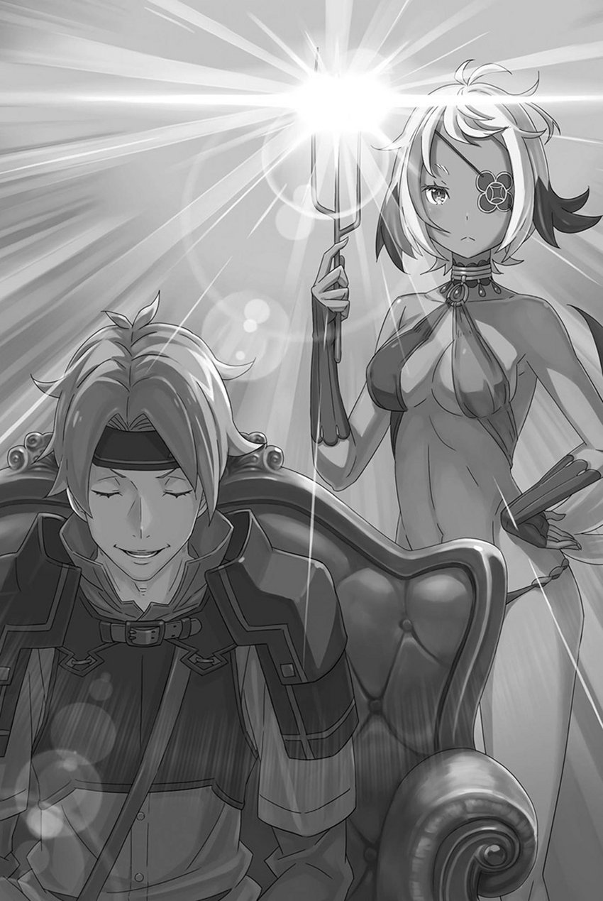

# 『水』

------

――不该存在的，由『咒则』引发的剑奴孤岛大屠杀。

在最后一刻，夺走昴生命的是冰冷的刀锋。

然而，在此之前，那从身体边缘慢慢死去的感觉，毫无疑问在蚕食着昴，残忍地逼迫着他走向死亡。

到底，除了昴以外的人们——包括坦萨等剑奴、本应负责管理岛屿的狱卒、剑斗兽，甚至塞西尔斯在瞬间死去的原因尚不得而知。

为什么只有昴是个例外，死得更慢呢？

或许，这是一个即使思考也无法得出答案的问题。

对方也不是问了就肯回答的人，没必要为此耗费时间和脑细胞。

与此相比，应该关注那些确实可以获得的信息。

「托德的那个反应……咒则是答案」

临死前，昴用缺血的脑袋在两个答案中选了一个，而他选对了。

倘若当时没有重新考虑，仍执着于亚拉基亚的魔法这一猜测，昴就无法带着确切的答案回来。

正因为击中要害，托德才在那一瞬间决定杀死昴。

他认为昴不再是一个濒死的孩子，而是一个立刻就该杀死的危险人物。

正是托德的这种果断，成为了昴得出咒则结论的依据。

「可是，为什么是咒则呢？」

一旦排除了毒气的可能性，得出咒则可能性的证据，就不再执着于咒则只是恐吓而不存在的想法。

但是，这样一来，古斯塔夫的行为就变得过于异常了。

昴认为咒则不存在的根据是，古斯塔夫没有给违反剑奴孤岛规则、破坏秩序的危险昴施加咒则的惩罚。

诚然，古斯塔夫并不想让剑奴们死去，但是将昴一个人与岛屿的秩序相比，犹豫使用咒则并不合理。

所以，反过来想——

「当我挑衅时，古斯塔夫先生想使用咒则却无法使用。但是，当岛上的所有人被杀时，他满足了使用的条件？」

暂且根据现有情报，事情的经过只能这样解释。

「……古斯塔夫先生，是敌人吗。」

既然咒则已经发动，身为管理者的古斯塔夫十有八九就是昴他们的敌人。

也就是说，敌人是托德、亚拉基亚，再加上古斯塔夫，共三人。虽然可以确信塞西尔斯不是敌人，这也算是收获，但不能感到高兴。

因为那个咒则，甚至威胁到了塞西尔斯的生命。

「……」

每得到一份情报，也有新的坏材料被接连丢进锅里。

能否滤清这锅漆黑翻滚的汤汁，看透锅底呢。

而且，坏消息总是接踵而至。

这是因为——

「施瓦茨……」

「！」

「这震动是……」

昴捂着胸口蹲了下来。那里没有伤口，只留下被刺穿时的冲击感。

正在担心他的维茨，被脚下传来的震动惊到了。当然，昴早就知道会有这场震动，也明白它的由来。

尽管他知道这一切，但仍然存在一个巨大的问题。

——距离吊桥开始移动的余裕，比上一次从『死亡』重来时更短了。

※ ※ ※ ※ ※ ※ ※ ※ ※ ※ ※ ※ ※ ※ ※ ※ ※ ※ ※ ※ ※ ※ ※

对不愿面对的事移开目光、捂住耳朵，心情就不至于低落。

可是，倘若连心都成了丧家之犬，就再也找不到战胜那步步逼近的败局的办法。

所以，无论多么讨厌现实，也不能闭上眼睛，堵住耳朵。

即使重新开始的地点向后推了十几秒。

昴所拥有的『死亡回归』权能，其异常仍在不断作祟。

不同寻常的重新开始点设置当然是其中之一，这次还出现了短暂的时间差——短短十几秒的缓冲时间减少。

这与之前缓冲时间极端缩短的情况有所不同，可以说是加剧了昴的不安与绝望感。

这次只缩短了十几秒，可谁也不能保证，剩下的时间不会继续缩短。

这种异常现象屡次叠加，直至死亡的时间缩短到不到一秒，甚至根本无法实现『死亡回归』，昴还能做什么呢？

即使不想以『死亡回归』为前提，也必须将『死亡回归』纳入计算，制定作战策略。

如今身体变小，昴比缩小前更加无力。帝国这片土地，可没有温柔到容许他只顾惜命、坐享其成。

所以——

ｘ ｘ ｘ ｘ ｘ ｘ ｘ ｘ ｘ ｘ ｘ ｘ

「喂，施瓦茨……真的要在这待着吗？」

「当然是真的。拜托了，赫莱茵，就这次大决战，别被吓倒。」

「我才不会被吓倒呢！我才不会……」

昴身旁的赫莱茵咬紧牙关，吞吞吐吐。那颤抖的声音，任谁都听得出是在逞强。

赫莱茵害怕，希望昴能改变主意，这种心情可以理解。

如果被发现，可不是闹着玩的。这种胡闹的理由，他也搞不清楚。

然而，如果把发生的事情如实说出，无论被相信还是被质疑，赫莱茵都不可能再帮助昴。

为了这个目的，昴欺骗了赫莱茵，用虚假的理由让他协助。

昴告诉他，这是为了得到一份即使冒些险，也不能置之不理的情报。

而那些连赫莱茵也无法忽视的信息是——

「可恶，帝都的使者要谈论我们的演出？开什么玩笑……！」

「我已经请维茨帮忙拖延时间了。我们要去获取详细的信息。」

「我知道，我知道的，这种事情……」

赫莱茵焦躁不安，惦记着岛上的公演——将剑奴的生死搏斗搬上台供人观赏，这正是基奴海布得以经营的首要目的。

既然已经活过『斯帕鲁卡』，而旨在磨炼剑奴的日常死斗又尽量避免死人，那么最危险的，便是正式公演。

昴谎称拥有这种演出的信息，向赫莱茵寻求帮助。

结果——

「——请进。让本官听听二位的来意。」

严肃的声音伴随着门开启的声响在房间里回荡。

像圆木般粗壮的双臂推开了门，房间的主人归来，空气变得压抑起来。

昴闭上嘴巴，轻轻拍了拍赫莱茵的肩膀。赫莱茵也默默回应，似乎已经做好了面对无法逃避的境地的觉悟。

这也是理所当然的。昴和赫莱茵已经无法再胡乱行事了。

因为——

「亚拉基亚一将，还有……」

「托德」

开门的高大男人——古斯塔夫的话，得到了一个简短的女声回应。面对这过于简略的回答，有人似乎苦笑了一下，

「托德・芬格上等兵。暂时地，直到这次任务完成。」

就这样，一个让昴的灵魂感到窒息的男声接着说道。

丝毫不顾昴心中的恐惧，被领进来的两人——托德，以及褐肤、戴着眼罩的女人亚拉基亚，踏入了房间。

这里是古斯塔夫的办公室。就在前几天，昴也因为严重警告而被召唤到这个房间，而现在作为帝都使者的托德他们走进了这里。

「身为总督，这个房间真是够简朴的」

托德站在房间中央、接待用的沙发旁，环顾四周。

确实，古斯塔夫房里的东西很少。办公桌与书架，除此之外，便只有配得上「办公室」之名的公务必需品。

托德注意到这一点也是可以理解的。但是，他还是不要四处张望的好。

特别是在房间角落的书架那个方向。

ｘ ｘ ｘ ｘ ｘ ｘ ｘ ｘ ｘ ｘ ｘ ｘ

「——这里是办公室，本官所需的东西都已齐备。你是来稽查的吗？」

「哪里的话。我是亚拉基亚一将的随从。『将』挑人挑得厉害，除了我没有别的部下。」

「少数精锐」

「精锐这种评价，实在是过誉了」

古斯塔夫关上门，走向办公桌，托德朝他耸了耸肩。听到亚拉基亚接下来的话，他也没有改变神色，缓缓坐进沙发。

这样一来，他的视线终于离开了书架的方向，昴在心里松了一大口气。

这真是一个紧张得难以置信的时刻。

托德总是让人觉得不管怎么想，都会有比最坏的情况更糟糕的可能。

所以，他真的非常害怕再被发现。

——怕他发现，书架旁模仿周围景色隐去身形的赫莱茵，正将昴整个人罩在身下；而昴就在那掩护之中，屏息倾听。

「――――」

昴先请维茨拖住来访的龙车，趁这段时间与赫莱茵潜入古斯塔夫的办公室，再借助拟态藏了起来。

拖住龙车已有成功的先例，但拟态能否瞒过对方，只有试了才知道。虽然通过最初的『斯帕鲁卡』及之后的交谈，昴自认已了解赫莱茵拟态的原理，可这与确信不会被识破是两回事。

比起身心状态，赫莱茵拟态的精度更取决于他有没有一动不动的胆量。只要能坚持待在原地，融入景色的他几乎就是透明人。被他抱住小小身躯的昴，也能得到同样的掩护。

然而，只要一动，鳞片模拟出的景色便会乱掉，变成孩子捉迷藏时那种藏身处一眼就能看穿的模样。

与那头狮子般的剑斗兽交战时，这份胆怯曾让他一再丧命。葬送赫莱茵难得优势的，恰恰是他自己软弱的心。

但是，这次的伪装应该已经努力克服了这个弱点。

『只要不被发现，就不用担心他们对我们做什么。来的是『九神将』和眼尖的副官，但只要你的拟态不乱，就没问题。而且——』

『而、而且……？』

『——有我在。』

进入办公室之前，昴认真望着赫莱茵的眼睛，这样告诉了他。

即使说这话的，只是个手脚短小、连变声期都没到的狂妄孩子，对曾被他救下自己与同伴性命的赫莱茵来说，这番话仍然传达到了心底。确实，触动了他。

——所以，这一次，赫莱茵的拟态『第一次』没有被看穿。

这是他们第一次聆听亚拉基亚带着副官托德来到这个岛屿，与古斯塔夫展开的谈话。

「亚拉基亚一将，你不坐下吗？」

「站着就好。而且，我有些坐立不安」

「坐立不安？」

「来岛上之后，她似乎就有些不对劲。也许是因为离龙巢太近了吧。」

面对入座的邀请，亚拉基亚摇了摇头，仍然站着。副官托德坐在沙发上，上司亚拉基亚却站在他背后，形成了颇为古怪的场面。

然而，背后有上司的托德画面没有产生违和感，是因为昴过度地将托德想象成了一个非常强大而可怕的存在吗？

不过，对一个只要赫莱茵的拟态稍有破绽，就会立刻杀过来的家伙，不警惕才强人所难——。

「既然你觉得这样合适，本官没有意见。那么，此次来访所为何事？」

「能直接谈正事，真是帮了大忙。我们也不想耽误太久。一将，我可以把信交给他吗？」

「随便」

「谢谢。总督，这是来自帝都的，宰相的信件」

托德无视犹如摆设一般站立的亚拉基亚，从怀里拿出了信件递给了古斯塔夫。在古斯塔夫手中，信件上贴着封蜡，似乎也有表明发件人的印章。

然而，昴无法确定印章的标志。

「帝国，宰相……」

听到托德报出寄信人的身份，昴只觉舌头发干。

确实，根据让人讨厌的埃布尔的说法，那个宰相地位的人是将埃布尔从帝都赶出来的主犯之一。

那个驱逐了恶劣皇帝的恶劣宰相的信件送到了古斯塔夫手中。而且，送信的人是恶魔般的托德。

接下来，在剑奴孤岛发生的大屠杀让人只有不祥的预感。

「古斯塔夫・莫雷罗上级伯，我听说你被任命为这个岛上的总督是出于文森特・佛拉基亚皇帝阁下的命令。」

「那个认识是正确的。」

「虽然是皇帝阁下的命令，但剑奴孤岛基奴海布的管理者这样的令人讨厌的工作，对于佛拉基亚英雄『八腕斗神』库鲁刚的亲属来说并不合适，不是吗？」

正如昴的预感那样，房间的气氛变得紧张起来。

原因是托德那近乎无礼的冒犯。而通过此前的接触，昴清楚古斯塔夫最愤怒的是什么。

古斯塔夫生气的原因，不是别人说他自己的事情，而是——

「这种说法，是在怀疑我们皇帝阁下的判断吗？」

对皇帝阁下，也就是 埃布尔 = 文森特 的不忠感到愤怒。

ｘ ｘ ｘ ｘ ｘ ｘ ｘ ｘ ｘ ｘ ｘ ｘ

「――――」

在古斯塔夫释放出危险气息的同时，亚拉基亚立刻站到了托德的身边。

亚拉基亚神色莫测，可单是这一步，就令人联想到她以力量碾碎古斯塔夫那理所当然的忠义的景象。

然而，抬手喊了声「一将」、制止她威吓的，也正是托德本人。

「刚才的话是我说得太过分了。总督的愤怒是合理的。」

「……可是，我不会让你死。你还要，替朋友报仇。对吧？」

「——。啊，当然是这样。现在，我就是为了那个目的而活着。」

在指责亚拉基亚的态度的同时，托德的回答中也流露出悲痛的色彩。

听着亚拉基亚提到替朋友复仇，看着托德的反应，昴一边竭力不漏听一字，一边还是忍不住撇了撇嘴。

托德和复仇这样的词语似乎是非常不搭的。

虽然不能说完全了解托德，但托德身边也有重要的人吗？

明明都顾不上那个一直渴望相见的未婚妻，跑到这座岛上来杀这么多人。

「我说得不够体贴，对不起，总督。我和亚拉基亚一将都有些顾虑。所以态度不好。为此道歉。」

「……道歉我接受。但是，说话太过分会招致灾祸。」

「这话真叫人难堪。我已经深有体会了。」

托德在压制亚拉基亚的威胁后，对古斯塔夫的警告露出了苦涩的表情。而在一旁的古斯塔夫，则不顾托德的反应，用粗大的手指掰开封蜡，展开了信件。

帝国宰相——一手促成眼下帝国乱局的人，他信里的内容是——

「这是……」

「刚才那个失礼的话题的真实目的，可是我没有恶意。只是想说，如果总督对管理剑奴孤岛感到厌烦的话，这恰好可以解决问题。」

古斯塔夫浏览信件时，他那如岩石般的脸上出现了细小的皱纹。托德则一只眼睛眯缝着，仿佛想扩大那道裂缝。

把无言的亚拉基亚留在一边，托德以使者代表的面孔继续说。

「岛上的剑奴有成为内患的危险。皇帝阁下的意思是，全部处置掉。」

※ ※ ※ ※ ※ ※ ※ ※ ※ ※ ※ ※ ※ ※ ※ ※ ※ ※ ※ ※ ※ ※ ※

ｘ ｘ ｘ ｘ ｘ ｘ ｘ ｘ ｘ ｘ ｘ ｘ

托德淡淡地向古斯塔夫提出了剑奴孤岛剑奴——几百人的处分要求，就像在谈论扔垃圾的日子一样平淡。

「……」

昴之所以承受得住这最坏预想的应验，只因为已经亲眼目睹过全岛遭到屠杀，心里早有准备。

而赫莱茵猝然听见这噩耗，却没有惊叫出声，简直是个奇迹。

正确地说，应该是他太震惊了，以至于无法理解。

「……」

那句话毫无现实感，让赫莱茵连动弹都忘了。

虽然因此歪打正着，没有解除拟态，昴却也只能咬紧后槽牙。

就是这道命令，导致了杀死全岛所有人的咒则被发动。

果然正如担忧的那样，托德、亚拉基亚和古斯塔夫成为敌人。除非阻止这三人的恶行，否则无法防止那场大屠杀。

「所谓内患的危险，是指什么？」

「内患就是内患，是胆敢损害皇帝阁下威光的不法之徒。不过，宰相并不认为是古斯塔夫总督包庇了他们。总督的忠心毋庸置疑。」

「……」

「正因如此，心情会很沉重。总督在这个岛上任职以来，表演时亮相的剑奴的质量与以前相比已经无法比拟」

明明下令处置这些剑奴，托德却又慰劳起古斯塔夫的辛劳。

古斯塔夫垂眼看着信，神色不动。视野受限的昴，也无法知道托德的话在他心中激起了怎样的回响。

「——减少无谓的死亡危险，让他们掌握战斗的基础，学会并肩作战，而非相互算计，活下来的剑奴自然会变得更强。」

然而，古斯塔夫按照自己的哲学进行了剑奴孤岛的管理，并以平静的声音回答，似乎能感受到自豪之类的东西。

他不仅将剑奴视为展示物，古斯塔夫还锻炼和培养他们，以适应皇帝和帝国臣民的要求，改变了岛上的规则。

那里面大概并没有对剑奴的依恋、怜爱之类柔软的情感。

但是，古斯塔夫作为总督这个职位上的人物做出了决定。

「谈话结束了吗？」

古斯塔夫将四只手按在放着信件的桌面上，闭着眼睛。亚拉基亚向他问道。

这个全然不顾谈话内容、毫不体谅人的问题，若换作昴处在古斯塔夫的位置，或许已经气得满脸通红。

但是，古斯塔夫并没有反驳，托德也接受了这是理所当然的。

「听说你有方便处理这些人的咒则。『九神将』的格鲁比・加姆雷特一将，不是给了你一件咒具吗？据说用它就能一网打尽。」

ｘ ｘ ｘ ｘ ｘ ｘ ｘ ｘ ｘ ｘ ｘ ｘ

「可以」

「那么事情就简单了。赶紧解决掉，然后一起返回帝都。准备新剑奴也需要时间，所以暂时关闭基奴海布——」

托德就像在收拾用过的教具一样谈论着，这种不严肃的说法阻碍了仍在思考停滞的赫莱茵的恢复。

但是，即使赫莱茵的恢复尚未完成，时间也已所剩无几。

只要古斯塔夫按照托德等人带来的命令书发动咒则，所有人就会死。

昴知道，未来不会因为对方一时兴起就改变。想阻止这一切，只能现在行动。可是，该怎么做？

毫无计划地现身，立即被杀已经是显而易见的事情。

可若想挟持即将发动咒则的古斯塔夫，对方看起来又比昴和赫莱茵加起来都强——。

「——本官拒绝。」

是的，古斯塔夫拒绝了托德他们的要求，所以可以趁机。趁机。

趁机，趁机，这是什么意思？

「……什么？」

在拼命思考的情况下，就像赫莱茵一样，昴的思绪也被搅乱了。

与此相反，托德的声音冰冷而锐利。

昴感觉到房间里的空气仿佛变得粘稠了。

这是一种与古斯塔夫因托德的言辞而生气时截然不同的气氛。这不是热度，也不是湿度，而是一种仿佛颜色有所不同的氛围。

托德披着这种空气，看着将手放在桌子上的古斯塔夫，

「命令书的内容和我们的认知有矛盾吗？」

「没有。刚才，你告诉我的事情和信中的内容是一样的。宰相大人的名字和印章也没有差错。」

「那你这又是在表明什么态度？」

托德摊开双手，质问拒绝要求的古斯塔夫。

昴同样无法理解眼前发生的事。古斯塔夫拒绝了托德转达的、来自帝都的要求——发动咒则，清除剑奴孤岛上的剑奴。

为什么会这样呢？

「——本官奉皇帝阁下之命，为应对不时之需，尽力培养身心皆经过锻炼的剑奴。」

「宰相大人的印章反映了皇帝阁下的心意。有与事先下达的命令不一致的地方，所以无法判断吗？命令书是真的。」

「本官并未怀疑信件伪造，也承认这是宰相的命令书。」

「……这还怎么谈？」

托德皱着眉头，用无法理解的目光看着古斯塔夫。

唯独此时，昴与托德想的一样。虽说很感激古斯塔夫拒绝要求，却完全不懂他的真意。

是的，在同样困惑的昴和托德面前，古斯塔夫继续说道。

「本官曾亲自领受皇帝阁下的命令。」

「所以，命令书是撤回那个命令，遵循下一个命令的意思……」

「那是在本官奉皇帝阁下之命，出任此岛总督之时。」

托德的话被古斯塔夫打断，古斯塔夫阐述了自己选择的依据。那是几年前，古斯塔夫作为总督来到剑奴孤岛的事情。

那时候——

「皇帝阁下是这样对本官说的：『——即便日后余另有命令，也不得违背这最初的命令。』」

「——」

这正是处于这种境地的古斯塔夫的指引。

那是预见古斯塔夫会身处此境的话语。仅用「准备周全」远不足以形容，若没有近乎预知的远见，根本不可能下达这种命令。

这是佛拉基亚皇帝，文森特——不，是埃布尔为未来布下的棋子。

「因为有过去皇帝阁下的命令，所以不能听从现在皇帝阁下的命令吗？」

「阁下还说，本官无需知道详情。本官亦有同感。无论知情与否，本官应尽的职责都不会改变。」

摇摇头，古斯塔夫坚决地回答了托德的问题。

托德微微眯起眼睛看着保持坚定态度的古斯塔夫。他的眼神并不是在思考如何说服古斯塔夫。

因为他没有理由用尽言辞来说服一个不愿倾听的顽固者。

也就是说——

「亚拉基亚。——谈判破裂了。」

「——！」

就在这时，托德平静地对亚拉基亚说道。

下一瞬，为了赶在致命的一击到来之前，古斯塔夫用四只手抓住桌子的四角，举起它，试图砸向两名来访者。

强壮的手臂肌肉隆起，轻松抬起看似接近一百公斤的桌子——

「嘶嘶——」

伴着那声毫无紧张感的吆喝，亚拉基亚将手中的树枝指向古斯塔夫。

紧接着，从树枝尖端喷出的猛烈水流，将古斯塔夫的脖子以上、岩石般的面部全部冲刷掉，将他的生命化为虚无。

※ ※ ※ ※ ※ ※ ※ ※ ※ ※ ※ ※ ※ ※ ※ ※ ※ ※ ※ ※ ※ ※ ※

沉闷的声音响起，瞬间，被抬起的桌子落在地板上。稍微晚了一拍，失去了头部的古斯塔夫的身体向前倒在了桌子上。

从失去头部的伤口处，大量的血液喷涌而出，无情地弄脏了办公室的地板。

四处散开的鲜血，让古斯塔夫的死亡显得过于简单。

「多臂族这种生物，不管有多少条手臂也都一样。要是能长多颗脑袋就好了。」

托德望着死去的古斯塔夫，转动脖颈，发出骨节的咔咔声。随后，他回头看向正端详树枝尖端的亚拉基亚，歪着头问：「怎么了？」

「难道说，你对自己的力量感到惊讶吗？」

「不是那样。但是，的确感到惊讶。……用这么普通的水，居然能产生如此威力。」

「嗯，那是。如果要广泛攻击大量的敌人，火是个不错的选择。但如果对手只有一个，水无疑是更好的选择。下次就用一杯水，让水涌出到对方的脑袋里吧。」

「明白了。……托德？」

说着这可怕的提议，托德走近古斯塔夫的尸体，从怀中拔出大号匕首。亚拉基亚眉梢下垂，唤了他一声。

托德没有回应她的呼唤，走到桌子上的尸体后面，毫不留情地将刀插入古斯塔夫厚实的背部，纵向割开。

这是一种毫不留情的处理方式，就像是剖开鱼一样。

颈部已经流掉了大量鲜血，死去的身体溅出的血相对有限。即便如此，托德依然沾了一身血，一点点剖开古斯塔夫的尸体。

「——」

情不自禁地将目光从这一幕移开，昴意识到自己在颤抖。

直至今天，昴一直认为托德是可怕的敌人，但这是他第一次目睹这种猎奇的行为——将人类像动物一样解体。

昴一直以为，托德的暴力只会径直指向消灭敌人与危险这一目的。

如果他真的喜欢破坏尸体，那么以前被他杀死后，昴的尸体也会被同样破坏吗？这样想着，无法忍受的恐惧和厌恶感在全身蔓延。

在令人讨厌的声音中，昴甚至无法捂住耳朵。

哪怕眼前的景象让他本能地想封闭内心，也不知道其中会不会藏着什么线索。或许逃离托德时，只要有具尸体，就能分散他的注意力。

若不一边想着这种荒唐的念头，就实在撑不下去——

「找到了」

「找到了什么？」

突然，那令人不悦的声音停止了，托德和亚拉基亚的话题转变了。

亚拉基亚也因为托德的恶趣味而低声说话，而回答她的托德则擦拭着脸颊上溅起的血迹，

「是咒具，咒具。我就觉得这种家伙会把它植入身体里」

「咒具……」

「用于激活咒则的……哦，不懂也没关系。总之」

托德从古斯塔夫的身体内部拉出来的，是一个黑色的球体，似乎是埋在他巨大的身体中心的东西。

托德称之为咒具的球体，最多只有高尔夫球那么大。

而且，这是用于激活咒则的咒具。

也就是说——

「只要有这个，主人的生死就无关紧要了。真是蠢事」

托德一边摆弄手中的咒具，一边对背部被撕裂、头部消失的惨状的古斯塔夫的尸体说话。

那声音里没有怜悯，也没有同情。只有淡淡的不以为然。

「以为自己能和怪物一较高下，真是荒谬」

托德歪着头低语，所指的应该是一击杀死古斯塔夫的亚拉基亚。

然而，对于失去生命的古斯塔夫和在场的昴来说，这个『怪物』似乎指的是托德。

「——」

——无论如何，都必须从那个『怪物』身上夺回咒具。

「亚拉基亚，给我水。把血冲掉后，去对付岛上的家伙们——」

托德把注意力转向了亚拉基亚，想要用水洗掉浸满血的刀和手。

他把咒具放在办公桌上，然后转向亚拉基亚。

——本能地判断，只有这个时机。

「啊」

亚拉基亚张大了嘴，托德回头。托德的目光落在了突然出现在房间里、伸手去拿桌上咒具的孩子身上。

赫莱茵的伪装技巧发挥得淋漓尽致。

连精明的托德和怪物级别的亚拉基亚都没有察觉到昴他们的存在。

「赫莱茵！」

指尖勾住咒具的瞬间，昴喊了伏在地上、与地板融为一体的赫莱茵。

然而，他的视线却完全朝着另一个方向——办公室的入口。

他大喊道，

「把整个房间炸飞！！」

「——亚拉基亚！」

听到昴紧张的喊声，托德立刻叫了亚拉基亚。亚拉基亚警惕地看着门口，紧贴在托德身边。

以防万一，他们需要应对从门口发起的猛烈攻击。

然而——

「——这家伙在虚张声势！」

托德在一秒钟后，看穿了昴的企图。但是，那一秒钟足以让昴实现他的目标。

抓住咒具，然后——

「呜哦哦啊！」

赫莱茵大吼着扑过来，搂住拿到咒具的昴的腰。他抱起昴，一头冲向入口的反方向——办公室的窗户。

两人猛然撞上窗户，撞碎窗框，跃向室外。

就在他们跳出的瞬间——

「哗啦——」

伴着这声毫无紧张感的吆喝，威力与声音全不相称的激流席卷了办公室。

这股猛烈的水压将剑奴孤岛的上层吹得粉碎，原本属于房间主人古斯塔夫的整齐书架、家具等一切都被毫不留情地冲走。

然而——

「不在」

站在破碎的墙壁旁，看着房间里的东西一个接一个流出去的亚拉基亚踩着湿漉漉的地板喃喃自语。

放眼望去，从破碎的办公室外面可以看到沿着墙壁垂下的一条白布。

只要抓住那条布，他们就可以顺利地下降。

「这……」

「原来是做好了万全的伏击准备，那个小子。——那个家伙是什么人？」

站在亚拉基亚旁边，同样凝望着墙外的托德把手放在嘴边喃喃自语。

他眯起眼睛，若有所思地叹了口气，

「亚拉基亚，去把咒具夺回来。可以杀了他。」

「明白。那托德呢？」

「你不需要知道我想做什么，也没关系。」

摇了摇头，托德这样回答了亚拉基亚的问题。然而，亚拉基亚并没有纠结于此，她从破碎的墙壁伸出身子，径直朝下落去。

没有任何花招，也不借助任何东西，就这么从数十米高处坠下。

就这样，目送追击入侵者的亚拉基亚，托德叹了口气，

「……那个小子真是散发着讨厌的气息。」

他以毫无波澜的眼神低语，随后厌恶地咂了咂舌。

