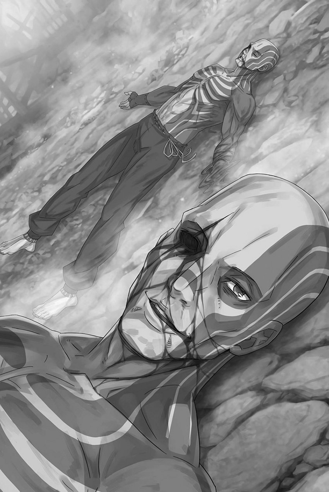

# 『维茨・罗根』

------

——维茨・罗根从不认为，自己能够堂堂正正地活着、堂堂正正地死去。

这个世界总是低估『寻常』的意义。

『寻常』一词通常表示普通、平凡，没有什么特别之处，但对于那些不如寻常人的存在来说，这是高不可攀的标准。

铁血都市『格拉拉西亚』，这是维茨成长的故乡。

整个帝国使用的武器、防具和战斗所需的各种工具都在这里制作。这个疯狂的城市中，工匠们不分昼夜地制作着伤害他人的武器。城里的居民有一半左右以某种形式参与武器制造，维茨也不例外。不过，自他有记忆起便没有亲人，他在工匠的工坊里被分派杂活，对这样的工作没有兴趣，也无法引以为傲。

工作只是为了生存，他在工坊里做杂活，仅仅是因为他出生在铁血都市这样一个地方。

如果主要产业是马具制造，他会帮忙制作马具；如果是农业，他会拿起锄头。

维茨既无执着，也无兴趣，只在锻钢的工匠旁默默干活。他不善交际，旁人也摸不清他在想什么。虽有人夸他勤快，大多数人恐怕还是把他当成一个底细不明、阴森可怕的家伙。

维茨自己并不在乎这些。他从不想与别人亲近。

既然从出生开始就是孤独，那么死去时也自然是独自一人。

或许，正是这种漠视他人、得过且过的活法，招人厌恶。

在他工作的工坊里，有一次关于原材料被盗的疑虑，第一个被怀疑的就是维茨。

他总是独自行动，没有人会为他辩护。他没有办法洗清自己的嫌疑。

最终，他没能洗清冤屈，因不曾犯过的罪行受审，成了罪人。——最初的刺青，是让人一眼就能认出罪犯的刑罚烙印。

刺青刻在双臂肘部以下。城里终年被锻钢的热浪包围，没人穿长袖，因此那印记总是暴露在外。

即使穿上长袖衣服，也很容易被发现心虚。

纹身一旦刻上，他的生活再也无法回到从前。

虽然之前的生活也并非上等，但真正失去『寻常』的时候是那个时刻。

他无法再在正常的工坊工作，为了谋生，维茨染指盗窃，开始从事原材料盗窃和贩卖，最终成为了一个真正的罪犯。

——简而言之，罪恶是后来赶来的。

当初被怀疑贩卖原材料时，没有人听维茨的解释，那时候他还不是罪犯。然而，后来，维茨最终成为了罪犯。

或许，人们会说，他本来就注定成为这样的人。

「如果我是个可憎的家伙，那就让我这样吧……」

纹身使他成为罪犯，现在无论从谁的眼中看，他都已经摆脱了『寻常』的自己。他在干邪恶的勾当，赚取微薄的生活费，但仍然无法与他人相处融洽。

既然如此，那些烦人的交往，不如一开始就全部舍弃。

原本仅在小臂上的刺青，被他亲手扩大到肩头、胸膛，渐渐覆盖上半身，再延伸至双腿，甚至脸与头。

手臂上的纹身是罪犯的证据，但全身纹身是危险的标志，不可靠近。

所有人都会害怕地躲避，给他让路。曾经被所有人抛弃、成为可怜罪犯的那个男人已经不在了，如今只剩下一个没有什么可失去的麻烦『非人』。

所以——，

「——站住，罪犯！别以为你会轻松逃脱！」

被城市守卫围住，武器指向他的维茨立刻投降。

倒在他脚下的血迹斑斑的人，曾是他初次成为罪犯的工坊里的学徒。

那个耳朵被咬掉、流着血泪哀嚎的男人，正是当年将罪名栽给维茨的真凶。听到他在酒席上泄露此事的传闻，维茨便找上门来报复。

将嘴里含着的耳朵吐出，维茨被城卫军逮捕，投进了牢房。

维茨在铁血都市早已恶名昭彰，自然无人给他出路。不久，处置便定了下来——以罪奴的身份，送往臭名昭著的剑奴孤岛。

他既没有反抗的精力，也没有反抗的意愿，被迫渡过湖泊。

被送往那个地方后，他被迫与同样命运的贫弱之人组队，参加与世上恐怖魔兽战斗的仪式。

无论如何都无所谓。他并没有死的打算。

即使牺牲了别人，他也要活下去，总有一天。

总有一天，重回『寻常』的——。

「――维茨！拿起剑！我们指望你！！」

——他只是想被当作一个『寻常』的人来对待。

※ ※ ※ ※ ※ ※ ※ ※ ※ ※ ※ ※ ※ ※ ※ ※ ※ ※ ※ ※ ※ ※ ※

「保护……！」

就在看到被踢飞的看守的头颅在空中划出一道血线的瞬间，维茨将身边的施瓦茨推向了坦萨。

这个穿着和服的少女，拥有与其幼小外表不符的强大力量。

然而，她并未完全掌握这股力量。身体与心灵的力量不协调，令人难以依赖。与施瓦茨，却是个不错的组合。

身体虚弱、心灵强大的施瓦茨。他应该能够善用坦萨的力量。

所以，在这一瞬间，将施瓦茨推向身体强大、内心却脆弱的坦萨，应该是对的。

而做出这个选择的维茨自己——，

「哦，哦哦哦……！」

向前冲去，用挥舞的手臂将飞来的看守的头颅砸向通道的地面。

一瞬间斩断友军的头颅，然后将其踢飞，这种惊人的行为让维茨等人的思维暂时停滞。但这应该不是全部。

事实上，维茨以外的四人的判断稍有迟钝，但维茨还是能够行动。

施瓦茨如此警惕的男子，他的目标绝不仅仅是这个。

正是在维茨思考的下一瞬间。

「――啊！？」

维茨紧盯着正面持斧逼来的男人。就在他侧面，黑色怪鸟——剑斗兽撞碎走廊的墙壁，闯了进来。

它破碎了维茨身后半步的墙壁，横扫了岛屿上层的通道。

针对维茨等人的空中攻击——不，不对。虽然是剑斗兽，但它的目标并非维茨等人。

「――――啊啊！！」

破碎的墙壁中现身的怪鸟，用尖嘴刺穿了地面上翻滚的看守的头颅。

怪鸟朝着通道冲来，瞄准了被斩断的看守的头颅。这其中的意义尚不明了，也无暇深思。

「你这家伙……！」

在半步之外，突如发生的剧烈冲击让维茨的背后遭到了壁碎片和剑斗兽锐利翅膀的划伤。尽管如此，他还是紧咬牙关，没有将目光从那个男人身上移开。

得知施瓦茨的身份后，那个男人不仅没有屈服，反而更加充满了杀意——太危险了。

与维茨的纹身制造出的虚假危险不同，这是真正的威胁。

无论如何，他都要挡住这个威胁。

「——」

看着向前的维茨，那个男人狠厉地眯起了眼睛。

对方一言不发，光凭眼神就能看出杀意。眼见男人左手挥起斧头，维茨也举起自己的左臂。

那是最早被纹上刺青、成为罪人证据、将他带到这片土地的臂膀。

他用尽全力迎接男人的一击，但——

「咕，嘎……」

毫不留情的斧头，从维茨左侧劈向他的脑袋。

维茨将举起的手臂挡进斧刃的轨迹，横过来而非竖着，迎上那一击。命中的瞬间，肘骨碎裂，上臂与肩膀的骨肉也一并被砸烂。

冲击与剧痛令视野染成血红，左臂则蒙上了与刺青截然不同的黑红色。

然而——

「挡住了……！」

由于不是等待着对方的攻击，而是主动踏出一步，斧头的威力稍微减弱了一些。

这使得维茨的头颅没有被击碎，也没有结束他的生命。虽然他原本就有被认为是异常的胆量，但却没有与之相称的判断力。

直到他遇到一个比自己更无畏的孩子，胆量和判断力才结合在一起。

因此，那次相遇让维茨的手臂能够触及那个男人——

「可没挡住啊。」

在左臂被摧毁的情况下，维茨试图用仅剩的右臂抓住那个男人。然而，在那一刹那，男人的身影消失了。

――不，男人并没有消失，只是看不见了。

对方一旦移出视野，便会消失在模糊的黑暗之中。

就像刚才那样。然而，这有些奇怪。很奇怪。突然间，维茨的视线右侧，看不见的部分瞬间扩大了。

就好像维茨的视线右侧突然被什么东西压碎了一般。

「维茨——！！」

在消失的男人尚未找到的情况下，有人叫着充满疑惑的维茨。

他缓缓地回过头去，看到了破碎的通道和喷出的烟雾。而消失的男人正挥舞着斧头，将那只破坏通道的怪鸟的脖子砍了下来。

「——」

在砍下怪鸟脖子的男人身后，摇摇欲坠的通道上出现了四个人的身影。

有人向后退着，也有人跌坐在地，但四个人似乎都避开了怪鸟的突袭。维茨竟为此松了口气，连他自己都有些吃惊。

在惊讶的同时，他想对那些愣愣地看着这边的人说句话。

破碎的左臂很疼。不知为何，脸的右侧也开始疼起来。

在这种痛楚中，他的意识渐渐变得模糊，但却努力抓住它，不让它远离。

「这是第一次……」

「维茨……！」

「说相信我的人……你是，第一个……」

喃喃自语的维茨明白了，那些困扰他内心的情感究竟是什么。

明白了之后，他的膝盖失去了力气，倒在了地上。

「维茨——！！」

再次听到有人情感激动地喊着自己的名字，他闭上了眼睛。

不知为何，心情异常舒畅。

※ ※ ※ ※ ※ ※ ※ ※ ※ ※ ※ ※ ※ ※ ※ ※ ※ ※ ※ ※ ※ ※ ※

昴想奔向倒下的维茨，却被一只伸来的纤手拦住。

他回过头，穿着和服的少女正含泪摇头，不肯让他冲动行事。

然后，在甩开那指头之前——

「——！」

一声撕心裂肺的尖叫响起，通道的天花板被从上方压垮。

倒在地上的维茨的头顶，无法承受重量的通道在发出剧烈的响声中崩溃，将身处下方的维茨吞没，地板也随之破碎。

走廊塌向下一层，维茨与压碎顶棚的灰色巨蛙，一同直直坠下。这一切，就发生在昴眼前。

那个左臂被斧头击中，右眼被刀刃破坏的维茨。

「维茨——！」

昴伸手探向崩塌的地板、顶棚和坠落的走廊，嘶声喊叫。

维茨掉了下去。那个为了保护昴他们，向前跳出的维茨。他们必须尽快跳下去，去救维茨。

「第二只自己掉下去了，真走运。杀魔兽也是件费劲事。」

在昴的思考陷入混乱之中，托德看着破碎的通道，喃喃自语。

他的脚下，是被斩断脖子的黑色巨鸟的尸体。这是闯入通道后，被托德用斧头杀死的魔兽。

所发生的事情太过仓促，无法消化。

托德做过什么，眼前发生了什么，一切都来得太快。没有理清这些，就无法去想其他的事。——无法去想维茨的事。

维茨遭遇了什么，如今又怎样了，昴不敢去想。

不能想象——

「——魔兽会吃掉折断自己角的那个人的尸体。」

「——」

突然，肩扛斧头的托德这样说道。

昴和其他人还没完全接受眼前的局面，都被托德的话语惊呆了，纷纷望向他。

托德在接受了四人的目光后，指了指脚下的尸体。

「折断角可以让魔兽屈服，但在被命令期间，它们一定积蓄了很多怨气。当那家伙死了，魔兽会为了泄愤吞食尸体。恶心吧。」

耸了耸肩，托德谈论的是鲜为人知的魔兽生态。

昴既不想知道他是如何得知的，也不觉得这种知识知道了能有什么好处。

然而，这解释了发生了什么。

那只大鸟冲进通道是因为被砍掉头的看守曾折断了它的角，托德事先知道它会瞄准尸体。

托德踢飞头颅，正是想让巨鸟追逐它时，将昴等人卷进去。

但是，事情并没有发展成那样。为什么呢，为什么呢，为什么呢。

为什么，因为……

「因为维茨……」

「他是个外表可怕却重视同伴的家伙。所以才死了。」

「啊。」

这是托德不太像自己的、详细解释发生的事情。

托德的作风是在不告知、不通知、不传授、不给予任何信息的情况下杀人。尽管如此，为什么现在要滔滔不绝地让人听他的话呢？

他让人听，让人理解，让昴的头脑转向下一个疑问。

被杀的两名看守和闯进来的魔兽之间的关联性。

一旦解决了这个问题，昴的思考就会转向下一个目标。接下来是关于维茨的事。

维茨已经死得无法挽回了。

「啊，啊啊啊——！」

不该死的，维茨不应该死。

为了保护昴他们，不该挑战可怕的托德。不该对抗这个对抗就会被杀的怪物。

因为，如果在这里死了的话——。

「终于露出孩子气的表情了。」

维茨死去的事实让昴瞬间充满了后悔和焦虑。

看到这个反应，托德露出了得意的微笑，并举起了他的斧头。

托德详细的解释，其目的就是让昴理清思路。

昴无意识地回避着维茨的死，而托德就是要逼他面对这一事实，击碎他的心，将一个深不可测的敌人，变回有血有肉的人。

「施瓦茨大人！」

昴惊讶得停下了脚步，而赫莱茵和伊德拉还没有从心理上恢复过来。在他们三人之前，率先行动的是坦萨。

坦萨站在昴面前，双手张开，盯着冲过来的托德。

然而，托德皱着眉头看着坦萨的行动，说道：

「你的本事和行动，可配不上啊。」

「诶？」

在挡路的坦萨面前说完，托德骤然屈膝蹲下。趁她的目光被这动作吸引，他将手臂探入她两腿之间，猛地向上一掀。

瞬间，坦萨的瘦小身体被抛起，横向飞出——飞向那被巨鸟破坏、通往外部的大洞口。

「啊」

即使拥有超乎寻常的身体能力，也无法抵抗重力和物理定律。当然，她的身体并非比常人更重，而是只有一个瘦小女孩的重量。

坦萨下意识地伸出手去抓，但是纤细的手指无法抓住任何东西，她的身体被扔到了岛屿的另一边。

「去玩吧」

被扔向空中的坦萨，她的惨叫声逐渐远离，消失在下方。

就这样，挡住道路的坦萨消失了，再也没有人能保护昴他们免受托德斧头的攻击。

「皇帝阁下的……」

「嗯？」

「那是皇帝阁下的孩子啊！你还有理智吗！？」

托德转身看着伊德拉，是伊德拉在大喊。

伊德拉双眼充血，原本和善的面庞因愤怒而扭曲。他责问托德，为何听见昴是佛拉基亚皇帝私生子这一『谎言』，也丝毫不为所动。

然而，托德对他的抗议的回应非常简单。

――他只是默默地挥起斧头，试图劈开伊德拉的头。

「呜哇！」

就在头部被劈开的一瞬之前，被扯住衣服的伊德拉跌倒在地。托德的斧头空挥一击，在惊恐的伊德拉身后，昴慌忙地摇了摇头。

没有办法，他无法说服对方。一开始，这种威胁就是个错误。

昴依赖了过于简单的选择。

因此，他陷入了如今这样的境地。

「躲开了，失败了。不过……」

托德重新架起斧头，一脸不以为然地看向侧旁。跌坐的伊德拉与昴身边，赫莱茵已经拟态，与周围景色融为一体。

与被破坏的地板和墙壁同化，人们根本无法察觉到赫莱茵在那里。

然而，他并没有进行高速移动。

「在我面前消失有什么用」

「施瓦――」

与托德对视时，赫莱茵身体一动，伪装瞬间被打破。

直到那一刻，他与风景的融合还是完美的。而现在，就像将画中的一部分握碎一样，变得非常难看。

接着，从赫莱茵身上喷出的红色颜料与之融合。

「――――」

斧刃从肩头劈入，一直砍至胸部下方，赫莱茵倒了下去。鲜血奔涌，拟态随之解除，灰色蜥蜴人的遗体轰然倒地。

维茨死了，坦萨被抛出，赫莱茵也被杀了。

一个接一个，在昴的眼前。

然后――、

「决斗吧……」

颤抖着的声音中，伊德拉从赫莱茵的尸体旁移开视线，站了起来。

伊德拉指着刚刚在眼前杀死同伴的男人，牙齿打颤。他脸上时而因愤怒涨红，时而因恐惧发青，转眼又茫然惨白，却始终瞪着托德。

那是在『斯帕鲁卡』中，为鼓舞昴等人、也为振作自己而说出的谎言。

与昴草率的谎言不同，他承载着名为谎言的理想。

「如果你也是战士的话――」

然而，这个理想可能过于遥远，伊德拉的理想被背叛了。

「哇！」

「――呃」

虽然是微弱的希望，但伊德拉的请求充满了拼命的努力。

托德却骤然大喝，打断他的话。伊德拉即使虚张声势，也想让自己坚强起来，而这一声正击中了他的破绽。刀刃随即刺入那刹那的空隙。

「咕」

「我不是战士，而是士兵」

伊德拉双膝跪地，颤抖着伸手摸向自己的脖子。托德的匕首刺在喉咙正中，锋利的尖端从后颈透了出来。

伊德拉的手紧紧抓住刀柄，试图拔出插在脖子上的刀。然而，在他拔出刀之前，托德的斧头从正上方劈开了伊德拉的头。

「――啊」

伊德拉向前倒下，托德从他身上拔出匕首。被随意丢在地上的遗体，与赫莱茵的尸体并排躺着，宛如噩梦。

在瓦砾残片之中，维茨的尸体被埋了起来。

被投掷下去的坦萨没有回来，是因为从高处摔下的她出了什么事吗？说起来，跟维茨一起掉下去的那只青蛙也应该在下面吧。

如果是这样的话，坦萨和这座岛上的剑奴们都会怎么样呢？

「实际上，到底怎样？」

「诶……」

「你，真的是皇帝阁下的孩子吗？」

托德把斧头扛在肩上，俯视着垂头丧气的昴。

失去了同伴，连逃跑的力气都没有的昴，被托德这样打量着，终于明白：对方是故意把自己留到最后的。

昴的谎言——皇帝的私生子这个说法，已经让托德心生疑虑。

托德也考虑过，昴真的可能是皇帝的私生子。

「那么……」

「嗯？」

「为什么，不投降呢？如果我是皇帝的……」

如果考虑到他是皇帝的儿子的可能性，那么昴他们的请求应该是有讨论余地的。

昴参与这个行动，利用坦萨等人的误解，是因为他认为这是重新振作『合』成员精神的最佳策略，同时也抱有一线希望。

托德可能会选择举白旗，而非互相残杀，以求生存。

但是，结果，昴失去了所有的同伴，命运掌握在托德手中。

「为什么，你到底……」

「投降之后被随便找个理由杀掉，我才不会做那种事」

「……」

「等到处于有利地位后再去了解事情的真相才是最好的。这样在判断时可以专注思考，也不容易犯错。——而且，更让人安心」

昴叹了口气，听到托德最后一个看似最重要的理由。

感觉就像是一直被托德勒着脖子，这种心情一直伴随着昴。

「不管你是不是皇帝的私生子，你的名字确实让人在意」

「名，字……？」

「菜月・施瓦茨，这个名字跟我所知道的一个可怕的家伙很像。而且你的气味，也跟那个可怕的家伙很相似」

托德轻轻嗅了嗅，目光冰冷地看着昴。

关于气味的问题，在大屠杀的第一次事件——托德来到剑奴孤岛时，他就听说过。

一旦被提及气味，昴的脑海里就浮现出不祥的预感。

「你能察觉到瘴气吗？」

「瘴气？啊，不，不是，别误会。真的是气味，体味而已。我的鼻子有点灵敏。所以，很奇怪」

「……」

「——你是不是有个哥哥？如果有，把你留下来当作与他交涉的筹码，也不是不行。」

昴的疑问被否定了，接下来托德提出了一个令人惊讶的建议。

竟然从托德的嘴里说出可以让他活下去，这是意想不到的。而且，托德口中所说的兄长，很可能指的就是昴自己。

他把身体尚未缩小的昴，当成了眼前小小的昴的兄长。

而且，昴记得自己女装时似乎也向托德报过名字，对方或许也在怀疑他与『夏美・施瓦茨』的关系。

无论如何，只要托德心中有『不杀』这个选项。

「――――」

维茨、赫莱茵和伊德拉的尸体就躺在附近。

一闭上眼睛，古斯塔夫和努尔爷爷的死亡画面也浮现在眼前。此外，在途中目睹了许多剑奴们的死亡，他们的尸体也在脑海中浮现。

一个个都死了。死了，然后……

——然后，昴不能死。

「……你，知道我哥哥的事吗？」

借着托德的误解，昴转换了意识，试图继续对话。

不知为何，托德对大昴保持警惕，这时候就利用这个警惕让小昴活下去。

这样一来，只要度过这个时刻——。

「——等一下」

「哎？」

张开嘴巴，昴正想说出度过此刻的话语，却被伸出来的托德的手掌抓住脸，从指缝间看到了他的眼睛。

托德蹲下来抓住昴的脸，眼神极为冷漠。

然后——。

「——你这家伙，是想操控我吗？」

一声沉闷的响声，锐利的感觉滑进了胸膛。

刀尖的冰冷钻进体内，昴瞪大了眼睛。慢了一拍，那足以令四肢麻痹的剧痛，才在脑后爆发出凄厉的尖叫。

随着那剧烈的哀嚎，昴的嘴巴也发出了惨叫。

「呜啊，啊啊啊」

「失误，失误。真是一点也大意不得。」

昴的胸口深深地插入了一把过于庞大的匕首。

不是说要抽出还是不抽出，而是匕首太大了。刺进去了。刺入的东西很可能破坏了胸膛里的重要器官。

嘴角溢出血泡，身体颤抖着，流着血的口水。

咳嗽着，从嘴里掉出染红的包裹。

已经无关紧要。也不能用了。不能死。死了就麻烦了。死了就不行了。

「别动」

昴翻滚着，试图爬离这里。托德说着，将脚踩上他的腹部，让他动不了，也逃不走。

在这种状态下，托德举起斧头，站在昴面前。

疼痛、恐惧、麻烦、危险，总之，必须停止这种红色的，这种冰冷的痛苦，这种，这个，总之，停下来，不行了。

「不，不能，死……」

「一、二、三！」

虚弱地举起手保护头部。没用的。

落下的斧头刃，砸碎了昴的手，还有下面的头，生命，一切都化为乌有——。

※ ※ ※ ※ ※ ※ ※ ※ ※ ※ ※ ※ ※ ※ ※ ※ ※ ※ ※ ※ ※ ※ ※

「——！」

脑袋被劈开，里面的一切倾泻而出。

感觉仿佛看到了如此可怕的景象，昴在喉咙深处狂喊。颤抖的手伸向头部，双手碰到了自己的头。

没有裂开。没有裂开的头，不疼的胸膛，还活着的生命，一切都还在。

在确认这一切的昴，松了一口气，抬起了头，此时——

「――啊」

慢慢地，向这边回过头来的满身纹身的男子。

他的左臂被斧子砸得粉碎，右眼被刀刺穿，流着大量的血，那就是维茨。

「这是第一次……」

沾满鲜血的维茨的嘴唇颤抖着，吐出了话语。

看到这一幕，昴发出「啊」这样可悲，可悲的叹息。

「说相信我的人……你是，第一个……」

「啊啊啊啊啊啊――！！」

说出无力的话语，维茨的身体倾斜地倒下。

伸出手也好，做什么也好，已经绝对无法挽救的维茨的身体。

不该死的，昴不该死。

不能让这一切，就此成为定局。

从『死亡』重来的起点，仍在不断向后推移——

「啊啊啊啊啊啊――！！」

――当出现无法拯救的人时，菜月・昴的『心灵』将会破碎。

