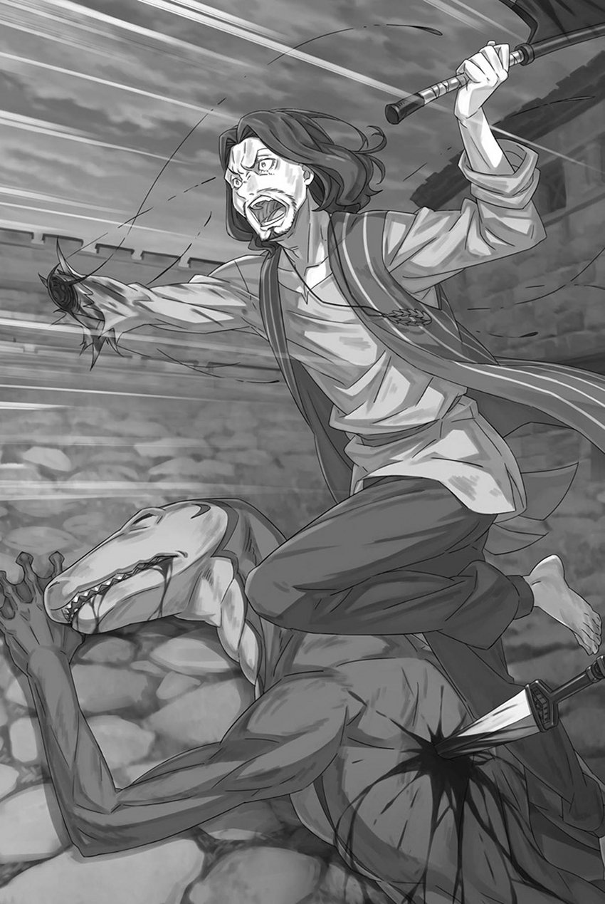

# 『伊德拉・米桑加』

------

脚步声，逐渐接近的脚步声，让昴的心惊恐不已。

必须阻止从帝都赶来的托德和亚拉基亚，这两个制造大屠杀的人。为此拼命，努力地，为了抵挡降临的恶意和不公，全力挣扎。挣扎着挣扎着，不停地挣扎，但最糟糕的事态还是发生了。

以『死亡』为契机的重来起点，正不断向后推移。

此时，昴最害怕的已经不是『死亡』本身，而是自己迎来死亡、跨过死亡之后，就此确定下来的现实。

――无法挽救的生命流失，这是他最害怕的事情。

而逃不过去的某人的『死亡』，正一步步逼近，这更是如此。

「啊啊啊啊啊――！」

眼前的景象，浴血倒下的维茨的身影让昴的喉咙发出惊叫。

大喊着，正要跃出去的昴被抓住了衣袖，动作被封住。抓住他的是坦萨，她的圆眼睛泛着泪光，拼命地摇头向昴示意。这一幕，他已经看过。已经看过了，看过了，是熟悉的画面。

他再次目睹了同样的景象，短短一分钟前就见过的景象。

「――――！」

紧接着，刺耳的叫声撕裂了空气，巨大的灰色蛙将倒下的维茨和通道一同压碎，随即穿过地板，掉进了岛屿的中腹部。

灰色蛙的巨体和掉落的碎片将维茨吞没，消失在视线之外。

「不要，不要不要不要啊啊啊――！」

「施瓦茨大人！？」

拼命地挥动手臂，昴甩开了坦萨的手。将惊愕的少女声音抛在身后，昴朝着掉落的维茨奔去。

只要立刻赶到，就能捡起掉落的他，堵住眼睛和左臂上的伤口，用绷带包扎好，在治疗室里照顾他，一定，一定，一定能――。

「还没――」

「比我想象的更脆弱啊」

无所顾忌地冲向维茨，试图拯救他。

而迎接昴的，是正面挥舞的某种东西。在他意识到那是被血迹染红的斧刃时，已经伴随着沉重的硬响，他的视线开始旋转。

在旋转的过程中，昴看到了一个笨拙地奔跑的孩子的身影。看着那个身影向前倾倒下去，他意识到那是自己无头的身体。

那么，头在哪里？更重要的是，维茨，维茨，维茨……

ｘ ｘ ｘ ｘ ｘ ｘ ｘ ｘ ｘ ｘ ｘ ｘ ｘ

不断旋转的视野突然定格，昴的大脑却仿佛仍被狠狠甩动。

就像突然停止了疯狂旋转的摄像机一样，实际上并没有在动的半规管产生了一种混乱的感觉。

涌上心头的恶心、混乱，还有那种必须要拯救维茨的紧迫感，告诉他现在可不能停下脚步——

「这还是第一次……」

如此回到原点的昴的视线中，看到了浑身是血的维茨喃喃低语的身影。

左臂与右眼流着惊人的血量，再过一秒就会倒下的维茨。

「说相信我的人……你是，第一个……」

「啊啊啊啊啊啊——！」

无法挽回的现实，将菜月・昴的灵魂彻底践踏得支离破碎。

※ ※ ※ ※ ※ ※ ※ ※ ※ ※ ※ ※ ※ ※ ※ ※ ※ ※ ※ ※ ※ ※ ※

灭亡的脚步声，正一步步地悄然逼近。

昴在大屠杀开始后，立刻决定阻止这一切。

最初，重来的起点只是后移了十几秒。可此后，余裕仍被一点点削去，奇迹越来越远，昴心中的希望也被逐渐抹尽。

他潜入古斯塔夫的办公室，与赫莱茵共同探究大屠杀的真相。

不知多少次，他们在与托德等人和古斯塔夫的谈判即将触及核心问题之前被发现，屡屡失败，接着继续尝试和犯错，直至无法回头。

重启地点被推到了与赫莱茵躲在办公室的那一刻。

「———」

从那一刻起，昴的心中响起了灭亡狂欢般的嘲笑声。

赫莱茵伏在昴身上掩护他，恐惧的心跳清晰可闻。然而，心脏跳得比他还猛烈的，恐怕是昴。

如果大屠杀无法阻止，重启地点又被推到了之后，该怎么办呢？

当无法挽回的场景成为重启起点时，菜月・昴到底还能做些什么呢？心中充满了绝望感。

然后——、

「嘶——」

伴着那声毫无紧张感的吆喝，古斯塔夫的脑袋被轰飞。那一刻，昴明白了。

他再也不能死了。如果死了，回到的地方是在古斯塔夫被杀之后的场景，那么他就再也无法挽救他的生命了。

一旦某人的『死亡』确定，那就与昴亲手杀了他们无异。

无法挽救的世界确立，无论是谁的手所导致的『死亡』，都将是菜月・昴犯下的杀人罪。

所以，他拼命地努力活下来。

无论古斯塔夫死去、努尔爷爷死去、剑奴死去，还是看守死去，无论谁死去，他都拼命挣扎着，不让自己死去。

如果昴死了，那些被杀死的人们将真的死去。

即使明知这是一个不合理的想法，昴也只能如此挣扎。

只要昴不死，就能留下一线可能让那些死去的人不再死亡。那样的话，他们就真的可以不死，所以——。

如果永远不死，就能让所有人都免于死亡，这样的幻想。

然而，这种幻想不过是幻想，昴悲惨地失去生命的事实已经证明了这一点。

※ ※ ※ ※ ※ ※ ※ ※ ※ ※ ※ ※ ※ ※ ※ ※ ※ ※ ※ ※ ※ ※ ※

究竟，这是第几次迎来了『死亡』。

「在我眼前消失又有什么意义」

「施瓦——」

昴无力地跪在地上，面前那声试图呼唤他名字的喊声，骤然中断。

毫不留情地挥舞的斧头将赫莱茵的生命连同身体斩倒，瞪大着白眼的他倒在地上发出巨大的响声。

血液汩汩流淌，渗透到地板上，与之前倒下的伊德拉的尸体的血混合在一起。

头颅被劈开的伊德拉，这次比赫莱茵更早被杀。

因为昴没有及时从第一次托德的攻击中救出他。先是伊德拉被杀，然后赫莱茵被杀，最后又剩下昴。

坦萨已经被托德抛出墙洞之外。

重来的起点，已经后移到了能听见坦萨坠落时的惨叫的那一刻。

手臂与脸遭到重创、和蛙形魔兽一起被塌陷的走廊吞没的维茨，为了保护昴而被抛向外面的坦萨，都已被『固定』在昴无从干预的现实里。

接下来——，

「说实话，这到底怎么回事？」

昴瘫坐在那里，双膝沾着两人流淌的血。托德将斧头扛在肩上，如此问他。

麻木的大脑疼痛不已，将接下来的话告诉昴。

已经听过很多次的托德的问题，那就是——。

「你究竟是不是皇帝阁下的孩子？」

「……别抢我台词。」

低头的昴的话语让托德愠怒地咕哝道。

虽然不知道心里被猜中后到底在想什么，但看来并没有达到让他立刻发怒来杀人的危机感。

并非是想给他危机感，而只是不由自主地说出口。

不过，如果托德的节奏被打乱了——，

「如果不想死，就别动。」

说着，昴从怀里拿出了一个黑色球体——被植入古斯塔夫身体的咒具，向托德显露出来。

黑球上的血已经擦掉，质地与触感像玻璃珠，明明只有高尔夫球大小，却沉甸甸的。

到底是由什么制成的，材质是什么并不重要。

重要的是，这东西蕴含着巨大的、残酷的力量。

既然它是发动『咒则』的钥匙，也是托德想要的东西，就能派上用场。

它应该能成为第二个让托德听自己说话的机会。

「这个，就是咒则所需的。如果不想死的话……」

「——你，那个是」

「——现在！是我！在说话！！我说不想死就听话，你听不见吗！？」

挥舞着手中的咒具，昴怒吼着，口水飞溅。

充满后悔和绝望的脑袋已经没有余裕，甚至没有留出空间来琢磨托德的话。只是让他顺从，愤怒涌上心头。

「哎呀，我知道了我知道了。」

看着昴的愤怒，托德轻轻叹了口气，放下斧头举起双手。

看着毫不犹豫地听从指示的托德，昴目瞪口呆。对于昴的反应，托德一边挑起眉毛，

「你真是个奇怪的家伙。不是你让我这么做的吗？」

「那，那是……这么，简单的，事情……」

面对托德，昴无言以对，瞪大了眼睛，痛苦地后悔自己的愚蠢。

这不是关于皇帝的私生子的问题，一开始就应该用咒具作为盾牌。因为害怕和焦虑，他贸然选择了简单的方法，结果把一切都搞砸了。

古斯塔夫和努尔爷爷，还有维茨和坦萨，都是因为昴。

都是因为昴没有好好动脑筋，没有好好思考——。

「你知道那个东西怎么用吗？」

「诶……？」

正在责怪自己的愚蠢，后悔不已的昴的思绪被声音打断了。

面对举起双手的托德的提问，昴发出嘶哑的声音，看着手中的咒具。如果说使用方法，他并不知道。这个东西没有明显的开关，也没有只要拿在手上就能明白使用方法的机制。

「——就是这样吧」

然后，仅凭那犹豫的眼神，托德立刻识破了他的威胁。

「要是知道，就不会拿这玩意儿来威胁我了吧。」

「啊」

紧接着，托德举起双手，用抬起的脚将昴的手踢飞了。

手中的咒具被踢出，黑色的球体弹跳到空中。不由自主地跟着抬头看去，昴又做了一个愚蠢的举动。

抬头就等于将脖子伸向对方。

「————」

跟踪弹跳起的咒具的视线，突然间中断。

中断之前，他似乎感觉到了从左侧到右侧传来的刺耳声音，但是已经没有办法确认那是什么，也没有理由去确认。

然后，他只能承认。

——他想不出任何能够阻止托德・芬格的方法。

※ ※ ※ ※ ※ ※ ※ ※ ※ ※ ※ ※ ※ ※ ※ ※ ※ ※ ※ ※ ※ ※ ※

——装好人被人耻笑，最后被夺走一切的蠢货。

这是周围的人对失去家业，流落街头，最后沦为奴隶的男子伊德拉・米桑加的评价。

他的故乡位于帝国西北部的一个小农村，那里是米桑加家代代经营磨坊的土地。磨坊的创始人是伊德拉的祖父的祖父，据说他相当有本事。

那位先祖得到领主委任，管理村中河畔的水车磨坊，将村里谷物的磨粉生意全揽了下来。

回报丰厚，所费劳力却少。在那些收成必须仰赖米桑加家加工的人眼中，伊德拉便是出身特权阶层。

然而，伊德拉和他的家人，并未因家业而傲慢生活。虽然他们的生活无疑比周围人富裕，但在歉收时期，他们代替村民承担向领主支付的税款，亲自进行谈判，代替村长履行应尽的职责，作为村里一员积极参与。

──诚实地经商，努力赢得广泛的信任和信誉。

这是米桑加家的家训，也是经营磨坊的信条。

磨粉时暗中私吞送来谷物的人并不少，世人看待磨坊主的眼光因此格外严苛，更应该谦逊待人——无论伊德拉还是他的父亲，都曾被主持家业的上一辈这样严加叮嘱。

正因为容易引起怀疑，所以要时刻敞开胸怀对待他人。决不独占财富，与周围人共享苦乐。尽管这在尊崇强者的佛拉基亚帝国并不正确，但在帝都铁血法则无法触及的边境寒村，这种做法一直受到尊重。

伊德拉也是从小受惠于此，成长起来的人之一。因此，当他因父亲重病提前接手家业时，他决定继续守护这一传统。

「真实而美好的生活，让人羡慕。」

羡慕伊德拉生活的是，一个来到村子酒馆的男子。这个散发着老练战士气息的男子，手持大剑，透露出他是一个游走于各地战场的雇佣兵。伊德拉觉得这样的外来者很罕见，于是与他畅饮，聆听了各种故事。

对于几乎不了解外部世界的伊德拉来说，那个男子描述的世界充满惊奇。与安宁的农村及其缓慢流逝的时光不同，那个男子生活的世界充满危险和残酷，然而同时也充满了难以忘怀的激情。

在那之前，伊德拉总是有着一种模糊的向往。作为佛拉基亚帝国的一员，除了继承家业，他是否还有其他选择？这种并未认真思考过的愿望一直存在。

他希望能过上尊重自己的力量和信念，绝不选择卑劣生活的战士之道。

「伊德拉，你有个表姐吧。事实上，我对她很感兴趣……」

男子每隔几个月就到村里一趟，每次都和伊德拉喝酒，两人渐渐熟络。在一起喝过不知多少回的某个夜晚，男子郑重地向他吐露心意。表姐正值婚龄，尚未嫁人，而伊德拉也很欣赏这个男子。

于是，伊德拉毫不犹豫地向他介绍了表姐，并帮助他们建立了牢固的关系，直至筹备婚礼。在婚礼之夜，他们欢庆新家庭的诞生。

然而一个月后，男子与表姐共谋，窃取了磨坊的家业。

男子声称表姐也有继承米桑加家业的资格，进一步指责伊德拉和他的父亲一直在粉磨过程中捣鬼，向村民谎称粉磨成果。当然，伊德拉坚决否认这一事实，但是磨坊主这个职业本身就容易引起怀疑，村子里的意见分歧严重。

在事情尚未解决之际，重病的父亲病逝，而操劳过度的母亲也紧随着离世。

「我已经无法再忍受了。无论如何，我要守护我的家……！」

伊德拉为已故的父母祈祷，诅咒自己的轻率，但仍决定反击。如果那个男子和他的表姐企图行恶，那么伊德拉就要正当地夺回权利。为此，他请求村民作证，向那个男子提起诉讼。

他相信米桑加家一直以诚实经营积累起来的信任，能帮助他伸张正义。然而——，

「为什么，这是怎么回事……」

约定的地方没人出现，反而从伊德拉的家里找到了武装起义的准备。

被陷害，他在领主面前经受了一场不愿意的审判。伊德拉拼命地辩解自己的清白，但村民们没有一个人站出来为他辩护。

男子和表姐策划了一切。

村民们选择了虽然说谎、但会给他们利益的男子，而不是诚实的伊德拉。

没有胜算，一点都没有。

家业被夺，成了奴隶的伊德拉被贩子送到了岛上。

失去了去处，即使仅剩的生命也受到摆布的最恶劣之岛——基奴海布。

在那里以生死为观赏的战斗中，伊德拉感受到自己的心变得黑暗，灵魂腐烂，于是考虑顺从绝望。

已经够了吧。

拼命努力，没有得到回报，那么为什么还要继续努力。

相信的东西是假的，信赖的事情是错误的。

每个人都在考虑利用别人，只为自己活下去。

既然如此，自己也这样做，没有什么不好。

说到底，一无所有的，正是伊德拉。

谁也不会选择他，那是理所当然的。

没有锻炼出的力量，也没有特殊有用的能力。谁会选择伊德拉？

就连伊德拉自己，也不会选择伊德拉。

尽管如此，究竟谁会选择那个只是愚蠢正直的伊德拉呢？

「你不是想成为战士吗，伊德拉！那么现在就是时候！现在正是那个时刻！」

—— 诚实地活下去，应得的回报的日子，应该是永远都不会到来的。

※ ※ ※ ※ ※ ※ ※ ※ ※ ※ ※ ※ ※ ※ ※ ※ ※ ※ ※ ※ ※ ※ ※

「――――」

伊德拉因为剧痛的头痛而无法动弹。

舌头发麻，喉咙好像被堵住了，无法呼吸。手脚的感觉变得遥远，仿佛自己的身体已经支离破碎，被这样的恐惧袭击。

感到恐惧，已是无可避免的事。

想起刚刚发生的事情，即使是在家乡没有人支持他的时候，全身的血液仿佛冷冻一般的感觉，也远不及现在的恐惧。

眼前的维茨被杀死，勇敢的坦萨被扔出通道。

看着这一幕，伊德拉只是僵硬地站着，什么也做不了。因为这种胆怯，相较于维茨和坦萨，他能活得更长久，真是讽刺。

多活这几秒、十几秒，真抵得过焚烧胸膛的屈辱吗？

无法做任何事情，却眼睁睁看着那两个有能力的人死去。

伊德拉因为这个事实带来的绝望和悔恨，比起因为鲁莽行为而让家业陷入困境的过去，更加沉重。

「哈」

想到这里，伊德拉不禁笑了笑自己的人生经历之浅薄。

除了失去家业的人生跌落，他想不出任何痛苦的经历。——他意识到，他曾是如此幸运、富足。

也许正是这样的伊德拉，激怒了那个夺走他人生的男子。

即使是这样，也不意味着那个男人的所作所为可以被原谅。

「———」

伊德拉以极其微弱的呼吸，模糊的视线环顾四周，想弄清楚周围的情况。

到底发生了什么？全身疼痛和这种不知所以的感觉是否有关联？更别说，这一切都是真的吗？

整个剑奴孤岛的人都可能被杀，施瓦茨是皇帝阁下的私生子，维茨和坦萨都被杀了，这一切难道不是梦吗？

全都是梦，伊德拉现在依然过着在幸福生活中觉得无聊的奢侈时光——。

「你还真是豁出去了啊，小伙子」

突然，一个冰冷的声音传来，伊德拉忘记了身体的痛苦，僵硬起来。

全身的血液仿佛被冻住，伊德拉慢慢地意识到，那声音的主人正逐渐接近。

然后——，

「虽然比站着要好，但是毫无计划地跳下去，结果自然会变成这样」

那是一个男人带着无奈的声音，但并不是对着伊德拉说的。

听见那声音是朝离自己稍远的地方说的，伊德拉暗自松了口气。可他终究没忍住，眯起眼，望向声音所指的方向。

在那里——，

「啊，哦」

一头黑发的少年满身是血，狼狈不堪地爬行着。

「……」

看到那爬行的少年，以及这里已经不是刚才的上层通道，伊德拉脑海里回想起发生的事情，那些在失去意识之前的事情。

维茨被杀，坦萨被扔出去，伊德拉在被杀之前因为无法理解那个疯狂行凶的男子的想法而大喊，施瓦茨采取了行动。

大喊着的施瓦茨抓住呆立的伊德拉和赫莱茵的腰，跳进了与坦萨被扔出去的墙洞相反的另一个洞口。

冲过来的巨鸟打开的墙洞，坦萨掉到了岛的另一侧，施瓦茨带着伊德拉他们跳进了相反的一侧——尽管如此，他们幸存的希望依然渺茫。

身体在墙面上刮擦，被凸起撞开，最终从高处摔向地面，就这样死去。

进行了十次，九次都会死去的冒险，但只剩下这样的紧急逃生。

抓住这次幸存的机会可以说是奇迹。但是，奇迹就到此为止了。

爬行的施瓦茨和倒在地上的伊德拉，都无法从追击的男子手中逃脱。

赫莱茵的身影看不到了，是因为他没能成功落在这半山腰的平台上，还是运用了伪装术，藏匿起来了？

即使他真的藏了起来，也不能对赫莱茵的勇气抱有期待。

他算不上恶人，却也绝不勇敢。畏畏缩缩、胆小，又容易得意忘形，虽然很亲近施瓦茨，却难以指望他做更多。

尽管如此，如果他有可能不死，那就让他憋住呼吸，躲起来吧。

如果施瓦茨拼命抓住的奇迹能救活赫莱茵，那也不错。

这样的报酬，是应该支付给施瓦茨的。

「……」

不经意间，伊德拉突然想到了。

从高处跌落，浑身破烂不堪的状态，此刻那个男子的注意力在施瓦茨身上，说不定伊德拉也能被当成死去的人而被忽视。

那个男人再可怕，总不至于把每具尸体的脑袋都砸碎一遍吧。

如果伊德拉的表现够逼真，让他认为自己已经死了，说不定就能活下来。就这样，至少自己一个人，能够幸免于难。

「――――」

这是一个选择的时刻。

伊德拉・米桑加将为了生存而牺牲什么，又将获得什么？

在这个残酷的世界里，强者和狡猾者可以得到一切的地方，伊德拉・米桑加到底会选择成为什么样的人？

曾经相信只要诚实，就能赢得信任和信誉，然后失去一切的男人——。

「——一、二、三！」

双手紧握斧头，准备将它挥向爬行着的少年的头部。

屏住呼吸，闭上眼睛，从一切事物中抽离。

——那样一来，到底又能救得了什么？

「不，啊啊啊啊——！！」

伊德拉强行使全身动起来，把贴在地面的身体撕扯下来，一边吐出大量的血，一边狼狈地奔跑。

奔跑着扑向那个男人的背影。因为左手不能动，所以只用右手，死死抓住那个男人的身体，准备拼命咬住他。

「我知道你还活着」

仿佛嘲笑伊德拉的决心，男人松手，让高举的斧头落向背后，空出的手立刻拔出匕首。转身一闪，伊德拉的右臂便从肘部被斩飞。

因为磨粉机水车的作用，伊德拉从未经历过重体力劳动，他那苍白纤细的胳膊被砍飞了。然而——。

「——带他走啊啊啊！！」

从被砍掉的胳膊处疼痛蔓延，伊德拉的视线变得一片血红。但在那一刻，他忘记了痛苦，拼尽全力地大喊。

那仿佛呕血般的嘶吼，让眼前的男人微微扬眉。

伊德拉的呼喊和行动，男子似乎无法理解其目的。

然而——。

「切」

男人咂舌转身，掷出刚刚斩断伊德拉手臂的匕首。

刀锋指向他的身后，原本在地上爬行的施瓦茨——不，施瓦茨已经不在那里。它瞄准的是那片扛着施瓦茨逃跑、不断蠕动的景色。

那是赫莱茵。

原本藏身潜伏的赫莱茵扛起了施瓦茨，开始逃跑。伊德拉看到这一幕，咬紧牙关，扑向男人的背影。

右臂已经不在，左臂无法动弹，伊德拉只能咬住男人的衣服紧紧抓住他。

「哼」

男人反肘击中伊德拉的胸口，再一脚将滑下的身体踢倒。可倒地时左臂受到的撞击，竟让它伴着剧痛恢复了知觉——脱臼的肩膀被撞回去了。

而此时，男子丢掉的斧头恰好滚到了伊德拉的左臂旁边，奇迹般地连续发生。

「你就没想过，他已经逃了吗？」

匕首已经掷出，斧头又被夺走，男人歪着头看向伊德拉。

即使失去了武器，他的表情却丝毫没有显出处于劣势。这也是理所当然的。伊德拉流了很多血，血流不止。

侥幸活着已经是个奇迹，太多奇迹已经发生了。

所以，伊德拉对男子的质问摇了摇头。

「不，我以为他已经逃了。但我也愿意相信。」

「——」

「相信他能留下来，没有逃走。」

畏畏缩缩、胆小、容易得意忘形，不过是算不上恶人的男人。

伊德拉只是笨拙地相信，赫莱茵若能不逃跑而留在原地就好了。

果然，人性很难改变。

他试图欺骗并利用周围的人，自称是战士的谎言也很快就被揭穿了。

诚实地，广泛地得到信任和信用。

即使被指着鼻子笑话说是装好人。

伊德拉・米桑加，既不能成为战士，也不能成为骗子。

他用左手举起斧头，流着血的伊德拉大喊道。

「我是伊德拉・米桑加！我是磨坊主的儿子！！」

「我才不关心呢」

榨尽最后的力量，伊德拉向那个满脸漠然的男人冲去。

—— 那一天，多亏了施瓦茨，他没有成为一个说谎者，心里暗暗庆幸。

※ ※ ※ ※ ※ ※ ※ ※ ※ ※ ※ ※ ※ ※ ※ ※ ※ ※ ※ ※ ※ ※ ※

昴被扛在拼命奔跑的身体上，带离死地。

对方跑得剧烈，根本顾不上他的伤口与安危。可这也是理所当然的。

虽然昴也疲惫不堪，但对方的身体状况更糟糕。

「赫、莱、赫莱、茵……！」

被痛苦地抓住腰，昴把指甲插进了对方的身体。甚至不清楚抓到了哪里。被抓的对方，外观已经一团糟。

并非只是伤痕累累，而是颜色、花纹，总之一切都乱了套。

他不断模仿沿途的景色，仿佛已经不知道该以哪一处为准。那具仍在奔跑的身体，突然失去力气，向前倒去。

「啊！」

理所当然，如果对方摔倒，昴也会被卷入。

被摔倒的对方扔在前面，昴滚到了冰冷的石地板上。由于没有做好受击动作，感觉门牙都要断掉了。

就这样，疼痛不已地抬起脸，趴在地上看向后方。

在那里——

「喘、喘……」

如字面上所说，喘息着的赫莱茵躺倒在那里。

赫莱茵无力地趴着，背部正中央深深插着一把大号匕首。不知道是什么时候刺中的。

是在跑步逃跑时还是在之前，即使是更早之前也无能为力。

如果昴死了，会回到伊德拉的头被破开之前。

也许已经被破开了。——不，因为为了不让头破裂而跳出去，所以是在落下之前，之后，还是在空中。

要让三个人都活着落地，无论怎么做都很难。明明感觉这是第一次成功，托德却追来了。

伊德拉的声音，赫莱茵的呼吸，都很遥远。

已经，一切都在手不可及的地方。

「好、奇怪啊、……」

趴在地上，努力爬行的昴的耳边听到了赫莱茵微弱的声音。

那声音像是从水中探出头来说话，大概是喉咙里灌满了血。恐怕得想办法把血弄出来，做些这样的处理。

必须要做，即使不是医生，也必须要做。

「生、命啊……就像花一样，先被摘走的，总是漂亮的……以前，听人说过……」

「别、说话了……我现在、就去，马上……」

「那么、像我这样、品性恶劣的家伙、先死了，就很奇怪了……啊」

挣扎着爬行。努力往前爬。

为了把将要溺死在自己鲜血中的赫莱茵扶起来。

然而，身体怎么也无法向前挪动。

「但是……」

怎么也前进不了，无法触及。

「……我先死，总比较好、吧」

比乌龟爬得还慢。动作缓慢得无法形容，像一只昆虫一样小的动作，努力爬行。

继续爬，一直爬，当终于触及到时，已经太迟了。

赫莱茵的颜色已经恢复成原来的灰色。

背上插着刀，胳膊也折断了一根，浑身流着血的赫莱茵，就算是在跑过来的途中死去也不奇怪。

或许他在死去的同时还在跑。肯定是这样。

已经，昴无法救助的人都死去了。

简直就等同于，是昴亲手杀了他们。

因为没有救到所有人，就跟杀了所有人一样。

「呜咽」

脸上流下的是血，还是泪水，还是鼻涕。

已经分不清哪个是哪个，什么是什么，谁是谁，答案是什么，都已经。

已经，已经，已经，已经，已经，所有的一切都不知道了。

「——哎呀，那边在呻吟的是不是巴斯呀？」

「――――」

「啊啊，果然是巴斯！真是巧合啊，在这种场合相遇。情况变得相当热闹了，你享受吗？」

呆愣地望着，心情如同失去了一切的昴，轻松的声音传来。

无法转头看向声音的来源。竭尽全力试图将身体扶起，用眼睛看着这个对他说着荒谬话语的人，然后说些什么，用尽全身力量去——。

「不用特意拼上性命回头看我哦。」

「——啊」

「毕竟，这里可不是该用尽全力的地方吧？」

说着，他自己走到前面——塞西尔斯凑近昴的脸说道。

身体左半边被烧焦，却依然满不在乎地笑着的『青色雷光』。

