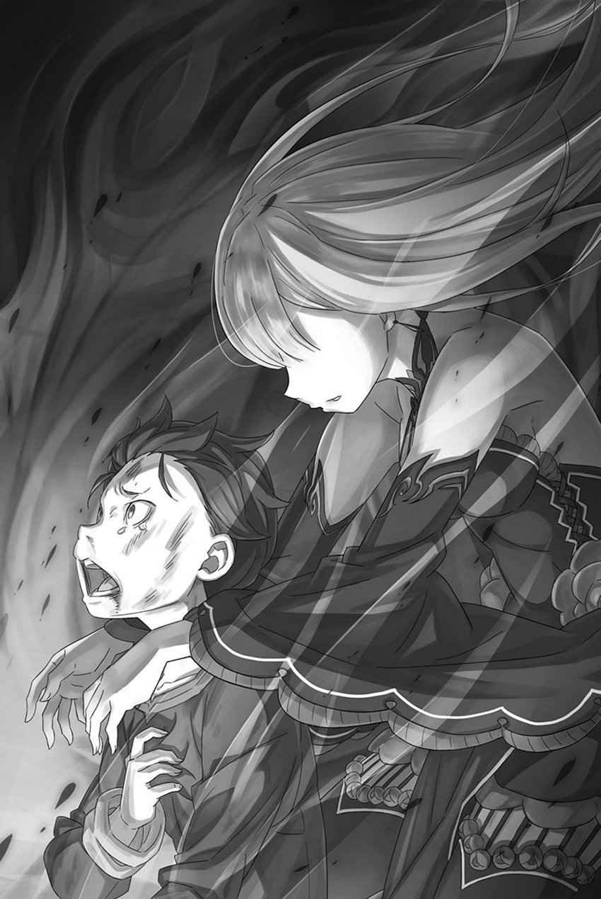
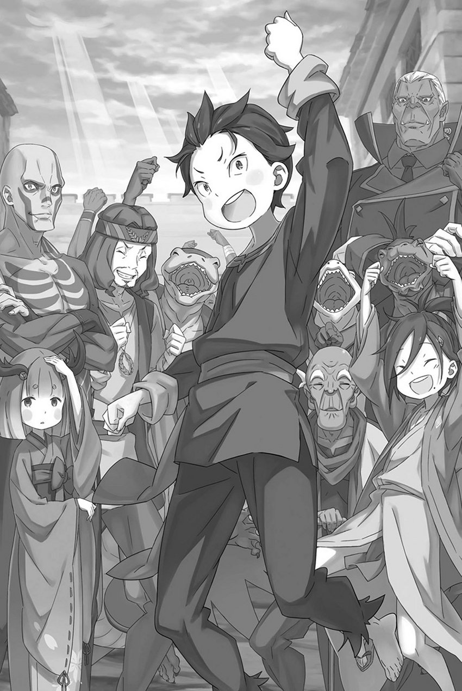

# 『I know』

------

——在这令人绝望的惨状面前，那爽朗的笑颜与声音未免太过违和。

尽管身上的和服被火焰惨烈地燃烧，脸的左侧也是一片焦黑，但看着昴的塞西尔斯的态度还是一如既往，实在是过于异常了。

不只是他。——现如今还活在这个岛上的全员，都是些异常的家伙。

正常人肯定都已经死了吧。

眼前的塞西尔斯、追着自己的托德、四处杀戮的亚拉基亚、还有大罪人昴。

这些人都过于异常、才能恬不知耻地活下来。

所以——、

「塞、西……」

「看起来你那边也挺不容易的呢。那边的蜥蜴人先生已经死了、看这情况鹿人小姐还有其他两个『合』的队友也都死了么」

「――」

「哦呀，难道你还没有承认，他已经死了吗？」

塞西尔斯从昴震惊的眼神里读出了他的想法。

突然、愤怒之情涌起。明明能像这样读出他人的想法、那为什么就不能理解昴现在的心情。

听到赫莱茵死亡讯息的昴到底该怀着怎样的心情。

为什么、能这么轻易地提及死亡。

「已经死了哦、完全的。……但是、嘛死的时候表情看起来不错」

「明明，都死了……！」

「你觉得人都死了，还谈什么好坏？那我们可就意见不同了。有好的活法，自然也有好的死法。旁人如何看待，就别去横加干涉了，那可不风雅。蜥蜴人先生死得很好，这张脸就是证明。」

「————」

「仿佛是完成所有使命后才死去的表情、我也想像这样呢」

听着塞西尔斯说个不停、昴一言不发。

昴并没有被说服，只是觉得争辩毫无意义。他不想看赫莱茵死去的脸，也丝毫不觉得能与塞西尔斯互相理解。

所以、附和他话语的理由一点也没有。

「那么、虽然在这和你偶遇了、但实际上我也很忙呢。现在我正在和在岛上大肆破坏的半裸女性绝赞对决中哦」

塞西尔斯伸了下懒腰、擅自把话题继续下去。

对于他指的是谁、只能认为是亚拉基亚了。

按照托德吩咐开始大虐杀的亚拉基亚、与仅有战斗力不是出类拔萃这一可爱优点的托德组合在一起、就成了完美无缺的邪恶。

还在想把剑奴的头做成水气球后怎么就不见了、看来阻挡在她前面的是塞西尔斯。

即使再不成样子、果然能够阻止『九神将』的也只有身为『九神将』的人。

「不过、如你所见我也陷入苦战了呢。呀真是服了服了。还真的存在呢、能和我一较高下的对手。我还以为我的天剑之路只能一个人走完了」

「……为什么」

「嗯？怎么了？」

「为什么、现在还能、乐在其中……」

仿佛将灵魂都榨了出来，昴挣扎许久，最终说出口的却只是迁怒。

对、仅仅是迁怒罢了。在这地狱般的状况下、维茨也是坦萨也是伊德拉也是赫莱茵也是、大家都在这个岛上失去了生命。昴恨着此刻还笑着的塞西尔斯。

为什么还笑得出来。这个状况哪里有意思了。

「为什么……！」

「啊啊，你把因果弄反了。我不是因为开心才笑，而是在营造一种因为笑着、心情便会渐渐愉快起来的局面。」

「――啊？」

「身处这般残酷的世界，谁都在追求自己的理想与幸福。方法千差万别，各人也有各人的信条，但无论选哪条路，都该有与之相称的信念。而我所秉持的信念，便是这样的活法。」

一边说着、塞西尔斯一边用右手触碰了下自己的左脸颊。炭化的皮肤逐渐脱落、然而他在这超越人想像的痛楚中仍然保持着笑容。

感受不到痛楚什么的、塞西尔斯并不依赖着那样作弊的能力，保持着微笑。

「既是这世界的当红主角，就不该迎合剧本，而该让剧本来迎合我！若问我为何微笑，我便会这样回答。」

「――――」

「并不是为了其他的谁而笑、仅仅是为了自己。——为了何时都不让天上的观众看见自己的丑态而羞愧」

「――――」

「那么、巴斯、你又将揭示怎样的信条呢？」

即使半身焚烧、也坚持笑颜的塞西尔斯的哲学。

昴完全无法理解这种想法，却又从中感受到一种奇妙的虔诚，令他无法只凭一时情绪就将其踩在脚下。

观众什么的、塞西尔斯之前也说过类似的话。

有谁、或者说有什么、超越这世间的东西一直看着自己。

即使在这个情况下、塞西尔斯的话语中也坚定着自己的信念、肯定无法被任何事物所扭曲。

所以——、

「哦、看来休息时间结束了呢」

说着、他看向出现在下层通路的亚拉基亚的身姿、但笑颜未曾断绝。

全身被火炎缠绕的亚拉基亚、本该凌驾于所有剑奴的她、手中的树枝被折断、单眼的眼罩也消失了。

仿佛是不想让他人看见自己眼睛一样、亚拉基亚用另一只手挡住左眼、她平时缺乏表情的脸、现如今正被复杂的感情扭曲。

「塞西尔斯……」

紧咬牙关盯着塞西尔斯的眼睛里此刻正闪烁着愤怒与混乱。

火焰形成的翅膀在背上飞舞、仿佛与她的感情联动一般、猛烈的热量充斥着道路。

随着空气中传来焦味、她周围的一切都燃烧了起来。

道路的墙面或是地板、烛台或门板、倒下的赫莱茵的亡骸也是——。

「――」

「在这里一起被烧死、就能回报那个死相么？我真是说了不像样的话呢、留下来还是离开都随你喜欢」

看着赫莱茵的身体开始燃烧，昴脸色骤变，耳边传来塞西尔斯的话。他用手臂撑住地面，将身体从渐渐发烫的地板上抬起，站了起来。

头好疼。血量也不足。无力感更是击垮了自己。

可即便如此，昴为什么还要站起来？为什么没有留在这里被烧死，也没有咬破藏在后槽牙内侧的『药』？

「那么，愿在此岸再会。」

连为什么要离开都不清楚、昴转身离开了燃烧的道路。

一步一步拖着自己的身体、用着实在是过于迟缓的速度。

他一边懊悔着：若是能更早跑出这样的速度，是不是就不用让伊德拉、赫莱茵、维茨和坦萨死去了？

一边继续着自己的逃亡。

※ ※ ※ ※ ※ ※ ※ ※ ※ ※ ※ ※ ※ ※ ※ ※ ※ ※ ※ ※ ※ ※ ※

「――那么、巴斯也已经离开了」

「――――」

「哎呀哎呀，看来我被讨厌得不轻呢。」

感觉到蹒跚的气息走远了、塞西尔斯苦笑着闭起一只眼。

感受到缠着火焰的女人的强烈的愤怒、虽然明白这份怒气指向自己、但塞西尔斯自己却对这份怒火的源头一无所知。

不过、倒是能感觉到这份怒气并不是因为自己是她的敌人、或是因为自己妨碍她屠杀剑奴。

大概、还有着其他的理由吧。

但是——、

「虽然我有着能惹怒大多数接触过的人的特技、但是像这样的情况……有点没有头绪呢！」

「――到底、要戏弄人、到什么地步……！」

「嗯、说我在戏弄人。作为参考能让我听听哪里像在开玩笑么？」

「那个！那个、身姿算什么……」

被赤红的眼瞳所盯着、指出了身姿的问题。

就算问那算什么、像这样被烧毁半身可是她自己的杰作。

「但应该不是指的这个吧？难道说、我和你之间有什么关系么」

「戏弄人……」

「我没有开玩笑。不过，就算这么说，也拿不出让你相信的证据，只能坚持这样说了。原来如此，若从这个方向考虑，许多事情倒也说得通了。」

一边说着、塞西尔斯一边用右手手指咕噜咕噜转着刚刚从战斗中夺取的亚拉基亚的眼罩点着头。

在剑奴孤岛开始胡闹之前的记忆，实在模糊不清。此前昴问起时，他说的就是实话；自己并不太在意，也是实话。不过，正想着其中或许另有缘由时，眼前这女人便带着一副知情的样子出现了。

如果消失的记忆里真的有她的存在、那就多少有点可惜了。能与自己如此交锋的对手、说不定自己曾抱着期待。

在通往天剑的道路上——。

「一直都像这样……谁也、什么都、都不告诉我……！」

「哦呀？」

但是、在陷入思考的塞西尔斯面前。传来了她不甘心的声音、混杂着愤怒、混乱与强烈的痛苦。

背后的火焰由赤红转成青蓝。品味不错。

她一边变化火焰的色彩、一边发出痛苦的声音、

「公主大人也是，阁下也是，都瞒着我……我，总是……」

「你觉得被丢下很痛苦么？」

「――」

无意间的一句话让她的表情发生了变化

望着那双动摇的红眸，模糊记忆深处的某种情感，似乎隐隐作痛，又似乎没有。到头来，还是弄不清与她的关系。

「嘛要是关系很好的话像这样厮杀可就太奇怪了、一定是相当箭弩拔张的关系吧。倒不如说这才更适合现在的状况！」

「塞西尔斯……」

「聊得太久，观众会无聊的。差不多该让剧情继续了。可惜我给不了你任何答案，不过，也许能稍稍消解你心中的郁结。」

塞西尔斯藏起不断作痛的半边身体，握紧手中转着的眼罩，与她相对。

塞西尔斯结束了口头的对话、摆出了接下来要在语言触及不到的领域展开交流的姿势。亚拉基亚陷入了沉默。接着慢慢放下自己的左手。

迎向那暗淡无光的赤瞳、塞西尔斯苦笑。

「拿出真本事来吧。——你这煎蛋，总只煎一半啊。」

「――」

「咦？我刚才是不是说了什么？」

反射般说出口的话、连自己都感到不可思议、塞西尔斯歪着头思考。

但是、这似乎更加招致了她的愤怒。

「――――」

汹涌喷出的青蓝火焰，开始焚烧岛的下层。

没有顾忌周围的余地、塞西尔斯自己也化为『青色雷光』、跳入火炎之中。

※ ※ ※ ※ ※ ※ ※ ※ ※ ※ ※ ※ ※ ※ ※ ※ ※ ※ ※ ※ ※ ※ ※

「哈啊、哈啊……」

一边感受着背上传来的炎热空气、昴一边拼命的逃离下层。

逃跑、就这样逃跑。没有任何反抗与挣扎、仅仅只是逃跑。

战略撤退什么的、为了勇敢地为延续下一回做准备的逃亡什么、连这些借口都算不上。

因为、在这前方没有任何延续下去的希望。

大家都死了、谁都救不回来了。

靠着维茨他们牺牲生命换来的逃亡、自己却什么也做不了。

明明自己想着能漂亮地完成所有事。

事实上，当他闯过两次『斯帕鲁卡』，救下『合』的伙伴和赫莱茵的同伴时，确实觉得自己能够克服所有困难。

然而因为对自身的误解、而变得自大。

说到底，昴已经死过许多次。只因为死后还有重来的机会，事情才得以顺利解决。一旦这点行不通，就成了现在这样。

真正有能力的人、就算一次不死也能完美地成就所有事。

正如、那个恐怖的存在、托德・芬格一样。

就算没有死归的权能、也能靠自己的力量跨越各种事态。

同样没有出类拔萃的战斗力，为什么托德做得到的事，昴却做不到？

正因为做不到，昴才害死了那么多人——。

「可恶……」

逃出岛的下层、昴一接触到外面的空气、懊悔的心情就膨胀开。昴捶打着倚靠着的墙壁、诅咒着自己的软弱。

小小的拳头、纤弱的身体、不灵光的头脑、派不上用处的权能。败北的理由一个接一个涌上心头。

倒不如问，这个只有眼神凶恶的小混蛋，到底还有什么——。

「――」

因为懊悔而停住脚步、诅咒着自己的昴的呻吟、被意外的动静给终止了。

在这个场合下最坏的声音源头、昴因为最坏的想像而全身颤抖。伊德拉拼命阻止的托德难道说已经追上来了。

但是——、

「施瓦茨、大人……」

「――坦萨？」

接着掠过的声音让昴比起恐怖更多的是感到惊讶。

气息微弱得快要断绝似地呼唤昴的、正是被托德扔下道路、在这之后生死不明的坦萨。

拖着脚的她全身被水打湿、和服已经褪去，只身着白色的衣衫。头上的两个角其中之一已经被折断。看上去破破烂烂的。

然而——、

「施瓦茨大人、你没事真是、太好了……」

摇曳的圆瞳映射出她的安心、昴的内心深处体会到了痛苦。

看见濡湿的她就知道刚刚是被扔到湖里了。在这凶暴的水棲类魔兽栖息的湖中。坦萨折断的角正是她并非安然无恙的证据。

感到疲惫、感到痛苦、想被帮助、想依靠大人才是理所当然的。

可坦萨看到昴，只是眼角一松，说了声「太好了」。

对着一事无成的、菜月・昴——。

「――啊」

就在这么想的瞬间。

脚下失去了力量、昴跌落在一旁。绷紧的弦被切断、刚才还大声吵闹的大脑一下就安静了下来。

并不是因为与还活着的坦萨再次相遇而感到安心。

也不是因为想到了什么解决事态的办法而有了成就感、更不是因为暂时脱离了托德的恐怖。

——只是、对自身感到厌烦了。

「施瓦茨大人……！？」

看见跪倒在地的昴、坦萨马上担心地走了过来。

看见她走过来的方式、脚也许已经受伤了也说不定。仔细一看、白色衣衫的腋下也逐渐在被染成红色。

明明受了这么严重的伤、却还在担心着昴。

因为察觉自己到没能回应坦萨的期待、昴才有这种无力感。

想要放弃的心情支配了自己的内心。

「――――」

并非痛苦亦或是恐怖。

令菜月・昴绝望的、并非是那么浅显易懂的东西。

回应不了他人的期待、愿望。

这才是令菜月・昴真正感到绝望的猛毒。

「施瓦茨大人，请振作一点……其他人，伊德拉大人和赫莱茵大人呢……」

来到昴身边、扶着昴的肩膀的坦萨询问起不在此处的两人的下落。

她并没有呼唤维茨的名字。那也是理所当然的吧。坦萨亲眼见到维茨被杀。然后、对不在此处的两人、有了不祥的预感，

这份预感、令人绝望的正确。

「两人都、死了……」

「――」

「伊德拉也是、赫莱茵也是、为了庇护我……」

大家都死了。昴不仅没能救他们，反而被他们救了。

维茨、伊德拉、赫莱茵，三个人都为了保护昴而死。坦萨险些丧命，也是因为想保护动弹不得的昴。

大家都死了、因为昴的错。

杀了大家的、也是昴的错。

这场、发生在剑奴孤岛的大悲剧、都是因为菜月・昴的错。

「施瓦茨大人……快离开这个地方、现在优先需要找个地方藏起来」

「就算躲起来、也是没用的。……反正马上就会被找到的」

「就算真的这样！难道说要像这样什么都不做等着被杀害么？如果变成这样、『合』的大家又是因为什么而丧命的！」

「――――」

坦萨对着摇摇头、一动不动的昴焦急地喊道。

带着泪声的她的哭诉并没有唤醒昴心中的热度、反而让自己的心更加冰冷。

是的、三人拼下性命守护的昴没派上任何用处。

也是就说、三人都死的毫无意义。单单只是因为庇护了昴。

没能回应他们的期待。明明都甚至不惜编造谎言欺骗了他们。

早知道，就不该撒那样的谎。若无法骗到最后，若连撒了谎也带不回任何成果，就根本不该说谎。

这样的话三人也不会代替昴死去了。

自己并不是皇帝的儿子、也不是什么菜月・施瓦茨、仅仅是菜月・昴。

这么说来、还有一人、也被这个谎言欺骗了。

「施瓦茨大人！在这里倒下的话――」

「……全部都是谎言啊、坦萨」

「――――」

「皇帝的私生子什么的、都是骗人的话。我虽然有着一个帅气、出色的父亲……但自己并不是、皇帝的孩子」

昴垂着头、向坦萨告白了谎言与虚假的期待。

如果更早一点的话——不、最开始就不该有那样的谎话。

「――――」

坦萨睁大双眼、对昴的告白不知道说些什么。

这也是当然的。在这个状况下、昴自己都诅咒着说谎的自己。被骗的她当然也有理由感到愤怒。

如果、是被坦萨杀掉的话、那也是没有办法的。

其他人、也是如此。

对骗人的昴、给予惩罚的机会、他们已经永远失去了。

那么，就算坦萨要亲手施以惩罚，也无可厚非。

「……施瓦茨大人」

「――――」

「快点、从这里离开吧。我会背着你走的」

「唉……」

昴闭着眼，已经做好无论被说什么都承受下来的准备，却因坦萨的话抬起了头。

坦萨无言地想要拉起昴的手臂、是真地打算背着昴移动、对她的行为昴不禁发出了「等一下」的声音

明明都说了、全部都说了。谎言的事情

「难道没听清么……我是！」

「并不是皇帝阁下的私生子、我听到了。关于这件事、之后再……」

「之后什么的、没有那种事了吧！？我可是和皇帝没任何关系的啊！那么、你已经没有要帮助我的理由了……」

本就没有任何理由。将不存在的理由伪装得煞有介事，正是昴犯下的罪。

最终、这发展成夺去了三人的性命——、

「――施瓦茨大人、真的是这么想的么？」

想要甩开肩膀上纤细小手的昴停下来了。

蹲在自己面前的坦萨正面盯着昴的眼睛。昴也注视着坦萨、但无法理解她说的话语的含义。

真的想法什么的、这些、明明都是事实。

「维茨大人、伊德拉大人与赫莱茵大人、他们为了施瓦茨大人拼上性命的理由、真的都是因为那个谎言、认真的么？」

「因、因为……是因为我是皇帝的孩子才会」

「我和大家一样、都对此深信不疑。但是、那三位……胆小怕事、卑鄙怯弱、满嘴谎言、他们难道真的会因为对帝国的忠诚心与爱国心、赌上性命么」

昴如果是皇帝的私生子的话、那就是帝国的皇子了。

那么、身为帝国臣民的三人、守护昴也是理所当然的。但是、坦萨的话让自己不禁反思。

胆小怕事、为了自保而逃跑的赫莱茵。

卑鄙地想算计旁人，挣扎求生的维茨。

满嘴谎话、夸大自己想要利用他人的伊德拉。

不管和谁、都感觉没法和睦相处。那三人应该也是同样的心情。

但是、三人都拼上性命、庇护着昴、守护着昴、让自己逃走。

究其原因。昴一直认为是因为他们把自己当做皇帝的私生子。

但是、如果、万一。——假如不是这样的话。

「为、什么……？」

「施瓦茨大人、已经确实地走进那三人的内心了」

「――――」

「诚恳地交流、真挚地回答、然后理解大家的心情……就这样、施瓦茨大人、走进了大家的内心」

对不知道其中缘由的昴、坦萨盯着他如此回复道。

昴做了什么、为什么那三人要帮助昴、坦萨给出了答案。

但是、昴还是不懂坦萨话语的意味。

因为——、

「那种事，本来就应该做啊。我根本，没有做什么特别的事。」

和协力渡过难关的他们对话、试着去理解他们、这些都是理所当然的事。

没能办到事情当然也有、也有半途而废的情况。但是、这些都是大家都会去做的事情、并不是成为依靠的特别的理由

「我能明白大家的心情。我也曾被尤尔娜大人拯救，被她真心相待。我想，那三位也是一样的。」

「――――」

「仅仅这样，便值得为之赌上性命。……有时，人就是会这样想。」

这样的说法太狡猾了。

如果这只是昴自己的情况、他就会对坦萨说没这回事。但是坦萨用自己的经验、用尤尔娜赐予自己的庇护举了例子。

尤尔娜・米希格蕾、是许多种族生活在一起的魔都的女主人——在昴的认知里、是帝国最为温柔的女性。

与尤尔娜一样什么的、实在是不敢当、自己差的太远了、

坦萨她、对昴的评价过高了。

但是——、

「――――」

但是、那三人、赫莱茵、维茨和伊德拉、又是如何呢。

昴对那三人的了解，大概远比他们自己以为的还要多。

赫莱茵的自我厌恶、维茨的冤罪、伊德拉家的没落、昴知道这些。

他知道，他们经历了痛苦与悲伤，无人可依，最终才来到这座岛上。

实在是太过分了。那三人也应该拥有机会才对。

昴明明觉得，他们不该就这么死在这里，一切就此结束。

「我想，救下大家。」

「他们已经被您拯救了。甚至愿意为保护您，付出性命。」

「不对、不是这样的。就算不这样……」

也许、真的如坦萨所言。

也许、那三人比起昴想的更把自己视作为伙伴。

昴也许拯救了三人的心。

但是、只是拯救心的话、还是不够的。

只拯救心就结束了什么的、从没想过如此、要救的话就要拯救全部。

昴想要拯救善待自己的人、熟知的人、不论身心、都要救下来。

不做到这种地步、就不算菜月・贤一的——不对。

「――我讨厌、这样」

讨厌什么都做不到只能绝望地哭泣叫唤、周围的一切都逝去的终结的世界。

不知何时剑奴孤岛已经被黑烟所包围、在湖上漂浮的岛燃烧着、燃烧着、火焰蔓延开来。仿佛要将拥入其中的生命全部断绝。

「这种事……」

不承认、不想承认。谁也救不了、不想因为这样的结局而屈服。

大家为他舍弃了性命，结果却到此为止，这让他怎么接受。

无法接受。所以——、

「――我、不想、输给你」

「胜负什么的、怎样都好」

黑烟在男人身后升起。他用手中的斧头敲了敲肩膀，歪着头，这样回答。

※ ※ ※ ※ ※ ※ ※ ※ ※ ※ ※ ※ ※ ※ ※ ※ ※ ※ ※ ※ ※ ※ ※

扛着血淋淋的斧头、摇摇晃晃现身的这个男人的身姿、一瞬间让人误以为是其他人。

标志的印花头巾被摘下、橙色的头发垂下的姿态、和之前他给人的印象大不相同

但是、那双眼睛——那双藏不住邪恶的绿色瞳眸、揭示了他的本性。

「托德……」

「你的命还真硬。通道烧起来了，害我费了些时间才追上。我明明交代过亚拉基亚，要用水的。」

「――――」

「看来、亚拉基亚碰上了抽不开身的情况了啊。真是关键时候派不上用处的家伙」

托德不耐烦地说着、他垂下的橙发下的表情毫无开朗可言。初次见面是那股骗人的好青年的气氛完全消失了、剩下的只有寒冷凶恶的攻击性。

就连那个攻击性、说不定也是这边的误解、是虚假的东西。

必要的话、就会编织相应的谎言、利用周围的一切的男人、托德流的虚假作风——、

「不要、再接近我们了……」

盯着刚跨出一步的托德、坦萨举起了身旁的石头。

在有着和孩子外表不匹配的坦萨腕力的手中、即使是石子也足够称得上凶器。但是对手是托德的话、感觉石子就只是石子程度的威胁。

实际上、托德也并不害怕、他眯起眼睛、

「是掉入湖中却命很硬的小姐啊。你也和刚才的那伙人一样么？」

「……如果你说的是、『合』的同伴的话」

「真是麻烦的眼神。我也不能轻视抱着视死如归的态度的对方的危险。这样的话、我们双方都不能轻举妄动了呢、真是麻烦」

一边说着、托德一边撩起自己的头发。这个举动传达了托德失去印花头巾这件事、是伊德拉的功劳。

没能打倒他，也没能伤到他，只夺走了一条头巾。

尽管如此、伊德拉的还击还是让托德不得不警戒昴等人。

「你……你的愿望、到底是什么？」

「――？只是能回家就行罢了？」

停下脚步的托德、回应了坦萨的问题。

并非怀着恶作剧的心情开玩笑、托德轻描淡写地说出了自己的愿望。托德的愿望不过是回家而已。

那个大概、并不是什么谎话。

「――」

「坦萨、不用跟他多说了、接下来换我」

昴拉住眼神逐渐严峻的坦萨、静静地盯着托德。

托德在破破烂烂的两个孩子面前耸了耸肩。

「我这边可没什么话想说哦、小鬼」

「观察我们破绽的同时顺便嘛。还是说、快死的孩子在你眼里很可怕么？」

「可怕极了。在这个情况下还敢挑衅我的孩子、实在是可怕的不得了」

不会被任何言语挑衅、警戒心一点都没有放下、就算对手是小孩子也绝不手软。

真是麻烦到极点的对手、被逼到山穷水尽也是理所当然的。但是、也可以这么想。如此慎重、机关算尽、不过分信赖自己的生存方式——。

「你、无论什么事都会自己完成呢」

「――。也不是所有事。只不过在自己的能力范围之内的话」

「明明和亚拉基亚、还有同伴一起来的、却一点都不信任他们呢」

从托德的态度里，完全感受不到他对亚拉基亚有丝毫挂念。

并非是因为信赖亚拉基亚的强大、认为她绝不可能败北、而是无论强弱、托德觉得亚拉基亚怎么都好。

不只是亚拉基亚。托德对他身边的一切、都是这么想的。

所以、他的行动也好思考也好理想也好、全部都由他一人来完成。

「对这样的你、我绝不想输」

「胜负什么怎样都好。只要你肯死的话这次算你赢了也行啊」

「我的败北、不只是我一人的败北。这会成为是坦萨的、赫莱茵的、维茨的、伊德拉的、『合』所有人的败北」

这样的结果、我绝对不要。

昴他们是一同抗争、一同战斗、为了胜利还组成的『合』。

所以、要赢。——全员、一起赢下来。

「――――」

拖着离死不远的身体、跪着的昴把手放在胸前。

这番话让托德皱起眉头。但因为忌惮坦萨，他无法轻举妄动。当然，如果昴做出什么看得见的动作，托德也一定会出手阻止。

但是、昴就保持着跪着的姿势、一动不动。

「托德」

没有任何动作的必要。——只需要说出那句话。

「――我、可以进行『死亡回归』」

跨过微微的踌躇、昴说出了那句话。

要是说出这句话、就必定要做出相应的觉悟、保持着手置于胸前的姿势、昴清楚地说了出来。

接着——、

「……什么？」

一阵愕然过后、托德因为昴的话眉头紧锁。

托德他并不理解这句话的意义、坦萨也传来疑惑的气息。从两人的反应以及丝毫没有疼痛的自己的胸看来、昴找到了异常的原因。

就算身体缩小、也绝对忘不了的苦痛的回忆。

要是说出那句话、必定会降临在昴身边的灾厄。支配时间静止的世界的黑影和因为打破禁忌而施加于此身的令人难以忍耐的痛苦。

但这一切都未到来。为什么。——『魔女』丢失了昴的位置。

红琉璃城的天守阁、剑奴孤岛的『斯帕鲁卡』、由托德开启的大虐杀——在各种场面下发生的『死』的螺旋、还有随之而来的问题。

出自本能、昴下意识地理解了这一切。

就像鸟儿不会忘记自己飞行的方法、鱼儿不会忘记游泳的方法。

菜月・昴也绝不会忘记自己权能的使用方法。

是因为被扔到佛拉基亚帝国、还是因为现在的『幼儿化』呢。

要说比这更早就该发现的余地的话、是有的。

不管是『斯帕鲁卡』、还是大虐杀时被解放的剑斗兽——在魔兽没有直接杀到昴面前时、就该确信『魔女』的手已经远离了昴。

所以，昴喊了出来。

「我啊、可以『死亡回归』！」

「――、你这家伙」

「我可以『死亡回归』！『死亡回归』啊！你懂么、『死亡回归』啊！」

――『死亡回归』、决不能向任何人透露。

不仅因为那会带来难以忍受的痛苦惩罚，也因为它可能通向更加残酷、足以让心破碎的绝望。

怀着恶意使用这个手段、去剥夺对手的性命、昴没有过这种期待。

没有堵上坦萨的耳朵。也让托德知道了不想让他听见的情报。

但是、昴的目标不是托德、也不是岛上的任何人。

「――我可以『死亡回归』！」

昴抬起头、对着黑烟滚滚的天空大声呼喊。

伤痕累累的身体里，喊声震得内脏生疼，仿佛就要死去。可是，昴做好觉悟、渴求着的痛苦，并不是这个。

为了不在观众面前羞愧、塞西尔斯迷惑的言论还留在自己脑海里。

昴并不觉得自己想的是和塞西尔斯是同一个对象。说到底。塞西尔斯可能是在胡言乱语的可能性很高。但是、这份胡言乱语让昴注意到了。

与塞西尔斯说的观众一样、昴也有个一直注视他的存在。

那个守望昴的存在、如果现如今依旧没有离开他身边的话、这种令人绝望的、缺乏『爱』的轮回就不会发生。

「――我可以、『死亡回归』！」

我、就在这里、找到我吧。

虽然知道这只是自己的一厢情愿、但是、昴想要拯救大家。

我的、单单只靠菜月・昴的权能、是不够的。

所以——、

「……找到我吧、莎缇拉」

『――我爱你』

就在他唤出那个名字的瞬间。

「――――」

世界突然失去了色彩、所有嘈杂的声音都远离耳边、消失在了彼方。

手脚都动不了、舌头仿佛麻痹了一样。视线没法移开、呼吸也做不到。全部都被强制地束缚住、失去了自由、慢慢地、扰乱心脏鼓动的威胁要现身了。

——身披漆黑阴影织成的长裙，那位令他眷恋的『魔女』，出现在眼前。

『我爱你』

随着那句话、『魔女』伸出了黑色的魔手。

轻轻地划过昴的脸颊、然后是脖子、锁骨、接着来到心窝处、到达约定之地。

『我爱你。我爱你。我爱你』

随着耳熟的爱的细语、她的手指穿过昴的胸膛、温柔的包裹住昴生命跳动的机关。

『我爱你。我爱你。我爱你。我爱你。我爱你。我爱你。』

肯定、昴自己也变得奇怪了吧。

无论是耳边无数爱的表白、还是背叛般包裹住昴心脏的手指、就算在那之后等待着自己的是世界终结一般的痛苦、昴全都期盼着。

所以——、

『我爱你。我爱你。我爱你。我爱你。我爱你。我爱你。我爱你。我爱你。我爱你。我爱你。我爱你。我爱你。我爱你。我爱你。我爱你。我爱你。我爱你。我爱你。我爱你。我爱你。我爱你。我爱你。我爱你。我爱你。我爱你。我爱你。我爱你。我爱你。我爱你。我爱你。我爱你。我爱你。我爱你。我爱你。我爱你。我爱你。我爱你。我爱你。我爱你。我爱你。我爱你。我爱你。我爱你。我爱你。我爱你。我爱你。我爱你。我爱你。我爱你。我爱你。我爱你。我爱你。我爱你。我爱你。我爱你。我爱你』

——即使是将世界掩埋的可怕的话语、也无法破坏菜月・昴。

※ ※ ※ ※ ※ ※ ※ ※ ※ ※ ※ ※ ※ ※ ※ ※ ※ ※ ※ ※ ※ ※ ※

世界恢复了色彩，消失的耳鸣再次响起，手脚与舌头的麻痹散去。昴大口喘息着，除他以外的一切，也重新开始流动。

「咕」

突然抓紧胸口呻吟的昴在托德与坦萨看来应该无法理解吧。

但是两人都察觉到了、这之后发生的变化。

「怎么了……！？」

托德目光陡然锐利，神情惊惧地绷紧，环顾四周。

但是变化的原因不在于看见什么、还是听到的声音——而且是、鸣叫声。在剑奴孤岛残存下来的魔兽、像是商量好似的一起吠吼。

而且这叫声带着不寻常的兴奋、仿佛失去了理性一样在宣泄怒气。

「――」

刹那间感觉到危机感的托德、马上就认识到昴就是一切的原因。

就算是托德、也无法理解昴呼喊的『死亡回归』的意义。但是、他马上就放弃了理解的必要、马上转移到充满杀意的行动。

即便仍忌惮坦萨反击，托德也已猛地冲了过来。

坦萨马上将石头笔直地朝着托德的身体飞了过去。

但是——、

「可恶……！」

发出微小呻吟的托德、因为左臂承受石头攻击的痛楚咬紧牙关。

因为绝不能投偏，坦萨选中了最大的目标——躯干。托德自然没有放过这一点，牺牲左臂，将伤害压到最低。

接着、托德趁势挥出斧子、要将坦萨的身躯砍倒。

但是、昴没有让这发生。

「施瓦茨大人！？」

肩膀突然被人从后面推开，坦萨向一旁倒去，惊叫出声。

将她撞飞的、是被她庇护在身后的昴。坦萨脱离了斧子的攻击射程、但昴却代替自己承受了攻击。

一瞬间、托德眯起眼睛、但是斧头的势头却没打算停止、顺势劈了下去。

慢慢接近的斧刃、即将带走昴的脑袋——然后在一瞬间。

「――！？」

仿佛撞击到什么重物似的、传来一阵钝音、接着托德的身体飞了出去。

被打飞的托德一落地便起身，可严重裂伤的嘴角鲜血直流，双膝也剧烈打颤。

「咳……刚才、那是……」

对刚才发生了什么、托德一片茫然。

向着那样的托德、昴伸出了手指指向他——、

「――『不可视之神意』」

昴特地郑重地向他解说了刚刚那一击是什么。

「下一次、就是击飞你的头了」

「――――」

把指向托德的手指再换成中指竖起、昴如此宣言。

吐出因为下颚被击碎还留出的血、托德眯起眼睛。还以为他要就这样为下颚被粉碎报仇——、

「――――」

托德一边盯着昴、一边慢慢的向后撤。一迈入黑烟之中、他马上毫无犹豫地消失了。

托德只要中途发现形势不利、就会果断舍去一切、选择逃走。

「嘛、早知道、就会、这样……」

「施瓦茨大人！」

目送着托德消失、神色大变的坦萨马上来到昴的身边、在还未握住坦萨的手之前、昴已经倒了下来。

本身昴来到此处已经是濒死状态了。带着伊德拉和赫莱茵一起跳下来的时候、大概已经遭受了身体里的骨头折断了数根的重伤。

好久没用过的『怠惰』的权能、一如既往对昴而言刺激过于强烈了。鼻血涌了出来、却怎么也停不下来。

但是、不管怎样、无论止不止血结果也不会差太多就是了。

托德的最后挥出的一斧、粉碎了昴的右肩、刺入了身体。

意识没有一下子远去、和疼痛什么的没有关系、正是昴命不久矣的证据。

「施瓦茨大人、施瓦茨大人……！」

坦萨哭着紧紧抱住他，昴由衷地感到抱歉。

这个小小的女孩真心陪伴着他，拼命想让他活下去，可自己却不得不把她留下。

但是——、

「这个、给你……」

「――、咒具？」

昴从怀里取出黑色的球体、交到坦萨的手上。

并不是考虑到了什么。总之、昴只是在死前把一切能留下的东西都留给坦萨。

「塞西、他……在那里、和亚拉基亚……」

「我、我明白了……！我知道、知道了、所以……」

「托德他、已经……不用再小心他了」

考虑到托德的性格、只要一度遭遇失利就绝不会再次来犯、这既是他可恨的地方、也同时是可以加以利用的他的生存信条。

坦萨强忍呜咽，回应着拼命挤出话语的昴。

面对这个直到最后仍牵挂着自己的昴，她也拼命想为他做些什么。

但是、这不对。

顺序反了。

就是因为坦萨先做了什么才让昴重新审视了自己、改变了想法。

坦萨让菜月・昴想起来自己在最后的最后也不能放弃。

多亏如此、自己才又能、又能战斗了。

所以——、

「――下、一次」

听见昴轻声说出的决意，坦萨睁大了眼。

但是、对她来说、这听起来更像是垂死的昴的最后的倔强吧。

眼中含着泪水、忍受着悲痛的感情、坦萨小小的手、纤细的指、温柔的包裹住停不下颤抖的昴的手。

然后——、

「是的、正是如此、施瓦茨大人。下一次、绝不会输了」

像是为了不玷污昴最后的愿望一样、流泪的坦萨如此说道。

虽然两人的想法并未走到一起。但是、想要拯救对方的心情却是一致的。

这就足够了。

怀着这足够的思念、还有此刻的心情——、

「――由我来、将大家」

——拯救。

在这份决意的最后、菜月・昴的生命燃烧到了尽头。

※ ※ ※ ※ ※ ※ ※ ※ ※ ※ ※ ※ ※ ※ ※ ※ ※ ※ ※ ※ ※ ※ ※

——漆黑、漆黑、无论哪里都是一片漆黑的世界。

只有黑暗存在、光芒射不进来的空间、即使是祈祷与愿望也无法达到的最终之地。

无论何时都是腐蚀内心、被无力感挫败、充斥着叹息与悲伤的令人诅咒的绝境。

但是、此时此刻、这个瞬间、昴已经等待很久了。

「――――」

一人无法抗衡的黑暗、仿佛要将一切吞噬。

被无力感折磨、被周围甚至自己放弃、什么都做不到的败北感灼烧着自身。

『――我爱你』

「——不是全部。可是，我明白。」

一个人能完成的事情并不多。

自己并不是那么了不起的人。所以、也会出错、觉悟也会被扭曲。

但是——、

『――我爱你』

「我也，确实明白。——我明白。」

有些事，直到快要失去，才终于明白。

与此同时，也会迷茫，不知该如何安放此前积累的感情。

但是，自己确实还想继续理解下去。

最重要的事情、已经清楚地明白了。

「谢谢。――我出发了」

向那片所有生命都曾消逝、水域隔绝的孤地——为了不再落败，为了不让珍贵之物再次遭到践踏，菜月・昴将再度降临。

——再一次、降临

※ ※ ※ ※ ※ ※ ※ ※ ※ ※ ※ ※ ※ ※ ※ ※ ※ ※ ※ ※ ※ ※ ※

——嘎啦嘎啦、屁股感受着疾风马拉着马车行进中的摇晃。

这并不是什么让人感到舒心的旅程。

并不是有关乘坐的感觉之类的、而是指心情这方面、单就乘坐感觉而言恐怕是帝国里屈指可数的优待了吧。但是。这也算不上什么好事。

豪华马车让他不自在的原因，是窗户太少，缰绳也不在自己手里。当然，增开窗户或亲自驾车，都要付出更容易被攻击的代价，如何取舍因人而异。

自己只是单纯地讨厌把事情交托给他人、导致对事态的反应会慢一拍而已。

马车本身有着土魔法的加固、周围警戒则由比自己更优秀的人来担任。

「真是无微不至呢、除了旅行本身以外」

正因为强者为尊的国风、『将』的称赞是极端的。

说起来，被如此对待的自己也可以说是被放在了强者这一方，但其本身就是令人敬谢不敏的麻烦，这也是托德的真心话。

他的主张是只要不是位于世界的顶点、那么被当作是强者、比起得到的东西、损失的更多。被当成弱者反而更容易行事。

所以、才有了被如此郑重对待却觉得心情不爽的结论。

「――无聊么？」

不经意间、从顶上传来声音、闭上的眼睛缓缓睁开。

说话的人在车顶，车厢里除了自己空无一人。有人在身旁会让他喘不过气，独处倒不错，可同行者这毫无文明人样子的举止，实在叫人看不下去。

不过，对方并不是说了就会听的人。教育与管教，让别人去操心吧。

反正也没打算和她共事太久。她似乎一心在帮忙的复仇，到时随便找颗合适的脑袋，谎称那就是仇人，也就行了。

「听到了么？」

「听到了。只是在想事情罢了。你才是、好好地记住指示了吧？」

「就这些事、就算是我也能记住的」

她的口气似乎觉得被小看了，可到底能不能信，仍大有疑问。

说到底，哪听说过因为自己不擅思考，就把方针全推给部下、而且还只是一名上等兵的『将』？她还要求他别再说敬语，他也照办了，却仍完全不懂她在想什么。

大概，是亲近起自己来了吧。把她当作女版贾马尔，似乎也差不多。

比起贾马尔、更难找地方扔下倒是个麻烦。

「看见、岛了。准备好了么？」

「只要宰相的信没有弄丢、接着就只需要让传闻中的总督按照信里的指示去做就行了、这是一份不需要与任何人发生争执的愉快的工作。」

车顶上，亚拉基亚望着马车沿吊桥驶去的方向，如此问道。

托德回答时，确认了一下怀中信件的触感。没错，只要让总督照命令书行事，自己做的无非就是传令。

但是、如果说只是普通的传令、那么就没有特地让亚拉基亚来送信的理由。

这是唯一让人在意的点。

「本该是件轻松差事才对。」

「……目的是、岛的全灭。做得到么？」

「要是总督大人能老实地同意咒则的发动就好了」

在目的地，管理剑奴孤岛的古斯塔夫・莫雷罗总督，为了支配聚集在岛上的剑奴们，制定了被称为『咒则』的绝对规则

被古斯塔夫刻下咒印的人，一旦违反规则，咒则便会发动，不由分说地夺走性命，是个十分方便的东西。

由『九神将』的其中一人『咒具师』作成的诅咒道具、以此道具为起点的咒则、他的发动条件倒是单纯明快——、

「——离咒具超过规定距离的人，就会死。」

「……岛上的人、没事么？」

「大概岛的整个区域都是安全圈吧。反正如果不解开咒印，就算有人想偷偷溜出去也会死。即使被威胁通过吊桥，也能有效地阻止逃跑。作为将剑奴关在岛中的威慑力已经足够了。」

事实上，只要剑奴中的一个人在咒则的效果下死去的话，就谁也不会在跟着确认咒则的有效性吧。没有那么不要命的傻瓜。

不必亲眼盯着目标，也不必做什么，诅咒便会自行发动。配合岛屿的地形，的确是一套周密的束缚手段，托德也不得不佩服。

不过，若让人发现咒则无法随心所欲地发动，立刻就会引来叛乱。

「嘛、到那时候反正也是打算全灭的、直接将咒具扔进湖里就是了」

环绕剑奴孤岛的湖极深。这座被水隔绝的孤岛，必须依靠大型吊桥才能通往岸边；而通向湖底的距离，更为深远。

只要把咒具扔进湖里、一旦到达湖底、就已经十分满足发动的条件了。

最坏的情况、假如总督不肯协力、那就自己回收咒具、然后扔进湖里。

「无论什么事、都要做最坏的准备。当然也包括咒具的藏身处、啊」

万一总督以工作为荣、不配合这边就麻烦了。

稳定地、一帆风顺地协助我们将剑奴全部杀死就最好了、就这样处理完工作、完成旅途的目的、能早点回家就好了。

「卡秋娅……」

因为又要离她远去、短暂的重逢反而更加加深了他的执着心。

就像饥渴的喉咙只被给予了一滴水一样。想喝水喝到肚子裂开、这也是人之常情吧。

早一秒也好、完成工作返回帝都、为此——、

「――有任何的牺牲都可以」

只要将自己的心中的其中一个楔子朝粗暴的方向挪开的话。

「――托德、有点不对劲」

名字被喊到、男人——托德「怎么了？」、抬起脸。

声音里没有任何紧张的意思、她一直都是这个感觉。但是、『九神将』的实力并无半点虚假、她确实有着超越常人的判断力。

她指向的方向、就是马车逐渐接近的目的地剑奴孤岛——已经快经过吊桥一半了、马车即将向岛的那半边吊桥移动。也就是说、这是在即将进入对手地盘前的呼喊、托德心里不好的预感开始升起。

然后——、

「――停下来！」

「唉？」

「现在马上！停下来！往回走！」

透过窗户看向道路的瞬间、托德大声的呼喊让驾车的士兵感到疑惑。

托德因士兵迟钝的反应咂舌，立即冲上御者台，夺过缰绳，先勒停马车，再急忙催促疾风马调头。

接着看向屋顶、

「亚拉基亚、警戒岛的那一边！如果有什么行动的话就不用管、直接攻击」

「――。知道了」

「宰、宰相那里下达的使者的使命……」

「――――」

「啊、呜……」

老实地遵从指令的亚拉基亚与提及使命感的驾车者。前者先不管、托德静静地眯起眼、近距离盯着不听话的后者。

因为托德的眼神、驾车者害怕地发不出声音。

这是正解、假如不听话的话。托德是打算将他击落湖中的。

回去时候没有失去驾车者真是帮了大忙了、在度过吊桥前能发现异变则是亚拉基亚的功劳。——看起来、事态已经开始发展了。

「托德」

「贝尔斯提兹宰相的担忧看起来成真了」

对亚拉基亚的呼唤如此回答道、托德驾驶着疾风马逆行、原路返回。

要是吊桥被升起，可就麻烦了。控制对岸那半座吊桥的人，也未必没有倒向敌方。

毕竟——、

「――会以万全的准备等着我们、看来对面有一个相当危险的家伙在统率着」

「赢不了？就算我也在」

「啊啊、正是如此」

托德听着逐渐提高紧张感的亚拉基亚的声音、点头说道。

背上传来一股恐惧的战栗——、

「――不是对上之后我们能有胜算的对手。至少、今天不行」。

※ ※ ※ ※ ※ ※ ※ ※ ※ ※ ※ ※ ※ ※ ※ ※ ※ ※ ※ ※ ※ ※ ※

「……虽然知道会撤回去、但对形势的判断也太快了吧」

昴看着马车在吊桥上直接掉头、没有任何犹豫地原路返回、不禁叹了口气。

虽然感慨并惊讶他们的判断速度如此之快、但这也在预想的范围内。如果要是真的想将他们骗进来讨伐、首先要老实地把他们迎入岛内。

但是、到了那个时候我们这边也无法毫发无损。

既然已经知道他们进来会引发多大的惨剧、那就没有为此大赌一场的理由。

——毕竟自己已经、做出了一次前所未有的大赌博了。

「施瓦茨大人、使者那边……」

「啊啊、撤退了呢。果然像这样排成一长排迎接会让他们觉得奇怪呢。就是因为想让他们有这种想法才故弄玄虚的」

「是、这样啊。……不用和『弐』做对手、真是让人安心呢」

以手做檐、看向吊桥远方的昴身边站着身着和服的少女。轻抚自己胸口的少女、坦萨因为作战的成功安心地长舒了口气。

她的双角依然健在、少女如玉般的肌肤也没有明显的损伤。

毫发无损，精神十足，又那么坚强懂事——是完完整整的坦萨。

「――。那、那个施瓦茨大人？」

「嗯？」

「不、那个、为什么要抚摸我的头呢……」

「啊、抱歉抱歉、一不小心」

因为坦萨害羞的提问、昴为自己无意识抚摸她的头的行为而道歉。但是、即使道歉了也没有停下来的意思。

对着昴继续抚摸着自己的头行为、坦萨也没有多说什么。

连她那副为难的表情都显得可爱，昴心想，只要不被甩开手，就偏要一直摸下去——

「――要玩到什么时候！是小朋友之间腻腻歪歪的时候么！？」

「呜哦」

从背后传来的精神的呼叫声让昴停下了动作、坦萨趁机慌慌张张地离开了、昴瘪起嘴回头看去。

迎着昴的视线、蜥蜴人——赫莱茵露出「什、什么啊……」的表情交替看向两侧的人求救。

「为啥我会被这样盯着啊！？我只是说了理所当然的话罢了！难道不是么！？」

「大概是措辞和时机都不对吧。虽然说到不识时机，我也没资格说别人。」

「比起你来可是好多了……。稍微给我顾虑下、蜥蜴混蛋……」

「啊！？」

两侧的两人——被伊德拉和维茨所背叛、赫莱茵不禁翻起白眼。

面对赫莱茵的反应、伊德拉苦笑、维茨则鼻子哼了一声。三人并排而立的场景、让昴感慨良多。

因为昴的眼神、伊德拉皱起眉头、

「施瓦茨、我很在意你那故弄玄虚的眼神……」

「没什么。只是觉得，终于走到这一步了。」

「――？」

昴用手指擦了擦鼻下，伊德拉疑惑地歪头。旁边，维茨抱起结实的双臂，低声道：「这都不懂吗……」

扭过满是可怕刺青身体、维茨眺望桥的彼方、

「赶走了帝都的使者……。这样一来我们也就没有退路了啊。是这样吧……？」

「――。虽然有点不太对。这也是正解」

「有点不太对……！？」

维茨刚才一副理解者的神态崩溃、睁圆了眼睛。昴不禁苦笑、自己的感慨似乎与三人的想像有点不一样。

三人——不、大家都不必知道、这样就好了。

只要昴清楚地记得这一切。

然后——、

「――看来、结果已分」

回头看去、沉重而又严厉的声音来自于刚刚在吊桥旁等待使者的人物。

看着使者率领马车折返、目送他们到岸边的他、摆出宛如鬼一样的神情、认真地盯着昴。

大汉缓缓走来，压迫感随之逼近。昴察觉身后的赫莱茵等人都有些被震住，便耸了耸肩，

「这样一来、就能相信我了吧？」

「本官再无异议。皇帝阁下赐予本官的敕命，如今正是成就之时。也就是说——」

「也就是说？」

「剑奴孤岛基奴海布的全体剑奴，愿加入您的麾下。——施瓦茨殿下。」

这么说着的正是将胸前的四只手抱拳、威风堂堂的剑奴孤岛的管理人古斯塔夫・莫雷罗。

因为古斯塔夫的话、随从的看守面面相觑、采取了同样的姿势。

「真是不爽……」

维茨对着古斯塔夫的姿势、不满地低声说道。

昴回头看去、维茨闭起一只眼、歪起下巴、

「我可不愿让人擅自决定，全体剑奴都得服从……哪怕你是管理这座岛的总督，也不行……」

「维茨・罗根、你的意见我暂且保留。但是比起个人的意志还有更优先的东西。你要是忘了本官有让你听话的方法就麻烦了」

「要试试么……？」

维茨冷哼，古斯塔夫眼中也透出沉静的决意。两人似乎一触即发，昴还未来得及插到中间——

「总督、不要着急、维茨、你这家伙语言组织不够充分、才会招致误解的吧」

「就算发生争执、我也不在意的……」

「别人有意见啊！真是的！总督，我们可不会因为你一声命令，就吓得哆哆嗦嗦地听话，干那种丢脸的事！」

维茨被伊德拉控制住、代替进言的是赫莱茵。

倘若形势不利，赫莱茵连古斯塔夫的眼睛都不敢直视。可此刻，他半点怯意不露，堂堂正正地抬手指向昴。

「就算没有微妙的威胁、我们也会和施瓦茨一起行动的。呐、是这样的吧、你们这家伙！别各个都跟胆小鬼似的。」

「――别惹我发笑了、蜥蜴混蛋！！」

「谁害怕了啊、谁啊！」

「哦哦，走吧，我们的帝国皇子殿下！」

「打倒不招人喜欢的亲生父亲、建立起我们的帝国――！！」

回应赫莱茵呼唤的、是壮大的欢呼声。

一个一个从周围——不、从岛上传来的是前去迎接使者的剑奴的声音。

血气方刚的男人声音里、也混杂着赫莱茵的同伴奥索的声音、还有难得从治愈室出来的努尔爷爷的声音。

正如字面意义上、这是团结一致的剑奴孤岛基奴海布。

「――谢谢」

听着周围沸腾的欢呼声、昴按着自己的胸口低声说道。

那是对身边伙伴的感谢，对自己的感谢，更是对给予自己这个机会的那个人的感谢。

随后，昴双手拍了拍脸颊，神清气爽地抬起头，

「那么、我们要出发了、塞西你怎么办？」

「――哈哈、确实如此呢」

向着歪头提问的昴、旋转落下一个身影。发出轻快的声音降落到地面上的、正是在高处关注着事态发展的塞西尔斯。

没有被烧焦半边身体的他、就跟被烧焦的时候一样、眺望着昴和周围的人。

「……这可真是太疯狂了。就算是我也没想到会演变成这种局面、不得不说干得漂亮。但是我还有一个疑问」

「唉？什么疑问」

「你不辞辛劳地四处游说，将大家拉到自己这边，这份手腕确实令人佩服。不过，有件事——你似乎唯独没邀请我吧？」

两手藏在袖间、塞西尔斯打从心底感到不可思议般的提问。

塞西尔斯似乎真的不理解，惯常的笑容也消失了。昴看得微微睁大眼，随即满意地点头。

确实。昴没有去找过塞西尔斯。

古斯塔夫、赫莱茵、维茨、伊德拉、奥索一行人、努尔爷爷、雷克斯、米尔扎克、卡修、莫伊佐、迪罗伊、克里格金、科德洛、芬梅尔，甚至连那个石头脑袋的独行侠乔瑟也都找过了、唯独漏过了塞西尔斯。

要问为什么——、

「――因为我想看看、塞西的这个表情」

一直以来在关键时候让昴狼狈地扑空的正是塞西尔斯。

昴还没蠢到为了出口气就去冒险。不过，考虑种种之后，他觉得无论好坏，这种方式对塞西尔斯最有效。

然后实际上、朝着被这么说了以后睁圆双眼的塞西尔斯、昴宣告道。

「现在跟我走，我可会狠狠使唤你的。怎么样，要来吗？」

「哈、哈哈哈、哈哈哈哈哈！ 啊哈哈哈哈！！」

昴耸肩，眨了眨眼。听到这居高临下的邀请，塞西尔斯张大嘴，身体向后仰去，爆发出大笑。

塞西尔斯在原地手舞足蹈、大声笑完后、一边用手指擦去眼角的泪水、一边说、

「没想到！没想到没想到！居然把我！把『青色雷光』塞西尔斯・赛格蒙特！这世界的当红主角！晾在一旁，就为了让我亲口说『请一定带我一起去』！这可真是……太不得了了，巴斯！」

「……那么、如何呢？」

「当然要一起去！本想说，被你牵着鼻子走真不痛快，可明明被摆了一道，却半点也气不起来，真是了不起！啊，痛快！」

塞西尔斯用力鼓掌，干脆地顺着昴的意图跳进了局中。见他答应得如此爽快，昴松了口气，抬手托住下巴。

其实、有件事一开始就很在意——、

「那个巴斯的叫法，完全不明所以啊」

「呜哦，迎面逆风！才刚答应跟你走，就因为称呼谈崩了，未免太煞风景。那么，你有没有别的称呼可提议？」

「是呢……」

看着前倾的塞西尔斯、昴稍作思考。

昴反复念了几遍「巴斯」，忽然冒出一个念头。细想又觉得相当不错，于是坏笑着说道，

「――BOSS」

「――――」

「以后，就叫我 BOSS 吧」

虽然没有装模作样的打算、但奉陪下塞西尔斯的故事脑也意外的不错。

对昴的回答、塞西尔斯「嚯嚯」、说道、

「BOSS，BOSS，BOSSBOSSBOSS……这发音真不错！虽然完全不懂什么意思，可一点也不讨厌，不如说很喜欢！」

「就是头目的意思哦。不是正好么？」

「是啊，BOSS！那么，我们开始吧！」

塞西尔斯笑得爽朗，话音气势十足。昴也应了声「啊」，点下头。

随后，昴望向塞西尔斯，以及『合』的伙伴赫莱茵、维茨、伊德拉和其他剑奴，又与古斯塔夫及他率领的看守们一一对上目光。

在这壮绝的体验的最终、获得了团结一致的伙伴——、

「――出发吧、大家！去给帝都里可恨老爸的脸上来上一拳！！」

「「哦哦――！！」」

剑奴孤岛的人们纷纷回应起昴的号召。

一边感受着仿佛整个岛屿都在湖中摇晃的气势、昴一边注意到盯着自己看的坦萨的视线。

「放心好了、坦萨」

昴向着唯独知晓自己并不是皇帝私生子的她、用力点头、决心从这西方大地一口气挺进帝都。

既是菜月・贤一的儿子、也作为深受伙伴信赖的自己、向前突进。

所以、此时此刻、菜月・昴——、

「――这次。由我们来取胜」

――自从在异世界被召唤以来、自己如今将作为最强的存在蹂躏佛拉基亚帝国。

