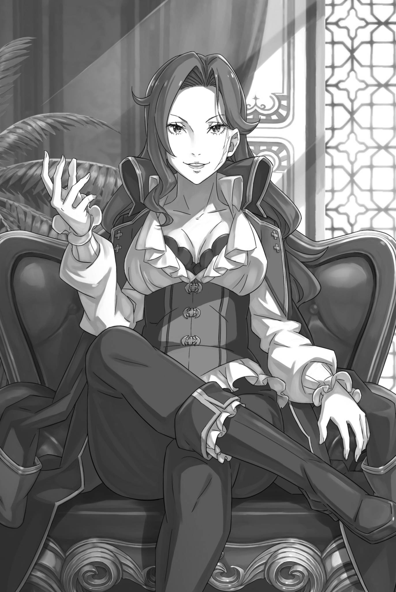

# 『女豪杰和小丑』

------

――在神圣佛拉基亚帝国，由文森特・佛拉基亚皇帝统治下，帝国迎来了自建国以来空前的安宁时代。

即使有一些小规模的冲突，也难以想象有数千人交战的情况，唯一的例外就是尤尔娜・米希格蕾的叛乱。内战自然是不可能的，与其他国家的领土争端也不会发生。只要与长期对峙的露格尼卡王国的关系持续僵持，这种情况就不会出现。

将这一切归功于时势固然容易，可如此一来，为维持和平付出的诸般心血，未免就被辜负了。

首先，仅仅依靠时代的力量就能取得如此伟业吗？

在这个充满争端的佛拉基亚帝国，皇帝在位九年间，不断消除战争，这如同在薄冰上生火一般矛盾。这就是当代皇帝，被誉为『和平主义』的文森特・佛拉基亚皇帝的手段。

然而——

「——不过，阁下肯定不乐意听见别人称自己为『和平主义』吧」

「是这——样吗？姑且不论行事对错，自己的作为得到认可，总不至于不高兴吧？事实上，国家安定也是皇帝阁下所期望的，不是吗？」

「那么，你是不是以被称为『亚人兴趣』为荣呢？」

「毫无疑问。毕竟，这个名字是我自己传播出去的。」

「真是叹为观止，看来我拿了个糟糕的例子。最近，来找我的老朋友都是些奇怪的家伙。多亏了他们，我并不感到无聊。」

说着，那位女性一边撩起额头上的刘海，一边露出了美丽的野性笑容，眯起了绿色的眼睛。

她身材高挑，体态柔韧而矫健，修长的四肢肌肤光滑，曲线鲜明的身体裹在商船船员般的衣装里。她坐着的上等座椅旁，搁着一把带鞘弯刀。周身充盈的战士气魄，足以证明那并非装饰，而是真正用于搏杀的武器。最引人注目的，是她左侧脸颊上那道从额头延伸到下巴的巨大白色刀疤。

这道独特的刀痕一旦见过便难以忘怀。然而，尽管如此，她依然给人留下美丽的印象——对于被称为『灼热公』的她来说，这道刀痕甚至只是装饰品。

——『灼热公』塞琳娜・德拉克洛伊上级伯。

这便是眼前这位女豪杰的姓名与爵位，她亦是佛拉基亚帝国屈指可数的大贵族之一。

而在坐于她对面的罗兹瓦尔看来，早在眼下这场风波之前，她便是自己跨越国界结交的朋友。

「当然，前提是你那句『老朋友』，可以让我当真——呢」

「我并不打算因为朋友与否而进行无聊的拉锯战。首先，作为上级伯，与人见面总是谈论得失。偶尔我想要谈一些没有这种事的奢侈闲聊。这算是我的高要求吗？」

「倒不算奢望，只是听你说得如此辛酸，实在令人心——痛啊」

微笑着，罗兹瓦尔拿起桌子上的茶杯，品味着温暖的香气。香气扑鼻，温暖的液体在舌尖跳动。可惜，罗兹瓦尔无法从食物或饮料中获得更多的信息。

为了成为现在的自己，他不得不承担的负担之一就是无法品尝食物和饮料的味道。

然而，作为客人，他不能不表示感激。于是，罗兹瓦尔瞥了一眼坐在他旁边的矮小人影。替罗兹瓦尔品尝茶的味道的那个人轻轻叹了口气，

「白白糟蹋了好茶叶。建议您换一位负责沏茶的侍者」

眼中闪过一抹锐利的红光，她毫不客气地发表了对茶水的感想。

面对她毫不留情的言辞，罗兹瓦尔眯起了一只眼，而被她所指的那个人则愉快地笑了笑，说：

「还真直白。看来，得换个沏茶的人了？」

「是的，对茶叶实在太不敬了。」

「其实因为家里人手不够，泡这茶的人正是我。」

「原来如此。那么，我认为您以后还是不要再尝试泡茶了。」

「真是个毫不留情的姑娘，我很喜欢。你娶了个好妻子啊。」

塞琳娜一边露出笑意，一边调皮地看着罗兹瓦尔。她一直以来都表现出宽容的态度，无论是面对失礼还是无礼。尽管身为大贵族，她并没有表现出对权威固执的性格。

这样的思考方式和存在方式，从她们初次相遇时就一直没有改变。

「不过，她可不是分不清失礼和侮辱的人。方才只是听懂了你那踩在分寸边缘的玩笑。拉姆，可别太过——头了」

「明白了，亲爱的」

「――塞琳娜，我要纠正一下，她是我的侍从，不是我的妻子。」

「原来如此，『亚人兴趣』还没被套牢啊。虽说两国关系紧张，可婚礼都不请我，未免也太见外了」

拉姆若无其事地接受告诫，又顺势拉近两人的距离，罗兹瓦尔只能叹气。而塞琳娜那带着窃笑的回应，似乎也稍稍偏离了他的本意。

然而，罗兹瓦尔已经意识到，这个话题挖得越深，对自己越不利。因此，他没有再深入追问。

无论如何――、

「话说回来，虽然我听说过，但还是非常惊讶。原来罗兹瓦尔大人和德拉克洛伊伯爵关系如此亲密。」

「动辄几年音讯全无，算不算亲密还有待商榷。偏偏又挑这种忙乱的时候，不打招呼就登门……再这么失礼，我可要像烧死我父亲一样，把他也烧死了」

「塞琳娜，那个玩笑在帝国以外的地方可不好笑。」

「哦？是吗。在社交圈里，这个玩笑总能让大部分人笑出声来。」

这玩笑连拉姆也听得一时语塞。那是塞琳娜拿自己争夺家主之位的一幕打趣——她确实曾烧死父亲，掌控德拉克洛伊家。就连脸上的刀疤，据说也是父亲临死前留给她的。她能将此事当作笑谈的胆量，以及帝国人一笑置之的态度，都叫人不禁深思。

罗兹瓦尔认识她是在她十几岁的时候 —— 塞琳娜因为事务来到露格尼卡王国，在那里发生了一些纷争，罗兹瓦尔帮助解决了问题。

简而言之，他救了被刺客盯上的塞琳娜的命，并揭发了是她的父亲暗中指使的，所以与德拉克洛伊家的渊源颇深。

然而，在那段惊心动魄的经历之前后，塞琳娜的性格并没有发生什么变化，她坚毅如火焰般的性格是与生俱来的。

「我也很想听听你在社交场上的趣事，再叙叙旧……不过，如你所料，这次不打招呼便突然来访，是事出有因——呢」

与老朋友的闲聊固然有吸引力，但对罗兹瓦尔来说，最重要的依然是实现他的梦想。

罗兹瓦尔的一生都是为了实现那个深埋在心底的愿望。因此，来到帝国、甚至每一次眨眼和呼吸，都是为了实现那个愿望。

「──────」

目前，罗兹瓦尔和拉姆与艾米莉娅等人分开，前往帝国西北部的德拉克洛伊上级伯领地，与领主塞琳娜・德拉克洛伊会面。

来意自不必说，是要找到从普雷阿迪斯监视塔失踪、被认为传送到了遥远帝国的昴与雷姆，将他们带回。对罗兹瓦尔而言，找回昴一人便已足够，但他没有愚蠢到将这种想法说出口。

总之，找回失踪的亲人、带回王国。这就是这次旅行的目的。

然而，即使只是带他们回来，事情也并不简单。

四大国之中，露格尼卡王国与其余各国的往来，均因各自的缘由而不容易。需要门路和大笔金钱的卡拉拉基都市国家还算好办；古斯提科圣王国只要选对时节、对信仰采取合宜的态度，规矩也尚算明白。

从这个角度来看，与露格尼卡王国关系不合的帝国的处境难度更高。

露格尼卡和佛拉基亚的关系自古以来就不好，如今虽然奇迹般地签订了不可侵犯条约，但这个条约究竟能相信到何种程度仍然值得怀疑。

这份互不侵犯条约，与其说是友好的证明或征兆，倒更像一道警告：彼此都正该专注内政，谁也别来多事。

这次，国境被封锁的事件和不可侵犯条约的背景似乎有关联。

或者说——

「——这次动摇帝都的大事件，难道是想废除不可侵犯条约的一方的阴谋？猜疑心也要有个度啊。这可不是王国人的想法。」

塞琳娜准确地说中了罗兹瓦尔的心情，绿色的眼睛微微眯起。

这位女英雄待人和善，泡茶的手艺糟糕，但她在帝国担任稀少的上级伯，眼光绝非虚假。

帝国的行事准则不同于王国。只要有本事，便不问年龄与出身，自然是越有能力的人，越能身居高位。

因此，塞琳娜・德拉克洛伊获得了上级伯的地位，并继续保持着。

刚才她的指出，也是罗兹瓦尔考虑过的可能性之一，他将之铭记在心。

罗兹瓦尔一行进入帝国时，反乱的火种便已冒烟。以往总能在苗头初现时将其扑灭，如今却已无法奏效。

如果认为这很可能导致一场真正的叛乱，那么当然会有正当理由。

那就是——

「——关于露格尼卡王国与帝国的领土战争，可能是为了实现这个目的。」

面对指责他们多疑的塞琳娜，拉姆双手放在膝上，静静地说出了自己的看法。

女英雄投来的一瞥，拉姆用淡红色的眼睛直视着，然后说道：

「自从文森特・佛拉基亚皇帝的统治受到威胁，总会有人不希望安宁。那么，这些人在破坏安宁之后，会希望得到什么呢？自然会认为那就是露格尼卡王国。」

「是吗？其实也有因为不能忍受比自己更伟大的人存在而发动叛乱的例子。去年，那些对我挥剑的家伙的头目就是这样的人。」

「让我们把这种特殊情况放在一边吧。」

「虽然并不算特殊，但确实有点偏离主题了。」

塞琳娜把手指放在漂亮的下巴上，仔细思考拉姆的观点。

罗兹瓦尔没有在中途插话，是因为他觉得拉姆的观点没有需要纠正的地方。虽然他以前没有和拉姆讨论过这个问题，但他并不惊讶她也担忧着和他一样的可能性。

不管怎么说——

「塞琳娜，你也不应该希望与露格尼卡王国发生战争。当然，如果你对皇帝有足够的愤怒，想要谋反，那就另当别论了。」

「幸运的是，我从未对这位主张能力主义的皇帝感到不满。偶尔会发脾气的尤尔娜一将的行为，对我这个拥有远离魔都的领地的人来说，也只是与我无关的事。只是」

「只是？」

「你又是凭什么认为，我不希望与王国开战？若你想说帝国会落于下风，可就要搅动我心头的风浪了」

塞琳娜微笑着看着这边，视线中带着一丝紧张的感觉。

这是她对罗兹瓦尔言辞的一种坚持表现。被称为『灼热公』的她，凭借自己的实力守护着上级伯的地位，受到轻视是无法容忍的。

这和拉姆批评她泡茶的手艺，根本不能相提并论。

塞琳娜并没有把心血注入茶里，但她却全心全意地为家族的声誉努力着。

「怎么了，罗兹瓦尔？是我的误会吗？还是你口误了？」

塞琳娜像是堵住了他的退路，罗兹瓦尔看着她绿色的眼睛，意识到旁边的拉姆正偷瞄着他。

拉姆想必也敏锐地察觉了气氛变化：一旦答得不妥，事情就会麻烦。得罪塞琳娜，将使他们在帝国寸步难行，不仅因为会失去后盾，更因为她知道罗兹瓦尔的真实身份。

考虑到这一点，并结合塞琳娜的性格和人品，罗兹瓦尔应该在这个场合做出最好的回答是——

「是啊，抱歉让你误会了。我重新说一遍。——若与王国开战，就会白白流下大量鲜血，而且是帝国人的血。所以，我不建——议」

「哦？」

塞琳娜的眉毛微微挑起，她的脸上的白色刀痕开始颤动，瞳孔微微收缩。她的情绪还没有爆发，但接下来的话决定了一切。

然而，罗兹瓦尔已经决定了接下来要说什么。他没有试图骗她或欺骗她。

如果王国和帝国交战，帝国的大量血液将会流淌。

理由便是——

「因为，王国有『剑圣』莱因哈鲁特・范・阿斯特雷亚啊。只要帝国军队跨越国境而来，他们就会成为一条血腥的河流。」

「嘿，嘿，这是禁忌的做法！」

「就算是犯规，可他确实存在，就不得不摆上桌面讨——论。正如你说，这张王牌足以让整场推演失去意义。不过——」

罗兹瓦尔暂且停下话头，闭起异色双瞳中的一只，只留下蓝色的那只，

「这张王牌，可不会犹豫要不要一开始就打出来」

本来，一些最后关头的绝招都是需要保留的，但对于『剑圣』来说，情况并非如此。第一时间使用最有效，回报也最大。

最重要的是，当事人也很高兴地接受了这个任务。

「唉，唉，竟然不能好好地进行思考实验，这可让军略家们感到悲哀啊。」

紧绷的气氛霎时消散，塞琳娜重重靠回椅背，像个闹别扭的小女孩一样噘起嘴，

「在帝国的时候，我只能听闻剑圣的传闻......在你看来，『剑圣』是一个规格之外的怪物吗？」

「前几代『剑圣』倒还算有几分可爱——之处，至于当代，这个形容确实恰当。没见过本人，恐怕很难有实感」

「你说得就好像已经见过所有的『剑圣』了。不过，是这样啊......」

在罗兹瓦尔的回答中，塞琳娜苦笑了一下，皱起了优美的眉头。

凭着多年的交情，塞琳娜相信罗兹瓦尔不可能在此信口开河，因此正认真权衡他的话。

可其他帝国人，未必都有她这么听得进道理。

「如果过度自信于自己的力量，或者低估『剑圣』的力量，悲剧是无法避免的。因此，我故意要让你的想法受到逆风的影响。我们不应该打仗。」

「――――」

「另外，若帝国真要向王国挑起战争，到时我也会成为你们的对手。想见识一下吗？从你们束手无策的高空，毫不留情地倾泻魔法，是何等无慈悲的景象」

他耸了耸肩，做出一副轻松的样子，但罗兹瓦尔在战略上也是一股不可小觑的力量。

即使不及『剑圣』，只要飞在空中施放魔法，也足以压制数千杂兵。若选对战场，凭他一人便能突破整条战线。

「这倒与『剑圣』的事不同，我很容易就能相信。毕竟，我曾亲眼见识过你力量的一角」

「那也是十年以上前的事了。现在，我可以展示比那时更为成熟的魔法。」

「真是深不可测的家伙。不过，过人的力量也伴随着相应的束缚。你没法在帝国随意行动，也正是这个缘故吧」

「答对了」

这次轮到罗兹瓦尔被堵住话头，只得摊开双手。

实际上，如果他执行刚才所说的战术，罗兹瓦尔可以从人手无法及之处一直射出魔法，将帝国变成废墟，直到魔力用尽为止。

可放眼当世，能凭魔法做到这一点的，只有罗兹瓦尔。就算稍加收敛，身份也一样藏不住。

在佛拉基亚帝国展露超凡的魔法造诣，无异于自报身份。

因此，罗兹瓦尔在这次入帝国之旅中必须保持低调。

同样的理由与限制，也约束着正在分头行动的艾米莉娅。

「她可能会立刻变得暴躁，然后忘记这一切。」

「那就靠和她在一起的孩子们了。嗯，考虑到情况，加菲尔也应该能够充当制止者，所以不要太担心了。」

在这种情况下，如果不信任他们，他们根本无法采取不同的行动。

正是因为相信了对方的判断，他们才能采取目前的行动。虽然如果让奥托和佩特拉听到『信任』这个词，他们可能会面露厌恶的表情。

「推测你们不是唯一进入帝国的人吧？」

在罗兹瓦尔与拉姆交谈时，塞琳娜离开椅背，坐直了身体，接着说道。迎着两人的视线，她用手指描摹脸上的刀疤，

「是在寻找某样物件……还是在寻找人呢？看起来对你们来说非常重要。」

「对我和你之间的关系来说，这个说法有点棘手啊。」

「但是你们的行动证明了这一点。否则，你们不可能越过被封锁的国境来到佛拉基亚。——除非这是宿命。」

塞琳娜微微眯起了眼睛，用平静的声音低语。

罗兹瓦尔想不出她所指何事，察觉异样而皱起眉头。但不等他追问话中真意，拉姆便先应了声「是」，

「我们有无论如何都想带回来的人。对拉姆而言，那个人与生命同样重要」

「拉姆。」

「就算隐瞒或者掩盖，也没法瞒过这位吧。」

尽管拉姆毫不畏惧地暴露了可能会成为弱点的信息，但正是这个回答，让罗兹瓦尔无法反驳。因为行动本身就是答案。

「话虽如此，要暴露弱点，也该讲究个方式吧」

「别责备拉姆。她是个很勇敢的孩子。但是更让我惊讶的是，你为了她重要的东西而冒险。这表明她非常重要。」

「是啊，没有谁能代替拉姆。」

「虽然不否认这个事实，但说话的方式有点问题。」

尽管寻找的目标在罗兹瓦尔和拉姆之间有所不同，但塞琳娜似乎产生了误解。

由于需要帮助，有关寻找人的详细信息将稍后共享。

「无论如何，我现在理解你警告我不要开始战争的原因了。」

回到刚才的对话中，罗兹瓦尔的警告让塞琳娜的表情突然紧张了起来。她注视着愈发紧张的罗兹瓦尔和拉姆的脸，然后用理智的目光继续说道：

「不过，我愿听你的忠告，不代表其他帝国人也会如此。就算告诉他们，与『剑圣』为敌毫无胜算，大多数人也只会恼羞成怒」

「这就是与王国的不同之处——呢。在王国，可不用特地解释『剑圣』的实力」

「是啊。如果有机会见到王国的『剑圣』莱因哈鲁特，只要看一眼就不需要更多的解释了。」

四大国家之间的条约也禁止莱因哈鲁特离开露格尼卡境内。其他国家的人很少有机会见到他。如果有这样的机会，就不需要这么复杂的说服了。

―― 一眼看到『剑圣』莱因哈鲁特・范・阿斯特雷亚，任何人都会立即感受到与他敌对的行为有多么愚蠢。

这只有在远离正常理智的世界中生活的疯子们才不会明白。

「听你们说得这么认真，我也只能期望阁下顺利平定反乱，或是取而代之的反乱者多少留有理性了」

话题的起点，正是已经燃起的反乱，以及反乱者真正追求的目标。

只要对方深思熟虑，没有与王国争斗的狂妄野心，罗兹瓦尔所说的两国大战与流血便能避免。当然，若皇帝一方能够稳妥平乱，自是再好不过。

「无论内乱如何收场，之后都不能将矛头指向露格尼卡。与帝国交战，可不在我的计划之内——呢」

——罗兹瓦尔的一切行动都是通向实现他的梦想之路。

此次来帝国与塞琳娜会面，也不例外。

无论请求她协助带回昴，还是向身为帝国权贵的她阐明与王国开战毫无益处，都是如此。

对于罗兹瓦尔的梦想，昴的存在是必不可少的。此外，罗兹瓦尔要走的路线中，与佛拉基亚帝国的战斗并不包括在内。现在不是和王国和帝国打仗的时候。

在『亲龙仪式』到来之前，不可有干扰龙与王国缔结盟约的事情发生。问题如妨碍王位选举等，都必须被解决。

因此——

「必须请皇帝阁下尽早平定反乱，让帝国建国以来首次迎来的安宁，再延续得久一些——呢」

「哦？好久没看见你露出这种坏笑了。又在盘算什么？」

听到罗兹瓦尔的话，塞琳娜开心地挑起眉毛。

罗兹瓦尔并未意识到自己露出了坏笑，既然她这么说，或许确实如此。不过，他的打算应该并不违背塞琳娜的心意。她也是帝国贵族，既未将这场反乱视作自己的事业，立场上自然该支持皇帝。

「德拉克洛伊伯爵。」

罗兹瓦尔正如此想着，身旁的拉姆忽然主动叫住塞琳娜。后者循声看向她，

「可以打扰一下吗？」

「啊，没关系的。而且，别叫我『德拉克洛伊伯爵』了。我只是想找个知己闲聊……就麻烦你叫我塞琳娜了。」

「好的，那就叫你塞琳娜大人吧。而且……罗兹瓦尔大人和您的关系真的很亲密呢。」

「嗯？」

听着改称呼的拉姆，塞琳娜睁大了眼睛。但很快她的表情变得调皮起来，点头表示理解。

罗兹瓦尔有一种不祥的预感，不知道她在想什么。

「我看你们好像也已经相处了很久了吧，关于我和这个男人是怎么认识的，你们很在意呢……」

「我们认识已经十年了。」

「那么，我和他的关系还要再早一些。拉姆，你能喝酒吗？」

「虽不及对茶那般挑剔，不过拉姆对酒也颇讲究」

「那太好了。」

掌拍了拍膝盖，塞琳娜向拉姆露出一副 「我明白了」 的笑容。

看来他们马上要开始喝酒，边聊起过去的回忆。而且，谈到塞琳娜与他们相识的时期，罗兹瓦尔年轻时的一些趣事也将被提及。

「塞琳娜，谢谢你的邀请，但我们有急事要办。关于那件事……」

「所以你们需要借助我的力量，对吧？那就更不能得罪我了。既然久违地见面了，至少陪我喝点酒」

「……拉姆」

罗兹瓦尔放弃了说服毫不动摇的塞琳娜，转向拉姆。

罗兹瓦尔想带回昴，拉姆也为寻回自己的半身雷姆而来到帝国。方才她曾真诚回答塞琳娜的追问，或许能将这位心思已转到酒杯上的女主人，拉回正事。

然而──，

「巴鲁斯姑且不论，正因为要为雷姆着想，才不该拒绝塞琳娜大人的邀请」

「真的，就这么简单吗？」

「当然，如果能听到罗兹瓦尔大人与我们相识前的故事，即使只是原地踏步，也算是最好的选择」

拉姆毫不脸红地说出了这既是目的，又能实现利益的话。

而对罗兹瓦尔来说，这无疑是痛苦的，拉姆与塞琳娜的关系出奇地好。他们喝酒聊天一定会愉快地谈得投机。

这对罗兹瓦尔来说，无疑是一个令人头疼的时刻即将开始。

「从某种意义上说，这也是必要的代价吗？」

一切都是为了迅速达成目的，离开帝国，回到王国。

拜访故友，请求帮助的时候，他们已经做好了付出一定代价的准备。虽然没想到会是这样的方式。

「正好，刚才有一位客人在你们到来之前离开了。因为那位客人非常热闹，我本来以为会感到孤单呢」

「你们也跟那些人很亲密吗？」

「严格来说，我跟那位客人的丈夫比较亲密，没错。他们应该很快会回来，那时候再介绍给你们吧。现在比那更重要的是──」

站起身的塞琳娜朝着房间一角的装饰架走去。当她打开柜门时，里面摆放着各种大小的酒瓶，可见她是个酒好者。

她挑选了其中一瓶，一边拿着三个杯子从同一个架子上拿下来，

「我跟罗兹瓦尔相遇是在我代表父亲担任使者的时候。在前往的王国中，遭到了刺客的袭击……事实上，那是父亲的指使，但被罗兹瓦尔救了出来」

「原来如此。请继续」

于是，酒被倒进摆在桌子上的杯子里，往事的谈话就此展开。

充满好奇的拉姆和话唠塞琳娜谈得火热，罗兹瓦尔则不得不在无地自容中，接受这也是必要的时间。

「────」

一切都是为了实现那伟大的愿望，为了夺回实现愿望所需的棋子──。

——两天后，反乱军中那位黑发少女『夏美・施瓦茨』的名字传到了德拉克洛伊伯爵的宅邸，拉姆随即制伏了塞琳娜・德拉克洛伊上级伯。罗兹瓦尔的盘算就此落空，不得不更深地卷入帝国内乱。

