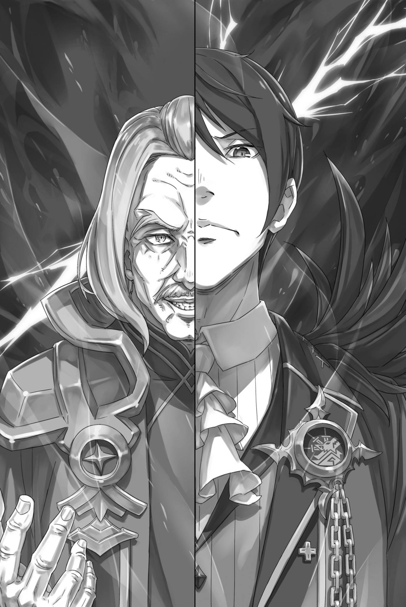
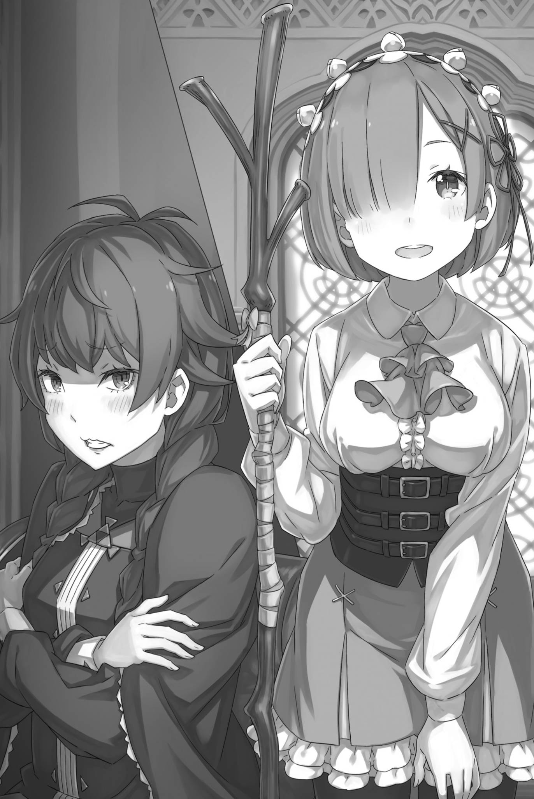

# 『友人』

------

「这几天，庄园里的气氛也变得紧张起来了。」

雷姆低声感慨着空气中的紧张氛围。

干燥的空气和冷风，从外面带来的这些气息似乎混杂着人们的不安和烦躁，还有战场上涌现出的情绪。

姑且说来，虽然时间很短，但雷姆确实多次经历过战场。

根据她的感觉，肌肤感受到的紧张感逐日增加，仿佛在等待爆发的时刻。守护庄园的士兵们也显得越来越焦躁。

这种情况，恐怕还是受到了现在的局势的影响。

「反叛军势头强劲……据说现在帝国的许多地方都在发生叛乱。帝国军正忙于应对这些叛乱，无法采取积极行动。」

讽刺的是，引发各地叛徒一齐起事的契机，正是让雷姆他们被掳到帝都的城郭都市古拉尔攻防战——连『九神将』都出动的帝国军大举进攻，却被临时拼凑的反乱军勉强挡了下来。

反乱军——雷姆知道，率领他们的埃布尔才是真正的皇帝，因此总觉得这个称呼有些别扭。据说，那支抵抗势力正在不断壮大。

传言盛赞城郭都市固若金汤，竟成功击退了『飞龙将』毫不留情的猛攻；至于被灰溜溜赶回去的帝国军，根本不足为惧。

「虽然不能说是在撒谎，但……」

可在亲历其事的雷姆看来，玛德琳率领飞龙撤退，并非出于战略上的原因。城里都被打成那样了，还要称他们为胜者，未免有些不妥。

当然，对于反叛军来说，胜利就是胜利，他们没有理由错过大肆宣扬的绝好机会。实际上，正是由于这一点，各地的反叛军才趁反叛势头骑势而上。

从战略上看，没有什么问题。——确实没有什么问题。

反叛军如此兴奋，还有其他原因。

除了城郭都市的险胜，叛乱如此盛行的背景还有一个原因。那就是魔都卡欧斯弗莱姆的统治者，尤尔娜・米希格蕾一将的加入。

尽管善变，但以高实力著称的一将的叛变，为反叛军的势头火上浇油。

而这本就是埃布尔的计划，也是与他同行的菜月・昴的方针。

「……虽然只是跟着过来的，但也有可能没有起到什么作用。」

在这一系列事件中，昴到底发挥了多大的作用？

嘴上说着他也许什么忙都没帮上，雷姆自己也承认，这话毫无说服力。真要让昴毫无作为，除非彻底封住他的嘴、限制他的行动。

而且，雷姆根本无法想象昴会闭嘴不作声、不做任何事的样子，所以他一定是有所作为的。——甚至，也许他还劝说了一将。

尽管如此，这个想法似乎有些过于猜测了。

「真的吗……？」

无法完全否定的预感，让她不禁质疑自己。

反叛军纷纷起义，帝国的根基正面临空前的动摇。帝都也受到了弥漫着血腥和钢铁气息的风的侵袭，甚至传到了被囚禁的雷姆他们那里。

到底，埃布尔预见到了这种局面发展到什么程度呢？

「连原本针对他自己的敌意，也算进去了？」

或许，他预计到了反叛势力的扩大，以及反叛军纷纷发声，从而集结足够的力量与帝都的假皇帝对抗。

昴也被用作实现埃布尔计划的棋子。

当然，昴可能并未被告知计划的全貌。他只是被用于实现埃布尔目标的棋子。——至于原因，雷姆并不是完全不知道。

她并不是那么不知羞耻，以至于可以用这样的借口来回避问题。

「――――」

最初，在『修德拉克之民』的村落中开始出现的小规模叛军，会不会就此吞噬整个帝国，演变成后人口中流传的政变呢？

如果是这样，处于其中心的埃布尔和昴将如何被描述呢？

而在这漩涡中，自己究竟应该完成什么任务——。

「——等一下」

「啊……」

「你、你发什么呆啊。是、是你自己说要做的吧。那就好好地，对，好好负责到底啊」

在这个时候，沉浸在思考中的意识被叫回来，雷姆瞪大了圆圆的眼睛。

低头望去，被雷姆摆弄着深棕色头发的女性——卡秋娅，正通过面前梳妆台的镜子，严厉地瞪着她。

卡秋娅略带卷曲的发丝绕在雷姆指间。这也是当然的，雷姆正在替她编头发。

「对不起，我在思考。」

「不用你说，谁都知道人时时刻刻都在思考什么。不要把这种事当成借口，一个一个地汇报。」

「————」

「——啊，我不是说，别说话，但是……」

卡秋娅是否觉得对道歉的雷姆态度过于强硬，她有些结结巴巴地改口。

雷姆本来是想道歉的，但却不禁觉得目光低垂的卡秋娅有些可爱，像是一只小动物。

卡秋娅・奥雷利——与雷姆一样，被囚禁在宰相贝尔斯提兹的府邸里的女性，也处于软禁状态。

雷姆是作为负伤的弗洛普的治疗者被带来的，之后又因贝尔斯提兹的关注而持续受到软禁。而卡秋娅被留在这里，似乎另有缘由。

虽然没有交换详细的情况，但仅仅这样说话已经比起最初的时候相当亲近了。如果真的要说出口，她会像烈火一样生气，感觉好不容易拉近的距离会变得更远，她是这样的性格。

「……你那个表情，什么啊。看着就烦。」

「对不起。我也还没有完全习惯看。就像看着别人的脸一样。」

「别说，恐怖的事好吗？你说你没有记忆什么的，听了我会觉得很害怕，搞不清楚是不是真的。」

卡秋娅瞪着镜子，气鼓鼓地咬着自己的手指。

每当发生什么事情，她就会咬指甲，这是卡秋娅的习惯。虽然认识时间短暂，但无论是好还是坏，她在情绪波动时总是这样。

咬着指甲，卡秋娅带着怨气的目光从镜子中看着自己和站在背后的雷姆。坐在轮椅上的她的后面，雷姆也望着梳妆台镜子里映出的自己。

诚然，雷姆向卡秋娅说的是夸张的看法。

即便失去了『记忆』，雷姆也早已接受这是自己的面容，而非他人的。她不可能对眼前所见、伸手所触的一切都怀有敌意。

路伊、修德拉克之民、米迪娅姆、弗洛普，普莉希拉和修尔特等人的善意，甚至怀疑这一切，空荡荡的自己还剩下什么？

她明白这一点，对于那个最初伸出援手的人，也该适可而止了——。

「……你，梳头发真的很好。」

「哎？」

「所以我说，你梳头发真的很好。原本在忘记一切之前就这样工作过吗……肯定不是。只是梳头发的工作应该是不存在的吧。啊，说了蠢话。忘记吧，忘记吧！」

雷姆将目光从镜中的自己移开，刚才无心间已替卡秋娅编好了头发。卡秋娅红着脸望向她，原来是在夸奖她的手艺。

卡秋娅从头两侧垂下的辫子，她用双手轻轻按住它们，嘴唇颤抖着瞪着雷姆。

「又发呆……陪、陪我很无聊吧。那就！别这样围着我打转了，去找别人，对，找别人去啊」

「不，因为现在在庄园里的其他人都在忙工作。」

「那么，就是说只有我闲着？所以，才会来找我……」

「不是这样的。请不要让我为难」

「到、到底是谁让谁为难啊……！」

卡秋娅推动轮椅的车轮，逃到房间的深处。她咬着指甲，抬着头瞪着雷姆，就像一个被侵犯领地的猫一样凶狠。

雷姆模糊不清的态度让卡秋娅感到不安。

「卡秋娅小姐，抱歉让您产生误会。我来找卡秋娅小姐，并不是因为在庄园里只有您闲着。」

「那么，那么，是什么原因呢？为什么来找我……」

「那是因为……」

面对寻求合适理由的卡秋娅，雷姆稍微陷入了思考。

正如她所说，雷姆并没有把自己的处境看得轻松到还要找人消磨时间。不过，稍一接触便能发现，卡秋娅既非什么重要人物，也不掌握帝国的机密。

对于急切想要采取行动的雷姆来说，与她交往所能得到的东西确实不多，这是无可争议的事实。

尽管如此，雷姆积极地与卡秋娅建立联系的原因是——

「为、为什么？说出来听听！如果你不能说出来的话……」

「我想，是因为我和卡秋娅小姐是友人吧」

「———」

「卡秋娅小姐？」

雷姆认真地面对自己的内心，并试图寻找合适的话语，但最后得出的只是这样一个简单的想法。

对于卡秋娅，雷姆并没有什么实际的打算。因此，她无法给卡秋娅提供一个让她满意的「就是这个」原因。

雷姆也因此感到困惑，不知如何让卡秋娅信服。

「友人……友人是谁啊！」

「咦？啊，不是人名。友人，就是朋友的意思」

「友人……呃，朋、友……？」

卡秋娅惊讶地睁大了眼睛，一副听到了难以置信的话语的表情。看到卡秋娅的反应，雷姆不禁想，是不是突然说朋友太过亲昵了。

归根结底，卡秋娅与雷姆的关系是雷姆强行加入的。

他们都不情愿地被软禁在贝尔斯提兹的宅邸里，称这种在那里诞生的关系为朋友，可能有些草率。

「对不起，我太随意了。既然我们都是被软禁的人，或许把我们称作软禁伙伴更合适一些……」

「友、友人！」

「是吗？」

「你说友人了。明明都说了。……也、也不是不可以，那样也行」

卡秋娅用双手捂住脸，转过头说道。

听到这话，雷姆眨了眨眼睛。卡秋娅「啊」地喘了口气，

「不过，如果你不喜欢的话，随时可以取消，好吗？」

「我明白了。那么……」

「你、你要取消吗？」

「不，我不会取消。而是说，我和卡秋娅小姐成为了朋友。」

没想到得到了本人的同意，雷姆点了点头。卡秋娅睁圆了眼睛，随后扯了扯自己的两条辫子，咬着指甲，低声嘟囔：「这样啊」

她咬指甲似乎是在情绪波动时的表现，但现在眼前的她究竟是在生气还是感到不安呢？

不过，从她脸上看不出有什么不好的情绪，或许需要重新考虑她咬指甲的原因。

连同这些难以捉摸的地方，卡秋娅都让雷姆无法放着不管。虽然雷姆自己也不甚了解，但这应该已足够称作朋友了。

「……话说回来，你还真是那个啊」

「那个是指？」

「就是那个，……你对外面的叛乱情况了解得相当多。」

咬着指甲，闭着眼的卡秋娅突然好像想起了什么，转换了话题。

一瞬间，雷姆有些疑惑地看着她，但很快就意识到卡秋娅是在提到刚才自己在给她扎头发时陷入沉思的事情。

「虽然不知道算不算很了解，但我原本就是从战斗的地方被带来的，所以对此很关注。卡秋娅小姐就不关心吗？」

「……不是没有关心。但是，我不太想去想。因为，我的哥哥……那个笨蛋哥哥，已经死了，我讨厌战争。」

「――啊。」

低头看着自己的膝盖，卡秋娅双手交叉，轻声说道。

卡秋娅哥哥的死对雷姆来说并不是第一次听说。很显然，他对卡秋娅来说是个非常重要的人。她时常这样，提起已故的哥哥。

最近，埃布尔发起的反乱中的一场战斗，导致了卡秋娅哥哥的死亡。也许，那场死亡与雷姆参与的战斗并非毫无关联。

如果身边的人失去了生命，雷姆也会厌恶战斗。即使现在，她也希望没有战斗这回事。

「即使如此，战争是无法置身事外的。卡秋娅小姐的未婚夫也出征了，我听说了。你很担心，对吧？」

「那家伙……！总、总之就算做什么都好像不会死，但是。」

「哥哥也是这样的，对吧。」

「――――」

身为帝国贵族，这种事情是无法避免的吗？

哥哥战死，未婚夫也奔赴战场。作为帝国士兵参战，对雷姆来说心情很复杂。——埃布尔绝不会对敌人手下留情。

即使是曾经本该是自己的臣民的士兵们，也是如此。

「真是奇怪啊……」

说到底，雷姆并没有被埃布尔的理念感染，也并不赞同他的观点。

起初，雷姆被俘虏在帝国军的阵地，为了将她救出，昴向埃布尔和修德拉克的部落寻求帮助。为了回报他们的帮助，昴向他们提供了支持——虽然雷姆也在不知不觉中与他们共同行动，但本来并没有这种义务。

没错，原本是没有的，但现在已经是过去式了。

「路伊酱，普莉希拉小姐，米泽尔妲小姐和弗洛普先生……」

雷姆和他们有关系，彼此照顾和被照顾过。

这样的人们走上了与埃布尔相同的道路。在她察觉之前，雷姆的心也难以离开那个地方。但这对敌对的帝国士兵和卡秋娅并无关系。

如果卡秋娅知道雷姆的立场的真实情况，她会原谅雷姆吗？

「――――」

她没有勇气向失去了非常重要的哥哥而悲伤的卡秋娅坦白这件事。

「……你怎么了？」

「啊，不，没什么。如果我看起来知道外面的事情很详细的话，那是因为最近在别院那边聚集的人们的缘故吧。」

「别院……啊，那帮家伙。」

听到雷姆的话，卡秋娅的声音降低了一个音阶，目光也变得更加严峻。

卡秋娅这样的反应并不奇怪。本来，她就有些害怕生人和不信任人类的倾向，雷姆花了很大的努力才接近她。

对她而言，宅邸里不断增加陌生人，实在不是什么值得欢迎的事。何况那些人，还是从各地带回来的反乱旗帜。

「虽然有那么多人，但你真的认为他在里面吗？那些人中，皇帝阁下的……」

「――私生子」

「……反正已经被揭露了，也就不算隐藏了。」

卡秋娅插话，露出了尴尬的表情。

她似乎觉得又多说了一句，但雷姆并没有放在心上。与此同时，那句话的含义牢牢抓住了她的心。

贝尔斯提兹・冯达尔福的宅邸，也就是雷姆等人遭到软禁的地方，其别院中聚集了许多从帝国各地战场带回的少年。

――他们都是具有共同特徵的十几岁少年，『黑发皇太子』。

「阁下没有子嗣，这很奇怪……这样的传闻，嘛，确实有……」

卡秋娅低声说着，雷姆想起了刚被带到庄园时，她和贝尔斯提兹一对一会面的情景。

贝尔斯提兹与将埃布尔逐下玉座、窃据其位的假皇帝联手。他说过，自己发起谋反，是因为埃布尔放弃了身为皇帝的职责。

那被放弃的职责正是皇位继承人的缺席。

「阁下没有皇后……到目前为止，历代皇帝阁下都会有很多伴侣，孩子也……然后，从中选出下一位皇帝。」

「这是规矩。然而埃布尔先生……不，文森特皇帝却一直没有遵守。就在这时，又传出了『黑发皇太子』的消息」

「听说他们声称，不能再将帝国交给阁下……真是愚蠢」

「荒唐，是吗？」

雷姆抬起眉毛，看着低头深恶痛绝地嘟囔的卡秋娅。

卡秋娅的反叛言论，与其说是对战争爆发原因的恼怒，更像是对发起战争的对方的愤怒。

「卡秋娅小姐，您很认可文森特皇帝吗？」

「我、我才不会高傲地评价皇帝阁下呢！……但是，在强者称霸的帝国里，像我这样的人是没有立足之地的。……只要没有战斗，那些差距就不存在了。所以，那时候很轻松。」

「轻松，是吗……」

雷姆低下眼睛，听着卡秋娅磕磕巴巴地说出自己的心声。

虽然埃布尔的手腕不差，贝尔斯提兹也说如果没有世子问题的话，他不会考虑发动叛变。实际上，帝国长期和平，像卡秋娅这样的观点的人也应该不在少数。

在没有战斗的时候，危及生命的人会变得更少。

战斗开始的瞬间，卡秋娅的哥哥死去，她的未婚夫也被拖上了战场。对卡秋娅来说，要她对战争产生好印象实际上是很困难的。

话虽如此――，

「我认为在那个别院里，并没有真正的『皇太子』。」

无论埃布尔是否真的有孩子，雷姆已经得出了这样的结论。

听到雷姆的回答，卡秋娅低声问「为什么」。迎着她自下而上的目光，雷姆点了点头，望向别院的方向，

「那些被关在别院里的人，都是参加了各地反抗运动的『皇太子』们……至少，他们都自称是皇太子。」

「我、我也听说了……那、那又怎么样呢？」

「声称是皇帝阁下的孩子，煽动反叛，却很快就被捉住，这种情况，难道不是考虑得太过草率了吗？」

雷姆不好把话说得太笃定。不能告诉卡秋娅的内情和消息，实在太多。

在各地战场上被俘虏，为了证实真相而被活捉的『皇太子』。这就是那些被关在别院里的人们所处的境地。

雷姆知道真正的皇帝埃布尔是怎样的人，因此看待他的孩子时，眼光也不免更苛刻。至少，她不认为他的孩子会是个蠢人。

首先，如果站在叛军一方，那么他们应该与发起叛乱的埃布尔合作。

如果父子共同努力，要推翻假皇帝，那么这些轻易被捉住的『皇太子』里应该很难有真正的皇子。

「当然，这并不是绝对的证据……」

雷姆也不能断言她的想法和印象是绝对正确的。

埃布尔也不是万能的。他可能会因为某种错误而被敌人俘虏、被束缚住。但是，战败并被俘虏就是另一回事了。

若连被俘都在算计之内，那倒能令人刮目相看。可真能指望别院里的哪一位『皇太子』，怀有这样的谋划吗？

「你、你倒是很有把握啊。……你到底是皇帝阁下的什么人？」

「――。我与他并未见过面。本人也会这么说的。只是，对于那些被关在别院里的『皇太子』们，我想也许有不少人和我持相同的看法。」

「他们是在欺骗，把自己当成皇太子？这种可怕的事情，为了什么……」

「……也许只是个体面的、招兵买马的借口吧。」

如果能成为皇帝的亲生子女，那就是为了争夺王位的理由，再没有比这更好的宣传口号了。

据说，在佛拉基亚帝国，还没有通过篡夺而换位的例子。然而，帝国的法则并没有禁止通过篡夺夺取皇位。

只要控制住帝都，夺取王座，斩下皇帝的首级，那么这个人就会成为下一任皇帝。

为了实现这个目的，所需的力量，作为招兵买马的借口，把下一代皇帝候选人捧上天，是非常方便的。

「何况，『皇太子』从未公开露面。除了黑发黑瞳之外，其他一概不知，谁都可以这么宣称」

「……那些开始宣称的家伙们呢？」

「虽然他们应该是叛军的同伙……」

卡秋娅的问话，让雷姆想到的已不是那些被囚的『皇太子』，而是他们身边的人。若能称之为同伴，那么『皇太子』既然是从同伴手中夺来的，那些人想必也没能安然脱身。

反抗皇帝的人的结局，他们最后只有一个去处。

「利用别人，被利用，然后死去或被捕……真是愚蠢的家伙们。」

「卡秋娅小姐……」

「什、什么？我说错了吗？还是说，你想说我自己也是人质，凭什么摆出这种口气？你觉得那些人比我还强吗！？」

卡秋娅声音颤抖得像是发脾气，眼中含着泪水。

她过分强调自己与那些被囚禁者的不同，反而可能是因为她在自己和他们之间发现了共同点。

卡秋娅常常骂自己没用，是因为她知道，自己被囚禁的处境，正拖累着与自己有关的人——她的未婚夫，并为此深深自责。

「……」

因为理解卡秋娅的感受，雷姆不知道该说些什么。

若说不同，她会觉得是欺骗；若说理解，她会觉得傲慢。两人之间的距离还没有缩小到可以无条件解开彼此心结的地步。

不知道该说什么，雷姆懊恼地攥紧了手中的拐杖。

就在这时——

「——真是吵死了，小姑娘。」

「……」

一个极其冰冷的声音在房间中回响，雷姆和卡秋娅屏住了呼吸。——不，雷姆还只是屏住了呼吸，而卡秋娅的反应可不仅仅是这样。

目瞪口呆地睁大眼睛的卡秋娅望向雷姆背后，房间里通往中庭的窗户那边。声音也是从窗户传来的，也就是说声音的主人就在那里。

卡秋娅直接与对方对上了眼，完全被冻住了。

「啊，嗯……」

「别发出让人讨厌的声音。别做让人眼烦的事。在龙面前，这是不敬。」

冷冰冰的声音击打着喘息急促、瞪大眼睛的卡秋娅。仿佛被那声音紧紧掐住全身，卡秋娅的喉咙甚至无法正常回应。

看到卡秋娅颤抖的样子，雷姆咬紧了嘴唇，转过头去。

在那里——

「——玛德琳女士。」

「会治愈术的姑娘，你在这里做什么？你应该有任务要完成才对。龙不在时，你是不是觉得可以为所欲为了？」

「我没有那样的意思。」

在一种严厉的声音的威压下，这次是雷姆体验了压迫感。然而，保护背后的卡秋娅，雷姆直接面对对方。

在房间窗外的中庭上站着一个身材娇小，穿着可爱的衣服，以及头上生长着两根黑色角的少女——玛德琳・艾沙尔。

她是『九神将』之一，是把雷姆带到这座宅邸的人。她经常应贝尔斯提兹和文森特的要求离开庄园，雷姆对她归来的姿态感到惊讶。

她惊讶的并非玛德琳的出现，而是她那触目惊心的模样。

玛德琳昂首屹立在中庭，她的身体被污浊的黑血染色。

「那，血是？你受伤了吗？」

「别岔开话题。龙不是命你治好那个男人的伤吗」

「我没有跑题。弗洛普先生的伤正在按照步骤治疗。请回答我的问题。那血是……」

「——不是龙的血。这是别人溅到我身上的血。」

玛德琳不耐烦地皱眉，扯了扯衣服，回答雷姆的问题。衣料发出干脆的剥裂声，想必是干涸的血液已将它黏在皮肤上。

雷姆惊呼不已，究竟要以怎样的方法伤害他人，或者伤害多少人才能浴尽那样的血？

「你刚才去战斗了吗？」

「战斗，是与认可其对等地位的对手交手。你觉得，有什么能与龙并立？龙做的是狩猎。一场有着麻烦限制的狩猎」

「烦人的……」

「只留下黑发的性命，其他的杀死。」

对于直白的玛德琳的话语，雷姆无法回答随意的话语。

不过她也明白了，玛德琳担负着将各地战场上的『皇太子』带回来、囚于别院的任务。

下令抓捕『皇太子』的，果然还是贝尔斯提兹吧。

以他最初发起谋反的目的而言，若埃布尔真的藏有子嗣，谋反的根本理由便不复存在了。

雷姆不知道贝尔斯提兹是害怕还是欢迎这个。

虽然不知道，但是——

「如果不是杀，而是说抓住，」

倘若找到了真正的『皇太子』，那位老人恐怕会心满意足地赴死。

这是让雷姆感到心胆寒冷的想象。

无论如何——

「那么，您这次回来，是为了再将一位『皇太子』送进别院？还是来确认我有没有怠慢弗洛普先生的治疗？」

「叽叽喳喳的，龙有陪你闲聊的理由吗？别得意忘形。事到如今，即便没了你，帝都的治疗者要多少有多少……」

「那些治疗者能守口如瓶吗？既然宰相先生身边没有安排这样的人，不就说明很难找到吗？」

「你不要得意忘形。」

雷姆本无意逞强，回答时却不自觉地加重了语气。玛德琳似乎听得不悦，走近窗边，金色眼眸中的瞳孔收紧。

那股令人寒入骨髓的凶猛气息，让雷姆也不由微微瑟缩。

「笨、笨蛋！别多嘴！根、根本不是那样的！」

就在这时，车轮吱呀作响，卡秋娅慌慌张张地推着轮椅上前。

卡秋娅用面露惊恐的脸朝着窗外的玛德琳对视，在她的目光下，她的喉咙颤抖着，但是：

「她、她的话不用当真……您不用当真！她什么都不懂，什么都忘了，就是个笨蛋！」

「卡秋娅小姐......」

「虽然是笨蛋，可总比没有强，所以别、别动她……那个，我会！我会让她好好干活的。也会让她治好那个金发的……！」

对于选择了话语的卡秋娅，雷姆静静地屏住了呼吸。在卡秋娅的冲劲下，玛德琳的目光也变细了，盯着她。

雷姆担心那目光中会浮现危险的神色，做好了挺身保护卡秋娅的准备，等待玛德琳下一步行动。

然后——

「别让像你这样的弱者对抗龙。下一次就没有了。」

「哎呦」

玛德琳将手搭在窗框上，淡淡说着，便将其捏碎。石料轻易碎裂，发出巨响，吓得卡秋娅喉间一颤。

然而，尽管难以接受卡秋娅的态度，但玛德琳似乎已经决定放过她了 ——

「请收回您说卡秋娅小姐弱小的话。真正软弱的人，怎么可能像这样向您提出意见……」

「别、别说了！闭嘴，笨蛋！去死！笨蛋！别说了！」

「卡秋娅小姐！但是……」

「没有但是，别说了！去死！别说了！」

手扶着拐杖，正要转向玛德琳的雷姆被卡秋娅撞了过来。这是一个微弱的碰撞，所以雷姆轻易地抵挡住了，但紧接着卡秋娅拼命地伸出手臂，这让她无法挣脱。

作为雷姆，她本想让玛德琳收回对卡秋娅的轻视，但既然卡秋娅本人如此拼命地阻止，也只能作罢。

于是放弃直接申诉的雷姆，玛德琳哼了一声，转过身去。

「小心你的言辞，姑娘。我会真的去准备一个替代的治疗者的。」

「请等一下。去哪里？」

「去那个男人那里。龙想跟那个男人谈谈。」

「如果您要去弗洛普先生那里，请先洗掉血迹再换衣服。毕竟他是受伤的人，我们也要顾及他的感受。请您考虑一下。」

「你……」

雷姆毫不犹豫地告诉准备离开的玛德琳。玛德琳又露出一副不悦的表情，卡秋娅拉着雷姆的袖子怒吼道「去死！」。

但是，雷姆不能死，也不能让弗洛普死。

满身血污的样子是极不卫生的。无论龙人和帝国的常识如何，她在这一点上是绝对不能让步的。

「请洗个澡。」

「……知道了。」

「衣服也请换掉。明明有那么多可爱的替换衣服……」

「我说知道了！真是烦人！」

玛德琳龇出獠牙，厉声喝道。那股仿佛撕裂空气的威压，像狂风般扑向雷姆，连卡秋娅也一并被波及，压得两人喘不过气。

即便如此，玛德琳应该也明白，她不能违背雷姆的要求。这一点上，她已被弗洛普成功驯服，算是他的一大功绩。

总有一天，也许能够用这种办法让玛德琳转向他们这边。

「别用不轨的眼光看龙，姑娘。――不管你怎么谋划，都是徒劳的。」

「不管要做什么，我想都不能断言毫无意义」

「不是这个意思。我是说没有时间」

「没有时间？」

雷姆歪了歪头，眯起眼睛，试图理解玛德琳的真意。

但是，根本不需要探究。玛德琳肯定讨厌雷姆，但她也不喜欢说谎、掩饰，因为这是龙人的骄傲和生活方式。

因此，她把话语的意思说得清清楚楚。

她说道：

「与反抗皇帝的家伙们决一胜负的时候，快到了。龙正是为此被召回的。——你的职责，也就到那时为止」

※ ※ ※ ※ ※ ※ ※ ※ ※ ※ ※ ※ ※ ※ ※ ※ ※ ※ ※ ※ ※ ※ ※

留下这番近乎绝望的话，玛德琳离开了中庭。

她没有径直前往弗洛普的房间，想必会听从劝告，先沐浴更衣，再去见他。

弗洛普本人也欢迎她来。只要他不会受到伤害，雷姆也没有阻止的理由。

然而，

「和反叛军决战」

「她、她倒是没说，会在哪里……」

「……」

咬着指甲、在玛德琳离开的方向上仍然心烦意乱地关注着 —— 卡秋娅也抱着与雷姆相同的担忧。

她的不安，是帝国军队与反叛军的决战，以及那个时机和地点。

不久，玛德琳的话语给人以预感。然而，地点在哪里呢？有没有任何地方适合全面对抗？

在帝国各地叛军爆发、战场到处都是的现状下，如果准备一举击败那样的对手，那就是……

「……真是的，怎么全都是笨蛋。你也是，你也是啊，大笨蛋！」

「卡秋娅……」

「对、对方是『九神将』，还是个根本说不通的龙人吧！？你居然还敢那样，去死吧！想犯蠢就自己去死！去死，笨蛋！」

将不安转换为当前的烦躁，卡秋娅用哭腔责备雷姆。

与雷姆已做好准备不同，她被迫承受了很多。实际上，如果卡秋娅当时没有插话，雷姆可能不会失去生命，但被玛德琳的愤怒伤害的可能性很大。

「对不起，谢谢你。但是，因为我不能容忍别人把卡秋娅说坏话......」

「谁、谁管你！我早就听惯了！你却还那么傻……」

「习惯听这样的话，太荒唐了。所以，无论多少次被说，我都会在同样的情况下作出同样的反驳。」

卡秋娅自我贬低让人感觉不好。即便如此，这种自卑也有其理由和深思熟虑。但是，对别人的攻击是难以忍受的。

——可回想自己的所作所为，雷姆也觉得，这实在太任性了。

「正因为这样，我才......」

正因为知道，哪怕明白自己任性，她也不愿就此沉默。

听见雷姆的回答，卡秋娅连连眨眼，嘴巴开开合合，说不出话来。

然后，她怒视着雷姆，咬着指甲。

「我、我不管了……你的事，我再也不管了！不、不做了。我要跟你绝交。不做朋友了，是我先不要你的……！」

「不，要不要继续做朋友，选择权应该在我这里。您不可以这样」

「这种单方面的说法，有这种事吗！」

卡秋娅说话时喉咙发紧，雷姆微微苦笑着回应。

两人的对话稍稍舒缓了紧绷的心情，与此同时，雷姆也在思索。

——如果玛德琳所说的决战，已经近在眼前。

「......我能做些什么呢？」

空虚无物的自己，能发出什么声响呢？

这是雷姆心里一直翻腾的问题。

