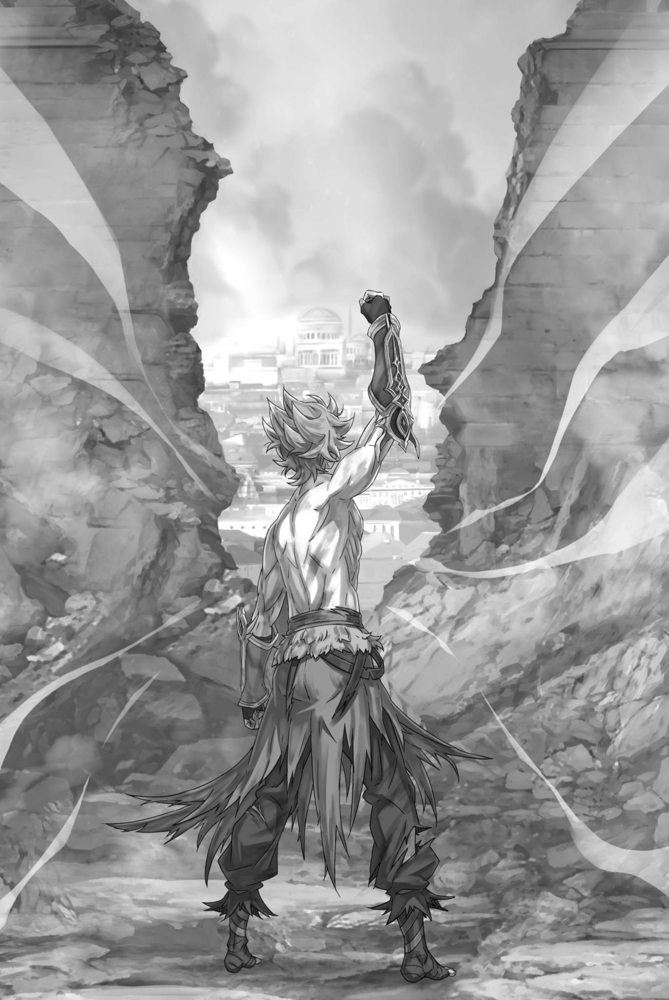

# 『卡夫马・伊鲁克斯』

------

――在帝国这片充满各式亚人的土地上，仍有一类被视为异端的存在。

这便是『虫笼族』，在如此多样化的亚人生态中，他们的存在显得极为异形、独特，充满异端视线的注目便不离其身。

外表上，虫笼族与人类并无太大差别。

他们大多肤色偏褐，有刺青的习俗，仅此而已。既不像眼睛独特的『巨眼族』『魔眼族』，也不像手脚特殊的『多腕族』『长足族』，更没有『兽人族』『半兽族』那般一目了然的特征。

然而，虫笼族被其他族群以特异的目光看待，是由于其特有的生态方式。虫笼族会在体内与『虫』共生。

如前所述，与其他亚人相比，虫笼族与人类族群外观上的差异较小。如果不加入『虫』，他们也能像人类一样生活。

但他们并不这样做。族群成员会在体内注入『虫』，并继承其特征。这相当于通过后天获得的亚人特性，是一种禁忌的术法，他们将自己的肉体改造成为亚人的身体——这也是其他亚人族群避之唯恐不及的主要原因。

这与刃金人或光人又截然不同。前者生来便有身体的一部分金属化，随着成长，将其锻造成自己所需的武器；后者则被认为能吸收所杀之人的灵魂，让额头的辉石愈发明亮。

由于与其他族群没有交流，虫笼族的生态大多数仍然是个谜。由于错误的知识和偏见的传播，虫笼族常常会对其听到的谣言感到无语。然而，这些谣言的纠正机会很少，误解也很难消除。

常见的误解是，虫笼族注入『虫』的时间以及『虫』的生态和虫笼族之间的接触点——这可以说是涉及其本质的历史。

起初，将『虫』放进身体内是极其危险的。

在佛拉基亚帝国南部，虫笼族居住的村庄最深处有着『虫』的栖息地，洞穴里弥漫着异形生物和毒气，被称为『奈落』。那里栖息的『虫』外形奇特，与一般人所想象的虫子完全不同。

究竟是谁开始考虑将这些正体不明的生物放进自己的体内，没有人知道。

或许是寻求超自然力量的术士或忍者等异常者们，因为平凡的术法无法获得力量，才想出这种外道之法，这是专家们的观点。

总之，对于这些存在来说，虫笼族只是一个副产品。

那些将神秘的『虫』放进身体，希望与后天拥有的力量共生的人，才是虫笼族的祖先。这种疯狂一直传承至今。

话说回来。虫笼族第一次放虫的仪式是在十二岁时举行的。

在那之前，他们锻炼身心，好让自身成为适合容纳『虫』的器皿。真正参加仪式、被『虫』认可为宿主后，才算迎来孵化之时。

此后，唯有完全掌控共生的『虫』、能将其运用自如，才会被认可为完成羽化，获准以独当一面的虫笼族自居。

十二岁之前禁止举行仪式，正是因为接纳『虫』乃是性命攸关之事。

如果没有足够的体力和精力，尝试放虫的人会被虫咬死。虽然最短的挑战年龄是十二岁，但只要容器没有准备好，就可以延长仪式到十五岁。如果在那之前仍未成功，那么这个人就没有资格作为虫笼族的一员，只能被投入『奈落』，成为『虫』们的食物。

重要的放虫仪式的痛苦难以言说。

人体内流动的血液有不同的类型，当试图通过其他人的血液补充不足时，摄入不同种类的血液会危及生命。放虫仪式的痛苦就与此相似。

将自己全身的血液都化成毒药，腐蚀内脏、灼烧脑部的感觉是难以形容的苦痛。

进入体内的『虫』会化蛹，试探宿主是否配得上自己。它要用三天三夜，决定将对方作为容器，还是将其溶解、吞噬殆尽。

当茧子破裂后，如果能够保持人的形态，就算仪式成功，与『虫』的共生也就成立了。

将『虫』摄入身体，从茧子中孵化出来的虫笼族第一次出现了肉体上的变化。

有人获得触角或翅翼，有人眼球变成复眼，有人长出多手多足，还有人手指或躯干覆上甲壳，变化各不相同。

摄入的『虫』明明与昆虫截然不同，带来的身体特征却与现实中的昆虫相似，这便是虫笼族之名的由来。

当然，外形改变，并不意味着那个人本身也随之改变。

但也确实有人，将举行仪式、后天使自身异形化的虫笼族，视作渴望成为『虫』之容器的异类。

即使在承受了痛苦之后面临着偏见，虫笼族的存在方式仍然没有改变。

要成为一个被承认的虫笼族，必须摄入一个『虫』。但是，被摄入『虫』的数量越多，作为战士的力量就越大。

因此，一流的虫笼族战士至少摄入了三个『虫』。

然而，随着摄入『虫』的数量增加，在体内共食的危险性也会增加，宿主的生命也会变得更加危险。因此，共生的『虫』数量与战士的质量直接相关。

当时的虫笼族族长是战士中的战士，因为他摄入了八个『虫』，所以他是整个族群的英雄，一个值得敬畏和尊敬的人物。

然而，卡夫马・伊鲁克斯成为了摄入三十二个『虫』的怪物。

这个怪物的出现使英雄的功绩相形见绌，这与虫笼族的规则背道而驰。

为了避免危及容器的性命，本应直到十二岁生日之后，才允许举行纳『虫』入体的仪式。可卡夫马第一次被植入『虫』，却是在出生仅仅几天的时候。

他的父亲是族长的兄长，也是一个始终不如优秀弟弟的男人。那份疯狂，最终指向了自己的孩子。

懂事之后，得知自身遭遇的卡夫马，是这样听说父亲的事的。

父亲早已被身为弟弟的族长亲手处决，真正的心思无从得知。只知道父亲谎称孩子出生不久便已夭折，将卡夫马秘密隔离，每年都为他举行植入『虫』的仪式。

具有讽刺意味的是，卡夫马的存在被曝光，他在十二岁时第一次从藏身之地出来——在同伴们都参加『虫』仪式的年纪，卡夫马已经成为了一个与十三只『虫』共生的怪物。

虫笼族中对于这种难以想象的存在，对于卡夫马的待遇意见分歧。

父亲因违背族规、诅咒亲子而在众怒中遭到处决，已无从询问。卡夫马能容纳十多只『虫』的原因也完全不明。最后，是身为族长的叔父宣布，愿为卡夫马的存在负责，他才获准活下去。

这是毫无疑问的，卡夫马・伊鲁克斯感激他的族长。

他的血亲叔父与他一定保持一定的距离，既不过度责备也不内疚。他的态度表明，他不会特别对待卡夫马，而是作为虫笼族的一员对待，这让卡夫马感激不尽。

即使叔父如何对待他，自己在族人中仍然是异常的事实。

还有一代人不知道『虫』带来的痛苦，他们对卡夫马保持距离；已经羽化的一代人则害怕卡夫马摄入了难以想象的数量的『虫』。

作为被其他种族视为异端的虫笼族，卡夫马处于更为异端的地位。

尽管卡夫马没有任何需要受到责备或迫害的理由，他可以像过去一样与外界保持疏离，无视那些注视他的目光。然而，尽管他在与众不同的环境中成长，卡夫马的本质却高贵纯正。

他不认为族人因为他而感到害怕是一件好事。

要成为虫笼族的一员，必须经历纳『虫』入体的仪式。

可卡夫马在自我意识萌芽前，便已跨过这个阶段。因此，他不惜努力，希望以别的方式与同胞相互理解。

他积极与人交流，向身为族长的叔父学习战士之道，耐心与各个年龄层的族人相处，以此证明自己与他们并无不同。

为了成为被虫笼族尊敬的战士，卡夫马挑战了接受新的『虫』的仪式。然而，周围的人都反对他这样做。卡夫马已经吞噬了十三只『虫』，这是虫笼族历史上前所未有的成就，族人们期望他能够取得更大的成就。但是，如果他在虫的羽化之前失去了生命，这将是不能接受的错误。

卡夫马理解长者们的想法，却不愿就此止步。

尚未获得许可，他便取走『虫』，独自进行了无人见证的仪式。后来卡夫马常以此自戒：唯独这份鲁莽，确实承袭自父亲。

然而那一次，他终究冒险纳入第十四只『虫』，熬过三天三夜吐血般的地狱苦痛，活了下来。

卡夫马・伊鲁克斯终于以自己的意志完成孵化，成为了虫笼族的一员。

尽管他有着特殊的出生，卡夫马心灵的高贵却在族人中获得了尊敬，成为了虫笼族历史上最强大的存在。

在佛拉基亚帝国，强者才会受到尊敬和荣耀的赏赐。

承载全族的期待与希望，卡夫马也为立身为佛拉基亚的『将』、让世人知晓虫笼族的力量，踏上了旅途。

当然，嘴碎的人哪里都有。有些人会听信有关虫笼族的不实传闻，对卡夫马进行恶言相向和骚扰。但这些都是小事。

对于走出外面的世界的卡夫马来说，这只是小事。没错，只是小事而已。

卡夫马・伊鲁克斯是虫笼族历史上所产生的『怪物』。

他拥有高尚的精神和对同胞的团结意识，率先与敌人战斗，保护了族群。

但是，无论卡夫马付出了多少努力，同胞们都将他与自己区分开来。正是因为他们知道与『虫』共生的困难，才不能将卡夫马视为同类。

因此，卡夫马・伊鲁克斯离开家乡，寻求希望。

只有在没有同胞和虫笼族的地方，卡夫马才能看到他追求的光明。

本来，每个虫笼族人都应该在成长的过程中迎来孵化和羽化的过程，并在这个过程中认识到自己不是怪物，而是独一无二的存在，但现在，卡夫马终于可以迎接这个过程了。

※ ※ ※ ※ ※ ※ ※ ※ ※ ※ ※ ※ ※ ※ ※ ※ ※ ※ ※ ※ ※ ※ ※

「――嗷！！」

金色的猛虎向前冲来，咆哮着，卡夫马咬紧牙关应对。

面对上半身急剧膨胀、挥起锋利兽爪的敌人——自称加菲尔・汀泽尔的战士，卡夫马全力迎击。

「我为先前小看阁下而道歉！」

展开破损的背翼，卡夫马从两只伸出的胳膊中释放出紫色的荆棘。

虽然是卡夫马所吞噬的『虫』中的新人，但是由于使用方便，荆棘被广泛使用。但即使使用这种荆棘制约力，也无法阻止加菲尔的势头。

加菲尔挥舞的爪子像抓取物品一样扫过城墙的地板，割断了荆棘的头部，受伤的『虫』在卡夫马的身体中尖叫，震动着卡夫马的大脑。

荆棘看上去好像无止境地涌出，但它只是卡夫马所吞噬的『虫』的一部分。

当然，如果受伤，就会有相应的反弹作用。卡夫马用精力压抑，表现出不受影响的样子。

「呀！！」

加菲尔不停地跳着，挥下爪子，卡夫马用翅膀加速，滑过城墙，擦过猛虎。

冲击与轰鸣在身旁炸响。卡夫马心中一凛：原以为绰有余裕的闪避，竟已成了堪堪躲过。

比起先前的交锋，对方更快、更强了。

是在战斗中成长，还是解放了保留的力量？两者都不现实。战场上的战力变化，几乎全是衰退。

当然，应该如此，战斗前整备的完美状态，一旦开始战斗，每秒钟就会失去，余力将枯竭，最佳成果也将无法发挥。

因此，在战斗中，重要的是第一手释放最大的火力和技巧。

当然，卡夫马也不例外，他释放出了最大的火力和战技，向敌人进行攻击。

加菲尔也应如此。——正因理当如此，眼前一切才显得不合常理。

即使已经獣化，也不可能在战斗中提高力量和速度。

「而且，你的伤势还很严重吧。」

刚才的攻击，用袭击或使用毒药来形容也不为过。不管手段好坏，卡夫马并不排斥这种行为。在战斗中，如果注重风度可以决定生死，那就应该选择最适合的方法。当然，如果这种注重可以发挥实力的话，那又是另一回事了。

无论如何，加菲尔的伤势绝不寻常。

最重的是卡夫马一拳造成的头部外伤，侵入体内的『虫』所造成的破坏也绝不可小觑。然而，同一手段已经无法再次奏效。

吞下火之魔石的加菲尔的肉体仍然在燃烧。虽然他的全身都被火焰包裹着，但内部处于难以处理的燃烧状态。

虽然将『虫』吞入宿主也会有危险，但是处于未确定宿主状态的『虫』也非常脆弱，稍微放置在苛刻的环境中就容易死亡。

活在持续燃烧状态的身体中的『虫』，根本不存在。

「想法才是可怕的。」

即使能使用治愈魔法，也无法杀死目的不是伤害的『虫』。但是，如果不消除『虫』，就无法用魔法治愈伤口。这是最好的突破两难的方法，但并不认为这是头脑决定的结果，反而更可能是本能的结果。

如果用头脑思考，就不可能实施吞下魔石并燃烧身体这样的行为。

「——！」

滑入对方毫无防备的侧腹处的瞬间，卡夫马双肩射出炮弹般的红色触角。

扭曲的肩骨上的『虫』角尖穿透了像钢铁般强健的腹肌，将发出苦呼的加菲尔的身体轰然吹飞，从城墙上弹落下来。

这是一次痛打，但卡夫马也没有毫发无伤。

「咕」

两根触角被从根部折断，痛楚直透骨髓，令卡夫马脸颊抽搐。若已用痛苦换来胜利，此刻倒可以跪下喘息。

但他不能愚蠢到在这里跪下来。

因为——

「噫！呀！嗷呜呜呜！」

加菲尔，他被吹飞了，但在卡夫马的眼前，他爬上了刺入城墙的爪子，高高地跳起来。

他被触角刺穿的腰部喷出红色的蒸汽，伤口以出奇制胜的速度愈合。治愈魔法淡淡的光芒在暴力的磷光中闪耀，使得卡夫马快速呼出了一口气。

「哈」

然后，他意识到自己嘴里涌上了一股笑意，卡夫马用手捂住自己的嘴。

然后放下手，松弛地摇了摇头。

「太棒了。」

承认吧。

卡夫马・伊鲁克斯在与加菲尔・汀泽尔的战斗中，充分地享受着。

「哦哦哦！！」

加菲尔咆哮着挥下双臂，身体纵向旋转，化作金色圆盘砸落。卡夫马举臂欲挡，却判断无法接下，于是转而前冲，钻过加菲尔双腿之间，绕到身后，瞄准余光中那毫无防备的后背。

然而，卡夫马未曾转身便挥出的翅翼斩击，却被突然跃起、插入两人之间的石块挡开。攻击即将触及后背时，加菲尔伸出的前爪按住地面，发动加护，挡下了这一击。

与坚硬石料碰撞的翅翼发出撕裂声——而在石块另一侧，加菲尔以前爪撑地，双后腿猛然蹬出。

「——?!」

在彼此背后的情况下，卡夫马受到了强烈的一击。因为他试图保持平衡而产生了问题，身体伸展而没有反弹，他吐着血，身体弹跳着撞向地面，长长的身躯在墙上跳动。

他一次，他两次高高弹起，在他滚动的势头之外，他看到了加菲尔转过头来的脸。

在那个时候——

「第二次——！」

胸部张开和肋骨张开，里面盛放着红色的内脏，发出了冲击波，向着加菲尔直冲而去。这并不是新添加的『虫』，而是三十二个『虫』的共存共生产生的新器官。

多种『虫』的机能结合，释放出毁灭性的冲击波，以细密而猛烈的震动吞没、摧毁沿途的一切，碾为齑粉。

任何战士，只要全身承受这无形的一击，便会化作血雾。

「——咕」

在那个满是鲜血的瞬间，加菲尔的金色毛发沾染上了血红色。这种信念是无法动摇的，因为即使是最强的战士也会变成血雾。正因为如此，卡夫马才会说：

「你这个怪物！」

卡夫马将手臂插入地面，止住翻滚，抬起头。

鲜血染红的上半身颤抖着，加菲尔张开大口，直直扑来——那是承受了足以杀死任何战士的一击，却依旧冲来的『怪物』。

「…………」

他的巨大拳头击中了卡夫马的面部，而后者则反射性地挥出拳头将对方的下巴撞起。随着拳头猛烈地打击，一朵朵鲜红的血花在墙上绽放。

这是一场没有人能插手的残酷战斗，是怪物与怪物之间的冲突。

「哈……」

卡夫马喘息着，注入全力。

特殊的出身造就了世间罕有的怪物。这既是卡夫马・伊鲁克斯被同胞疏远的原因，也是他自己诅咒过的命运。

他离开了封闭的家园，踏上了广阔的世界，就是为了寻找证明自己不是怪物的依据。

但现实却并非如此。即使在外面的世界，卡夫马非凡的实力也被视为异端，被作为正规军的许多人畏惧，因为他的力量是超出常规的。很多人都将卡夫马视为异形，与他保持距离。

他认为，在任何地方都是怪物，这是无法逃脱的命运。但是……

『——往上走吧，卡夫马三将！与我们一同为阁下尽忠！不必想得太多，我们也和你一样，都是怪物啊！』

这名大汉高声大笑，他的话对于卡夫马来说是一种天赐之恩。

卡夫马希望证明自己不是怪物，因此试图顺应同伴。但是，他的愿望无法实现。如果不能得到认同，他还试图到外面去寻找，并再次失败。

但是，如果抬头看看，会怎么样呢？

那里竟挤满了连被畏为怪物的卡夫马・伊鲁克斯，也尚不能企及的怪物。

卡夫马想要的，并非别人告诉他，他不是怪物。

他只是不愿孤身一人，既无人分享，也无人相互理解。

即使是怪物，世界也不会将卡夫马拋在一旁。

因此——

「……还有与阁下的战斗。」

触角在贴身距离接连射出，加菲尔全身承受攻击，一边受伤一边治愈，硬生生撑了下来。

那超乎寻常的防御力、生命力，以及想必结合了加护之力的超再生能力，正是眼前『怪物』的奥秘，也是令卡夫马热血沸腾的原因。

右臂放出的荆棘缠住猛虎全身，却被他任凭尖刺撕裂皮肤，强行挣脱。足以弹开任何斩击的甲壳包裹着拳头，与加菲尔银光闪耀的护手正面相撞，甲壳顿时豪快地粉碎。

左手的虫卵被火焰烧毁，推压的膝盖发出的冲击波也无法追赶恢复速度，最终未能发挥作用。

痛快。啊，何等痛快。

归根结底，自己是个武人，再如何自持，也仍是怪物。伴随体内『虫』们的喝彩，不知何时，笑容已牢牢挂在卡夫马脸上，再也褪不下去。

三十二只『虫』，这些与他融为一体、比家人还亲近的存在，正为终于能倾尽全力的机会欢喜、呐喊。

他必须赢得胜利。

为了大义，为了引领帝国的皇帝阁下，为了回报将自己引入这片境界的恩人，也为了那些盼望提升虫笼族地位的同胞。

「你在看什么？」

在疼痛和窒息和思维加速正在摧毁他的大脑中，他听到了那个声音。

两人都在以狂暴的势头，拼命将足以致死的重击砸向对方要害，根本没有正常交谈的余裕，可那声音依旧传来了。

眼前的翠绿色眼睛凝视着他，血红的眼神穿透了他的灵魂。

锋利的牙齿发出吸食血肉的声音，粉碎骨头的声音使他的所有感觉都远离了他。

仿佛将这一切都化为战斗的伴奏，眼前的怪物放声吼道。

「老子，就在这里」

「……」

「只有这一瞬间，没有其他东西能干扰我们。」

转瞬间，世界的颜色远离了他，风声和耳鸣也听不见了，眼前的这个大敌就是卡夫马・伊鲁克斯的整个世界。

竟让对方说出这么煞风景的话，卡夫马为自己的失礼感到羞愧。

然后，他马上扔掉了这种惭愧的无趣，点头表示同意。

「啊，只有你和我。」

瞬间，拳头交错，相互的拳头猛烈地撞击在彼此的面部，时间仿佛在加速。

加菲尔张开的手掌扣住卡夫马的脸，骇人的握力让头骨悲鸣。卡夫马也将手伸向对方口中，从那里灌入荆棘。

如果从外面打不破，就从内部入手。

大量荆棘在体内肆虐，即将从内部将他撕碎。然而，即使口中不断被灌入荆棘，加菲尔仍将卡夫马举起、摔下，狠狠砸在城墙上。

背部被埋在城墙中，被抬起，再次落下。抬起、落下。抬起、落下。不断提起，不断提起，不断提起，然后落下、落下、落下、落下，再将其踩在脚下。

整个身体都陷入城墙中，城墙出现了裂痕，星形的尖端分成两部分。视野变成了鲜红色，血液溢出代替了呼吸。

即便如此，荆棘仍未失去力量，不断涌入加菲尔体内。

只要卡夫马尚未力竭，『虫』就会贪婪地追逐胜利。

但是，黄金虎张开的嘴无法咬断这些厚厚的荆棘。无论他多么用力地刺入，荆棘的层厚度都很大。无论如何，他也无法逃脱。

荆棘也是有限的，可以吐出的量也有限。

若在此将荆棘耗尽，就等于主动舍弃了击退其他攻城反乱军的有效手段。可这场胜利，值得如此。

——不，是加菲尔・汀泽尔这头怪物，值得如此。

「啊、啊啊、啊啊啊啊啊——！！」

卡夫马的喉咙发出雄性的呐喊，无视身体各处骨骼的疼痛。

涌动的荆棘充满了加菲尔的体内，压力无处发泄，只能导致死亡。

无论如何扭动身体，无论如何变成野兽，他都无法逃脱。

集中体内所有『虫』的力量，卡夫马压制了加菲尔，全力争取胜利，然后看到了令人难以置信的东西。

「——什」

金毛大虎的喉咙里被注入荆棘，其体已经膨胀到快要炸裂的边缘。就在其体要爆炸的时候，荆棘的压力突然迅速消失了。

为什么？荆棘竟然在进入其体内后，产生了一个出口。

加菲尔猛然用锐利的爪子撕开了自己的腹部，从那个伤口中荆棘涌出来。

这种残忍又无脑的战术，只是在招引死神前往。一旦荆棘涌入那个伤口，就像不能关闭嘴巴一样，腹部的伤口也会被撕裂。那样一来，身体就会被撕成两半，决斗就结束了。

是的，这种行为太愚蠢了，只会招致死亡。

但是，当卡夫马看到这种行为的瞬间，他脑海中出现的短暂的空白给了即将炸裂的加菲尔一点点喘息的机会。

下巴合上了，荆棘被扯断的声音响起，金毛大虎的嘴巴合上了。

荆棘的致命攻势失效，还不等卡夫马意识到，加菲尔已踏前挥拳。银色护手的坚硬冲击，狠狠贯穿了他的面门。

跌倒在城墙上，躺在地上的卡夫马的脸被拳头狠狠地打中，决定性的打击给城墙造成了巨大的损害。

随着轰隆声响起，被誉为铁壁的帝都鲁普加纳的城墙开始崩溃。

在感受到崩溃的声音和背后的塌方之际，卡夫马看着面前收拳的加菲尔。

慢慢地失去了野兽化的状态，恢复成少年的样子，那个加菲尔自己撕裂开的腹部伤口，正在喷射着血雾的情况下愈合。

看着这道致命伤以骇人的速度消失，仿佛从未存在，他不由失笑。

多么愚蠢的景象啊。

「......你这个怪物。」

就在他轻声叹息的瞬间，城墙彻底崩塌了。他跟随着崩塌的城墙和碎石，意识缓缓遥远，逐渐远去，连最后一点搜寻的力气也没有了——

「阁下，万分抱歉……」

他在最后一刻扮演着忠臣的角色，却感到非常可耻。他落下去了。

——自己从出生时起就一直听到的『虫』的声音，似乎变得异常安静。

※ ※ ※ ※ ※ ※ ※ ※ ※ ※ ※ ※ ※ ※ ※ ※ ※ ※ ※ ※ ※ ※ ※

一把抓住失去意識的男子，强行拖着他穿过瓦砾堆逃离崩塌的现场。

他用脚后跟蹭地以减缓动力，回头看到城墙轰然倒塌，强固的要塞被一大洞击穿。

「我打开了突破口啊。」

想起艾米莉娅开战前的号令，加菲尔扯起嘴角，却牵动了嘴边那道大口子，疼得他低哼一声。

他急忙伸手摸着伤口，催动治愈魔法。

「啊，该死，好疼……但是。」

他粗略地治愈了口裂伤口，目光盯着自己的手掌。

突如其来的激战，以及几乎处于垂死边缘的状况，实话说，让人觉得死亡也是再正常不过的。然而，全身众多的伤口已经愈合，只剩下微微的隐痛。他甚至认为，即使在野兽化的同时，也保持了一定的冷静，以便继续战斗。这也导致他的伤口愈合速度很快。但是，这只是一个因素吗？

「……老子，变强了吗」

握紧张开的手掌，加菲尔低声说道。

他没有实际感觉到。幸运的是，在与需要他全力以赴的对手进行战斗之前，他从未遇到过这种情况。毕竟，除了在水闸都市与『八腕斗神』的库鲁刚进行战斗之外，对于加菲尔来说，所有的战斗都没有得到完全释放。现在，这个枷锁被解除了，他在战斗中重新发掘了自己的全部力量，感觉非常明显。

比起从前，他已跨过了一道壁垒。而这场战斗，让他确切地感受到了这一点。

因此——

「——怪物这评价，老子原封不动地还给你」

在把卡夫马的身体放在地面上后，加菲尔鼻子哼了一声。

卡夫马胸膛微微起伏，还活着。加菲尔明白，这是战争，若真要确保胜利，便不该留下敌人的性命。可是——

艾米莉娅说过，要用他们的力量，尽量减少死去的人。

奥托也只是叮嘱加菲尔，要将对手揍到站不起来。

毫无疑问，艾米莉娅是真心实意的，奥托是在为他着想，他想实现他们说的话。

所以在这个场合——

「——是老子，赢了」

攻陷星形城墙一角的加菲尔，将拳头高高举起。

