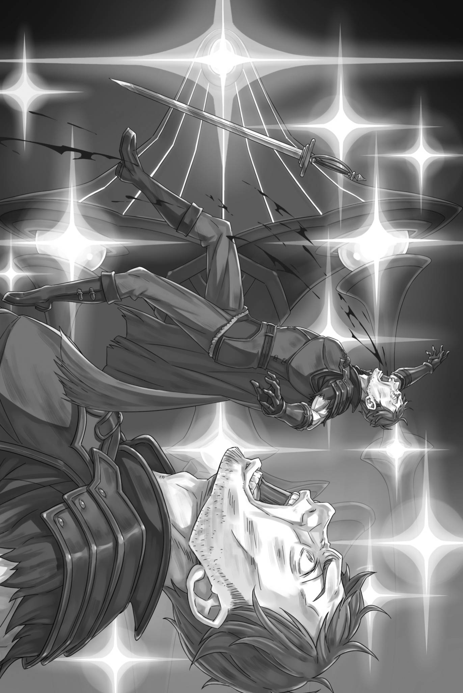

# 『石偶军团』

------

箭矢射穿没有眼鼻耳朵的头颅，石制人偶猛地向后仰去。

然而，那不具备人类五官的头部，似乎也并非人类意义上的要害。即便被箭射穿、崩掉一块，敌人的进军步伐依旧毫不停顿。

「只是打坏它们的头部还不够啊……荷莉！」

「我知道啊！」

石制人形们摇摇晃晃地向他们逼近，伸出手臂。

它们与人类一样大，却用非人类的动作逼近，这让人感到厌恶。将这种反感融入拉弓的指尖，弓弦发出雷鸣般的声响。

同时放出的三支箭直接命中石制人形的身体，不是穿透它们，而是将它们的身体打得粉碎，停止了人偶的动作。

可一旦躯干四肢彻底散架，就算是石偶也无法再动起来。

但是——

「这数量，哪来得及一个一个瞄准啊！」

正在瞄准城墙、据说是敌人布阵的破绽——第三个据点的库娜，看到敌军的数量和构成，心情变得绝望。

据说守护第三顶点的，是『九神将』之一的莫古洛・哈加涅。

幸运的是，莫古洛自己的身影并没有出现在城墙上。这是因为还没有到达莫古洛那里，还是莫古洛在其他地方呢？

无论如何——

「简直像聚在树汁上的蚂蚁一样啊！这么多，根本杀不完啊！」

「现在是抱怨的时候吗！射，射，给我拼命射！怎么射都能中！」

「哇——！库娜好严格啊！」

虽然像是发出悲鸣的声音，但荷莉从库娜的箭筒里拔出箭矢，一边夹在弓上，一边不断地射出。每一箭都能破坏两到三个石人形，但敌人的数量实在是太多了。

——石人形的数量多达数百到数千，数不清楚。

「啧，该怎么办啊……！」

舌头发出咂嘴声，库娜保持距离与敌人对峙，心里骂着发出指示的埃布尔。

虽然只是听说，莫古洛・哈加涅是一种特殊的亚人，被称为『钢人』。不同于将身体部分转化为金属的刃金人，听说莫古洛・哈加涅全身都是由矿物质构成的存在。

那么，眼前的无数石人雕像难道都是这种钢人吗？

「大家大家，它们看起来一点都不像活人啊！真的像是娃娃一样！」

「我也有同感！这些家伙是什么构造的啊！？」

保持适当的距离，睥睨周围，看着石头人的群体。由于它们没有眼睛，感觉不到任何自我意识。

它们只会包围接近的目标，用坚硬的四肢与怪力殴打，将人活活打死。那些未能逃脱、被追上后淹没在数量暴力之中的人，死状惨不忍睹。

先前挑战第三顶点、被石偶群踩碎的叛徒，如今连尸骸都遭践踏，恐怕早已在队列后方不成人形。对库娜等人而言，这绝非可以当作旁人遭遇、一笑置之的事。

如果这样下去，他们将被无数敌人踩踏，无法抵御。

必须赶在那之前——，

「要是撑不住，就得撤了……」

「啊！库娜！看那边！」

「啊？！」

在战场上，两人踢开田地上的草，同时射击并逃离。就在这时，荷莉的呼喊声引起了库娜的注意，然后惊人的景象出现在他们的视野中。

战场上立着一道人影，石偶蜂拥而至，石块构成的手臂狠狠砸下。眼看那人就要挨上一击，倒伏在血泊里——，

「——区区石头做的人偶，别来碍事！！」

发出这声怒吼的，正是怒容令凶悍美貌更显狰狞的米泽尔妲。

她怒喝着抡起双手紧握的棍棒，将扑来的石偶连头带上半身一一砸碎，反过来击溃了敌人。

不，不仅仅是她选择进攻而不是逃跑，而是其他人也做出了相同的选择。

「碍事碍事碍事！连该敬仰的皇帝陛下的威光都不懂，你们这帮帝国的耻辱，少来挡老子的路！」

伴着粗哑的吼声，剑光利落地斩断石偶的颈项，又将飞起的头颅凌空劈成两半。若还不够，便斜斩躯干，齐肩削去手臂；见它停了动作，就一脚踢倒，扑向下一个目标。

还有一个戴眼罩的外表粗犷的男子，像米泽尔妲一样跳向石制人偶。

这两个人的无情的白刃战斗打败了石制人偶。

然而，真正让库娜和荷莉惊讶的不是以上任何一点。

「――――」

剑刃高高挥起，挥斩而过，一座座石头雕像被狠狠地砍倒，轰然碎裂。

这并不是一种华丽的剑法，反而充满着暴力和粗暴。但是在面对需要被破坏阻止的石头雕像时，这无疑是一种最为合理的剑术。

挥剑葬送石偶群的，是红发剑士亨克尔——库娜对他的了解，仅限于他是那位傲慢高傲的普莉希拉的随从。

这个不知何时加入战列、面如亡魂的男人，接连斩倒无声的石偶。那光景恍如闷热难眠的夜里所见的噩梦，毫无真实感。

单看他做的事，分明是库娜等人该欢迎的援助。然而，那萦绕不散的阴郁，却让她不知是否该为之高兴。

毫无疑问，这肯定与亨克尔挥动剑时的神情和面容有关。

「看起来很痛苦啊。」荷莉的低语让库娜无法认同。

荷莉这样表达也可以理解，但在库娜看来，这个男人看起来更像是渴望死亡的人。

有时，确实会有战士为了寻找葬身之地而走上战场。

修德拉克也有年老将逝之人，带着弓箭深入森林，以挑战潜伏其中的巨兽为名，选择自己的终点。

库娜也许不会选择这样的结局，但是她能够理解这种想法。

然而，亨克尔与寻求死亡之处的战士不同。

虽然他渴望死亡，但却又害怕死亡，拼命抵抗死亡的样子只能让人感到痛苦。虽然大家都知道他的存在对战局起到重要作用，但库娜却希望他能立即倒下去，死去。

这个男人挥舞着被黑暗气息所笼罩的剑，让周围的气氛都变得沉闷而压抑。

「库娜！荷莉！」

然而，尽管库娜和荷莉充满了这样的情绪，战场上的局面仍然在持续发展着。

一边叫着她们的名字，一边疾驰穿过草原的是塔莉塔。背负箭筒，换上了典型的修德拉克族装扮的她，来到了两人的面前。

「停下脚步很危险的。不要白费了姐姐和贾马尔开辟出来的道路。」

「我明白，族长，不用你说……咦，只是被眼前的景色迷住了。」

「是因为亨克尔吗？」

塔莉塔眯起眼睛，一语点中了库娜那难以启齿的心结。

作为米泽尔妲的妹妹和『修德拉克之民』的族长，塔莉塔早先是一个缺乏决断力、比较胆怯的女孩子。

但是，为了继承族长的条件之一，即同行魔都卡欧斯弗莱姆的旅途，她似乎经历了一次大转变，不再胆怯，反而获得了一种柔韧的强度。

现在的她所提出的建议，也是由此带来的。

「族长觉得他不怪异吗？」

「说他诡异，未免太直白了……但他确实在拼尽全力，也确实是我们的战力。既然如此，我不反对与他并肩作战」

「挺坦率的回答呢……我也认同你的想法。」

即使有些问题无法解决，现在也不必急于解决。

塔莉塔原本在日常生活中可能不擅长，但在狩猎时却能够很好地切换心态。现在，作为族长，她已经能够在任何情况下很好地应对了。

库娜在心中如此评价着，塔莉塔则望向她背后的箭筒。

「箭少了很多呢。找机会收回落在地上的箭吧，别在同一具石偶身上耗费太多」

「这倒是理论上没错啊。」

「可它们哪有那么容易一箭就死啊！」

「只要瞄准心脏就可以一箭解决了。——就像这样。」

在两位困惑的女孩面前，塔莉塔箭在弓上，迅速地射出三支箭。三个石人形从远处向米泽尔妲逼近，塔莉塔的箭头穿过它们的背部、头部和大腿，将它们射杀。

「等等，等等，等等！怎么一发就死了！？心脏？」

「明明是石头人偶，根本不知道心脏长在哪儿啊」

「是、是吗？仔细看的话，我想应该能看出哪里比较重要……」

被库娜和荷莉追问，塔莉塔为难地垂下眉梢。

看她的反应，她真的只是仔细看了看，没做别的。虽然性格截然相反，让人容易忽略，可这种凭直觉判断的本事，果然不愧是米泽尔妲的妹妹。

作为修德拉克的一员，库娜反倒为这对族长姐妹如此纯粹的天性而感到自豪。

「没什么可借鉴的，我们就按照我们的方式去做。捡箭，如果不够，就用棍棒或其他武器。消灭敌人。」

「这种玩具就到此为止了！」

「有这股干劲很好。不过，真正的『九神将』迟早会现身……尤尔娜就是如此，『九神将』的实力不能以常理衡量。一定要小心」

「那么，是不是应该告诉米泽尔妲呢？」

在听取了严肃的塔莉塔的意见后，库娜用下巴指向在前线疯狂战斗的米泽尔妲。

那位装着一条义腿的前族长，将位置交给妹妹后，仿佛卸下了重担，正肆意大闹。照这架势，一旦『九神将』从敌阵现身，她肯定头一个撞上去。

就算少了一条腿，米泽尔妲也能与任何强敌打得有来有回——，

「姐姐，别冲得太靠前！单独面对会死的！」

「――――」

在射穿了挡在米泽尔妲面前道路上的石像头后，塔莉塔大喊着。米泽尔妲挥手回应着，表示她理解了。

塔莉塔的判断与这番话，让库娜真心惊讶，也深有所感。

塔莉塔真的不再一直躲在姐姐的背后了。

「当初玛丽乌莉出事那会儿，她的样子还叫人看不下去呢……」

「我们很高兴看到塔莉塔变得如此出色。」

「现在是说这些的时候吗！？你们两个，也请好好战斗！！」

石偶渐渐从周围合拢。荷莉用弓身殴打，库娜则以短柄手斧将其砸碎，却还在说着这番话，惹得塔莉塔提高声音斥道。

听到这位勇敢的族长的指令，库娜和荷莉相互点头，毫不犹豫地遵循命令。

那份古老盟约，订立于往昔的佛拉基亚皇帝与修德拉克之民之间，对活在当下的库娜等人而言已太过遥远，即便忘记，也无可厚非。

然而，这场为践行盟约而开始的战斗，如今确实也成了库娜和荷莉身为修德拉克之民，必须亲手赢下的战斗。

※ ※ ※ ※ ※ ※ ※ ※ ※ ※ ※ ※ ※ ※ ※ ※ ※ ※ ※ ※ ※ ※ ※

在前方，石制的人形直接朝着自己猛冲而来。

没有脸，没有敌意，也没有杀意。然而亨克尔・阿斯特雷亚依然挥舞着剑，对着这样的敌人进行战斗，咒骂着那个无情地选择了人形的傀儡使。

他不禁想，自己为什么要在帝国的大地上挥舞剑？

为什么在经历了那么大的耻辱之后，还能够紧握着剑不放？

为什么，那个自己必须证明尚有用处的人明明不在此地，自己却仍然——。

「——嗯」

他挥舞着剑，斩向伸出来的手臂，斩击的余波将对手的上半身吹飞。

对手是一座石人形，即使斩下了头和手臂，也无法降低其战斗力。因此，必须使用像野蛮人那样的一击，将对手击倒，让其失去行动能力。

他变换握剑的姿势，双脚分开站稳。

将剑蓄在腰侧，粗暴地横扫出去，沿途石偶顿时被夸张地扫飞，几乎令人快意。可他不觉得快意。一点值得高兴的事都没有。

他已经记不起来挥舞剑是一件令人愉快的事情了。

对他来说，剑一直只是比看起来更重的枷锁。

「该死！」

他啐出恶骂，一剑劈向进入攻击范围的敌人。

脑海里尽是以『为什么』开头的疑问。他要将那些快要遮住视野的念头一并扫开，挥剑，挥剑，挥剑挥剑挥剑挥剑，疯狂挥剑——。

「该死的！」

习剑时，他常被教导，要心无杂念。

提高专注，摒弃杂念，与剑融为一体，剑技自然会愈发精纯。——可无论听了多少次，他都不明白这番教诲究竟在说什么。

「该死的！」

他被告诉不要思考，但当他试图付诸实践时，他还是在考虑着如何『不去思考』，所以他根本无法心无旁骛。完全集中于剑这一点，人类该如何做到？

活着就会饥饿，就要呼吸。身体总有哪里发痒，也会困倦。忧心的事没有尽头，脑海一角始终挂念着家人。别说明天，连十秒之后都令人不安；别说十秒之前，连昨天乃至更早的失败，也始终让他耿耿于怀。层层积累，无休无止，无休无止，思绪永不停歇。

怎样才能心无旁骛？

完全停止人类生存中产生的自然思考，这绝非人类所能做到的。那么，能够心无旁骛的剑士难道不是人类吗？

难道说，自己不是剑士吗？

「该死的！！！」

无尽的辱骂声一波接一波地涌现，不论多少次吐出口，都无法从脑海中抹去。

亨克尔胡乱挥剑，仿佛要将这些念头一并扫尽，把挡在眼前的石偶化作一堆堆碎石。

这种行为到底有多少价值呢？

该做的事没能在该做的时候做好，反让自己想讨好的人收拾残局，最后还得别人救命，欠下难以偿还的人情。

这样一再重复，又能弥补什么、报答多少？

『可惜，本大爷可不知道大叔你背负着什么』

脑海中，除了自己的自责声，还夹杂着别人的声音。

还是在观景台喝醉酒的时候，听到了一个年轻而清脆的声音。虽然明确表达了不想和任何人说话的意愿，但却是一个莽撞无礼、毫不客气地闯进来的少年的声音。

『你说自己搞砸了，本大爷也不知道究竟搞砸到了什么程度。不过啊，犯错的经历，本大爷也有』

即使已经随意说了一些话将他赶走，这个少年还是经常出现。

明明自己也满脸迷惘，那少年却偏要煞有介事地插手他的烦恼。

而且说的尽是些幼稚廉价、叫人只想嗤之以鼻的天真理想。

『自己惹出来的事，只有自己才能作个了结。所以，大叔你要是还能做些什么——』

「闭嘴，小屁孩！！」

这些安慰或者怜悯的话，到底是在慰藉还是在劝慰，又或者是在同情？其实并不重要。

所有朝自己而来的关切，都只叫他厌烦。他没有想要的东西。从别人那里，他什么也不想要。他想要的不是某件东西——而是只想由某个人来给予。

从那个人那里得到的东西才有价值。除此之外，所有的东西都只是随身携带的沉重负担。

「——」

诡异的石偶无声地逼近，他一剑劈向眼前的两具，将它们一并纵向斩开。另一具似要趁他大幅挥剑的空隙从侧面扑来，他便以剑鞘末端砸碎它的脸，再抽回爱剑『阿斯特雷亚』，将后续的敌人贯穿。

如果对手没有面容，只是学习了一些动作，那么无论有多少个都可以杀死。

只要呼吸还在，十个也好，二十个也好，都可以应付。但这有什么意义呢？

这种连该看见的人都看不见的邀功，究竟有什么——，

『——大叔你能做的，就是用自己的剑扳回来啊』

「该死……」

仍旧倚靠着即将熄灭的微弱火光，真是可笑。

一旦开始思考这个问题，就会陷入『为什么我还活着』这样的难题。

他究竟想用这把剑证明什么？想得到什么？又渴望着什么？

「——」

如果主要威胁是数量，周围的人也会陆续开始攻略它。

其中脱颖而出的是亨克尔、手持棍棒的狩猎民族女性，以及使用不相称的流畅剑技的眼罩双剑使。但是，主要使用弓箭的狩猎民族在族长的指示下，果敢地推进战线，一度退却的其他叛变者也各自恢复了势头。

正如所指出的那样，这是敌方防御网中的漏洞。

比起其他四个顶点，这一处的防御力显然要弱得多。亨克尔能一路杀入其中，就是证明。

只要有一个人，哪怕只有一个真正的强者坐镇，亨克尔就绝不可能像这样冲在最前面。

「追上那个背影！」

「别让那个红发男子赚功劳！我们也继续前进！」

「不错的剑术。剃掉那胡子吧，这样会变得更加好看。」

自己冲在最前面，身后大群人一面追赶一面高喊——这种事根本不可能。

哪有闲暇让自己沉醉在一时的假象里。

「该死……来啊，再来！这样连邀功都算不上——」

为了更严苛、更清醒地正视眼前的现实，他抬起头。

一道横斩扫飞正面并排的石偶，他膝间蓄力，就要跃向近在眼前的城墙。

就这样攀上去，扫清墙上的敌人，攻下第三顶点——可又不是明确讨取了哪位敌将，这也能算立功吗？

这样能弥补城郭都市的那次失态吗？能让他对普莉希拉怀有的期望，重新系上一线蛛丝般的希望吗？

至少一点点，哪怕只有一点点——

「——你，杀我的，最多」

「――――」

在试图奋力攀爬城墙的瞬间，亨克尔被叫住了。

他的肺部感到窒息，沙哑的呼吸从喉咙中漏出。他既没有被攻击，也没有被攻击阻止，只是被叫了一声。

仅仅因为这个原因，亨克尔的全身都紧绷了起来。

方才什么心无杂念，什么自己的愿望，什么挽回过失，脑海里纠缠的种种思绪全被一片空白涂抹，消失不见。

他只知道，他遇到了一种无法抵御的威胁。

那是...

「杀我，最多。所以，我也，杀你」

声音没有透露出任何感情，然而城墙的变化却显现在亨克尔的眼前。

不是石头人站在城墙上。

也不是守卫着城墙的石头人。

城墙的第三个角上，也就是所谓的星型城墙的第三个角，开始发生变化。

「啊——」

亨克尔喘息着，视线变得模糊，城墙两旁突然出现了无数个『光点』。至于这些光点是否应该被称为『光』，这是有争议的。

这些出现在城墙上的『光点』是明亮的绿色球体，大小约为拳头，乍一看似乎是无害的，不会引起危险感。

然而，这些『光点』本来并不存在于城墙之上。突然间，无数球状的『光点』在原本毫无异样的城墙上生长出来。在亨克尔看来，这些『光点』看起来像是一双活生生的眼睛，似乎与他的视线交汇在一起。这些『光点』同时盯着他，让他感到不寒而栗。

「嘶……」

那一瞬，亨克尔全身僵住，握剑的力道随之松懈——，

「飞出去」

刹那间，与那平板的声音截然相反，裹挟着惊人轰鸣与狂风的巨大石拳，击中了正在跃起的亨克尔，将他轰向高空。

「咔」

石拳从头到脚无所不至地打在他身上，亨克尔无可奈何地被击飞到空中。

正如他方才扫飞石偶一般，他如今也只能以『被扫飞』形容。亨克尔洒着鲜血飞出，透过翻转的视野，看见了——，

在他被吹飞的过程中，地面的情况发生了翻天覆地的变化。这不是亨克尔意识变得模糊所致，而是确凿无疑的、不可忽视的变化——

「『九神将』之『捌』，莫古洛・哈加涅！」

这是战场上战士的规矩，堂堂正正地自报家门——但是，其规模实在是太大了，与平常完全不同。

「――――」

那必须攻克的星形城墙——第三顶点本身，动了起来。

这正是『九神将』之一，自称为莫古洛・哈加涅的强大存在。

