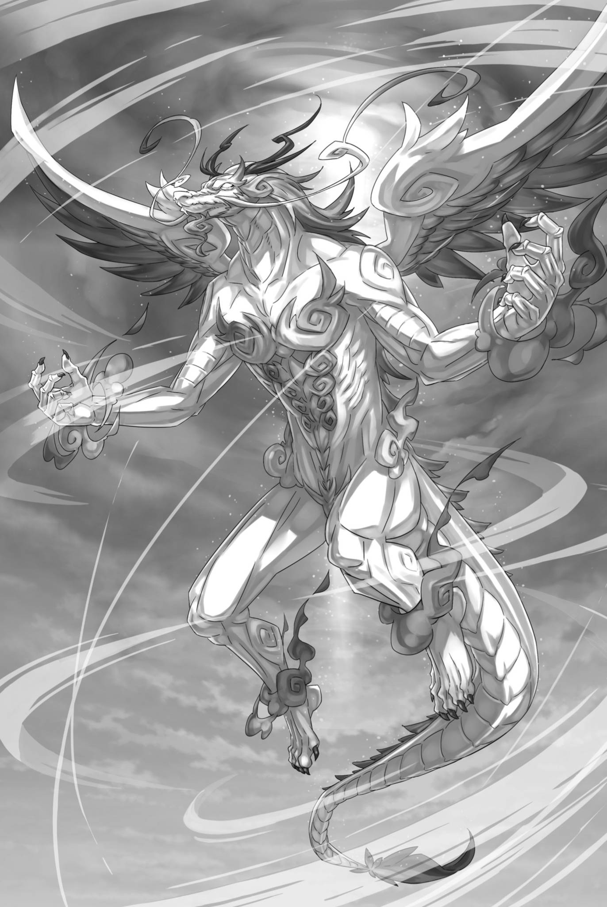
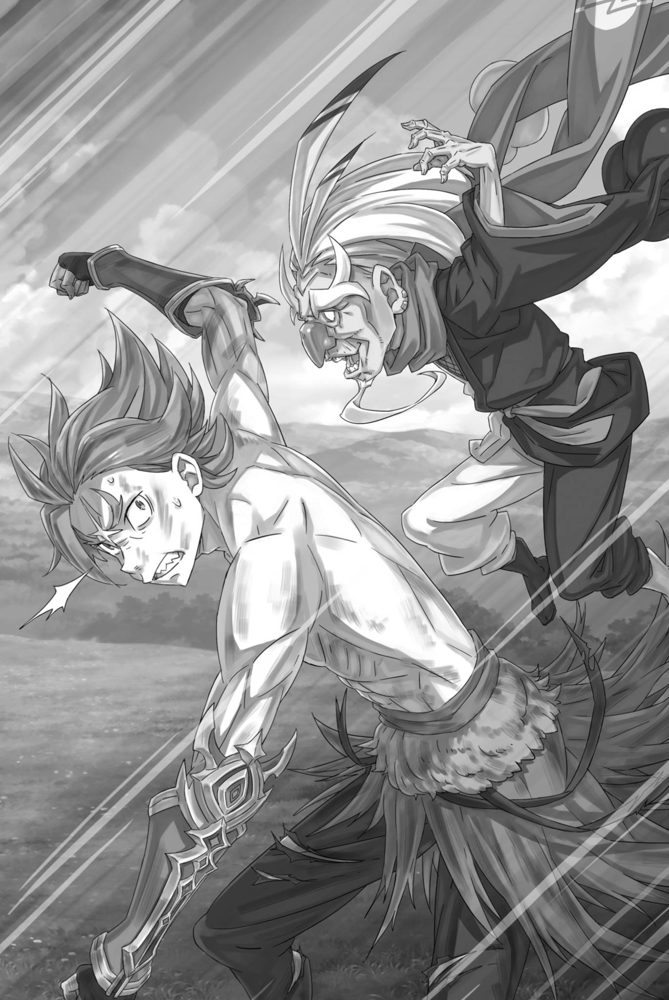
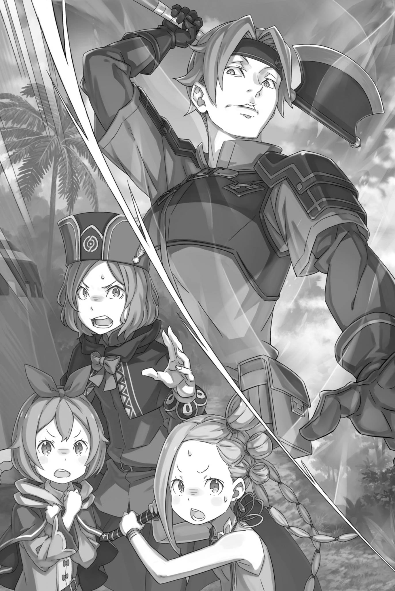

# 『顶点楚歌』

------

那一刻，身披白云，降临到地上的存在，被战场上的每个人都看到了。

太过雄伟和壮烈，处于与凡俗不同的次元之中，是一种超越的生命体 —— 每个人都能一眼理解。

「那是，龙啊」

翠绿色的眼睛睁得大大的，站在崩塌的城墙旁的加菲尔小声地说。

与卡夫马・伊鲁克斯的死斗结束后，他急促地喘着气，寻找自己下一个使命时扫视战场，这时发生了这件事。

刚刚打完一场苦战的加菲尔自然也将那一幕看在眼里。那头『云龙』现身的地方，正是艾米莉娅坐镇、被冰雪染成一片洁白的顶点——眼下战况最为激烈的一角。

「艾米莉娅大人......」

拥有荒谬容量的门，以及剥夺世界温度的魔力运用，艾米莉娅毫无疑问已经认真起来了。

如果正在与守卫五个城墙顶点的敌人战斗，那么对手肯定是『九神将』或者等同于他的存在，最起码也是和卡夫马匹敌的对手。

仅是这样的对手，就已经让加菲尔不愿艾米莉娅与之交锋。如今，追加的战力竟还是神话中的存在，未免荒唐得过分。

「是『飞龙将』把它叫来的吗？可恶，得赶紧让她撤下来……！」

加菲尔立刻做出判断，打算赶去替换战场上的艾米莉娅。

艾米莉娅能够战斗，与让艾米莉娅去战斗，是两码事。明知这一点，却仍让她亲临前线，是他们阵营在这场攻城战中不得不做出的艰难抉择。

原本，艾米莉娅该处在不必担心受伤的安全之地，见证这一切才对。

「本大爷可就没脸见老大了。」

艾米莉娅不想将一切都交给别人，这样的心情自然可以理解。

这种善意的谦逊和关心别人的心态是非常可贵的。但是，我们不能完全允许她做自己想做的事情。

而且，加菲尔是艾米莉娅阵营的武官，他的职责是扫清降落在阵营上的火花，并消灭所有的敌人。

「――――」

闭上眼睛，加菲尔静静地确认着自己的状态。

在与卡夫马的战斗中受到的重伤，全身被切割，内部被挤压，为了杀死寄居在自己体内的『虫』，加菲尔不得不点燃自己的身体。然而，他还活着。

话虽如此，他也只能嘴硬说一句自己没事。

「虽然说完全没问题有点过分……但我还能干！」

此刻，他仍从脚下的大地吸取力量。全力发动的治愈魔法，正以惊人的速度修复着身体内外的伤势。

这本该是可能折损寿命的巨大负荷，但水门都市的经历，让加菲尔的肉体与精神都突破了原有的界限。

突破了看不见的、确实存在的薄膜，加菲尔站起了身。

无数伤口升起血色蒸汽。加菲尔活动着仿佛燃烧般灼热的身体，决意前往远处迎战巨龙。

「你们这些家伙！我已经打破了城墙了！赶快冲进去啊！！」

加菲尔张口，向远处观望的叛军放声吼道。

他们是比加菲尔先挑战卡夫马而被一扫而空的一伙。包括受伤的、被同伴扶持的，相当一部分仍应该作为战斗力存在，然而他们全都一致地远离了加菲尔和卡夫马的战场，在决战结束后仍然没有动弹。

这可能是因为被加菲尔和卡夫马的战斗所压倒的缘故。

然而，理由还不止如此。

「是你把城墙打破的！如果是这样，那么你应该是第一个进去的！」

「――――」

「英勇的战士，我们敬重你的武勇！任何人都不得冒犯这份荣誉！」

半人半马的男子猛烈地回答了加菲尔的话。

击倒卡夫马的加菲尔，才有资格第一个跨过城墙。所以，他们停下脚步，一直等着他先行。

这似乎并非那人一己之见，而是所有目睹方才决斗者的共识。这些为各自私愿挑起战事的人，心中却将战士的骄傲奉为至高。

他们好像对加菲尔的战斗方式非常赞赏。

他们的关注和照顾本身是令人激动的，但——

「抱歉，本大爷有个非去不可的地方。可不是『去而复返的维普弗洛克』那回事。——是那家伙。」

加菲尔抬起下巴，指向高高在上的白龙。

在普雷阿迪斯监视塔，在城郭都市古阿拉尔，加菲尔都曾有机会遭遇龙，却总因时机不巧而错过。如今，龙终于来到了他能够扑上去一战的地方。

不是想不想打，而是必须去打。

「――――」

看着加菲尔的动作，反叛军也为白龙的出现而感到惊恐。

明明被龙的威势压得心惊胆战，却仍未跪倒在地——这些叛军的胆气，同样远超常人。

加菲尔决定挑战。因此——

「越过城墙的任务，就交给你们了」

只要反叛军能够冲破倒塌的城墙，就能够改变当前的局势。

如果帝国的最高战斗力都站在五个要塞的防御线上，那么驻扎在水晶宫的文森特・佛拉基亚皇帝周围的保卫力度可能会相对较弱。

直接从城墙的洞口放出决定性的一击，也是一种可能性。

「所以——」

将攻入帝都的先锋交给叛军，加菲尔便要去迎战那白色的威胁。

是的，他正试图迈向白龙所在的顶点。

突然间，加菲尔全身都感到一阵恐惧。

「——呃」

那是先于思考、身体自发做出的反应。

但毫不犹豫地、不加思索地，按照脑子里本能呼喊的感觉，他发出了全力一击。

加菲尔将拳头向身后甩去，以一记反手拳迎击背后的来者。

「——哦，连老夫的隐匿都看破了？这可不得了啊。」

在他的钢铁拳头的背后，传来了一个嘶哑的声音。

「咔。」

刹那间，他感觉到背后的影子被他的背拳击中了。

毫无疑问，他感觉到金属手套表面被什么东西触碰到了。尽管如此，发出尖叫的声音却是从自己的嘴里发出的，盯着眼前的景象，加菲尔惊愕不已。

冲击贯穿了背脊。有人将小小的脚尖轻轻抵在加菲尔背上。好可怕的踢击——不，不对。

「完完整整，就是你自己那一拳咯。老夫只是让它从身体里过了一遍，再还给你罢了。」

回答疑问的声音传来，加菲尔睁大双眼，全身骨骼都在冲击下嘎吱作响。

不论此话是真是假，那股堪比自身全力一击的威力，震荡着内脏与大脑，令视野剧烈摇晃。割伤、挫伤、骨折，甚至内脏破裂，他都能迅速治愈。

即使没有治愈，他也可以强行移动身体。

但是，那种击中体内核心的攻击是无法抵消的。

「啊——」

全身痲痹的加菲尔咬紧了牙齿，警惕着追击。他勉力运动着迟钝的手脚，设法保护了自己的脖子和头部的要害。

但是，他害怕的追打并没有来临。

相反，对方利用了可以追打的时间进行了威慑。

「说实话，城墙真给打破了，里头可就麻烦啦。」

紧接着，十数人接连倒下，惨叫与倒地声响成一片。

加菲尔强撑着打颤的膝盖抬起头。响应他的呼喊、准备攻入帝都的叛军队伍前列，人马与兽人们的额头、胸膛，已被黑铁色的飞刃——名为苦无的投掷武器贯穿，转眼间便断了气。

即使是使用治愈魔法也来不及。这是一种瞬间的重伤。

他们既然敢挑战帝都，便理应都是有相应实力的战士。即使比不上卡夫马这样的『将』，也绝非泛泛之辈——

「如果死了，就只是垃圾。还有必要称之为战士吗？」

「――――」

「嚯嚯嚯！小伙子，瞧你那不服气的眼神。城墙也是你打穿的吧？麻烦家伙一个接一个地冒出来，真叫人头疼啊。」

说着话，笑着张嘴，用手指描摹着自己的长白眉的小个子影子。

在加菲尔终于挣扎着移动了自己的脚步并距离远离的视线中，出现了一个比加菲尔还要矮的老人。

但是，用『小个子老人』这个词来描述他，似乎并不恰当，因为他是个怪物。

「你……」

「哎，等等。老夫待会儿再陪你玩。先这样——」

「什么？」

盯着老人的敌意满面，全身的毛发都竖立起来的加菲尔。然而，老人伸出手臂，用缺失右手腕以下的手臂阻止了加菲尔。

加菲尔皱起眉头看着老人的残缺肢体，老人则挥动了腿。

加菲尔还没看清，老人横扫的一脚已在地面划出一道深沟，将自己与加菲尔同后方的叛军隔了开来。

然后，老人转向那些站在痕迹另一侧的反叛军。

「跨过这条线来试试吧。你们全都会死的」

「――咳」

「嗯，听话就能保命。村里的年轻人也该学学你们，最近一个个净跟老夫顶嘴。老夫可是村长啊，你们说是不是？」

老人耸了耸肩膀，露出了洁白的牙齿，并咧嘴笑了起来。

他全然不把刚刚的威胁当回事。在场的人却无一本能地怀疑那句话的分量——只要越线，他便真会杀人。

加菲尔也理解了眼前老人的身份。

「奥尔巴特・邓克尔肯......『恶毒翁』。」

「老夫不是每次都说不喜欢这个称号嘛，听着跟骂人没什么两样。」

「—— 你到这里来做什么？」

老人奥尔巴特耸了耸肩膀，看起来自然不做作，但这正是让加菲尔无法放松警惕的原因。奥尔巴特悄无声息地站在加菲尔的背后，在这个开阔的平原的正中央。

「――――」

在建筑物的阴影中悄悄接近，消除气息，还可以理解。即使如此，也足以构成威胁，但这样一来，发生的事情也就能得到合理解释。但是，对于没有气息地插入到这个空间的存在，该如何理解呢？

他只是一种被视为威胁的存在。

面对心生战栗的加菲尔，老人仍旧神态自若，挑起一边眉毛。

「嗯？来干什么？这还用问嘛。老夫的差事就是不让叛军进去，卡夫马这边搞砸了，只好来给他收拾残局咯。」

他用断去右手的手臂指了指倒在地上的卡夫马，随后又像是想起什么似的，换成左手。

「所以老夫早说了，不是让奇夏上，就是把格鲁比叫回来，不然可不妙。结果呢，果然输了嘛。」

「很明显吗？老头子，你没有资格嘲笑他。」

「哦？」

奥尔巴特眯起一只眼，似乎不明白他为何动怒。加菲尔则挪动脚步，挡在了他与卡夫马之间。

虽然卡夫马是敌人，这点没有改变，但是除了跟卡夫马正面对决的加菲尔之外，没有人有权利对卡夫马的战斗表现和存在方式进行干涉。

「这家伙很强。当然，我更强。」

「——？嗯，这个……你看他就知道了吧？我也不否认这一点。你到底想说什么？」

「本大爷是说，你这态度让人火大！同样都是『将』，又是自己人，你就这么看待他！？」

加菲尔像猛兽一样张大嘴巴，狠狠地吠叫。看着他那凶猛的咆哮声，奥尔巴特皱起了眉头，歪着头，真心感到疑惑。

老人表情怪异地接话道：「等等，我是一将，而卡夫马只是二将。完全不一样的存在，你说对吧。」

「——！」

奥尔巴特将这番话说得理所当然。意识到彼此之间那道无法理解的鸿沟，加菲尔的瞳孔骤然收窄，犹如猛兽锁定猎物——下一瞬，他扑向了老人。

他感到了对卡夫马应该得到的尊重。但是，对于眼前的敌人，他没有这种感觉。

眼前的老人既不渴望那份敬意，也不承认它的价值。在战斗中，他们各自看重的东西，根本就不同。

「打烂你！！」

他挥起双臂向奥尔巴特逼近。

双臂毫无保留地发力，挥出不逊于、甚至超越击破城墙时的一击。两只拳头从左右夹击，狠狠砸向奥尔巴特的头颅。

轰鸣炸响，冲击震动大地，碎裂的地面宛如爆炸般崩开，沙尘纷纷洒向后方叛军的头顶。这本该是足以将奥尔巴特打得粉碎的一击。

然而——

「呃」

在眼前这一幕之下，加菲尔目瞪口呆。

拳头确实从左右夹住了老人的脑袋，结结实实命中的触感沿着加菲尔的双臂传了回来。

然而，老人却在被加菲尔的拳头夹住头的同时露出了白色的牙齿，笑了起来。

「真厉害啊。老夫把这股劲全卸到地上去了，居然还能这样。」

「啊——」

「光是卸下去的力道，就把地面给震碎了。你这臂力可真不得了。」

话音未落，老人的脑袋便向下一缩，从加菲尔的双拳之间滑了出去。加菲尔的视线追着落下，却在下一瞬——

「呕——！？」

他在追踪下落的奥尔巴特的时候，头顶却受到了冲击。

虽然奥尔巴特原本是蹲下的，但像是从上方遭到了打击。

「以为在下面的时候，就该防着上头；以为在上头的时候，就得防着下面。这可是基本功啊。」

「啊啊啊啊啊——！！」

伴着奥尔巴特轻飘飘的话音，加菲尔怒吼着向下挥拳，瞄准那一头白发猛砸过去。

瞬间，锐利的冲击穿透了加菲尔的后脑、背部和臀部。

加菲尔打出的拳头空中打了个空，重重地插进了地面。

取而代之的是，奥尔巴特在一瞬间消失了，但他的声音却从正上方传来。

「所以，当你以为是下方时，它就在上方。没接受教训的家伙肯定会被淘汰的哦。」

他扭动身体，向声音挥舞手臂。当他的手指触碰到某物时，加菲尔用力将其挥下，准备砸向地面。

他打算先将对方掼向地面，封住动作，再补上一拳。只要双脚离地，那种将力量卸走的把戏便该使不出来了。

「――――」

然而，就在战斗本能即将付诸行动时，加菲尔猛然停住。手中抓住的不是奥尔巴特，而是被老人抛到他头顶的卡夫马。

他停止了将卡夫马扔到地面上的动作，嘴唇颤抖着。

突然间——

「嘿，你这家伙，知道为什么二将有五十个人，而一将只有九个人呢？—— 因为我们太强了。」

声音和冲击穿过了加菲尔的头部，从左右两侧穿过去。

※ ※ ※ ※ ※ ※ ※ ※ ※ ※ ※ ※ ※ ※ ※ ※ ※ ※ ※ ※ ※ ※ ※

——那是天穹的怒火。巨大的火球自天空坠下，仿佛要将世界焚烧殆尽。

尤尔娜看到了这个被染成红色的世界，有一种世界被激怒了的错觉，世界也许会对一个微不足道的个体发泄出如此愤怒。

焦黑的大地再度被烈焰吞没，叛军、草木，乃至尸骸的内里都将被烧尽。面对这一切，尤尔娜却一动不动。

「——阳剑。」

「真是会使唤女儿啊。」

以尤尔娜的呼唤为信号，普莉希拉纵向挥起了真红的宝剑。

那美丽的剑，会让人目眩神迷，燃烧心灵，连灵魂都会被其吞噬。这魔性对于宝剑来说只是附带的，甚至不是它真正存在的理由的一部分。

也就是说，当它真正履行它的存在理由时，它的光芒将变得更加强大。

「――――」

『阳剑』从下往上，从大地向天空挥舞，直接击败了这股惊人的大火。刹那间，燃尽一切的火焰消失了，不是因为被打断，而是像从来不存在一样消失了。

「阳剑可以烧尽妾身想烧的东西，斩杀妾身想斩杀的东西。」

这种暴力、不合理、不公正的力量，就是眼前光景的背后，也是像要毁灭世界一样的业火消失了的原因。

尤尔娜原以为火球骤然消失，多少能让对手措手不及。但普莉希拉紧接着便出言提醒。

「别小看了它，那是『噬灵者』。」

这句简短的提醒没能说明太多。普莉希拉向右跃开，尤尔娜则向左闪避，奔涌的水流从二人之间轰然穿过。

「——嗯。」

尤尔娜不得不再度提高对亚拉基亚实力的估计。

这不是尤尔娜第一次与亚拉基亚交手了。

早在之前，当尤尔娜发起所谓的『谋反』时，她们就曾经交过手。

那时，亚拉基亚身后还有塞西尔斯坐镇；而战场又是尤尔娜的主场——魔都卡欧斯弗莱姆。与此刻相比，前提已大不相同。

虽然当时的战斗对于尤尔娜来说也很认真，但事实上，她并不是真的想要杀掉亚拉基亚。

她向那些伤害城中居民的人施以报复，让他们付出了应有的代价。

那同时也是一次实力的展示。既然与文森特对立的一方已经明白了她的力量，事情便有了谈妥的余地。

但亚拉基亚并不懂这些政治上的盘算，自然也谈不上为此手下留情。

然而，这个认知是错误和天真的。

如今尤尔娜终于理解，她为何能位居奥尔巴特之上，坐上『九神将』第二位。水流如利刃般切开大地，一直延伸到地平线的尽头。

她明白了，这是因为水受到压力而成为了威胁。

然而，当她看到这种异常时，尤尔娜把她的衣袖卷了起来。

她穿上了自己最喜欢的衣服，为了决战做好了准备。

即使如此，她还能承受住亚拉基亚的一击吗？

「上一次，你还只是用火烧掉了我半座城呢。」

亚拉基亚一口气焚烧了半个城市，今天也将反叛军和城墙一起烧毁。

火焰适合依托石造建筑构筑防线，而无需顾忌周围的战场，对亚拉基亚也有利。尤尔娜因此以为，她没有理由在此时改变战法。

「这多半也是谁教她的。若不是拿来对付妾身，倒还有几分可爱。」

说着，普莉希拉向亚拉基亚走近。

亚拉基亚将星形城墙的一处顶点护在身后，膝盖以下燃起火焰，悬浮于半空。

即使仅仅从高空中，无情的火力也足以构成威胁。

首先，她需要把亚拉基亚拉到可以接近的地方。

「母亲！」

「嗯，我知道！」

在普莉希拉奔跑的喊声中，尤尔娜的内心感到了一瞬间的动摇。

明明母亲已换了一副全然不同的容貌，普莉希拉却能如此自然地接受，反倒让尤尔娜这个做母亲的不知如何是好。

虽然母女在婴儿时期就分离了，但尤尔娜也无从得知普莉希拉的成长过程。

「舞起来吧。」

尤尔娜放下烟斗，挥舞着它的末端，用厚底鞋踩踏着地面。接着，在普莉希拉前进的正面，地面开始缓缓颤动，随后浮现的岩石为普莉希拉提供了通向目的地的支撑。

尤尔娜的『魂婚术』，同样可以作用于无机物。只是，其效力与倾注的感情、共同度过的时光成正比。她因此有些不安——这片曾与心爱之人共度时光的大地，自己究竟有多爱它呢？

但结果如你所见。

「做得好。」

留下这句丝毫不把母亲当母亲的话，普莉希拉跃上面前的立足点。

更多踏脚石接连浮起，构成通向亚拉基亚的道路。尤尔娜还特意铺出了多条路线，免得一条直路让女儿成了活靶子。

正当他们通过这些努力时……

「碍事。」

亚拉基亚挥动手中的树枝，释放出狂风，将漂浮在空中的土地一扫而空，扫平了所有的道路。

这股狂风的威力不仅仅是暴风雨，而是相当于被巨大的手掌猛击的威力，如果直接袭击的话，就算是普莉希拉的身体也有可能被全身粉碎。

「你这样毫不留情地攻击妾身，不觉得妾身的美貌会很可惜吗？」

「决定了。无论失去手脚，公主还是公主」

「又是别人替你决定的吗。」

普莉希拉高高跃起，从空中向亚拉基亚喊话。

普莉希拉已在脚下的立足点被击碎之前跃起，此刻身在半空，正向下坠落。

亚拉基亚的眼中不再有迷惘。她瞄准了普莉希拉的四肢——即使要将其斩断，公主也依旧是公主。

就在此时——

「你们可别忘了我啊」

亚拉基亚抬头看着头顶上的普莉希拉，就在这时，从正下方飞来的尤尔娜踢了亚拉基亚一脚。

尤尔娜将力量灌入脚上那双平日里亲自悉心打理的爱鞋，以『魂婚术』赋予的一击迎了上去。

「都这把年纪了，还想抢妾身的风头吗？」

尤尔娜由下方踢出的一脚，与普莉希拉从上方斩落的『阳剑』，夹击了亚拉基亚。

然而，两人的攻击却彼此撞在了一起。

本应夹在中间的亚拉基亚并没有承受那一击。尤尔娜的踢击与普莉希拉的剑刃都穿过了她的身体，径直碰撞，迸发出猛烈的冲击。

她们看见，亚拉基亚的身躯竟已化为透明。

然而更令人惊讶的是，尤尔娜和普莉希拉的攻击正好相撞的地方是摇曳着的亚拉基亚的身体中。

「竟然……穿过去了？」

「雕虫小技。」

两人的攻击穿行于亚拉基亚透明的身体之中，未能伤她分毫。

亚拉基亚的整个身体像是炸开了一样，事实上也确实炸开了。

化为白光碎片四散飞舞的亚拉基亚身体，带着可怕的扩散力化为散弹四散飞溅，像水飞沫一样袭向尤尔娜和普莉希拉。

「咕……！」

尤尔娜聚起先前被风击碎的瓦砾，试图用它们挡下攻击。

所谓的『围绕』，并不是像衣服一样贴在身上，而是高速地绕着身体周围旋转，抵挡攻击的小技巧。

只要亚拉基亚的散弹的威力不太高，就可以大大减轻其威力。

但是——

「——唔！」

然而，土石构成的屏障仍被贯穿。

被冲击波吹飞，尤尔娜惨叫着跌落在地上。她立刻伸出脚尖着地，尽力避免了笨拙地滚动。

她不能倒下。更不能在地上痛苦地打滚。

「若是我倒下……那些爱着我的人，可是会不知所措的……！」

尤尔娜的灵魂的重量是由那些爱她的人的存在维系的。

既然如此，她必须全力以赴地回应他们的爱。回应爱并不是件轻松的事情。

无论言行举止还是情感，她都必须相应得体。

无论是日常生活、私人空间，还是战斗中，都是如此。

「啪」，一声轻响，插在尤尔娜盘起的发髻上的发簪碎成了粉末。整个发饰都由好几层鳞片重叠制成。

「那是谁的礼物？母亲。」

「——是我深爱的孩子们送的礼物。」

尤尔娜轻轻地低下了头，将那些破碎的发饰碎片接在手指上。

她身上的东西，大部分都是礼物。无论是和服、鞋子，还是发饰，都是魔都居民用自己的手织制、雕琢、或者用自己的身体制成的精品。这些东西都是装满了灵魂的。

这些东西接受了尤尔娜的爱，同时也有资格代替她破碎。

「你也是？」

「可惜，妾身不像母亲那般来者不拒。无非是原本就有的东西，再加上已故丈夫献上的礼物罢了。」

说着，普莉希拉轻轻地露出自己的耳朵。接着，原本戴着翡翠宝石耳环的那只耳朵上却没有了它。

她们将本该落到自身的致命伤害，转移给了那些爱着自己的事物。正因如此，才能在这样的攻击下保住性命。

「你也……是从丈夫那里？」

「你看起来很严肃呢。那只消失的耳环是第四任丈夫送给妾身的。」

「四……」

「妾身已经结了八次婚了。不过，妾身还是比不上母亲。」

普莉希拉淡然地说着，她出乎意料的回答让尤尔娜惊得张大了嘴巴。但是，她的震惊很快就被普莉希拉重新握紧的阳剑的光芒所抵消。

刚才那种奇怪的现象……

「普莉希拉，『阳剑』本该能斩中任何对手吧。除非是唯有直达灵魂的『命剑』，才能斩断的存在……」

「不消母亲提醒，妾身也明白这一点。但你有所误会。」

「误解？」

「妾身的阳剑可以烧掉想要烧的东西，砍掉想要砍的东西。」

说着，普莉希拉缓缓举起阳剑的剑尖。

如果尤尔娜用目光追随剑尖，她会看到在阳剑剑尖的另一侧，浮现出飞散的白色光芒汇聚而成，逐渐成形的亚拉基亚。

『噬灵者』是一种稀有而不确定实体的力量，它反映了被吞噬精灵的特性，并赋予其力量。然而，它的功能扩展性令人惊叹。

此刻，那具肉体究竟是凭借什么原理化成了光——想到这里，尤尔娜忽然明白了。

阳剑是一把可以砍掉想砍的东西，能够触及万物的宝剑，但是——

「——那究竟是火，是水，还是风？倘若连是光是影都分不清，要让剑刃斩中，自然棘手。」

「――――」

紅色的眼睛微微眯起，普莉希拉与同样眼色的亚拉基亚对视着。

拥有能够到达一切之物的阳剑的持有者与具有能够变幻为一切之物的超越者对峙着——

「原来如此，这可真是个麻烦的对手啊。」

如果这里是卡欧斯弗莱姆的话，尤尔娜也许有正面撞击并磨平亚拉基亚的可能性。

然而，这里不是卡欧斯弗莱姆，尤尔娜的力量也无法完全发挥出来。

因此，决定性的打击不在尤尔娜的手中，而是——

「不管何时，舞台的中心都在于妾身这一方。」

普莉希拉向来能从逆境中汲取力量，越是处境不利，她便越发耀眼。

在她的微笑中，连站在旁边的尤尔娜也感到了耀眼。

唯有亚拉基亚，曾能立于那光辉近旁而不被灼伤。如今，她却站在了普莉希拉的对面。

※ ※ ※ ※ ※ ※ ※ ※ ※ ※ ※ ※ ※ ※ ※ ※ ※ ※ ※ ※ ※ ※ ※

―― 奥托・苏文感受到了风向的变化。

一开始，是风的声音。

奥托打开平日里紧闭的通道，让各种生物的『声音』涌入脑海。随着听取的声音越来越多，他仿佛逐渐溶入了世界，连自我的轮廓都在变得模糊。

只有在这样的情况下，才能找到被淹没在海量信息涡流中的东西。为了取出它，自己也需要深入地潜入其中——

「――奥托先生！」

「――啊」

佩特拉的呼喊，连同脸颊上骤然传来的清脆一击，将他拉回了现实。

就像一个储水槽被打破，里面的水溢出来一样，像在指间滑落的沙粒一样，声音消失了。

同时，他也有些可惜和留恋。

「啊，好险……谢谢你，小佩特拉。」

「你脸色又变得很糟糕了。请擦拭一下鼻血。」

「啊，谢谢了。……感觉就算没打仗也会出这么多血呢。」

接过递过来的手绢，奥托用力按在自己的鼻子上。滴下的血染湿了他脚下的草地，他深刻地感受到了过度使用加护所带来的负担。实际上，流失的血液量也不少。

虽然不及在普利斯提拉时被切伤的脚那么严重。

「要想深入到远方，需要消耗相当的体力呢……」

「我有帮上忙吗？」

「不，没有小佩特拉的支援，情况恐怕会糟得多。脑子里的消耗……该说是脑疲劳吧，实在很沉重。」

虽然加护者之间也有无法理解的事情，但是加护的负荷情况因其效果而有所不同。例如，地龙所拥有的『避风的加护』除了在展开时和未展开时的落差非常大之外，几乎没有缺点，是一种完美的加护。

加菲尔的『地灵的加护』，会在双脚接触大地时带来有益的影响；与此同时，为了让肉体始终维持良好状态，也会持续施加很高的负荷。

碰巧，加菲尔是一种身体非常强健的种族，所以并没有造成太大影响，但如果是普通的人类持有，可能需要定期将脚从地上拿开，以缓解负荷。

从这样的角度来看，奥托的『言灵的加护』主要集中在大脑的负荷上。

通过将生物的『声音』从耳朵中接收并转换为奥托可以理解的声音输出，因此集中在那里的负荷是自然的。

奥托现在正在试图捕捉平时关闭通道而不接收的『声音』，并试图完全理解所有听到的声音。

为此，他让佩特拉使用刚刚学会的阳魔法来增强他的身体——而且是全力投入头部功能的强化。

对于熟练的战士来说，他们可以自然地通过魔力增强肉体，但在这种情况下，这是一种通过外部干预进行的方式。

当然，即使用阳魔法强化头脑，也不会让艾米莉娅突然变得像拉姆一样敏锐。奥托对佩特拉魔法的期待，与其说是提升脑力，不如说是增强大脑的耐力。

在水下潜泳需要强大的心肺能力，而强化脑功能则使奥托能够长时间保持开放通道。

毫不夸张地说，没有佩特拉的帮助，成果恐怕连如今的一半都不到。

「因此，也会频繁出现想要深入探究的场面......」

「所以，只要我觉得有点不对劲，就可以狠狠地扇你一巴掌，对吧？」

佩特拉一边说，一边呼地挥了下手，预演着扇巴掌的动作。看她这么可靠，奥托不禁苦笑。

事实上，如果奥托陷入危险，最好的办法就是让佩特拉把他拉回来。那时候，最可靠、最快的方法就是用强制手段断开通道的连接。

在深入追踪『声音』时，他有可能失去自己的起始位置。当然，奥托与佩特拉交谈的『声音』是正确的，但如果他失去了这个正确答案，他很可能会失去语言能力。

如果他不能理解最熟悉的『声音』，奥托将永远需要保持通道开放才能与人交流。——如果这样的话，他最终会把风声和衣物摩擦的声音甚至当作『声音』，并失去理智。

「这样一来，我也要和许多拥有同样加护的前人一样，加入被自己的加护害死的行列了啊……」

好不容易靠着运气熬过童年、没有丢掉性命，如今却可能因为主动开放通道，丢失早已建立起来的自我。

加护者的生活方式真是充满了陷阱。

不过，也可以说，走过困难的道路，就会得到相应的回报……

「那么，情况如何？」

「……第一和第二顶点，已经不行了。那里已经没有能让我听到声音的生物。第一顶点被烧了个精光，第二……这肯定是艾米莉娅大人干的。」

「啊，艾米莉娅姐姐……」

奥托捂着鼻子喃喃自语，佩特拉面露复杂之色。

守护第一顶点的是实力位居『九神将』前列的亚拉基亚一将。她用精灵之力将那里烧成焦土，连能供奥托听取『声音』的生物也一并清除了。

如果鸟类、小动物或昆虫等生物无法生存，即使奥托打开了通道，也不会有任何『声音』可以听到。

「如果是焦土，那土里的生物不就没事了吗？」

「即使它们存活下来了，地下的生物也往往不会交谈。另外，我已经告诉了佩特拉，『言灵的加护』……」

「仅仅是能够理解能听到的生物的语言，并不意味着听力变好了。」

「没错。」

佩特拉的话让奥托无力地点头。

正如佩特拉刚才所说，奥托的『言灵的加护』只是能够理解所听到的『声音』，并能与无法进行会话的对象进行交流的加护。

也就是说，如果不是能够实际听到『声音』的地方，这种加护是无法发挥作用的。

受到了佩特拉阳属性魔法的强化，头部能力得到了提升，包括听觉和辨听能力。这让他能够在平常听不到的地方，捕捉到更广泛的『声音』。

然而——

「第一和第二顶点的反应都消失了。一个被亚拉基亚一将焚烧，另一个则被艾米莉娅小姐全部冰冻住了。」

「艾、艾米莉娅姐姐心里根本就没有恶意这种东西嘛！」

「我知道。而且，即使没有艾米莉娅小姐的事情，第二顶点的反应本来就很糟糕。——因为有生物害怕龙人。」

佩特拉说的并非『没有恶意』，而是『心里根本不存在恶意』，倒真是贴切。艾米莉娅心中既无恶意，自然也无从作恶。撇开这份共识不谈，奥托向佩特拉作出的解释也确实是事实。

第二顶点的守护者是玛德琳・艾沙尔，她是龙人 —— 这种罕见的亚人种族的存在甚至被怀疑。她摧毁了城郭都市，使其陷入半毁状态。

龙屹立于一切生灵的顶点，而龙人被认为与龙相通。面对这样的存在，动物无论大小，都只能因恐惧而逃离。

艾米莉娅将一带的气温降至极寒，不过是最后又推了一把。

不过...

「——第五顶点，加菲尔应该能处理好。第四顶点，光人一直在持续进攻。刃金人和单眼族的幸存者也已按指示前往会合。」

「第三顶点，修德拉克的人正在和先到的人一起对付石偶。你之前说要查一查的、绕开顶点的路呢？」

「本来似乎有一条从第一顶点直通城堡的路，但已经被预先填死了。不巧又给埃布尔先生猜中了，真让人不甘心。」

「不过，这样就不用再派人去查看，能更快采取下一步行动了。」

在脑海中整理着『声音』分布图的同时，奥托将它与佩特拉摊开的地图相对照。佩特拉的地图上已经描绘了许多文字，奥托将刚得到的情报添加到上面，然后佩特拉会加上箭头等补充说明。

由于脑力疲劳，他感到头脑中有种奇怪的沉重感，就像积水在头脑里一样。此时，佩特拉的存在真的非常珍贵，她可以一起帮助绘制尚未共享的图纸。

对于艾米莉娅的阵营来说，她的存在可能是最大的收获。至少，奥托现在认为佩特拉在这里是昴最大的功劳。

「话虽如此，我们会落到这步田地也是因为菜月先生，算下来还是功过相抵……」

深深地吐出带有血腥气息的气息，奥托确认了鼻腔畅通。佩特拉的手帕已经被奥托的鼻血弄得一团糟了。

等事情结束后，再买条新手帕赔给她吧。奥托这样想着，缓缓站起身，准备换个地方继续收集情报。

这时，一个声音响起——

「——小奥托！小佩特拉！」

「啊，小米迪娅姆！」

草原上，一个小小的身影挥舞着手臂向着他们跑来。那是一个挥动着长发在战场上奔跑的少女，名为米迪娅姆。她以那双灵活的脚直奔奥托他们的位置。

「小奥托，你帮大忙啦！小埃布尔说，快给他下一份报告！」

「我觉得埃布尔应该不会用那么可爱的方式来说吧……但如果能有所帮助的话，我感到很高兴。如果把东西交给不知道其价值的人，那么也得不到任何收益。」

「奥托先生，嘴真毒。不过我懂。」

奥托和佩特拉微微苦笑着听着米迪娅姆的报告。由于她的加入，指挥系统顺利运作了起来。奥托也可以更加专注于情报搜集，而将信息的运用交给埃布尔等人来处理。这也得益于米迪娅姆的存在。

「就算能运作，肯定也会别扭得多吧。」

「是啊。尤其我和小佩特……佩特拉大小姐，都不得不对埃布尔先生采取比较严厉的态度。」

「——？我被夸奖了吗？太好了！」

听到奥托和佩特拉的对话，米迪娅姆高兴地举起双手。接着，四名信使来到了奥托他们这里，他们是为了与本阵地保持联系。这可能是埃布尔认为奥托带来的情报非常重要的结果。

原本，对埃布尔而言，奥托若能留在本阵，自然会更方便。

「小奥托不在外头到处转，就听不到那些『声音』，对吧？」

「奥托先生并没有那么大的耳朵。」

「你们两个的说法，都各有各的问题啊！」

米迪娅姆毫无恶意地说着，佩特拉则带着一点嘲笑的意味。虽然这两句话从某种意义上来说都是事实，但却不能否认。

总之，他们将刚刚标注好的地图交给传令兵，再换来一张新的，以此应对不断变化的战况。

「请好好利用这个地图。虽然有些字有点乱，但是大小姐加上的箭头等符号应该可以作为参考。」

「明白。情报官阁下，侦察时也请多加小心。」

「情报官……」

交换地图时一并递来的称号让奥托脸上带着苦涩。

从商人到内政官，再到武斗派内政官，如今又成了情报官。他究竟要跨越多少职位才能等到王选结束呢？

或者说，即使王选结束了，这个困扰也不会消失吗？

「这种幸福的困扰，应该先放一边吧。」

至少在完成眼前的事情之前，奥托所想象的明天是不会到来的。

若只有奥托一个人迎来明天，又有什么意义。

所以——

「奥托先生，我们换个地方吧。」

「唉，大小姐连喘息的时间都不给我吗？」

「你这个平时明明即使我让你休息也不会休息的人，还说什么呢。等所有事情都处理完了，想喝酒喝到倒下为止也可以，好好加油。」

「这么说听上去我就像一个酒鬼一样啊！？」

奥托喊着这是败坏他的名声，佩特拉却吐吐舌头，蒙混了过去。感受到她不想让气氛过于沉重的体贴，奥托用没有沾血的那只手拍了拍脸颊，重新集中精神。

在佩特拉和加菲尔眼里，自己的脸色究竟有多吓人，又显得多么紧绷呢？他既想问，又不太敢问。

于是，奥托索性将这一切，都归咎于不在这里的昴。

「既然如此，胜利的奖赏我就不客气地收下了。为此——」

奥托刚刚打开通道，却立刻被巨大的杂音所震惊。

「――――」

「—— 奥托先生？」

看到奥托的脸色变得僵硬，佩特拉喊起了他的名字。

然而，佩特拉的呼唤并没有传到奥托的耳中。这是因为世界正在尖叫着，将呼喊声淹没了。

「啊——！？」

奥托的脑海瞬间沸腾，他捂住头受到了冲击。但他勉强抓住了险些飞散的意识，就在千钧一发之际。

可怕的尖叫声仍在回荡，包括世界在内的一切都被它所笼罩。

这是因为——

「啊」

在遭受突然冲击的奥托身旁，佩特拉与米迪娅姆这两个少女仰望天空，惊得张大了嘴。

她们眼中，那巨大的身影从天空直坠地面，直到即将撞地才张开双翼。即使相隔遥远，也足以让人明白——世界为何会发出这样的悲鸣。

所有的生物都尖叫不已，这是理所当然的。

「龙......」

是佩特拉说的吗，还是米迪娅姆，还是传令兵之一？奥托并不确定。

他知道的是那不是自己说的话，这一点是肯定的。

但为什么，这是——

「——！」

白龙现身、吸引了战场上所有目光的那一瞬间，只有两个人没有被它夺去心神。其中之一便是奥托——他猛地抓住佩特拉的手，同时用另一只手推开米迪娅姆的肩膀。

「——呀！」

奥托强行向后倒去，将惊叫的佩特拉拉进怀里。视野下方，被推开的米迪娅姆一屁股坐在了地上。

这是奥托此刻所能做的，至少能够躲避一下。

——一团赤红的火焰灼烧着空气，从倒下的奥托、佩特拉，以及跌坐在地的米迪娅姆头顶掠了过去。

「～～！」紧随着被拉倒后，佩特拉的细喉咙发出了惨叫声。

但是，惨叫声是一种安全信号。如果情况变得更加糟糕，就没有时间发出惨叫了。

事实上，奥托没能救下的传令兵便是如此。

「――――」

火球掠过奥托等人的头顶，命中了手持地图的信使士兵。

下一瞬，那身穿红黑军装的士兵，连同手里的地图一并被烈焰吞噬，根本来不及阻止。

看着这悲惨的场景，甚至连惊讶的声音都来不及发出。

「危险！」

少女的高亢声音响起，紧接着是金属与金属的碰撞声。

发出呼喊的是刚刚被奥托推开的米迪娅姆。她从跌坐的姿势伸出那双在孩童中仍算修长的腿，压低身体，拔出腰后蛮刀，将劈向奥托的凶刃全力弹开。

「奥托先生，起来！」

佩特拉抓住奥托的手臂，将他拉起。他站起来时向前踉跄了一步。

当他稳住身体看向背后时，矮小的米迪娅姆拿着比她身体还大的蛮刀，与袭击者正面对峙，对视着。

然后……

「失败了，本来是想一次性解决的。」

面对米迪娅姆的男子如此抱怨着。白龙现身这一异变中，除了奥托，唯有他有意识地无视了龙的存在感。

他是一个帝国士兵，头上绑着头巾，手持一把长柄斧，从他的臂章上看并非高级官员。

他是个普通士兵。问题是，他为什么会在这里。

虽然缩窄了接收『声音』的通道，奥托却并未放松警戒。

这个男子是如何避开奥托的『声音』侦查的呢？

尽可能地保持警惕，奥托用手臂保护着背后的佩特拉，与米迪娅姆并肩对视着这个男子。

「连妇女和孩子都不放过吗？未免太野蛮了吧。」

「回一句『上了战场，还分什么妇女孩子』倒是简单，可那样说，帝都的居民就太冤了。而且，你这说辞未免太占便宜了吧。」

「占便宜？」

「如果只是普通的非战斗人员被困在战场上，那你现在的说法可能也是合理的。但是，那些在战场上工作的人不能被认为是非战斗人员。」

这是个毫不留情地发动奇袭、要取他们性命的对手。

从一开始就很难有和平谈判的可能性，但可以说在那种彻底的态度面前，他们的希望已经被完全否定了。

可是，仍有一件事让奥托想不通。

「我和这些孩子们也在工作？在这里离开战斗阵地，有什么工作可以做呢？」

「我不知道，但是我的直觉告诉我，你们是这场战争的罪魁祸首。而且，我的直觉也这么说。」

「……什么？」

这个男人淡淡地打量着奥托等人，停了下来。

在奥托的催促下，那个男人轮流看着三个人，

「——你们也是那种，不能给你们时间的家伙。」

随着宣言，他挥起手中的斧头，毫不留情地试图夺去奥托三人的生命。

