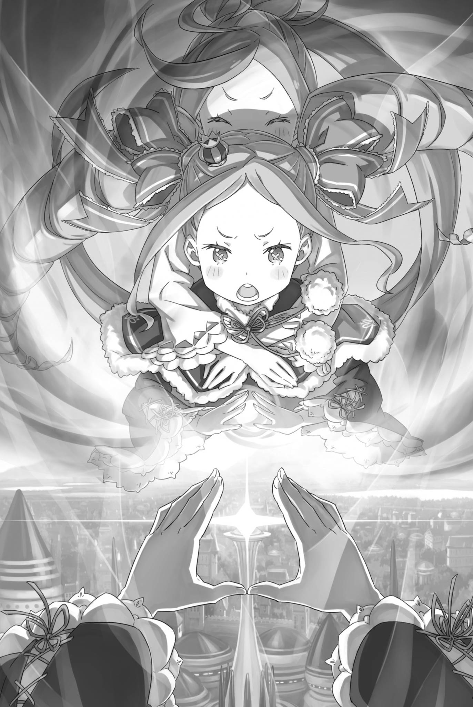
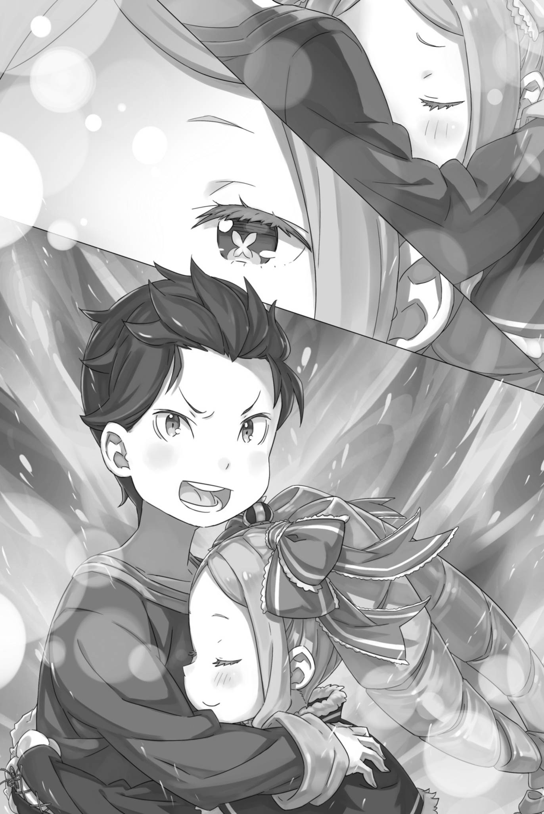

# 『用深爱描绘』

------

——作为『九神将』之一的『钢人』莫古洛・哈加涅。

在佛拉基亚帝国，知道他其实并非钢人的，也只有少数人。

真正的钢人，生来便以矿物、金属等无机物构成肉体，是介于人与物之间的存在。身体局部具有金属部位的刃金人，被认为是由钢人衍生而来的种族。这种异质的生态，至今仍有许多未解之处。

论种族的稀有程度，钢人虽然比不上龙人，但他们与人族之间的差异不仅在于外貌，更在于精神构造。若论沟通的困难程度，甚至远远超过龙人。

可以说，钢人是比精灵还难以接触的存在，只要有一定素养，精灵可以与之交流，而钢人却无法做到。

正因如此，登上帝国一将之位，甚至被认为比其他问题重重的『九神将』更容易打交道的莫古洛，才会被视为钢人中的异类。

但实际上，莫古洛只是利用自己的外表和钢人作为种族的特性，自称为钢人而已。

正因为他的真实身份，埃布尔已经确认：

——莫古洛才是这场旨在攻占帝都的决战中最大的障碍。

※ ※ ※ ※ ※ ※ ※ ※ ※ ※ ※ ※ ※ ※ ※ ※ ※ ※ ※ ※ ※ ※ ※

「――――」

他全身被一股巨大的冲击力击飞，眼前映入的是一个无比强大的存在。

他已经相信自己无法避免接下来将受到接连不断的攻击，命运终点已经到来了。但这似乎只是他的错觉。

「咳——」

极度萎靡的肺部被强行扩张，这种疼痛让亨克尔重新清醒过来。

他的意识回归了，第一个感受是硬而巨大的触感支撑着他的背部，也就是地面。他原本应该被扔到空中，然后四散飘散。

意识到这个事实，他的头脑充满了困惑。为什么？如何？发生了什么事情？

但是，就在他的大脑想明白自己还活着的同时——

「剑……」

在身体传来疼痛的同时，空荡荡的手中没有感觉到剑柄的触感。他立刻用另一只手伸向腰部，但那里的剑鞘也没有重量。

亨克尔转过头，震耳的耳鸣搅得脑袋生疼。终于，他看见自己的剑斜插在稍远处的地面上，不由得吐出一口气。

他还以为剑消失了、被自己弄丢了。那股焦躁令全身仿佛都化作了心脏，剧烈地跳动着——

「该死。」

等这股心绪平复，他又厌恶起了那个竟会担心丢失佩剑的自己。

这一瞬间的情感变化好像就是他那不彻底的自我的缩影。

「到底怎么了……」

他不断为自己增加讨厌自己的理由，同时挣脱出苦闷的情感。

他还活着。但是，这本身就是不可思议的。

在那一瞬间，他与自称为『九神将』的存在相遇，那个存在对他投以了坚定的杀意。——他明确表示要杀他。

事实上，被击飞到空中的亨克尔，只要再挨上一击，就会毫无还手之力地四分五裂，命丧当场。

为什么不是那样呢？寻找答案，他环顾四周——

「啊？」

他不由得发出呆愣的声音。也难怪，眼前的一切实在太荒唐了。太过、太过、太过太过太过地，脱离了现实。

世界仿佛在亨克尔周围裂成两半，展现出两个不同的地狱。

右侧的天空被一片厚厚的红色火云笼罩，炙热的气息让人窒息。

左侧天空中，披着白云的庞然巨影展开双翼，睥睨着冰封的大地。

「燃烧的天空和白龙……」

亨克尔惊奇地看着这一切，一边喃喃自语。

也许这种景象本来就不应该存在，让他产生了一种错觉，也许他已经死了，所以他看到了这些超越世俗的景象。

「啊——」

在那个超越接受极限的世界里，逃避现实的想法被搅乱了。

一片骤然落下的黑影，笼罩了才刚撑起上身的亨克尔，将他的思绪拉了回来。

他不想去想第二只龙会横穿天空，但……

「哇啊啊啊——！？」

仰头看着天空，看到了黑影的真身，亨克尔发出了惊叫。

一块巨大的岩石在惊人的速度下穿过头顶，飞过天空旋转，它们足以被误认为是房屋大小——而且不止一两块。

一块又一块规模庞大的投石从他头顶穿过，带着可怕的狂风从他头部到脚尖向前飞去。

而它们所飞向的，是——

「――――」

世界被一声巨响所震撼，似乎把地面震咳了一口，让亨克尔的屁股被抬了起来。

随后，连续不断的轰鸣声响彻耳畔，他急忙站起身来。

巨大的投石一个接一个地被投掷进来，接连命中的目标是另一个同样规模庞大的人影 —— 那是一座立起来的城墙。

「……莫古洛・哈加涅。」

亨克尔通过视觉信息全身颤栗着感受到，这座城墙属于这个帝国最为恐怖的九人之一。

他原想将昏迷前目睹的东西当成错觉，或是自己被恐惧压垮后产生的幻象。可眼前的景象证明，两者都不是。

——化作数十米、甚至更加庞大身躯的莫古洛，正以本该由亨克尔等人攻破的第三顶点本身，挡在他们面前。

真的，就是字面上的意思。

这是否是世界上存在的最适合这个词的情况呢？

那人形城墙仿佛跪着撑起身子，将掀起的农田与铺好的街道纳作自己的手臂、躯干，展开了难以置信的防御。

巨人脚下，是亨克尔曾拼命斩倒的成群石偶。巨拳越过它们的头顶砸落，宛如一整座城镇从天而降。

「――――」

在那庞然大物的方向，一块块巨石不断地砸向它，频繁地轰击着它的身躯。

那些攻城用的岩石，是赶赴帝都的途中，从采石场取来，或是凿崩陡峭山崖准备好的。

然而，将这些巨石不断地投向巨大的怪物的，本应是在主阵地等待出击机会的尤尔娜・米希格蕾的手下。

准确来说，是在尤尔娜支配下的魔都卡欧斯弗莱姆的居民们。

有角人种、蜥蜴人、兽人、多脚族——这支杂乱的混成部队列成阵势。他们唯一鲜明的共同点，是每个人的一只眼中，都燃着赤红的火焰，士气高昂。

那是真正眼燃战意的一群人。即便需要数人合力，他们抬起的岩石之大、投出的距离之远，仍旧令人难以置信。

但是，根据亨克尔的判断，这些巨石的直接命中对怪物的伤害是可疑的。

巨石命中，确实会让构成莫古洛身体的城墙与农地崩坏。然而，砸来的巨石随即又被纳入他的躯体，填补破损之处，攻击就这样被抵消了。

远远望去，攻击的无意义感仍然清晰可见。

他们仍不停止投掷的理由很简单：趁着巨石压住莫古洛的庞大身躯，其他叛军正在奋力进攻。

「……太愚蠢了。」

亨克尔也听到了。第三顶点的防御比其他顶点都要脆弱。

但是，那也应该在莫古洛・哈加涅爬起来并开始用其全部体积阻止道路之前。尽管如此，作战是否更新仍不得而知，其他撤退的叛军也加入进来，战力仍在不断膨胀。

其中还包括与亨克尔一起战斗的『修德拉克之民』。

「太愚蠢了。」

亨克尔的感慨以比之前更清晰的音量泄露出来。

愚蠢。只有这个词能够形容。在这个四面八方都是地狱的地方，除了地狱，还有什么可以说呢？

亨克尔还能说出什么呢？

「你们都疯了……全部都疯了！！」

回过神时，亨克尔已像抓住救命稻草一般，扑向插在地上的佩剑。

他倚靠在剑柄上，用颤抖的膝盖支撑着自己的体重，死死咬住牙关。所有人都疯了。他们的精神状态如此令人费解。

果然，这是不可能的。不可能，不可能，不可能，只有不可能。

「全部都疯了……」

他的声音变得无力，仿佛在剑柄上瑟缩着。

他无力地低垂着头。四周，烈焰、巨龙与巨兵震撼着世界。无法与这一切抗衡，难道是什么罪过吗？

如果是这样的话……，

「我……」

就在他说出这句话的瞬间，

轻快的蹄声响起，一匹栗毛疾风马从亨克尔身旁掠过。红发被它带起的风拂动，亨克尔抬起了头。

然后——

「――――」

瞬间，坐骑上的一个圆形发型男子和亨克尔的目光相遇。

兹克尔・奥斯曼。在本阵辅佐叛军统帅埃布尔的得力助手，身为佛拉基亚帝国的『将』，却向这个国家举起了反旗。

他亲口承认自己不擅长持剑交锋。就连亨克尔看来，这人也实在算不上什么个人战力——如今，他却超越亨克尔，冲了过去。

经过的瞬间，留下了蔑视跪在这里的亨克尔的眼神。

「对于我来说……」

越过跪在地上的亨克尔，那骑着疾风马的男子冲过战场。

仿佛追随着兹克尔的英姿，从各处战场汇聚的叛军也一齐向前，冲向莫古洛・哈加涅化成的城墙。

而亨克尔则依旧靠着剑，无法动弹。

无法动弹的同时——

「……果然，我还是无法胜任啊，卢安娜。」

※ ※ ※ ※ ※ ※ ※ ※ ※ ※ ※ ※ ※ ※ ※ ※ ※ ※ ※ ※ ※ ※ ※

超越那个跪倒在战场上、仿佛已被折断战意的红发剑士时，兹克尔・奥斯曼心中掠过的，是同情——他不过是遵从了生命趋利避害的本能。

那位自称普莉希拉・跋利耶尔的红衣女杰，堂而皇之地投身了这场叛乱。而作为她的随从参战的剑士，恐怕连佛拉基亚人都不是。

要求这样的人也遵循『帝国子民皆须精强』的信条，未免太过苛刻。

「我自己也无法坚定地遵循这种方式」

兹克尔手持剑，骑着爱马蕾蒂，自嘲着。

他虽然装作勇敢，但他之所以坐在『将』位上，主要是依赖于奥斯曼家族前辈积累的威望。

倘若不是出身军人世家，而是像其他士兵一样从小卒做起，缺乏剑术天赋的自己，恐怕根本无法出人头地。

他并不感到悔恨。当然，兹克尔也是帝国男子。

在某些情况下，他憧憬着能像『九神将』一样挥动自己的剑，改变战局。

然而，就像没有人能取代兹克尔的立场一样，他也无法将这种憧憬转化为现实。

因此——

「我是帝国的二将，『懦夫』兹克尔・奥斯曼！！」

是的，高声喊出，驾驭着他心爱的马匹，在激烈的战场上经历着可怕的变革。

通常，蕾蒂只是陪伴着兹克尔进行远征或散步，享受着平静的奔跑。但这一次，蕾蒂听懂了兹克尔的意图，展现出了一生中最出色的奔跑。

兹克尔深深地爱上了那匹毫无畏惧和不安的勇猛马匹。

蕾蒂跑得实在出色，纵使兹克尔的战前喊话并不熟练，也依旧点燃了许多叛军心中的火，让他们跟着冲了上来。

「光人走右翼！刃金人走左翼！各自按指示行动！其余人随我来！『钢人』莫古洛・哈加涅，由我们讨伐！」

「哦——！！」

听到兹克尔的指令，聚集起来的战斗力量带着咆哮冲向莫古洛。上方飞过的巨大投石，是那些热爱尤尔娜的志愿兵们的支援投掷。

这引起了莫古洛的注意，如果石块人偶的控制出现任何混乱，那么他们的冲锋只要到达莫古洛脚下就可以实现目标。

「放箭——！！」

豪迈的呼喊声从远处传来，箭雨贯穿站在正面的石像，将它们钉在了大地上。

策划这次行动的是离这里较远、听从兹克尔指示的『修德拉克之民』们和擅长弓术的叛军们，他们展现出了强大的攻击力。

在美丽而高傲的她们掩护下，兹克尔继续前进。连她们撤到后方的阵形都如此顺畅，一切顺利得近乎过头，令他暗暗咬紧了牙关。

「如果说这已经是过分完美了，那么，那个祝福才是真正的过分完美。」

他看着手握的剑，微微地笑了一下。

在出发前，他在帐篷中接受了一位少女的祝福。她可爱而威严，令人感到畏惧。她的眼神，仿佛度过了兹克尔无法想象的岁月，令他敬畏不已。他忍不住恳求她祝福自己。

他不会说这是因为受了懦弱之风的影响。只是因为他深知自己的责任，并渴望得到祝福。如果这样能提高一点成功的可能性，他甚至愿意依靠迷信。

「兹克尔二将！请退后！这里交给我们就足够了！！」

「别说傻话！已经没有退路，更没有退下去的余地！我也要上！！」

「——！」

骑在疾风马上，对旁边的士兵的请求摇了摇头，兹克尔没有放下他的责任。

部下似乎还想说些什么，却最终没有再阻拦兹克尔的决意。兹克尔感激这份体谅，愈发握紧了缰绳。

「哈！『好色之徒』兹克尔・奥斯曼二将，竟然亲自跑到前线来啦！」

部下并骑的另一侧，有人以不逊于疾风马的速度追了上来。那是用眼罩遮住一只眼睛的双剑兵——贾马尔・奥雷利。

他在城郭都市陷落时成为俘虏。此后，因其对文森特・佛拉基亚皇帝的强烈忠诚，兹克尔将这位从基层磨炼出来的剑士收入了麾下。

「贾马尔上等兵，有什么感觉吗？」

「很不错！无论向右看向左，正面都是敌人！我都有点兴奋起来了！」

「很好，实在出色，不愧是帝国军人的骄傲！我接下来要请莫古洛一将让出『捌』的位置，你要跟来吗！」

「只要是命令，我就做到！如果需要，我可以为您开路！」

面带狂野笑容的贾马尔加速前进，轻松地超越蕾蒂的速度，直冲面前的石像团队。

望着他的背影，兹克尔既觉得这份勇武可靠，又对将他牵涉进来心怀歉意。——但他立刻斩断了这份迟疑。

在必要的时候，扮演必要的角色。

这是他自己所希望的，他必须响应这一需求。

接下来就是...

「陛下，请尽情行动。」

―― 正当兹克尔献上祈祷时，水晶宫的魔法水晶在顶端闪耀着。

※ ※ ※ ※ ※ ※ ※ ※ ※ ※ ※ ※ ※ ※ ※ ※ ※ ※ ※ ※ ※ ※ ※

――在这次帝都决战中，有几个事件改变了埃布尔描绘的画面。

其中之一是尤尔娜・米希格蕾前往的第一个顶点，以及参战的普莉希拉。

另一个，是以自身加护收集详细战况、展现出这份本领的奥托。

还有一个是加菲尔，他不是与卡夫马・伊鲁克斯僵持不下，而是成功击败了他。

最后一个是艾米莉娅，她惹怒了玛德琳・艾沙尔，使其召唤了『云龙』。

然而，这些变数虽让埃布尔笔下的画面添了几分不同的色彩，却都不足以大幅改变最终的图景。

在保护帝都的五角星城墙中，只要突破其中一个顶点，即使其他顶点陷入僵局，也有获胜的可能。

在这幅图景中，始终无法忽略的关键，是莫古洛・哈加涅——不，是掌管佛拉基亚帝国中枢水晶宫的那件『流星』。

水晶宮是世界上最美丽的建筑之一，由高纯度的魔水晶构建，它本身就是用来打败外敌的武器。

宮殿内的魔力通过建筑内各处的魔水晶放大，然后从放置在水晶宮顶层的『魔晶炮』中释放出来。

据说其威力足以摧毁整座大城市，据传已有数百年未使用——是与『大灾』对抗时使用的。

长久以来，水晶宫的魔晶炮一直被视为传说中的物品，但在其实际存在被确认后，它得到了维护和整备，重新成为了威胁。

讽刺的是，这门魔晶炮成为了针对埃布尔本人的利刃，但只要这门魔晶炮还存在，就很可能轻易地扭转帝都决战的战局。

因此，一定要让这门魔晶炮发射出去。

而且，要让这一炮成为预先计入的损失，而非逆转战局的致命一击。

为此——

「——终究没有撤离吗，兹克尔・奥斯曼。」

望着骑乘疾风马、奔赴第三顶点战场的兹克尔，埃布尔如此低语。

兹克尔原本可以选择：将那些从其他顶点撤下、汇聚到第三顶点的叛军组织起来，鼓舞士气，让他们冲向挡路的莫古洛，而自己脱离战线。

但是，埃布尔也有预感他不会选择那条路。

是因为兹克尔的慎重，害怕任何即使只是微小的目标不能实现的『懦夫』，还是因为他是认为勇敢是美德的帝国士兵之一，埃布尔无从知晓。

然而，不论兹克尔出于什么理由下定决心，埃布尔都不会阻止。

对于埃布尔来说，兹克尔的生死也无法对他描绘的画作产生最终影响。

若将眼光放得更远，归根结底，就连埃布尔自己的生死，也未必能改变那幅图景——

「……侦察员的通报！水晶宫的魔晶炮有了动静！」

「――――」

「瞄准第三顶点！！」

近乎怒吼的通报响彻本阵，证明埃布尔的布局奏效了。

魔晶炮即将发射。它将扫平第三顶点——也就是莫古洛化成城墙的那片战场，将叛军一举抹去。

即使如此，只要水晶宫作为莫古洛的本体存在，就不可能打败『钢人』莫古洛・哈加涅，也无法突破第三个点。

但与此同时，帝都也将失去魔晶炮这一足以逆转任何战局的火力。

整幅布局，都是为此而绘。

因此——

「魔晶炮射线上发生了异常！！」

「……什么？」

――这个消息完全超出了埃布尔的预期。

※ ※ ※ ※ ※ ※ ※ ※ ※ ※ ※ ※ ※ ※ ※ ※ ※ ※ ※ ※ ※ ※ ※

――在这场帝都决战中，有几个人打破了埃布尔描绘的画面。

首先是尤尔娜・米希格蕾前往的第一顶点，以及参战的普莉希拉。

其次，是借助自身加护、展现出收集详细战况能力的奥托。

还有一个是战胜了卡夫马・伊鲁克斯的加菲尔，不再处于僵持状态。

最后一个是激怒了玛德琳・艾沙尔，使其召唤出『云龙』的艾米莉娅。

此外——

「——怎么可能。」

远处，在变成城墙的莫古洛・哈加涅庞大的身影后面，是怀旧的帝都最深处、佛拉基亚帝国权威的象征水晶宫。

在美丽宫殿的顶部，即使只有一部分人知道它是武器，直到埃布尔亲口告诉他们，『将』甚至都不知道魔晶炮的存在。

那是一经发射便足以扫平地表、彻底摧毁战局的决战兵器。兹克尔・奥斯曼赌上性命，就是为了让这珍贵的一炮耗在并非决胜之处。

他骑着爱马冲在最前方，高呼胜利属于己方，煽动叛军狂热地进攻，竭力彰显这支部队的威胁——让魔晶炮瞄准他们。

这一切都是为了让敌人错误地认为他们已经掌握了最好的机会来彻底改变战局。

因此，当水晶宫的顶部开始发光的那一刻，兹克尔确信自己成功了。

他的脑海中浮现出母亲、姐姐和妹妹，这些女性对他的形成至关重要，他甚至露出了笑容。

那些祈愿，美好得令人不忍带入坟墓。他原以为自己能平静迎来终结，然而眼前的一幕，却将那份平静尽数化成了惊愕。

因为——

「——碧翠丝小姐？」

※ ※ ※ ※ ※ ※ ※ ※ ※ ※ ※ ※ ※ ※ ※ ※ ※ ※ ※ ※ ※ ※ ※

「贝蒂就猜到会是这样。」

自由落体中，美丽的长卷发和裙摆随风飘动，碧翠丝低声说道。

当兹克尔来到碧翠丝等人的帐篷，寻求战士的祝福时，碧翠丝直觉到他打算去死。

四百年前，那个动荡不安的时代有很多眼睛看起来一样的人。

那时，碧翠丝没能向他们伸出援手。有些人并不愿被救，有些时候，则是她自己也不知道该如何去救。

也许即使再次经历那个时代，碧翠丝也无法更好地处理他们之间的关系。

她肯定会再次感受到同样的无力感，眼睁睁地看着他们走向死亡。

但是这次——

「——可那也不是今天在这里，再一次袖手旁观的理由。」

「啊——呜！」

碧翠丝将那双浮现着独特纹样的眼睛望向前方。少女的双臂从身后环上来，紧紧抱住她纤细的肩膀。

碧翠丝并没有原谅这个金发碧眼的少女。她毫无自觉的所作所为，确实令许多人陷入了不幸。

尽管如此，唯独此刻，碧翠丝愿意这样想。

唯独此刻，她愿意相信菜月・昴的心意——相信其中，并非只有『心软』。

「――――」

在比城墙更高的空中，有着碧翠丝和路伊两个女孩。

不知究竟如何做到的，路伊接连发动短距离『转移』，将碧翠丝带到这里，仿佛在以行动证明自己的立场。

先前，路伊已经证明了自己的立场。

那么，接下来，碧翠丝就该对她的所作所为做出回应。

「我能想象出大家生气的表情。」

或许是担心，或许是生气，或许是两者兼有。

想到那些珍贵的伙伴们心生不满的表情，碧翠丝的嘴角微微上扬。

然而，她并没有选择放弃。因为碧翠丝——

「贝蒂可是昴的搭档。」

在她喃喃自语的瞬间，远处可见的美丽宫殿整体闪耀着耀眼的光芒，有着足以改变世界形状的光芒一直笔直地向着叛军冲锋的方向射去。

那一击足以吞没冲在最前方的兹克尔等人，继而造成更加巨大的破坏。碧翠丝与路伊闯入炮击的轨迹，在胸前合起双手。

然后——

「——阿尔・纱幕。」

—— 通向另一个世界甚至可以吞噬这股改变世界的光芒的洞口被打开了，又立刻关闭了。

※ ※ ※ ※ ※ ※ ※ ※ ※ ※ ※ ※ ※ ※ ※ ※ ※ ※ ※ ※ ※ ※ ※

在那一瞬间发生的事情，能够正确理解的人究竟有多少呢？

实际上，如果这一切都像埃布尔所描绘的那样实现，那么即使在预测范围内，也会造成巨大的损害，并且对于在其他地方战斗的人们产生不可估量的影响。

然而，由魔晶炮带来的伤害没有发生，准备面对死亡的兹克尔・奥斯曼却开始与石像群战斗。

『云龙』梅佐蕾娅降临，艾米莉娅仍在与召来巨龙的玛德琳交战；『恶毒翁』奥尔巴特则凭借老练的身手，将加菲尔逼入绝境。

『极彩色』尤尔娜与普莉希拉母女，不得不与决意为目标抛却一切的『噬灵者』亚拉基亚激战；意图掌握战场、事实上已实现一半的奥托和佩特拉，则与米迪娅姆一同面对凶徒。

这些战场的局势，没有因此发生大的改变。

只是，它们因这一炮而骤然倒向全面劣势的可能，已经消失了。

换取这份巨大功绩的代价，却是——

「啊！啊啊！啊啊啊！！」

在中空中飘落着的路伊的怀中，紧紧抱着的少女的存在开始变得模糊。

那并非比喻。少女的身影正在一点点变得透明。路伊像要抗拒这一切般死死抱紧碧翠丝，却无济于事。

就像水滴般滴落一样，碧翠丝的身体开始变成光。

「啊！啊啊啊！」路伊尖叫着，试图拒绝眼前的情景。

无论她如何悲叹、呼喊，碧翠丝的存在仍在不断崩解。

为了拯救大量的生命，她释放的魔法阻止了摧毁一切的光。作为巨大力量的代价，碧翠丝的存在开始四散而去。即使伸出手去抓那些渐渐消失的光，它也无法被阻挡。

「啊……！！」

大颗的泪水从睁大的蓝眼睛里滚落，路伊拼命呼喊。

她一遍又一遍地叫着，但是什么也做不了。除了绝望的叫喊外，她再也找不到别的出路。

于是，她绝望地叫喊、呼喊、哀号着——

「——啊？」

当大粒的眼泪落下时，路伊把脸朝向远方。

她将怀里的碧翠丝抱得更紧。此刻，她不再看着即将消失的少女，不再看染白或染红的天空，也不再看怒吼四起的大地。她暂且忘却了构成这片战场的一切，只望向远方。

然后，她跳向了那个方向。

「呜——！」

身处半空，一次转移的距离不过十米左右。接连使用，便会带来仿佛内脏被绞紧的负担。可她不在乎。

连碧翠丝本该承受的负担也一并担下，路伊不断跃去。

跃去，再跃去，一次、一次又一次，不停地跃去，终于——

「――――」

抵达地面后，路伊踉跄着向前扑倒。她不顾浑身的疲惫，将怀中轻得令人难以置信的少女举向前方。

把虚幻的碧翠丝抬到了面前。

然后 ——

「呜呜……」

「——我知道了。你们两个都太冒险了。」

突然传来了一声像是苦笑的叹息，少女从伸出去的手中被抢走了。不，不是被抢走了。她被温柔地抱起来了。

在跪倒的路伊面前，碧翠丝被紧紧拥入怀中。

被那个黑发少年的臂膀轻柔、珍爱地紧紧拥抱着。

在这满溢爱意的拥抱中，完成重任的少女微微颤动长睫覆盖的眼睑，缓缓睁开了眼。

那双浮现着独特纹样的眼睛轻轻一眨——

「——你让贝蒂担心太久了。」

「嗯，我也爱你。」

以满怀自豪的深爱，回应那低语般的亲昵。本该相牵的手，终于再度握在一起。

在路伊小声地叹息着、在最前面目睹这一幕的时候，少年笑了。

他笑了，然后说出了话。

「那么，开始吧。——命运大人，放马过来。」

